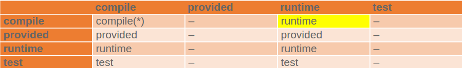

# dependency 
## 依赖范围与classpath的关系


## 依赖传递性影响依赖范围



## 依赖调解 
 
两个原则： 

1.路径最近者优先原则 

2.第一声明者优先原则 
 
 
## 排除依赖 
```xml 
<dependencies> 
   <dependency> 
     <groupId>sample.ProjectB</groupId> 
     <artifactId>Project-B</artifactId> 
     <version>1.0-SNAPSHOT</version> 
     <exclusions> 
       <exclusion> 
         <groupId>sample.ProjectE</groupId>             <!-- Exclude Project-E from Project-B --> 
         <artifactId>Project-E</artifactId> 
       </exclusion> 
     </exclusions> 
   </dependency> 
 </dependencies> 
``` 
## properties 
```xml 
<!--用于定义变量--> 
<properties> 
    <springframework.version>4.2.6.RELEASE</springframework.version> 
</properties> 
 
<!--所以依赖--> 
<dependencies> 
     
    <dependency> 
        <groupId>org.springframework</groupId> 
        <artifactId>spring-core</artifactId> 
        <!--使用了前面定义的变量--> 
        <version>${springframework.version}</version> 
    </dependency> 
 
    <dependency> 
        <groupId>org.springframework</groupId> 
        <artifactId>spring-beans</artifactId> 
        <version>${springframework.version}</version> 
    </dependency> 
 
</dependencies> 
``` 
## 从命令行调用dependency插件目标 

mvn dependency:analyze 

used undeclared dependencies 

unused declared dependencies 
 
mvn dependency:tree 
 
mvn dependency:list 


