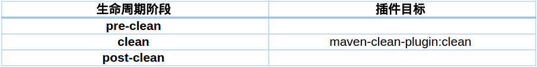
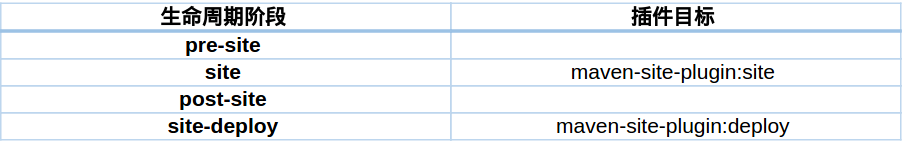
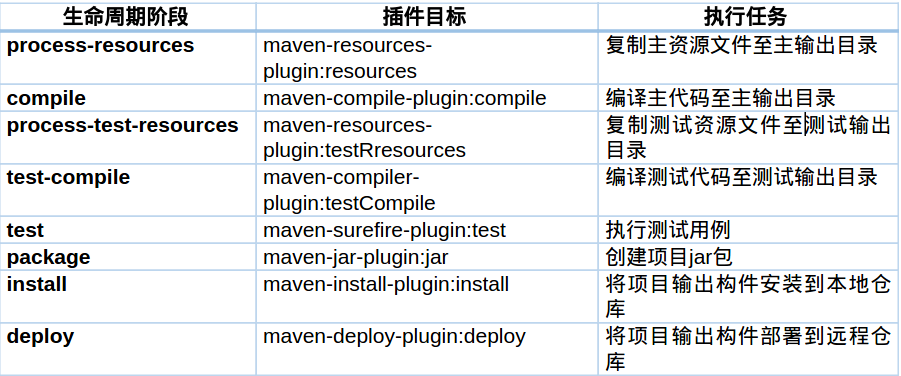

# plugin

**Maven核心仅仅抽象定义了生命周期，其大小仅为3M，具体认为交由插件实现，插件以独立构件形式存在，因此，maven会在需要的时候下载并使用插件。 **

**一个插件可能有多个功能，每个功能称为一个目标。 **


## 内置绑定 
**lib下的maven-2.2.1-uber.jar 包里的\org\apache\maven\project目录下 的super pom，可以查看默认使用的maven插件的version **
 
 
Maven在核心为一些主要的生命周期阶段绑定了很多插件的目标 
clean生命周期阶段与插件目标的绑定关系 

  
 
 
site生命周期阶段与插件目标的绑定关系  

 
 
default生命周期与内置插件绑定关系及具体任务(打包类型: jar) 

 
 
 
## 自定义绑定 
将maven插件绑定到某个phase上，例如将maven-shade-plugin插件的shade目标绑定到package phase上
 
## 配置插件 
### 命令行配置 
#### 跳过test 
 
mvn install –Dmaven.test.skip=true 
 
 
### POM全局配置 
#### 指定编译版本 
```xml
<plugin> 
    <groupId>org.apache.maven.plugins</groupId> 
    <artifactId>maven-compiler-plugin</artifactId> 
    <configuration> 
        <source>1.8</source> 
        <target>1.8</target> 
    </configuration> 
</plugin> 
```
## 全称与前缀 
 
## 查看插件信息 
### 在线查看 
https://maven.apache.org/plugins/index.html 
 
### maven-help-plugin 
 
首先lib下的maven-2.2.1-uber.jar 包里的\org\apache\maven\project目录下 的super pom，可以查看默认使用的maven插件的version 
 
 
以compiler为例，查看其version为2.0.2 

通过如下命令获取信息（=两端不要有多余的空格） 
 
mvn help:describe -Dplugin=org.apache.maven.plugins:maven-compiler-plugin:2.0.2 
 
 
省去版本信息，将获取最新版本的插件信息 

mvn help:describe -Dplugin=org.apache.maven.plugins:maven-compiler-plugin 
 
 
可简写为

mvn help:describe -Dplugin=compiler 
 
可添加如下参数 

mvn help:describe -Dplugin=compiler –Ddetail 
 
具体查看某一个目标： 

mvn help:describe -Dplugin=compiler -Dgoal=compile 
 

