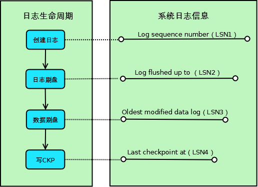

【mysql】关于checkpoint机制【转载】
# 一、简介
思考一下这个场景：如果重做日志可以无限地增大，同时缓冲池也足够大，那么是不需要将缓冲池中页的新版本刷新回磁盘。因为当发生宕机时，完全可以通过重做日志来恢复整个数据库系统中的数据到宕机发生的时刻。

但是这需要两个前提条件：1、缓冲池可以缓存数据库中所有的数据；2、重做日志可以无限增大

因此Checkpoint（检查点）技术就诞生了，目的是解决以下几个问题：1、缩短数据库的恢复时间；2、缓冲池不够用时，将脏页刷新到磁盘；3、重做日志不可用时，刷新脏页。

当数据库发生宕机时，数据库不需要重做所有的日志，因为Checkpoint之前的页都已经刷新回磁盘。数据库只需对Checkpoint后的重做日志进行恢复，这样就大大缩短了恢复的时间。

当缓冲池不够用时，根据LRU算法会溢出最近最少使用的页，若此页为脏页，那么需要强制执行Checkpoint，将脏页也就是页的新版本刷回磁盘。

当重做日志出现不可用时，因为当前事务数据库系统对重做日志的设计都是循环使用的，并不是让其无限增大的，重做日志可以被重用的部分是指这些重做日志已经不再需要，当数据库发生宕机时，数据库恢复操作不需要这部分的重做日志，因此这部分就可以被覆盖重用。如果重做日志还需要使用，那么必须强制Checkpoint，将缓冲池中的页至少刷新到当前重做日志的位置。

对于InnoDB存储引擎而言，是通过LSN（Log Sequence Number）来标记版本的。

LSN是8字节的数字，每个页有LSN，重做日志中也有LSN，Checkpoint也有LSN。可以通过命令SHOW ENGINE INNODB STATUS来观察：
```sql
mysql> show engine innodb status \G
```
``` 
---
LOG
---
Log sequence number 34778380870
Log flushed up to   34778380870
Last checkpoint at  34778380870
0 pending log writes, 0 pending chkp writes
54020151 log i/o's done, 0.92 log i/o's/second
```
Checkpoint发生的时间、条件及脏页的选择等都非常复杂。而Checkpoint所做的事情无外乎是将缓冲池中的脏页刷回到磁盘，不同之处在于每次刷新多少页到磁盘，每次从哪里取脏页，以及什么时间触发Checkpoint。

# 二、Checkpoint分类
在InnoDB存储引擎内部，有两种Checkpoint，分别为：Sharp Checkpoint、Fuzzy Checkpoint

## Sharp Checkpoint 
发生在数据库关闭时将所有的脏页都刷新回磁盘，这是默认的工作方式，即参数innodb_fast_shutdown=1。但是若数据库在运行时也使用Sharp Checkpoint，那么数据库的可用性就会受到很大的影响。故在InnoDB存储引擎内部使用Fuzzy Checkpoint进行页的刷新，即只刷新一部分脏页，而不是刷新所有的脏页回磁盘。

## Fuzzy Checkpoint

1、Master Thread Checkpoint；

2、FLUSH_LRU_LIST Checkpoint；

3、Async/Sync Flush Checkpoint；

4、Dirty Page too much Checkpoint

### 1、Master Thread Checkpoint-->定时刷新 

以每秒或每十秒的速度从缓冲池的脏页列表中刷新一定比例的页回磁盘，这个过程是异步的，此时InnoDB存储引擎可以进行其他的操作，用户查询线程不会阻塞。

### 2、FLUSH_LRU_LIST Checkpoint-->可用页不够

因为InnoDB存储引擎需要保证LRU列表中需要有差不多100个空闲页可供使用。在InnoDB1.1.x版本之前，需要检查LRU列表中是否有足够的可用空间操作发生在用户查询线程中，显然这会阻塞用户的查询操作。倘若没有100个可用空闲页，那么InnoDB存储引擎会将LRU列表尾端的页移除。如果这些页中有脏页，那么需要进行Checkpoint，而这些页是来自LRU列表的，因此称为FLUSH_LRU_LIST Checkpoint。

而从MySQL 5.6版本，也就是InnoDB1.2.x版本开始，这个检查被放在了一个单独的Page Cleaner线程中进行，并且用户可以通过**参数innodb_lru_scan_depth控制LRU列表中可用页的数量，该值默认为1024**，如：

```sql
mysql>  SHOW GLOBAL VARIABLES LIKE 'innodb_lru_scan_depth';
```
```
+-----------------------+-------+
| Variable_name         | Value |
+-----------------------+-------+
| innodb_lru_scan_depth | 1024  |
+-----------------------+-------+

```
### 3、Async/Sync Flush Checkpoint-->redo log file不够

指的是重做日志文件不可用的情况，这时需要强制将一些页刷新回磁盘，而此时脏页是从脏页列表中选取的。若将已经写入到重做日志的LSN记为redo_lsn，将已经刷新回磁盘最新页的LSN记为checkpoint_lsn，则可定义：

checkpoint_age = redo_lsn - checkpoint_lsn

再定义以下的变量：

async_water_mark = 75% * total_redo_log_file_size

sync_water_mark = 90% * total_redo_log_file_size

若每个重做日志文件的大小为1GB，并且定义了两个重做日志文件，则重做日志文件的总大小为2GB。那么async_water_mark=1.5GB，sync_water_mark=1.8GB。则：

当checkpoint_age<async_water_mark时，不需要刷新任何脏页到磁盘；

当async_water_mark<checkpoint_age<sync_water_mark时触发Async Flush，从Flush列表中刷新足够的脏页回磁盘，使得刷新后满足checkpoint_age<async_water_mark；

checkpoint_age>sync_water_mark这种情况一般很少发生，除非设置的重做日志文件太小，并且在进行类似LOAD DATA的BULK INSERT操作。此时触发Sync Flush操作，从Flush列表中刷新足够的脏页回磁盘，使得刷新后满足checkpoint_age<async_water_mark。

可见，Async/Sync Flush Checkpoint是为了保证重做日志的循环使用的可用性。在InnoDB 1.2.x版本之前，Async Flush Checkpoint会阻塞发现问题的用户查询线程，而Sync Flush Checkpoint会阻塞所有的用户查询线程，并且等待脏页刷新完成。从InnoDB 1.2.x版本开始——也就是MySQL 5.6版本，这部分的刷新操作同样放入到了单独的Page Cleaner Thread中，故不会阻塞用户查询线程。

MySQL官方版本并不能查看刷新页是从Flush列表中还是从LRU列表中进行Checkpoint的，也不知道因为重做日志而产生的Async/Sync Flush的次数。但是InnoSQL版本提供了方法，可以通过命令SHOW ENGINE INNODB STATUS来观察，如：

```sql
mysql> show engine innodb status \G
```
```
BUFFER POOL AND MEMORY
----------------------
Total memory allocated 2058485760; in additional pool allocated 0
Dictionary memory allocated 913470
Buffer pool size   122879
Free buffers       79668
Database pages     41957
Old database pages 15468
Modified db pages  0
Pending reads 0
Pending writes: LRU 0, flush list 0, single page 0
Pages made young 15032929, not young 0
0.00 youngs/s, 0.00 non-youngs/s
Pages read 15075936, created 366872, written 36656423
0.00 reads/s, 0.00 creates/s, 0.90 writes/s
Buffer pool hit rate 1000 / 1000, young-making rate 0 / 1000 not 0 / 1000
Pages read ahead 0.00/s, evicted without access 0.00/s, Random read ahead 0.00/s
LRU len: 41957, unzip_LRU len: 0
I/O sum[39]:cur[0], unzip sum[0]:cur[0]
```
### 4、Dirty Page too much-->赃页太多

即脏页的数量太多，导致InnoDB存储引擎强制进行Checkpoint。其目的总的来说还是为了保证缓冲池中有足够可用的页。其可由参数innodb_max_dirty_pages_pct控制：

```sql
mysql> SHOW GLOBAL VARIABLES LIKE 'innodb_max_dirty_pages_pct' ;
```
```
+----------------------------+-------+
| Variable_name              | Value |
+----------------------------+-------+
| innodb_max_dirty_pages_pct | 75    |
+----------------------------+-------+
```
**innodb_max_dirty_pages_pct值为75表示，当缓冲池中脏页的数量占据75%时，强制进行Checkpoint，刷新一部分的脏页到磁盘**。在InnoDB 1.0.x版本之前，该参数默认值为90，之后的版本都为75。

# 三、Checkpoint机制
在Innodb事务日志中，采用了Fuzzy Checkpoint，Innodb每次取最老的modified page(last checkpoint)对应的LSN，再将此脏页的LSN作为Checkpoint点记录到日志文件，意思就是“此LSN之前的LSN对应的日志和数据都已经flush到redo log

当mysql crash的时候，Innodb扫描redo log，从last checkpoint开始apply redo log到buffer pool，直到last checkpoint对应的LSN等于Log flushed up to对应的LSN，则恢复完成

那么具体是怎么恢复的呢？



如上图所示，Innodb的一条事务日志共经历4个阶段：

创建阶段：事务创建一条日志；

日志刷盘：日志写入到磁盘上的日志文件；

数据刷盘：日志对应的脏页数据写入到磁盘上的数据文件；

写CKP：日志被当作Checkpoint写入日志文件；

对应这4个阶段，系统记录了4个日志相关的信息，用于其它各种处理使用：

Log sequence number（LSN1）：当前系统LSN最大值，新的事务日志LSN将在此基础上生成（LSN1+新日志的大小）；

Log flushed up to（LSN2）：当前已经写入日志文件的LSN；

Oldest modified data log（LSN3）：当前最旧的脏页数据对应的LSN，写Checkpoint的时候直接将此LSN写入到日志文件；

Last checkpoint at（LSN4）：当前已经写入Checkpoint的LSN；

对于系统来说，以上4个LSN是递减的，即： LSN1>=LSN2>=LSN3>=LSN4.

具体的样例如下（使用show innodb status \G命令查看，Oldest modified data log没有显示）：

```
LOG
---
Log sequence number 34822137537
Log flushed up to   34822137537
Last checkpoint at  34822133028
0 pending log writes, 0 pending chkp writes
54189288 log i/o's done, 3.00 log i/o's/second　
```

# 四、日志保护机制
mysql crash的时候，Innodb有日志刷盘机制，可以通过innodb_flush_log_at_trx_commit参数进行控制，这里说的是如何防止日志覆盖导致日志丢失

Innodb的checkpoint和redo log有哪些紧密关系？有几上名词需要解释一下：


Ckp age（动态移动）: 最老的dirty page还没有flush到数据文件，即没有做last checkpoint的范围

Buf age（动态移动）: modified page information没有写到log中，但已在log buffer

Buf async（固定点）: 日志空间大小的7/8，当buf age移动到Buf async点时，强制把没有写到log中的modified page information开始写入到log中，不阻塞事务

Buf sync（固定点）: 日志空间大小的15/16，当写入很大的，buf age移动非常快，一下子到buf sync的点，阻塞事务，强制把modified page information开始写入到log中。如果不阻塞事务，未做last checkpoint的redo log存在覆盖危险

Ckp async（固定点）: 日志空间大小的31/32，当ckp age到达ckp async，强制做last checkpoint，不阻塞事务

Ckp sync(固定点）:日志空间大小，当ckp age到达ckp sync，强制做last checkpoint，阻塞事务，存在redo log覆盖的危险

接下分析4种情况

如果buf age在buf async和buf sync之间

如果buf age在buf sync之后（当然这种情况是不存在，mysql有保护机制）

如果ckp age在ckp async和ckp sync之间（这种情况是不存在）

如果ckp age在ckp sync之后（这种情况是不存在）

第一种情况：


当写入量巨大时，buf age移动到buf async和buf sync之间，触发写出到log中，mysql把尽量多的log写出，如果写入量减慢，buf age又移回到“图一”状态。如果写入量大于flush log的速度，buf age最终会和buf sync重叠，这时所有的事务都被阻塞，强制将2*(Buf age-Buf async)的脏页刷盘，这时IO会比较繁忙。

第二种情况：


当然这种情况是不可能出现，因为如果出现，redo log存在覆盖的可能，数据就会丢失。buf age会越过log size，buf age的大小可能就超过log size,如果要刷buf age，那么整个log size都不够容纳所有的buf age。

第三种和第四种情况不存在分析：

ckp age始终位于buf age的后面(左边)，因为ckp age是last checkpoint点，总是追赶buf age(将尽可能多的modified page flush到磁盘)，所以buf age肯定是先到达到buf sync。

ckp async及ckp sync存在意义？

mysql中page cache也存在high water及low water，当dirty page触到low water时，os是开始flush dirty page到磁盘，到high water时，会阻塞一切动作，os会疯狂的flush dirty page，磁盘会很忙，存在IO Storm，

 

本文参考：

http://blog.csdn.net/yah99_wolf/article/category/539408

http://www.cnblogs.com/bamboos/p/3532150.html

http://tech.uc.cn/?p=716

http://www.mysqlperformanceblog.com/2011/04/04/innodb-flushing-theory-and-solutions/

作者：踏雪无痕
出处：http://www.cnblogs.com/chenpingzhao/