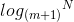
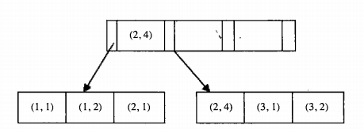

# 索引[转载](http://www.ywnds.com/?p=9976)
InnoDB存储引擎表是索引组织表，B+树索引的本质是B+树在数据库中的实现。
B+树上的每一个节点是一个页。其中，非叶子节点是索引页，叶子节点是数据页。


http://blog.jobbole.com/107800/


# 一、B+树索引

我们都知道CPU是很快的，磁盘是很慢的，要想提高数据库的访问效率，可以说非常大的一个优化点就是减少磁盘IO访问。每次查找数据时把磁盘IO次数控制在一个很小的数量级，最好是常数数量级。那么我们就想到如果一个高度可控的多路搜索树是否能满足需求呢？就这样，B+树应运而生。**B+树索引的本质就是B+树在数据库中的实现，但是B+树索引在数据库中有一个特点是高扇出性，因此在数据库中，B+树的高度一般都在2-4层，这也就是说查找某一键值得行记录最多只需要2-4次IO**。

数据库中的B+树索引可以分为聚集索引（clustered index）和辅助索引（secondary index），但是不管是聚集索引还是辅助的索引，其内部组都是B+树的，即高度平衡的，叶子节点存放着所有的数据。**聚集索引与辅助索引不同的是，叶子节点存放的是否是一整行的信息**。

# 二、聚簇索引

**InnoDB存储引擎表是索引组织表，即表中数据按照主键顺序存放。而聚簇索引就是按照每张表的主键构造一棵B+树，同时叶子节点中存放的即为整张表的行记录数据，也将聚集索引的叶子节点称为数据页。聚簇索引的这个特性决定了索引组织表中数据也是索引的一部分。同B+树数据结构一样，每个数据页都通过一个双向链表来进行链接。由于实际的数据页只能按照一棵B+树进行排序，因此每张表只能拥有一个聚集索引。在多数情况下，查询优化器倾向于采用聚集索引。因为聚集索引能够在B+树索引的叶子节点上直接找到数据。此外，由于定义了数据的逻辑顺序，聚集索引能够特别快地访问针对范围值的查询。查询优化器能够快速发现某一段范围的数据页需要扫描**。

许多文档会告诉我们：聚集索引按照顺序物理地存储数据，但是试想一下，如果聚集索引必须按照特定顺序存放物理记录，则维护成本显得非常之高。所以，聚集索引的存储并不是物理上连续的，而是逻辑上连续的。这其中有两点：一是前面说过的页通过双向链表链接，页按照主键的顺序排序；另一点是每个页中的记录也是通过双向链表进行维护的，物理存储上可以同样不按照主键存储。

聚集索引的另一个好处是，它对于主键的排序查找和范围查找速度非常快。叶子节点的数据就是用户所要查询的数据。如用户需要查询一张注册用户的表，查询最后注册的10位用户，由于B+树索引是双向链表的，用户可以快速找到最后一个数据页。并取出10条记录。若用命令EXPLAIN进行分析，可得：

```sql
mysql> explain select * from info order by id limit 10\G
```
```
*************************** 1. row ***************************
id: 1
select_type: SIMPLE
table: info
type: index
possible_keys: NULL
key: PRIMARY
key_len: 4
ref: NULL
rows: 10
Extra:
1 row in set (0.00 sec)
```
```sql
mysql> explain select * from info order by id limit 10\G
```
```
*************************** 1. row ***************************
id: 1
select_type: SIMPLE
table: info
type: index
possible_keys: NULL
key: PRIMARY
key_len: 4
ref: NULL
rows: 10
Extra:
1 row in set (0.00 sec)
```
可以看到虽然使用ORDER BY对记录进行排序，但是在实际过程中并没有进行所谓的filesort操作，而这就是因为聚集索引的特点。

另一个是范围查询，即如果要查找主键某一范围内的数据，通过叶子节点的上层中间节点就可以得到页的范围，之后直接读取数据页即可。又如：
```sql
mysql> EXPLAIN select * from profile where id>10 and id<1000\G
```
```
id: 1
select_type: SIMPLE
table: profile
type: range
possible_keys: PRIMARY
key: PRIMARY
key_len: 4
ref: NULL
rows: 14868
Extra: Using where
1 row in set (0.00 sec)
```
```sql
mysql> EXPLAIN select * from profile where id>10 and id<1000\G
```
```
id: 1
select_type: SIMPLE
table: profile
type: range
possible_keys: PRIMARY
key: PRIMARY
key_len: 4
ref: NULL
rows: 14868
Extra: Using where
1 row in set (0.00 sec)
```
执行EXPLAIN得到了MySQL数据库的执行计划，并且在rows列中给出了一个查询结果的预估返回行数。要注意的是，rows代表的是一个预估值，不是确切的值。

如下图，是一颗B+树（聚簇索引）：


## b+树性质

* 通过上面的分析，我们知道IO次数取决于b+数的高度h。假设当前数据表的数据为N，每个磁盘块的数据项的数量是m，则有 h=，当数据量N一定的情况下，m越大，h越小。而m = 磁盘块的大小 / 数据项的大小，磁盘块的大小也就是一个数据页的大小，是固定的，如果数据项占的空间越小，数据项的数量越多，树的高度越低。**这就是为什么每个数据项，即索引字段要尽量的小，比如int占4字节，要比bigint8字节少一半。这也是为什么b+树要求把真实的数据放到叶子节点而不是内层节点，一旦放到内层节点，磁盘块的数据项会大幅度下降，导致树增高**。当数据项等于1时将会退化成线性表。

* **当b+树的数据项是复合的数据结构，比如(name,age,sex)的时候，b+数是按照从左到右的顺序来建立搜索树的**，比如当(张三,20,F)这样的数据来检索的时候，b+树会优先比较name来确定下一步的搜索方向，如果name相同再依次比较age和sex，最后得到检索的数据。但当(20,F)这样的没有name的数据来的时候，b+树就不知道下一步该查哪个节点，因为建立搜索树的时候name就是第一个比较因子，必须要先根据name来搜索才能知道下一步去哪里查询。比如当(张三,F)这样的数据来检索时，b+树可以用name来指定搜索方向，但下一个字段age的缺失，所以只能把名字等于张三的数据都找到，然后再匹配性别是F的数据了， **这个是非常重要的性质，即索引的最左匹配特性**。

我们在查询数据时，一般都会在经常被查询的字段上面建立一个索引（B+树索引），这正是利用了索引中被排序的键值，通过内节点的索引功能及叶子节点中数据的有序性（索引默认是升序的），利用二分查找极大的提高了查找的性能，所以索引在数据库中的作用是至关重要的。

## b+树的查找过程

**b+树索引并不能找到一个给定键值的具体行。B+树索引能找到的只是被查找数据所在的页，然后数据库通过把页读入到内存，再在内存中进行查找，最后得到要查找的数据。**

**真实的情况是，3层的b+树可以表示上百万的数据，如果上百万的数据查找只需要三次IO，性能提高将是巨大的，如果没有索引，每个数据项都要发生一次IO，那么总共需要百万次的IO，显然成本非常非常高**。

# 三、辅助索引

**对于辅助索引（secondary index，也称二级索引），叶子节点并不包含行记录的全部数据，叶子节点除了包含键值以外，每个叶子节点中的索引行中还包含了一个书签。该书签用来告诉Innodb存储引擎哪里可以找到与索引相对应的行数据。由于Innodb存储引擎是索引组织表，因此Innodb存储引擎的辅助索引的书签就是相应行数据的聚集索引键**。

辅助索引的存在并不影响数据在聚集索引中的组织，因此每张表上可以有多个辅助索引。当通过辅助索引来寻找数据时，Innodb存储引擎会遍历辅助索引并通过叶级别的指针获得指向主键索引的主键，然后再通过主键索引来找到一个完整的行记录。举例来说，如果在一棵高度为3的辅助索引树种查找数据，那需要对这棵辅助索引树遍历3次找到指定主键，如果聚集索引树的告诉同样为3，那么还需要对聚集索引树进行3次查找，最终找到一个完整的行数据所在的页。因此一共需要6次逻辑IO访问以得到最终的一个数据页。

## count*通常选择最小的索引最为统计目标
从上面的特性我们可以知道，**一个表中，聚簇索引占用的空间肯定是最大的，因为它是存储了全部数据的，而辅助索引，是建立在某几个需要经常查询的列上面的，除了这几个列之外，剩下的就是用来“回表”的指针信息了，所以相对而言，辅助索引的占用空间都会比聚簇索引小很多**，特别是在一个表的列数很多或是这些列中包含大字段的情况下，因为我们一般都不会在大字段上直接建立索引。那这样比较下来**在我们统计一个表总的精确行数时（查COUNT*），一些优化器就会选择表中最小的索引来作为统计的目标索引，因为它占用空间最小，IO也会最小，性能相应的更快一些** 。

## 覆盖索引

**对于不能进行索引覆盖的情况，优化器选择辅助索引的情况是，通过辅助索引查找的数据是少量的。因为虽然辅助索引上的数据是顺序存放的，但是再进行一次书签查找的数据则是随机的，因此变成了磁盘上的离散操作**。

上面说到了“回表”，所谓回表，就是在使用辅助索引时，因为辅助索引只存储了部分数据，如果根据键值查找到的数据不能包括全部目标数据时，就需要通过二级索引的指针，也就是键值对中的值，来找到聚簇索引的全部数据，然后根据完整的数据取出所需要的列的过程。**这种在二级索引中不能找到所有需要的数据列的现象，被称为非覆盖索引，反之称为覆盖索引**。因为回表本身是需要去另一个索引（聚簇索引）中查找数据的，性能必然会受到影响，那为了尽可能的提高性能就需要尽量的减少回表次数，**所以可以试着将出现频率非常高的语句中所有使用到的列以合适的顺序建一个二级索引，这样所有需要的列都被这个二级索引覆盖了，就不需要回表了**，从而一定程度上提高了性能。这虽然是一个好的做法，但需要去权衡，因为需要考虑语句中涉及到的列数，这个语句出现的频率及最终这个索引的大小。最坏的情况是建一个和聚簇索引差不多大的二级索引，这样一方面是占用空间比较大，另一方面是维护这个二级索引对这个表的整体修改性能也是有影响的，所以各方面都需要去权衡，然后再决定是不是要这样做。

上面还说到了，**在统计总行数的时候，可以直接使用二级索引来做，是因为有一个很明显但很重要的前提：每个二级索引与聚簇索引的总行数是一样的，并且一对一**。只不过在每一个索引中，数据行的排序顺序不同，可以想象二级索引行与聚簇索引行行之间都有虚线相连，并且二级索引中每一行都有且只有一条虚线指向聚簇索引中的一行数据，而聚簇索引的每一行，都会有相同个数的虚线指进来，这个数目就是二级索引的个数。至于二级索引与聚簇索引究竟是如何连起来的，我们后面会详细讲述。

# 四、辅助索引的指针

现在已经知道，聚簇索引存储了所有数据，二级索引只存储了部分数据，但二级索引是为了提高性能的，所以经常会被使用到，那如果二级索引中的数据不能满足需求怎么办？这就用到了我们上面提到的“回表”，也就是二级索引中每行记录中指针的作用。

关于聚簇索引及二级索引列之间的逻辑关系，我们分类如下：

## 自定义主键的聚簇索引：
索引结构：[主键列][TRXID][ROLLPTR][其它建表创建的非主键列]

参与记录比较的列：主键列

内结点KEY列：[主键列]+PageNo指针

## 未定义主键的聚簇索引：
索引结构：[ROWID][TRXID][ROLLPTR][其它建表创建的非主键列]

参与记录比较的列：只ROWID一列而已

## 内结点KEY列：[ROWID]+PageNo指针

自定义主键的二级唯一索引：
索引结构：[唯一索引列][主键列]

参与记录比较的列：[唯一索引列][主键列]

内结点KEY列：[唯一索引列]+PageNo指针

## 自定义主键的二级非唯一索引：
索引结构：[非唯一索引列][主键列]

参与记录比较的列：[非唯一索引列][主键列]

内结点KEY列：[非唯一索引列][主键列]+PageNo指针

## 未定义主键的二级唯一索引：
索引结构：[唯一索引列][ROWID]

参与记录比较的列：[唯一索引列][ROWID]

内结点KEY列：[唯一索引列]+PageNo指针

## 未定义主键的二级非唯一索引：
索引结构：[非唯一索引列][ROWID]

参与记录比较的列：[非唯一索引列][ROWID]

内结点KEY列：[非唯一索引列][ROWID]+PageNo指针

通过这六种情况，讲清楚了聚簇索引记录包含的列，二级索引记录包括的列，以及在非叶子节点中分别包含的列，因为索引是用来检索数据的，所以还讲述了用来检查记录时，在二级索引及聚簇索引中，参与比较记录大小的列分别是什么，唯一索引与非唯一索引的区别等。

需要注意的一点是，上面讲述的索引列的顺序关系，与实际索引中记录的物理存储不是一回事，记录的存储格式是记录的格式，而这个是索引在内存中是元组的组织关系，这个元组的顺序体现的就是每个索引自己的逻辑顺序，以什么列建的索引，什么列就会在最前面起到优先排序的作用。

我们这里特别关注一下二级唯一索引的元组逻辑顺序，二级唯一索引中，作为索引本身的索引列，就是我们上面所说的“键”，当这个元组需要回表时，在元组中存储的聚簇索引列信息，就是我们所说的“值”，这样就形成了键值对。而对于二级非唯一索引而言，因为只有索引列本身再加上主键列才能保证索引记录是唯一的，所以这二者合起来才能构成我们所说的“键”，而“值”就为空了，也就是说，二级非唯一索引中，在记录构成方面，非叶结节点只是比叶子节点多了一个PageNo指针信息。

从上面可以看到，二级索引元组中，首先存储的就是每个索引定义的索引列，接着就是这条记录对应的聚簇索引的主键列的值，而主键列是唯一的，所以二级索引回表时对应的记录也是唯一的，这样就形成了一种指针的效果。

不过有一点需要注意一下，二级索引回表时对应的聚簇索引，如果是用户自定义的，有可能是自增列，也有可能是有逻辑意义的单列或者组合列的聚簇索引，如果用户没有自定义，则InnoDB会自动给聚簇索引分配一个主键列，不过是隐藏的列，即我们所熟知的Rowid列。基于此，如果是用户自定义的聚簇索引，则二级索引指针指向的就是聚簇索引所包含的列，如果没有自定义主键，那该指针就指向Rowid列了。

# B+树索引的管理
索引的创建和删除可以用两种方式。一种是alter table,另一种是create/drop index
 
## alter table 创建和删除索引的语法为：
```sql
ALTER [ONLINE | OFFLINE] [IGNORE] TABLE tbl_name
  | ADD {INDEX|KEY} [index_name]
        [index_type] (index_col_name,...) [index_option] ...
 
ALTER [ONLINE | OFFLINE] [IGNORE] TABLE tbl_name
  | DROP PRIMARY KEY
  | DROP {INDEX|KEY} index_name
``` 
 
## create/drop index的语法为：
```sql
CREATE [ONLINE|OFFLINE] [UNIQUE|FULLTEXT|SPATIAL] INDEX index_name
    [index_type]
    ON tbl_name (index_col_name,...)
 
DROP [ONLINE|OFFLINE] INDEX index_name ON tbl_name
``` 
MySQL索引注意的问题：对于MySQL索引的添加和删除操作，MySQL先是创建一张加好索引的临时表，然后把数据导入临时表，再删除原表，把临时表重命名为原表。
Innodb存储引擎从Innodb Plugin版本开始，支持一种快速创建索引的方法（只限于辅助索引，主键索引仍需要建临时表）。首先对表加S锁，在创建的过程中不需要重建表，但是由于上了S锁，在创建索引的过程中只能进行查询操作，不能更新数据。
 
 
# B+树索引的使用
 
## 什么时候使用B+索引
当查询表中很少一部分数据时，B+索引才有意义。对于性别，地区类型字段，他们取值范围很小，即低选择性。这时加B+索引是没有必要的。相反，**某个字段取值范围很广，如姓名，几乎没有重复，即高选择性，则使用B+索引是比较合适的。因此。当访问高选择性字段并取出很少一部分数据时，该字段加B+索引是非常有效的。但是当取出的数据行占表中大部分数据时，数据库就不会使用B+索引了**。
 
举例说明下，看下面这个团购订单表groupon_so的部分索引：
```sql
show index from groupon_so\G
```
```
*************************** 1. row ***************************
        Table: groupon_so
   Non_unique: 0
     Key_name: PRIMARY
 Seq_in_index: 1
  Column_name: id
    Collation: A
  Cardinality: 10088342
     Sub_part: NULL
       Packed: NULL
         Null: 
   Index_type: BTREE
      Comment: 
Index_comment: 
*************************** 2. row ***************************
        Table: groupon_so
   Non_unique: 1
     Key_name: idx_groupon_so_order_id
 Seq_in_index: 1
  Column_name: order_id
    Collation: A
  Cardinality: 10088342
     Sub_part: NULL
       Packed: NULL
         Null: 
   Index_type: BTREE
      Comment: 
Index_comment: 
*************************** 3. row ***************************
        Table: groupon_so
   Non_unique: 1
     Key_name: idx_groupon_so_order_code
 Seq_in_index: 1
  Column_name: order_code
    Collation: A
  Cardinality: 10088342
     Sub_part: NULL
       Packed: NULL
         Null: 
   Index_type: BTREE
      Comment: 
Index_comment: 
*************************** 4. row ***************************
        Table: groupon_so
   Non_unique: 1
     Key_name: idx_groupon_so_end_user_id
 Seq_in_index: 1
  Column_name: end_user_id
    Collation: A
  Cardinality: 10088342
     Sub_part: NULL
       Packed: NULL
         Null: YES
   Index_type: BTREE
      Comment: 
Index_comment: 
*************************** 5. row ***************************
        Table: groupon_so
   Non_unique: 1
     Key_name: idx_groupon_so_groupon_id
 Seq_in_index: 1
  Column_name: groupon_id
    Collation: A
  Cardinality: 148357
     Sub_part: NULL
       Packed: NULL
         Null: 
   Index_type: BTREE
      Comment: 
Index_comment: 
```
其中有一个索引 idx_groupon_so_order_id ，这个索引里面字段订单号的值都是不重复的，是高选择性的字段。
 
我们查找order_id为 99165590 的这条记录，执行计划如下：
```sql
explain select * from groupon_so where order_id=99165590\G
```
```
*************************** 1. row ***************************
           id: 1
  select_type: SIMPLE
        table: groupon_so
         type: ref
possible_keys: idx_groupon_so_order_id
          key: idx_groupon_so_order_id
      key_len: 8
          ref: const
         rows: 1
        Extra: 
1 row in set (0.00 sec)
```
可以看到使用了idx_groupon_so_order_id这个索引，符合高选择性，取少部分数据这个特性。
但是如果执行下面这条语句：
```sql
explain select * from groupon_so where order_id>99165590\G
```
```
*************************** 1. row ***************************
           id: 1
  select_type: SIMPLE
        table: groupon_so
         type: ALL
possible_keys: idx_groupon_so_order_id
          key: NULL
      key_len: NULL
          ref: NULL
         rows: 10092839
        Extra: Using where
1 row in set (0.00 sec)
```
可以看到possible_keys依然是idx_groupon_so_order_code，但是索引优化使用的索引keys显示的是NULL，因为虽然这个字段是高选择性的，但是我们取出了表中的大部分数据，所以没有用到索引。
```sql
select @a:=count(id) from groupon_so where order_id>99165590;
```
```
+---------------+
| @a:=count(id) |
+---------------+
|       8684424 |
+---------------+
1 row in set (2.48 sec)
```
```sql
select @a:=count(id) from groupon_so;
```
```
+---------------+
| @a:=count(id) |
+---------------+
|       9858135 |
+---------------+
1 row in set (1.86 sec)
```
```sql
tuangou> select 8684424/9858135;
```
```
+-----------------+
| 8684424/9858135 |
+-----------------+
|          0.8809 |
+-----------------+
1 row in set (0.00 sec)
```
可以看到我们取出了表中88%的数据，没有用到索引。
  
## 顺序读、随机读与预读取
### 磁盘IO角度
顺序读是指顺序的读取磁盘上的块，随机读是指访问的块是不连续的，需要磁盘的磁头不断移动。随机读的性能是远远低于顺序读的。
### 数据库角度
在数据库中，顺序读根据索引的叶节点就能顺序的读取所需的行数据，这个顺序读只是逻辑的顺序读，在磁盘上可能还是随机读。随机读是指访问辅助索引叶节点不能完全得到结果，需要根据辅助索引页节点中的主键去寻找实际数据行。**对于一些取表里很大部分数据的查询，正是因为读取是随机读，而随机读的性能会远低于顺序读。所以优化器才会选择全部扫描顺序读，而不使用索引**。
# 预读取
innodb存储引擎有两个预读取方法，随机预读取和线性预读取。随机预读取是指当一个区（共64个连续页）中有13个页在缓冲区中并被频繁访问时，innodb存储引擎会将这个区中剩余的页预读到缓冲区。线性预读取基于缓冲池中页的访问方式，而不是数量。如果一个区中有24个页被顺序访问了，则innodb会读取下一个区的所有页到缓冲区。但是innodb预读取经过测试后性能比较差，经过TPCC测试发现禁用预读取比启用预读取提高了10%的性能。在新版本innodb中，mysql禁用了随机预读取，仅保留了线性预读取，并且加入了innodb_read_ahead_threshold参数，当连续访问页超过该值时才启用预读取，默认值为56。
```sql 
show variables like 'innodb_read_ahead_threshold%';
```
```
+-----------------------------+-------+
| Variable_name               | Value |
+-----------------------------+-------+
| innodb_read_ahead_threshold | 56    |
+-----------------------------+-------+
1 row in set (0.00 sec)
```
 
# 辅助索引的优化
通过前面可知，辅助索引的页节点包含主键，但是辅助索引的叶节点并不包含完整的行数据信息，因此，innodb存储引擎总是会从辅助索引的叶节点判断是否能得到数据。让我们看一个例子：
```sql 
mysql> create table t ( 
  a int not null, 
  b varchar(20), 
  primary key(a),
  key(b)
);
Query OK, 0 rows affected (0.18 sec)
 
mysql> insert into t select  1,'kangaroo';
Query OK, 1 row affected (0.00 sec)
Records: 1  Duplicates: 0  Warnings: 0
 
mysql> insert into t select  2,'dolphin';
Query OK, 1 row affected (0.01 sec)
Records: 1  Duplicates: 0  Warnings: 0
 
mysql> insert into t select  3,'dragon';
Query OK, 1 row affected (0.01 sec)
Records: 1  Duplicates: 0  Warnings: 0
 
mysql> insert into t select  4,'anteloge';
Query OK, 1 row affected (0.01 sec)
Records: 1  Duplicates: 0  Warnings: 0
``` 
如果执行
```sql
select * from t
```
很多人认为应该是如下结果：
```
mysql> select * from t order by a\G;
*************************** 1. row ***************************
a: 1
b: kangaroo
*************************** 2. row ***************************
a: 2
b: dolphin
*************************** 3. row ***************************
a: 3
b: dragon
*************************** 4. row ***************************
a: 4
b: anteloge
4 rows in set (0.00 sec)
``` 
但是实际执行结果确是：
```sql
mysql> select * from t\G;
```
```
*************************** 1. row ***************************
a: 4
b: anteloge
*************************** 2. row ***************************
a: 2
b: dolphin
*************************** 3. row ***************************
a: 3
b: dragon
*************************** 4. row ***************************
a: 1
b: kangaroo
4 rows in set (0.00 sec)
``` 
因为辅助索引包含了主键a的值，因此访问b列上的辅助索引就可以得到a的值，这样就可以得到表中所有的数据。我们看这条语句的执行计划：
```sql
mysql> explain select * from t\G;
```
```
*************************** 1. row ***************************
           id: 1
  select_type: SIMPLE
        table: t
         type: index
possible_keys: NULL
          key: b
      key_len: 23
          ref: NULL
         rows: 4
        Extra: Using index
1 row in set (0.00 sec)
``` 
可以看到优化器最终走的索引b,如果想对a列进行排序，则需要进行order by操作：
```sql
mysql> explain select * from t order by a\G;
```
```
*************************** 1. row ***************************
           id: 1
  select_type: SIMPLE
        table: t
         type: index
possible_keys: NULL
          key: PRIMARY
      key_len: 4
          ref: NULL
         rows: 4
        Extra: NULL
1 row in set (0.00 sec)
```
```sql 
mysql> select * from t order by a\G;
*************************** 1. row ***************************
a: 1
b: kangaroo
*************************** 2. row ***************************
a: 2
b: dolphin
*************************** 3. row ***************************
a: 3
b: dragon
*************************** 4. row ***************************
a: 4
b: anteloge
``` 
或者使用主键强制得到结果：
```
mysql> select * from t force index(PRIMARY)\G;
```
```
*************************** 1. row ***************************
a: 1
b: kangaroo
*************************** 2. row ***************************
a: 2
b: dolphin
*************************** 3. row ***************************
a: 3
b: dragon
*************************** 4. row ***************************
a: 4
b: anteloge
4 rows in set (0.00 sec)
``` 
# 联合索引(最左匹配特性)
 
联合索引是指对表上的多个列做索引，联合索引的创建方法和之前的一样，如下：
```
mysql> alter table t add key idx_a_b(a,b);
Query OK, 0 rows affected (0.17 sec)
Records: 0  Duplicates: 0  Warnings: 0
``` 
## 最左匹配
联合索引还是一个B+树，不同的是联合索引键值的数量不是1，而是大于等于2.
下面我们讨论一个两个整形列组成的联合索引，假定两个键值的名称分别为a和b，如下图所示，每个节点上有两个键值，(1,1),(1,2),(2,1),(2,4),(3,1),(3,2), 数据按(a,b)顺序进行排列
 

 
因此，对于查询
```sql
select * from t where a=xxx and b=xxx
```
显然可以使用(a,b)这个联合索引。
对于单个a列查询 
```sql
select * from t where a=xxx
```
也是可以使用(a,b)这个索引。
但是对于b列的查询
```sql
select * from t where b=xxx
```
是用不到这颗B+树索引。可以看到叶节点上b的值为1、2、1、4、1、2.显然不是排序的，因此b列的查询使用不到(a,b)索引。
## 第二键值进行排列 
联合索引的第二个好处，可以对第二键值进行排序。例如很多情况下我们需要查询某个用户的购物情况，并按照时间排序，取出最近3次的购买记录，**这时使用联合索引可以避免多一次的排序操作。因为索引本身在叶节点中已经排序了**。看下面示例：
```sql 
mysql> create table buy_log(
  userid int unsigned not null,
  buy_date date);
Query OK, 0 rows affected (0.09 sec)
 
mysql> insert into buy_log values(1,'2013-01-01');
Query OK, 1 row affected (0.01 sec)
 
mysql> insert into buy_log values(2,'2013-01-01');
Query OK, 1 row affected (0.01 sec)
 
mysql> insert into buy_log values(3,'2013-01-01');
Query OK, 1 row affected (0.01 sec)
 
mysql> insert into buy_log values(1,'2013-02-01');
Query OK, 1 row affected (0.01 sec)
 
mysql> insert into buy_log values(3,'2013-02-01');
Query OK, 1 row affected (0.00 sec)
 
mysql> insert into buy_log values(1,'2013-03-01');
Query OK, 1 row affected (0.01 sec)
 
mysql> insert into buy_log values(1,'2013-04-01');
Query OK, 1 row affected (0.01 sec)
 
mysql> alter table buy_log add key(userid);
Query OK, 0 rows affected (0.07 sec)
Records: 0  Duplicates: 0  Warnings: 0
 
mysql> alter table buy_log add key(userid,buy_date);
Query OK, 0 rows affected (0.11 sec)
Records: 0  Duplicates: 0  Warnings: 0
``` 
上面我们建立了测试表和数据，建立了2个索引来比较。两个索引都包含了userid字段。如果只对于userid查询，优化器的选择是：
```sql
mysql> explain select * from buy_log where userid=2\G;
```
```
*************************** 1. row ***************************
           id: 1
  select_type: SIMPLE
        table: buy_log
         type: ref
possible_keys: userid,userid_2
          key: userid
      key_len: 4
          ref: const
         rows: 1
        Extra: NULL
1 row in set (0.00 sec)
``` 
可以看到possible_keys里面两个索引都可以使用，分别是单个的userid索引和userid,buy_date的联合索引。但是优化器最终选择的是userid，**因为该叶节点包含单个键值，因此一个页存放的记录应该更多**。
 
接下来看以下的查询，假定要取出userid=1最近的3次购买记录，分别使用单个索引和联合索引的区别：
```sql 
mysql> explain select * from buy_log where userid=1 order by buy_date desc limit 3\G;
```
```
*************************** 1. row ***************************
           id: 1
  select_type: SIMPLE
        table: buy_log
         type: ref
possible_keys: userid,userid_2
          key: userid_2
      key_len: 4
          ref: const
         rows: 4
        Extra: Using where; Using index
1 row in set (0.00 sec)
``` 
同样对于上述SQL，两个索引都可使用，但是查询优化器使用了userid和buy_date组成的联合索引userid_2.**因为这个联合索引中buy_date已经排序好了，可以减少一次排序操作**。
如果我们强制使用user_id单个索引，可以看到如下情况：
```sql
mysql> explain select * from buy_log force index(userid) where userid=1 order by buy_date desc limit 3\G;
```
```
*************************** 1. row ***************************
           id: 1
  select_type: SIMPLE
        table: buy_log
         type: ref
possible_keys: userid
          key: userid
      key_len: 4
          ref: const
         rows: 4
        Extra: Using where; Using filesort
1 row in set (0.00 sec)
``` 
在Extra这里可以看到Using filesort，Using filesort指排序，但不一定是在文件中完成。

(a,b,c)
```bash
select ... from table where a=xx order by b
select ... from table where a=xx and b=xx order by c
```
以下语句则不会使用索引
```bash
select ... from table where a=xx order by c
```
# 优化器选择不使用索引的情况
* 范围查找
* join链接
* 查询整行信息（不能使用索引覆盖，书签查找是磁盘上的无序查找）
# 索引提示
如果用户确定指定某个索引来完成查询，那么最可靠的是使用**force index**而不是**use index**。
# Multi-Range-Read优化

减少磁盘的随机访问
* 将查询得到的辅助索引存放于一个缓存中，这时缓存中的数据是根据辅助索引键值排序的
* 将缓存中的键值根据RowID进行排序
* 根据RowID的排序顺序来访问实际的数据文件
# Index Condition Pushdown(ICP)优化

不支持ICP的情况下，当进行索引查询时，首先根据索引来查找记录，然后再根据where条件来过滤记录。

支出ICP的情况下，Mysql数据库会在取出索引的同时，判断是否可以进行where条件的过滤，也就是将where的部分过滤操作放在了存储引擎层。在某些查询下，可以大大减少上层SQL层对记录的索取（fetch）,提供性能