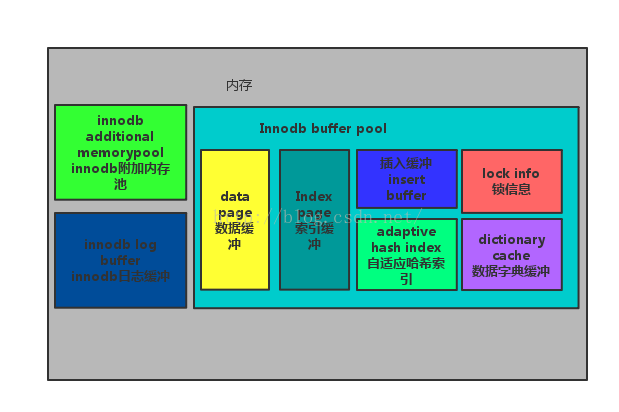

# InnoDB存储体系结构


> InnoDB存储引擎是基于磁盘存储的，并将其中的记录按照页的方式进行管理

* 后台线程
    * 主要作用是负责刷新内存池中的数据,保证缓冲池中的内存缓存的是最新数据;将已修改数据文件刷新到磁盘文件;保证数据库发生异常时 InnoDB 能恢复到正常运行的状态
* 内存池
    * 从图中可见, InnoDB 存储引擎有多个内存块,这些内存块组成了一个大的内存池,主要负责如下工作:
    * 维护所有进程/线程需要访问的多个内部数据结构
    * 缓存磁盘上的数据, 方便快速读取, 同时在对磁盘文件修改之前进行缓存
    * 重做日志(redo log)缓冲

## 后台线程
mysql有多个线程负责不同的任务
### Master Thread
核心业务：
* 将缓冲池中的数据异步刷新到磁盘
    * 脏页的刷新
    * 合并插入缓存insert buffer
    * undo页回收
### IO Thread
4种IO Thread
* write
* read
* insert buffer
* log IO thread
```sql
mysql> show variables like 'innodb_%io_threads'\G
```
```
*************************** 1. row ***************************
Variable_name: innodb_read_io_threads
        Value: 4
*************************** 2. row ***************************
Variable_name: innodb_write_io_threads
        Value: 4
2 rows in set (0.00 sec)
```
```sql
mysql> SHOW ENGINE INNODB STATUS\G
```
```
*************************** 1. row ***************************
...
--------
FILE I/O
--------
I/O thread 0 state: waiting for i/o request (insert buffer thread)
I/O thread 1 state: waiting for i/o request (log thread)
I/O thread 2 state: waiting for i/o request (read thread)
I/O thread 3 state: waiting for i/o request (read thread)
I/O thread 4 state: waiting for i/o request (read thread)
I/O thread 5 state: waiting for i/o request (read thread)
I/O thread 6 state: waiting for i/o request (write thread)
I/O thread 7 state: waiting for i/o request (write thread)
I/O thread 8 state: waiting for i/o request (write thread)
I/O thread 9 state: waiting for i/o request (write thread)
Pending normal aio reads: [0, 0, 0, 0] , aio writes: [0, 0, 0, 0] ,
 ibuf aio reads:, log i/o's:, sync i/o's:
Pending flushes (fsync) log: 0; buffer pool: 0
372 OS file reads, 54 OS file writes, 7 OS fsyncs
0.00 reads/s, 0 avg bytes/read, 0.00 writes/s, 0.00 fsyncs/s
...

1 row in set (0.00 sec)
```
### purge Thread
回收已经使用并分配的undo页


```sql
mysql> show variables like 'innodb_purge_threads' \G
```
```
*************************** 1. row ***************************
Variable_name: innodb_purge_threads
        Value: 4
1 row in set (0.01 sec)
```
### page cleaner Thread
负责赃页的刷新操作

FLUSH_LRU_LIST Checkpoint

Async/Sync Flush Checkpoint
## 内存
### 缓冲池
由于InnoDB是基于磁盘存储，使用缓冲池技术提高数据库的整体性能
* 读取： 
    * 将页FIX在缓冲池中
    * 先从缓冲池查找数据
    * 找到，称为在池中被命中
    * 找不到则将页FIX在缓冲池中
* 修改：
    * 首先修改缓冲池中的页
    * 再以Checkpoint机制刷新到磁盘 
```sql
mysql> show variables like 'innodb_buffer_pool_size'\G
```
```
*************************** 1. row ***************************
Variable_name: innodb_buffer_pool_size
        Value: 134217728
1 row in set (0.00 sec)
```
Innodb存储的数据页有：

```sql

mysql> show variables like 'innodb_buffer_pool_instances'\G
```
```
*************************** 1. row ***************************
Variable_name: innodb_buffer_pool_instances
        Value: 1
1 row in set (0.01 sec)
```
> 默认有一个缓冲池，可以配置为多个

可以通过**information_schema**架构下的表innodb_buffer_pool_stats来观察缓冲池的状态
```sql
mysql> use information_schema;
```
```
Reading table information for completion of table and column names
You can turn off this feature to get a quicker startup with -A

Database changed
```
```sql
mysql> select pool_id,pool_size,free_buffers,database_pages from innodb_buffer_pool_stats\G
```
```
*************************** 1. row ***************************
       pool_id: 0
     pool_size: 8192
  free_buffers: 7793
database_pages: 399
1 row in set (0.01 sec)
```
### LRU List和Flush List
#### LRU List
```sql
mysql> show engine innodb status\G
```
```
*************************** 1. row ***************************
...
----------------------
BUFFER POOL AND MEMORY
----------------------
Total large memory allocated 137428992
Dictionary memory allocated 377795
Buffer pool size   8192
Free buffers       7793
Database pages     399
Old database pages 0
Modified db pages  0
Pending reads      0
Pending writes: LRU 0, flush list 0, single page 0
Pages made young 0, not young 0
0.00 youngs/s, 0.00 non-youngs/s
Pages read 350, created 49, written 114
0.00 reads/s, 0.00 creates/s, 0.00 writes/s
No buffer pool page gets since the last printout
Pages read ahead 0.00/s, evicted without access 0.00/s, Random read ahead 0.00/s
LRU len: 399, unzip_LRU len: 0
I/O sum[0]:cur[0], unzip sum[0]:cur[0]
...
```
* LRU:latest recent used算法,管理缓冲池（想起了java垃圾回收。。。）
    * 最开始页存在Free buffers中，当从缓冲池中分页时，先使用Free buffers中的页（将Free buffers中的页移动到database pages（lru）中）
    * 当Free buffers中的页被用完后，开始淘汰lru列表末尾的页
* midpoint位置，最新读取到的页，放在LRU列5/8处，可由参数**innodb_old_blocks_pct**控制,midpoint之前称为new列表，之后称为old列表
    ```sql
    mysql> show variables like 'innodb_old_blocks_pct'\G
    ```

    ```
    *************************** 1. row ***************************
    Variable_name: innodb_old_blocks_pct
            Value: 37
    1 row in set (0.01 sec)
    ```
* innodb_old_blocks_pct:控制old page子链表在LRU链表中的长度。
* innodb_old_blocks_time:控制old page子链表的数据页移动到new page 子链表中的时机。
    * 当InnoDB_old_blocks_time的参数值设置为0时。当old部分的数据页被访问到时，该数据页会被提升到链表的头部，并被标记为new数据页。
    * 当InnoDB_old_blocks_time的参数值大于0时（以1000毫秒或者1秒为例）。old部分数据页插入缓冲池后，1秒之后被访问，该数据页会被提升到链表的头部，并被标记为new数据页。在刚插入到一秒内，即便old部分的数据页被访问，该数据页也不会移动到new链表的头部。

```sql
mysql> select pool_id,hit_rate,pages_made_young,pages_not_made_young from innodb_buffer_pool_stats\G 
```
```
*************************** 1. row ***************************
             pool_id: 0
            hit_rate: 0
    pages_made_young: 0
pages_not_made_young: 0
1 row in set (0.00 sec)
```
```sql
mysql> select table_name,space,page_number,page_type from innodb_buffer_page_lru where space = 53\G
```
```
*************************** 1. row ***************************
 table_name: `cellar`.`wine`
      space: 53
page_number: 3
  page_type: INDEX
*************************** 2. row ***************************
 table_name: NULL
      space: 53
page_number: 1
  page_type: IBUF_BITMAP
2 rows in set (0.00 sec)
```
* 压缩表在buffer pool中通过unzip_lru列表处理
```sql
mysql> show engine innodb status\G
```
```
...
----------------------
BUFFER POOL AND MEMORY
----------------------
...
LRU len: 399, unzip_LRU len: 0
I/O sum[0]:cur[0], unzip sum[0]:cur[0]
...
```
unzip_LRU包含在LRU内,（本例当前没有创建压缩包）

#### Flush List
在LRU列表中的页被修改后，称该页为脏页（dirty page），即缓冲池中的页和磁盘上的页的数据产生了不一致，脏页既存在于LRU列表中，也存在于Flush列表中。LRU列表用来管理缓冲池中页的可用性，Flush列表用来管理将页刷新回磁盘，二者互不影响。

```sql
mysql> show engine innodb status\G             
```
```
----------------------
BUFFER POOL AND MEMORY
----------------------
...
Modified db pages  0
Pending reads      0
Pending writes: LRU 0, flush list 0, single page 0
...

1 row in set (0.00 sec)
```
Modified db pages显示了赃页数量

```sql
mysql> select table_name,space,page_number,page_type from innodb_buffer_page_lru where oldest_modification>0;
```
```
Empty set (0.01 sec)
```

### 重做日志缓冲
InnoDB存储引擎首先将重做日志信息放入重做日志缓冲区，然后按照一定的频率将其刷入到重做日志文件。由参数**innodb_log_buffer_size**控制，默认为8M。

重做日志在下面三种情况下会把重做日志缓冲中的内容刷新到外部磁盘的重做日志文件中。

* Master Thread每一秒将重做日志缓冲刷新到重做日志文件。
* 每个事物提交时会将重做日志缓冲刷新到重做日志文件。
* 当重做日志缓冲池剩余空间小于1/2时，重做日志缓冲刷新到重做日志文件。
### 额外的内存池
在innoDB存储引擎中，对内存的管理是通过一种称为内存堆(heap)的方式进行。在对一些数据结构本身的内存进行分配时，需要从额外的内存池中进行申请，当该区域的内存不够时，需要从缓冲池中申请。

例如:分配了缓冲池，但是每个缓冲池中的帧缓冲(frame buffer)还有对应的缓冲控制对象(buffer control block)，这些记录了一些诸如LRU、锁、等待等信息，而这个对象的内存就需要从额外内存池中申请。因此在申请了很大的缓冲池是也要考虑相应增加这个值。