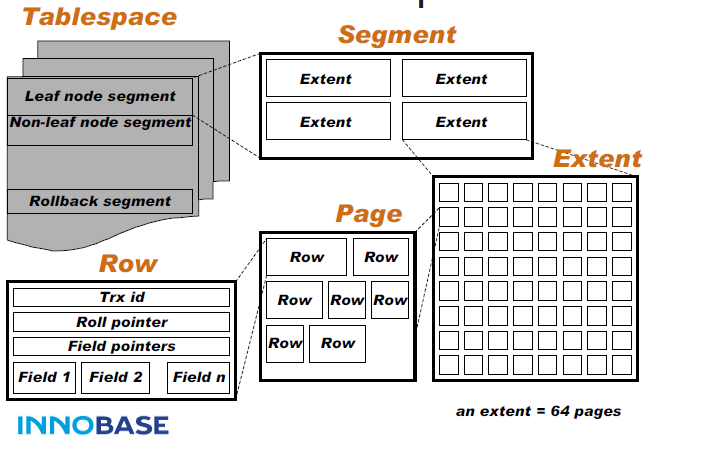

# 索引组织表
* Innodb，每张表都有一个主键
    * 如果我们定义了主键(PRIMARY KEY)，那么InnoDB会选择主键作为聚集索引
    * 如果没有显式定义主键，则InnoDB会选择第一个不包含有NULL值的唯一索引作为主键索引
    * 如果也没有这样的唯一索引，则InnoDB会选择内置6字节长的ROWID作为隐含的聚集索引(ROWID随着行记录的写入而逐渐递增，这个ROWID不像ORACLE的ROWID那样可引用，是隐含的)。

# Innodb 逻辑存储结构


## 表空间
[表空间](./innodb_file.md)

## 段
* 数据段
    * B+树的叶子节点
* 索引段
    * B+树的非叶子节点
* 回滚段

## 区
> 由连续的页组成的空间
> 每个区的大小为1MB
> 默认情况下，一个区中有连续的64个页（16k）

### 碎片页
启用参数innodb_file_per_table后，创建的表默认大小为96kb（<1M）。实际是先用32个page大小的碎片页存放数据，用完之后，才申请64个连续page。这样可以节省开销（小表，undo段等）

## 页
> Innodb管理的最小单位(每个页是一个B+树的节点)
* 数据页
* undo页
* 系统页
* 事务数据页
* 插入缓冲位图页
* 插入缓冲空闲列表页
* 未压缩的二进制大对象页
* 压缩的二进制大对象页

## 行
### 行记录格式
```sql
mysql> show table status like 'employees'\G
*************************** 1. row ***************************
···
     Row_format: Dynamic
···
```
* 1.0版本前
    * compact
    * redundant 
* 1.0.x版本后
    * Antelope
        * compact
        * redundant
    * Barracuda
        * Compressed
        * Dynamic

### VARCHAR(N) 行溢出数据 ,N的最大值为多少？
Innodb存储引擎可以将一条记录的某些数据存储在真正的数据页面之前。如
* BLOB
* LOB

但是这个理解有偏差，BLOB可以不将数据放在溢出页面，而VARCHAR也有可能将数据存为溢出行数据。

#### 65535字节
实验证明，mysql并不支持65535长度的varchar,实际存放最大长度varchar为65532（因为还有别的开销）。

#### varchar(N)
**N代表的是字符长度**，而文档中说明varchar类型最大支持65535单位是字节。

另外65535代表的是所有varchar列长度总和，如果列的长度总和超过这个长度，也无法创建
```sql
create table test2 (
    a varchar(22000),
    b varchar(52000)
) charset=latin1 engine=innodb;
ERROR 1118 (42000): Row size too large. 
The maximum row size for the used table type, not counting BLOBs, is 65535. 
This includes storage overhead, check the manual. 
You have to change some columns to TEXT or BLOBs
```

#### 行溢出情况
##### 单条数据过大
数据页只保存varchar的前缀部分字符，之后是偏移量指向行溢出页（uncompressed blob page）

##### 每个页中应有两条记录
否则退化成链表。

如果页中只能存放下一条记录，innodb会自动将行数据存放到溢出页中。

以上情况也适用于TEXT,BLOB等数据类型（注：新的行记录格式：compressed和dynamic）对于BLOB采用了完全行溢出的方式，在数据页中只存放20个字节，实际的数据存放在off page中
#### 总结
N的阈值是8098字节（byte）(8098*2=16196byte<16k)，否则发生行溢出

### CHAR