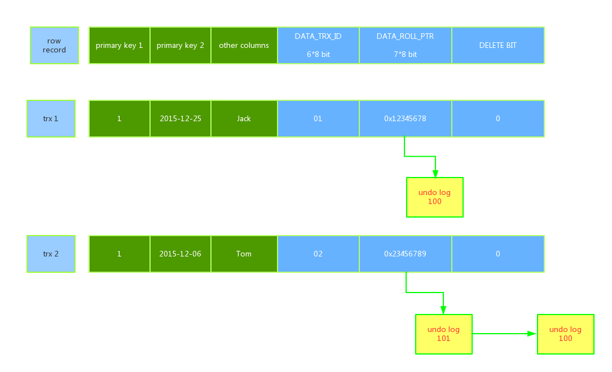

【mysql】关于innodb中MVCC的一些理解【转载】

# 一、MVCC简介
MVCC (Multiversion Concurrency Control)，即多版本并发控制技术,它使得大部分支持行锁的事务引擎，不再单纯的使用行锁来进行数据库的并发控制，取而代之的是把数据库的行锁与行的多个版本结合起来，只需要很小的开销,就可以实现非锁定读，从而大大提高数据库系统的并发性能

读锁：也叫共享锁、S锁，若事务T对数据对象A加上S锁，则事务T可以读A但不能修改A，其他事务只能再对A加S锁，而不能加X锁，直到T释放A上的S 锁。这保证了其他事务可以读A，但在T释放A上的S锁之前不能对A做任何修改。

写锁：又称排他锁、X锁。若事务T对数据对象A加上X锁，事务T可以读A也可以修改A，其他事务不能再对A加任何锁，直到T释放A上的锁。这保证了其他事务在T释放A上的锁之前不能再读取和修改A。

表锁：操作对象是数据表。Mysql大多数锁策略都支持(常见mysql innodb)，是系统开销最低但并发性最低的一个锁策略。事务t对整个表加读锁，则其他事务可读不可写，若加写锁，则其他事务增删改都不行。

行级锁：操作对象是数据表中的一行。是MVCC技术用的比较多的，但在MYISAM用不了，行级锁用mysql的储存引擎实现而不是mysql服务器。但行级锁对系统开销较大，处理高并发较好。

# 二、MVCC实现原理
innodb MVCC主要是为Repeatable-Read事务隔离级别做的。在此隔离级别下，A、B客户端所示的数据相互隔离，互相更新不可见

了解innodb的行结构、Read-View的结构对于理解innodb mvcc的实现由重要意义

innodb存储的最基本row中包含一些额外的存储信息 DATA_TRX_ID，DATA_ROLL_PTR，DB_ROW_ID，DELETE BIT

6字节的DATA_TRX_ID 标记了最新更新这条行记录的transaction id，每处理一个事务，其值自动+1

7字节的DATA_ROLL_PTR 指向当前记录项的rollback segment的undo log记录，找之前版本的数据就是通过这个指针

6字节的DB_ROW_ID，当由innodb自动产生聚集索引时，聚集索引包括这个DB_ROW_ID的值，否则聚集索引中不包括这个值.，这个用于索引当中
DELETE BIT位用于标识该记录是否被删除，这里的不是真正的删除数据，而是标志出来的删除。真正意义的删除是在commit的时候

具体的执行过程

begin->用排他锁锁定该行->记录redo log->记录undo log->修改当前行的值，写事务编号，回滚指针指向undo log中的修改前的行

上述过程确切地说是描述了UPDATE的事务过程，其实undo log分insert和update undo log，因为insert时，原始的数据并不存在，所以回滚时把insert undo log丢弃即可，而update undo log则必须遵守上述过程

下面分别以select、delete、 insert、 update语句来说明
## SELECT

Innodb检查每行数据，确保他们符合两个标准：

1、InnoDB只查找版本早于当前事务版本的数据行(也就是数据行的版本必须小于等于事务的版本)，这确保当前事务读取的行都是事务之前已经存在的，或者是由当前事务创建或修改的行

2、行的删除操作的版本一定是未定义的或者大于当前事务的版本号，确定了当前事务开始之前，行没有被删除

符合了以上两点则返回查询结果。

## INSERT

InnoDB为每个新增行记录当前系统版本号作为创建ID。

## DELETE

InnoDB为每个删除行的记录当前系统版本号作为行的删除ID。

## UPDATE

InnoDB复制了一行。这个新行的版本号使用了系统版本号。它也把系统版本号作为了删除行的版本。

说明
insert操作时 “创建时间”=DB_ROW_ID，这时，“删除时间 ”是未定义的；

update时，复制新增行的“创建时间”=DB_ROW_ID，删除时间未定义，旧数据行“创建时间”不变，删除时间=该事务的DB_ROW_ID；

delete操作，相应数据行的“创建时间”不变，删除时间=该事务的DB_ROW_ID；

select操作对两者都不修改，只读相应的数据

# 三、对于MVCC的总结
上述更新前建立undo log，根据各种策略读取时非阻塞就是MVCC，undo log中的行就是MVCC中的多版本，这个可能与我们所理解的MVCC有较大的出入，一般我们认为MVCC有下面几个特点：
每行数据都存在一个版本，每次数据更新时都更新该版本
修改时Copy出当前版本随意修改，各个事务之间无干扰
保存时比较版本号，如果成功（commit），则覆盖原记录；失败则放弃copy（rollback）
就是每行都有版本号，保存时根据版本号决定是否成功，听起来含有乐观锁的味道，而Innodb的实现方式是：
事务以排他锁的形式修改原始数据
把修改前的数据存放于undo log，通过回滚指针与主数据关联
修改成功（commit）啥都不做，失败则恢复undo log中的数据（rollback）
二者最本质的区别是，当修改数据时是否要排他锁定，如果锁定了还算不算是MVCC？ 
 
Innodb的实现真算不上MVCC，因为并没有实现核心的多版本共存，undo log中的内容只是串行化的结果，记录了多个事务的过程，不属于多版本共存。但理想的MVCC是难以实现的，当事务仅修改一行记录使用理想的MVCC模式是没有问题的，可以通过比较版本号进行回滚；但当事务影响到多行数据时，理想的MVCC据无能为力了。
 
比如，如果Transaciton1执行理想的MVCC，修改Row1成功，而修改Row2失败，此时需要回滚Row1，但因为Row1没有被锁定，其数据可能又被Transaction2所修改，如果此时回滚Row1的内容，则会破坏Transaction2的修改结果，导致Transaction2违反ACID。
 
理想MVCC难以实现的根本原因在于企图通过乐观锁代替二段提交。修改两行数据，但为了保证其一致性，与修改两个分布式系统中的数据并无区别，而二提交是目前这种场景保证一致性的唯一手段。二段提交的本质是锁定，乐观锁的本质是消除锁定，二者矛盾，故理想的MVCC难以真正在实际中被应用，Innodb只是借了MVCC这个名字，提供了读的非阻塞而已。
 
参考文章

https://www.percona.com/blog/2014/12/17/innodbs-multi-versioning-handling-can-be-achilles-heel/

http://www.xdata.me/?p=289

http://blogread.cn/it/article/5969

http://blog.csdn.net/chen77716/article/details/6742128

http://blog.chinaunix.net/link.php?url=http://forge.mysql.com%2Fwiki%2FMySQL_Internals

作者：踏雪无痕

出处：http://www.cnblogs.com/chenpingzhao/
本文版权归作者和博客园共有，如需转载，请联系  pingzhao1990#163.com 