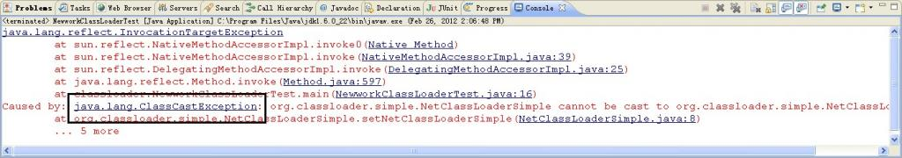
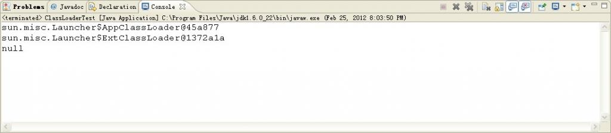
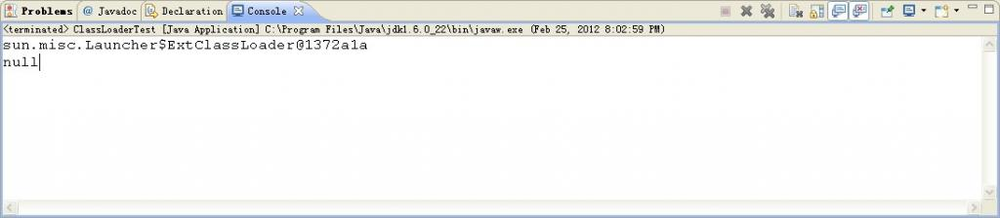
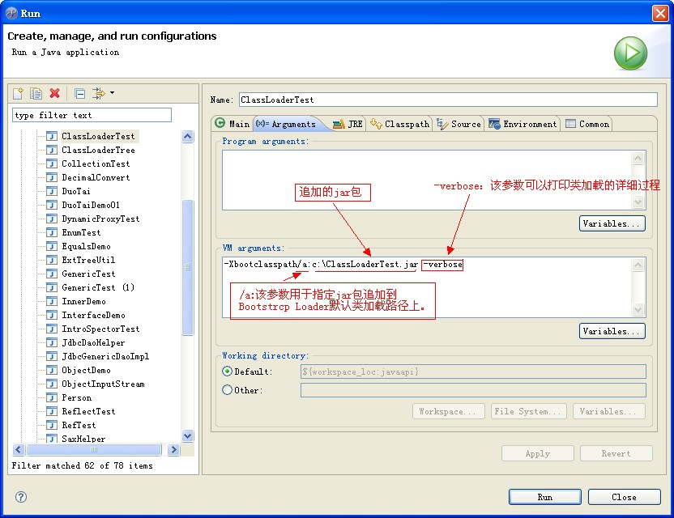
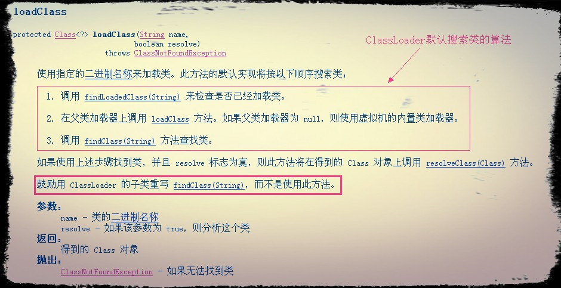
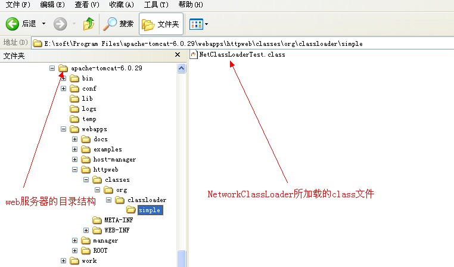
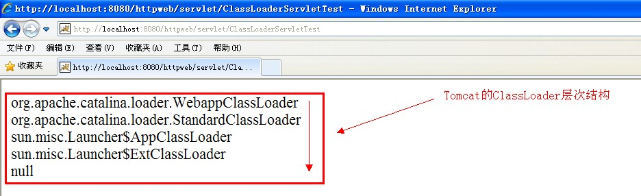
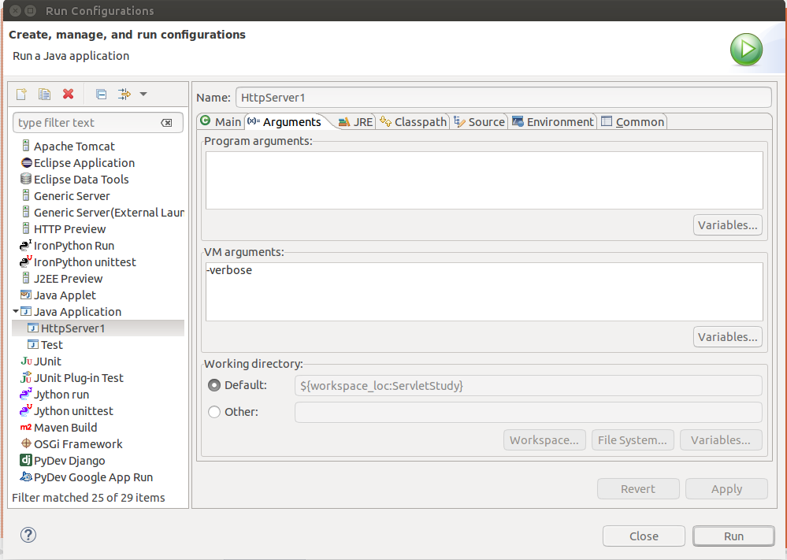

# CLASSLOADER

当我们写好一个Java程序之后，不是管是CS还是BS应用，都是由若干个.class文件组织而成的一个完整的Java应用程序，当程序在运行时，即会调用该程序的一个入口函数来调用系统的相关功能，而这些功能都被封装在不同的class文件当中，所以经常要从这个class文件中要调用另外一个class文件中的方法，如果另外一个文件不存在的，则会引发系统异常。而**程序在启动的时候，并不会一次性加载程序所要用的所有class文件，而是根据程序的需要，通过Java的类加载机制（ClassLoader）来动态加载某个class文件到内存当中的，从而只有class文件被载入到了内存之后，才能被其它class所引用。所以ClassLoader就是用来动态加载class文件到内存当中用的。**
 
## Java默认提供的三个ClassLoader
### BootStrap ClassLoader
称为启动类加载器，是Java类加载层次中最顶层的类加载器，负责加载JDK中的核心类库，即位于%JAVA_HOME%/jre/lib目录下的核心类库，如：rt.jar、resources.jar、charsets.jar等，

可通过如下程序获得该类加载器从哪些地方加载了相关的jar或class文件：
```java
URL[] urls = sun.misc.Launcher.getBootstrapClassPath().getURLs();  
for (int i = 0; i < urls.length; i++) {  
    System.out.println(urls[i].toExternalForm());  
}  
```
以下内容是上述程序从本机JDK环境所获得的结果：
```
file:/C:/Program%20Files/Java/jdk1.6.0_22/jre/lib/resources.jar
file:/C:/Program%20Files/Java/jdk1.6.0_22/jre/lib/rt.jar
file:/C:/Program%20Files/Java/jdk1.6.0_22/jre/lib/sunrsasign.jar
file:/C:/Program%20Files/Java/jdk1.6.0_22/jre/lib/jsse.jar
file:/C:/Program%20Files/Java/jdk1.6.0_22/jre/lib/jce.jar
file:/C:/Program%20Files/Java/jdk1.6.0_22/jre/lib/charsets.jar
file:/C:/Program%20Files/Java/jdk1.6.0_22/jre/classes/
```

其实上述结果也是通过查找sun.boot.class.path这个系统属性所得知的。
```java
System.out.println(System.getProperty("sun.boot.class.path"));  
```
```
打印结果：
C:\Program Files\Java\jdk1.6.0_22\jre\lib\resources.jar;C:\Program Files\Java\jdk1.6.0_22\jre\lib\rt.jar;C:\Program 				
Files\Java\jdk1.6.0_22\jre\lib\sunrsasign.jar;C:\Program Files\Java\jdk1.6.0_22\jre\lib\jsse.jar;C:\Program 
Files\Java\jdk1.6.0_22\jre\lib\jce.jar;C:\Program Files\Java\jdk1.6.0_22\jre\lib\charsets.jar;C:\Program Files\Java\jdk1.6.0_22\jre\classes
```
### Extension ClassLoader
称为扩展类加载器，负责加载Java的扩展类库，默认加载JAVA_HOME/jre/lib/ext/目下的所有jar。

### App ClassLoader

称为系统类加载器，负责加载应用程序classpath目录下的所有jar和class文件。

### Custom ClassLoader
除了Java默认提供的三个ClassLoader之外，用户还可以根据需要定义自已的ClassLoader，而这些自定义的ClassLoader都必须继承自
java.lang.ClassLoader类，也包括Java提供的另外二个ClassLoader（Extension ClassLoader和App ClassLoader）在内，但是Bootstrap ClassLoader不
继承自ClassLoader，因为它不是一个普通的Java类，底层由C++编写，已嵌入到了JVM内核当中，**当JVM启动后，Bootstrap ClassLoader也随着启动，
负责加载完核心类库后，并构造Extension ClassLoader和App ClassLoader类加载器。**
 
## ClassLoader加载类的原理
### 原理介绍
ClassLoader使用的是**双亲委托模型**来搜索类的，每个ClassLoader实例都有一个父类加载器的引用（不是继承的关系，是一个包含的关系），虚拟机内置的类加载器（Bootstrap ClassLoader）本身没有父类加载器，但可以用作其它ClassLoader实例的的父类加载器。当一个ClassLoader实例需要加载某个类时，它会试图亲自搜索某个类之前，先把这个任务委托给它的父类加载器，这个过程是由上至下依次检查的，首先由最顶层的类加载器Bootstrap ClassLoader试图加载，如果没加载到，则把任务转交给Extension ClassLoader试图加载，如果也没加载到，则转交给App ClassLoader 进行加载，如果它也没有加载得到的话，则返回给委托的发起者，由它到指定的文件系统或网络等URL中加载该类。如果它们都没有加载到这个类时，则抛出ClassNotFoundException异常。否则将这个找到的类生成一个类的定义，并将它加载到内存当中，最后返回这个类在内存中的Class实例对象。
 
### 为什么要使用双亲委托这种模型呢？
因为这样可以避免重复加载，当父亲已经加载了该类的时候，就没有必要子ClassLoader再加载一次。考虑到安全因素，我们试想一下，**如果不使用这种委托模式，那我们就可以随时使用自定义的String来动态替代java核心api中定义的类型，这样会存在非常大的安全隐患，而双亲委托的方式，就可以避免这种情况，因为String已经在启动时就被引导类加载器（Bootstrcp ClassLoader）加载，所以用户自定义的ClassLoader永远也无法加载一个自己写的String，除非你改变JDK中ClassLoader搜索类的默认算法。**

### 但是JVM在搜索类的时候，又是如何判定两个class是相同的呢？
**JVM在判定两个class是否相同时，不仅要判断两个类名是否相同，而且要判断是否由同一个类加载器实例加载的。只有两者同时满足的情况下，JVM才认为这两个class是相同的**。就算两个class是同一份class字节码，如果被两个不同的ClassLoader实例所加载，JVM也会认为它们是两个不同class。比如网络上的一个Java类org.classloader.simple.NetClassLoaderSimple，javac编译之后生成字节码文件NetClassLoaderSimple.class，ClassLoaderA和ClassLoaderB这两个类加载器并读取了NetClassLoaderSimple.class文件，并分别定义出了java.lang.Class实例来表示这个类，对于JVM来说，它们是两个不同的实例对象，但它们确实是同一份字节码文件，如果试图将这个Class实例生成具体的对象进行转换时，就会抛运行时异常java.lang.ClassCaseException，提示这是两个不同的类型。现在通过实例来验证上述所描述的是否正确：

* 在web服务器上建一个org.classloader.simple.NetClassLoaderSimple.java类
```java
package org.classloader.simple;  
  
public class NetClassLoaderSimple {  
      
    private NetClassLoaderSimple instance;  
  
    public void setNetClassLoaderSimple(Object obj) {  
        this.instance = (NetClassLoaderSimple)obj;  
    }  
}  
```
org.classloader.simple.NetClassLoaderSimple类的setNetClassLoaderSimple方法接收一个Object类型参数，并将它强制转换成org.classloader.simple.NetClassLoaderSimple类型。

* 测试两个class是否相同（NetWorkClassLoader.java）
```java
package classloader;  
  
public class NewworkClassLoaderTest {  
  
    public static void main(String[] args) {  
        try {  
            //测试加载网络中的class文件  
            String rootUrl = "http://localhost:8080/httpweb/classes";  
            String className = "org.classloader.simple.NetClassLoaderSimple";  
            NetworkClassLoader ncl1 = new NetworkClassLoader(rootUrl);  
            NetworkClassLoader ncl2 = new NetworkClassLoader(rootUrl);  
            Class<?> clazz1 = ncl1.loadClass(className);  
            Class<?> clazz2 = ncl2.loadClass(className);  
            Object obj1 = clazz1.newInstance();  
            Object obj2 = clazz2.newInstance();  
            clazz1.getMethod("setNetClassLoaderSimple", Object.class).invoke(obj1, obj2);  
        } catch (Exception e) {  
            e.printStackTrace();  
        }  
    }  
      
}  
```
首先获得网络上一个class文件的二进制名称，然后通过自定义的类加载器NetworkClassLoader创建两个实例，并根据网络地址分别加载这份class，并得到这两个ClassLoader实例加载后生成的Class实例clazz1和clazz2，最后将这两个Class实例分别生成具体的实例对象obj1和obj2，再通过反射调用clazz1中的setNetClassLoaderSimple方法。

* 查看测试结果



结论：从结果中可以看出，虽然是同一份class字节码文件，但是由于被两个不同的ClassLoader实例所加载，所以JVM认为它们就是两个不同的类。

## ClassLoader的体系架构：

 
## 验证ClassLoader加载类的原理
### ### 由AppClassLoader来加载类
```java
ClassLoader loader = ClassLoaderTest.class.getClassLoader();    //获得加载ClassLoaderTest.class这个类的类加载器  
while(loader != null) {  
    System.out.println(loader);  
    loader = loader.getParent();    //获得父类加载器的引用  
}  
System.out.println(loader); 
``` 
打印结果：

 
第一行结果说明：ClassLoaderTest的类加载器是AppClassLoader。

第二行结果说明：AppClassLoader的类加器是ExtClassLoader，即parent=ExtClassLoader。

第三行结果说明：ExtClassLoader的类加器是Bootstrap ClassLoader，因为Bootstrap ClassLoader不是一个普通的Java类，所以ExtClassLoader的parent=null，所以第三行的打印结果为null就是这个原因。
 
### 由ExtClassLoader来加载类
将ClassLoaderTest.class打包成ClassLoaderTest.jar，放到Extension ClassLoader的加载目录下（JAVA_HOME/jre/lib/ext），然后重新运行这个程序，得到的结果会是什么样呢？

 
打印结果：

 
打印结果分析：
为什么第一行的结果是ExtClassLoader呢？
因为ClassLoader的委托模型机制，当我们要用ClassLoaderTest.class这个类的时候，AppClassLoader在试图加载之前，先委托给Bootstrcp ClassLoader，Bootstracp ClassLoader发现自己没找到，它就告诉ExtClassLoader，然后Extension ClassLoader拿着这个类去它指定的类路径（JAVA_HOME/jre/lib/ext）试图加载，它发现在ClassLoaderTest.jar这样一个文件中包含ClassLoaderTest.class这样的一个文件，然后它把找到的这个类加载到内存当中，并生成这个类的Class实例对象，最后把这个实例返回。所以ClassLoaderTest.class的类加载器是ExtClassLoader。
 
第二行的结果为null，是因为ExtClassLoader的父类加载器是Bootstrap ClassLoader。
 
### 由Bootstrcp ClassLoader来加载类
用Bootstrcp ClassLoader来加载ClassLoaderTest.class，有两种方式：

* 在jvm中添加-Xbootclasspath参数，指定Bootstrcp ClassLoader加载类的路径，并追加我们自已的jar（ClassTestLoader.jar）
* 将class文件放到JAVA_HOME/jre/classes/目录下（上面有提到）

#### -Xbootclasspath

（我用的是Eclipse开发工具，用命令行是在java命令后面添加-Xbootclasspath参数）
打开Run配置对话框：

配置好如图中所述的参数后，重新运行程序，产的结果如下所示：（类加载的过程，只摘下了一部份）
打印结果：
```
[Loaded java.io.FileReader from C:\Program Files\Java\jdk1.6.0_22\jre\lib\rt.jar]  
[Loaded sun.nio.cs.StreamDecoder from C:\Program Files\Java\jdk1.6.0_22\jre\lib\rt.jar]  
[Loaded java.util.ArrayList from C:\Program Files\Java\jdk1.6.0_22\jre\lib\rt.jar]  
[Loaded java.lang.reflect.Array from C:\Program Files\Java\jdk1.6.0_22\jre\lib\rt.jar]  
[Loaded java.util.Locale from C:\Program Files\Java\jdk1.6.0_22\jre\lib\rt.jar]  
[Loaded java.util.concurrent.ConcurrentMap from C:\Program Files\Java\jdk1.6.0_22\jre\lib\rt.jar]  
[Loaded java.util.concurrent.ConcurrentHashMap from C:\Program Files\Java\jdk1.6.0_22\jre\lib\rt.jar]  
[Loaded java.util.concurrent.locks.Lock from C:\Program Files\Java\jdk1.6.0_22\jre\lib\rt.jar]  
[Loaded java.util.concurrent.locks.ReentrantLock from C:\Program Files\Java\jdk1.6.0_22\jre\lib\rt.jar]  
[Loaded java.util.concurrent.ConcurrentHashMap$Segment from C:\Program Files\Java\jdk1.6.0_22\jre\lib\rt.jar]  
[Loaded java.util.concurrent.locks.AbstractOwnableSynchronizer from C:\Program Files\Java\jdk1.6.0_22\jre\lib\rt.jar]  
[Loaded java.util.concurrent.locks.AbstractQueuedSynchronizer from C:\Program Files\Java\jdk1.6.0_22\jre\lib\rt.jar]  
[Loaded java.util.concurrent.locks.ReentrantLock$Sync from C:\Program Files\Java\jdk1.6.0_22\jre\lib\rt.jar]  
[Loaded java.util.concurrent.locks.ReentrantLock$NonfairSync from C:\Program Files\Java\jdk1.6.0_22\jre\lib\rt.jar]  
[Loaded java.util.concurrent.locks.AbstractQueuedSynchronizer$Node from C:\Program Files\Java\jdk1.6.0_22\jre\lib\rt.jar]  
[Loaded java.util.concurrent.ConcurrentHashMap$HashEntry from C:\Program Files\Java\jdk1.6.0_22\jre\lib\rt.jar]  
[Loaded java.lang.CharacterDataLatin1 from C:\Program Files\Java\jdk1.6.0_22\jre\lib\rt.jar]  
[Loaded java.io.ObjectStreamClass from C:\Program Files\Java\jdk1.6.0_22\jre\lib\rt.jar]  
[Loaded sun.net.www.ParseUtil from C:\Program Files\Java\jdk1.6.0_22\jre\lib\rt.jar]  
[Loaded java.util.BitSet from C:\Program Files\Java\jdk1.6.0_22\jre\lib\rt.jar]  
[Loaded java.net.Parts from C:\Program Files\Java\jdk1.6.0_22\jre\lib\rt.jar]  
[Loaded java.net.URLStreamHandler from C:\Program Files\Java\jdk1.6.0_22\jre\lib\rt.jar]  
[Loaded sun.net.www.protocol.file.Handler from C:\Program Files\Java\jdk1.6.0_22\jre\lib\rt.jar]  
[Loaded java.util.HashSet from C:\Program Files\Java\jdk1.6.0_22\jre\lib\rt.jar]  
[Loaded sun.net.www.protocol.jar.Handler from C:\Program Files\Java\jdk1.6.0_22\jre\lib\rt.jar]  
[Loaded sun.misc.Launcher$AppClassLoader from C:\Program Files\Java\jdk1.6.0_22\jre\lib\rt.jar]  
[Loaded sun.misc.Launcher$AppClassLoader$1 from C:\Program Files\Java\jdk1.6.0_22\jre\lib\rt.jar]  
[Loaded java.lang.SystemClassLoaderAction from C:\Program Files\Java\jdk1.6.0_22\jre\lib\rt.jar]  
[Path C:\Program Files\Java\jdk1.6.0_22\jre\classes]  
[Loaded classloader.ClassLoaderTest from C:\Program Files\Java\jdk1.6.0_22\jre\classes]  
null  //这是打印的结果  
C:\Program Files\Java\jdk1.6.0_22\jre\lib\resources.jar;C:\Program Files\Java\jdk1.6.0_22\jre\lib\rt.jar;  
C:\Program Files\Java\jdk1.6.0_22\jre\lib\sunrsasign.jar;C:\Program Files\Java\jdk1.6.0_22\jre\lib\jsse.jar;  
C:\Program Files\Java\jdk1.6.0_22\jre\lib\jce.jar;C:\Program Files\Java\jdk1.6.0_22\jre\lib\charsets.jar;  
C:\Program Files\Java\jdk1.6.0_22\jre\classes;c:\ClassLoaderTest.jar    
//这一段是System.out.println(System.getProperty("sun.boot.class.path"));打印出来的。这个路径就是Bootstrcp ClassLoader默认搜索类的路径  
[Loaded java.lang.Shutdown from C:\Program Files\Java\jdk1.6.0_22\jre\lib\rt.jar]  
[Loaded java.lang.Shutdown$Lock from C:\Program Files\Java\jdk1.6.0_22\jre\lib\rt.jar]  
```
#### 将ClassLoaderTest.jar解压后，放到JAVA_HOME/jre/classes目录下,
提示：jre目录下默认没有classes目录，需要自己手动创建一个

打印结果：
```
null
```
从结果中可以看出，两种方式都实现了将ClassLoaderTest.class由Bootstrcp ClassLoader加载成功了。
 
## 定义自已的ClassLoader
### 为什么还要定义自已的类加载器呢？

**因为Java中提供的默认ClassLoader，只加载指定目录下的jar和class，如果我们想加载其它位置的类或jar时，比如：我要加载网络上的一个class文件，通过动态加载到内存之后，要调用这个类中的方法实现我的业务逻辑。在这样的情况下，默认的ClassLoader就不能满足我们的需求了，所以需要定义自己的ClassLoader。**
定义自已的类加载器分为两步：
* 继承java.lang.ClassLoader
* 重写父类的findClass方法

### 为什么重写findClass方法？
因为JDK已经在loadClass方法中帮我们实现了ClassLoader搜索类的算法，当在loadClass方法中搜索不到类时，loadClass方法就会调用findClass方法来搜索类，所以我们只需重写该方法即可。如没有特殊的要求，一般不建议重写loadClass搜索类的算法。下图是API中ClassLoader的loadClass方法：



示例：自定义一个NetworkClassLoader，用于加载网络上的class文件
```java
package classloader;  
  
import java.io.ByteArrayOutputStream;  
import java.io.InputStream;  
import java.net.URL;  
  
/** 
 * 加载网络class的ClassLoader 
 */  
public class NetworkClassLoader extends ClassLoader {  
      
    private String rootUrl;  
  
    public NetworkClassLoader(String rootUrl) {  
        this.rootUrl = rootUrl;  
    }  
  
    @Override  
    protected Class<?> findClass(String name) throws ClassNotFoundException {  
        Class clazz = null;//this.findLoadedClass(name); // 父类已加载     
        //if (clazz == null) {  //检查该类是否已被加载过  
            byte[] classData = getClassData(name);  //根据类的二进制名称,获得该class文件的字节码数组  
            if (classData == null) {  
                throw new ClassNotFoundException();  
            }  
            clazz = defineClass(name, classData, 0, classData.length);  //将class的字节码数组转换成Class类的实例  
        //}   
        return clazz;  
    }  
  
    private byte[] getClassData(String name) {  
        InputStream is = null;  
        try {  
            String path = classNameToPath(name);  
            URL url = new URL(path);  
            byte[] buff = new byte[1024*4];  
            int len = -1;  
            is = url.openStream();  
            ByteArrayOutputStream baos = new ByteArrayOutputStream();  
            while((len = is.read(buff)) != -1) {  
                baos.write(buff,0,len);  
            }  
            return baos.toByteArray();  
        } catch (Exception e) {  
            e.printStackTrace();  
        } finally {  
            if (is != null) {  
               try {  
                  is.close();  
               } catch(IOException e) {  
                  e.printStackTrace();  
               }  
            }  
        }  
        return null;  
    }  
  
    private String classNameToPath(String name) {  
        return rootUrl + "/" + name.replace(".", "/") + ".class";  
    }  
  
}  
```
测试类：
```java
package classloader;  
  
public class ClassLoaderTest {  
  
    public static void main(String[] args) {  
        try {  
            /*ClassLoader loader = ClassLoaderTest.class.getClassLoader();  //获得ClassLoaderTest这个类的类加载器 
            while(loader != null) { 
                System.out.println(loader); 
                loader = loader.getParent();    //获得父加载器的引用 
            } 
            System.out.println(loader);*/  
              
  
            String rootUrl = "http://localhost:8080/httpweb/classes";  
            NetworkClassLoader networkClassLoader = new NetworkClassLoader(rootUrl);  
            String classname = "org.classloader.simple.NetClassLoaderTest";  
            Class clazz = networkClassLoader.loadClass(classname);  
            System.out.println(clazz.getClassLoader());  
              
        } catch (Exception e) {  
            e.printStackTrace();  
        }  
    }  
      
} 
``` 
打印结果：

下图是我机器上web服务器的目录结构：


目前常用web服务器中都定义了自己的类加载器，用于加载web应用指定目录下的类库（jar或class），如：Weblogic、Jboss、tomcat等，下面我以Tomcat为例，展示该web容器都定义了哪些个类加载器：

* 新建一个web工程httpweb
* 新建一个ClassLoaderServletTest，用于打印web容器中的ClassLoader层次结构
```java
import java.io.IOException;  
import java.io.PrintWriter;  
  
import javax.servlet.ServletException;  
import javax.servlet.http.HttpServlet;  
import javax.servlet.http.HttpServletRequest;  
import javax.servlet.http.HttpServletResponse;  
  
public class ClassLoaderServletTest extends HttpServlet {  
  
    public void doGet(HttpServletRequest request, HttpServletResponse response)  
            throws ServletException, IOException {  
  
        response.setContentType("text/html");  
        PrintWriter out = response.getWriter();  
        ClassLoader loader = this.getClass().getClassLoader();  
        while(loader != null) {  
            out.write(loader.getClass().getName()+"<br/>");  
            loader = loader.getParent();  
        }  
        out.write(String.valueOf(loader));  
        out.flush();  
        out.close();  
    }  
      
    public void doPost(HttpServletRequest request, HttpServletResponse response)  
            throws ServletException, IOException {  
        this.doGet(request, response);  
    }  
  
}  
```
* 配置Servlet，并启动服务
```html
<?xml version="1.0" encoding="UTF-8"?>  
<web-app version="2.4"   
    xmlns="http://java.sun.com/xml/ns/j2ee"   
    xmlns:xsi="http://www.w3.org/2001/XMLSchema-instance"   
    xsi:schemaLocation="http://java.sun.com/xml/ns/j2ee   
    http://java.sun.com/xml/ns/j2ee/web-app_2_4.xsd">  
  <servlet>  
    <servlet-name>ClassLoaderServletTest</servlet-name>  
    <servlet-class>ClassLoaderServletTest</servlet-class>  
  </servlet>  
  
  <servlet-mapping>  
    <servlet-name>ClassLoaderServletTest</servlet-name>  
    <url-pattern>/servlet/ClassLoaderServletTest</url-pattern>  
  </servlet-mapping>  
  <welcome-file-list>  
    <welcome-file>index.jsp</welcome-file>  
  </welcome-file-list>  
</web-app>  
```
# 访问Servlet，获得显示结果


## 其他
https://www.ibm.com/developerworks/cn/java/j-lo-classloader/
http://snandy.iteye.com/blog/307083

《深入理解Java虚拟机》


## 测试
```java
package ex02.pyrmont;
 
import java.net.Socket;
import java.net.ServerSocket;
import java.net.InetAddress;
import java.io.InputStream;
import java.io.OutputStream;
import java.io.IOException;
 
public class HttpServer1 {
 
    /**
     * WEB_ROOT is the directory where our HTML and other files reside. For this
     * package, WEB_ROOT is the "webroot" directory under the working directory.
     * The working directory is the location in the file system from where the
     * java command was invoked.
     */
    // shutdown command
    private static final String SHUTDOWN_COMMAND = "/SHUTDOWN";
 
    // the shutdown command received
    private boolean shutdown = false;
 
    public static void main(String[] args) {
        HttpServer1 server = new HttpServer1();
        server.await();
    }
 
    public void await() {
        ServerSocket serverSocket = null;
        int port = 8080;
        try {
            serverSocket = new ServerSocket(port, 1, InetAddress.getByName("127.0.0.1"));
        } catch (IOException e) {
            e.printStackTrace();
            System.exit(1);
        }
 
        // Loop waiting for a request
        while (!shutdown) {
            Socket socket = null;
            InputStream input = null;
            OutputStream output = null;
            try {
                socket = serverSocket.accept();
                input = socket.getInputStream();
                output = socket.getOutputStream();
 
                // create Request object and parse
                Request request = new Request(input);
                request.parse();
 
                // create Response object
                Response response = new Response(output);
                response.setRequest(request);
 
                // check if this is a request for a servlet or a static resource
                // a request for a servlet begins with "/servlet/"
                if (request.getUri().startsWith("/servlet/")) {
                    ServletProcessor1 processor = new ServletProcessor1();
                    processor.process(request, response);
                } else {
                    StaticResourceProcessor processor = new StaticResourceProcessor();
                    processor.process(request, response);
                }
 
                // Close the socket
                socket.close();
                // check if the previous URI is a shutdown command
                shutdown = request.getUri().equals(SHUTDOWN_COMMAND);
            } catch (Exception e) {
                e.printStackTrace();
                System.exit(1);
            }
        }
    }
}
```


其他相关代码略

该代码通过判断uri是否包含/servlet/目录来通过servlet动态生成web资源或者返回静态资源

查看程序启动的详细信息



控制台打印如下，可以看到被加载到内存中的类！
```
[Opened /usr/lib/jvm/java-8-oracle/jre/lib/rt.jar]
[Loaded java.lang.Object from /usr/lib/jvm/java-8-oracle/jre/lib/rt.jar]
[Loaded java.io.Serializable from /usr/lib/jvm/java-8-oracle/jre/lib/rt.jar]
[Loaded java.lang.Comparable from /usr/lib/jvm/java-8-oracle/jre/lib/rt.jar]
[Loaded java.lang.CharSequence from /usr/lib/jvm/java-8-oracle/jre/lib/rt.jar]
[Loaded java.lang.String from /usr/lib/jvm/java-8-oracle/jre/lib/rt.jar]
[Loaded java.lang.reflect.AnnotatedElement from /usr/lib/jvm/java-8-oracle/jre/lib/rt.jar]
[Loaded java.lang.reflect.GenericDeclaration from /usr/lib/jvm/java-8-oracle/jre/lib/rt.jar]
[Loaded java.lang.reflect.Type from /usr/lib/jvm/java-8-oracle/jre/lib/rt.jar]
[Loaded java.lang.Class from /usr/lib/jvm/java-8-oracle/jre/lib/rt.jar]
[Loaded java.lang.Cloneable from /usr/lib/jvm/java-8-oracle/jre/lib/rt.jar]
[Loaded java.lang.ClassLoader from /usr/lib/jvm/java-8-oracle/jre/lib/rt.jar]
[Loaded java.lang.System from /usr/lib/jvm/java-8-oracle/jre/lib/rt.jar]
[Loaded java.lang.Throwable from /usr/lib/jvm/java-8-oracle/jre/lib/rt.jar]
[Loaded java.lang.Error from /usr/lib/jvm/java-8-oracle/jre/lib/rt.jar]
[Loaded java.lang.ThreadDeath from /usr/lib/jvm/java-8-oracle/jre/lib/rt.jar]
[Loaded java.lang.Exception from /usr/lib/jvm/java-8-oracle/jre/lib/rt.jar]
[Loaded java.lang.RuntimeException from /usr/lib/jvm/java-8-oracle/jre/lib/rt.jar]
[Loaded java.lang.SecurityManager from /usr/lib/jvm/java-8-oracle/jre/lib/rt.jar]
[Loaded java.security.ProtectionDomain from /usr/lib/jvm/java-8-oracle/jre/lib/rt.jar]
[Loaded java.security.AccessControlContext from /usr/lib/jvm/java-8-oracle/jre/lib/rt.jar]
[Loaded java.security.SecureClassLoader from /usr/lib/jvm/java-8-oracle/jre/lib/rt.jar]
[Loaded java.lang.ReflectiveOperationException from /usr/lib/jvm/java-8-oracle/jre/lib/rt.jar]
[Loaded java.lang.ClassNotFoundException from /usr/lib/jvm/java-8-oracle/jre/lib/rt.jar]
[Loaded java.lang.LinkageError from /usr/lib/jvm/java-8-oracle/jre/lib/rt.jar]
[Loaded java.lang.NoClassDefFoundError from /usr/lib/jvm/java-8-oracle/jre/lib/rt.jar]
[Loaded java.lang.ClassCastException from /usr/lib/jvm/java-8-oracle/jre/lib/rt.jar]
[Loaded java.lang.ArrayStoreException from /usr/lib/jvm/java-8-oracle/jre/lib/rt.jar]
[Loaded java.lang.VirtualMachineError from /usr/lib/jvm/java-8-oracle/jre/lib/rt.jar]
[Loaded java.lang.OutOfMemoryError from /usr/lib/jvm/java-8-oracle/jre/lib/rt.jar]
[Loaded java.lang.StackOverflowError from /usr/lib/jvm/java-8-oracle/jre/lib/rt.jar]
[Loaded java.lang.IllegalMonitorStateException from /usr/lib/jvm/java-8-oracle/jre/lib/rt.jar]
[Loaded java.lang.ref.Reference from /usr/lib/jvm/java-8-oracle/jre/lib/rt.jar]
[Loaded java.lang.ref.SoftReference from /usr/lib/jvm/java-8-oracle/jre/lib/rt.jar]
[Loaded java.lang.ref.WeakReference from /usr/lib/jvm/java-8-oracle/jre/lib/rt.jar]
[Loaded java.lang.ref.FinalReference from /usr/lib/jvm/java-8-oracle/jre/lib/rt.jar]
[Loaded java.lang.ref.PhantomReference from /usr/lib/jvm/java-8-oracle/jre/lib/rt.jar]
[Loaded sun.misc.Cleaner from /usr/lib/jvm/java-8-oracle/jre/lib/rt.jar]
[Loaded java.lang.ref.Finalizer from /usr/lib/jvm/java-8-oracle/jre/lib/rt.jar]
[Loaded java.lang.Runnable from /usr/lib/jvm/java-8-oracle/jre/lib/rt.jar]
[Loaded java.lang.Thread from /usr/lib/jvm/java-8-oracle/jre/lib/rt.jar]
[Loaded java.lang.Thread$UncaughtExceptionHandler from /usr/lib/jvm/java-8-oracle/jre/lib/rt.jar]
[Loaded java.lang.ThreadGroup from /usr/lib/jvm/java-8-oracle/jre/lib/rt.jar]
[Loaded java.util.Map from /usr/lib/jvm/java-8-oracle/jre/lib/rt.jar]
[Loaded java.util.Dictionary from /usr/lib/jvm/java-8-oracle/jre/lib/rt.jar]
[Loaded java.util.Hashtable from /usr/lib/jvm/java-8-oracle/jre/lib/rt.jar]
[Loaded java.util.Properties from /usr/lib/jvm/java-8-oracle/jre/lib/rt.jar]
[Loaded java.lang.reflect.AccessibleObject from /usr/lib/jvm/java-8-oracle/jre/lib/rt.jar]
[Loaded java.lang.reflect.Member from /usr/lib/jvm/java-8-oracle/jre/lib/rt.jar]
[Loaded java.lang.reflect.Field from /usr/lib/jvm/java-8-oracle/jre/lib/rt.jar]
[Loaded java.lang.reflect.Parameter from /usr/lib/jvm/java-8-oracle/jre/lib/rt.jar]
[Loaded java.lang.reflect.Executable from /usr/lib/jvm/java-8-oracle/jre/lib/rt.jar]
[Loaded java.lang.reflect.Method from /usr/lib/jvm/java-8-oracle/jre/lib/rt.jar]
[Loaded java.lang.reflect.Constructor from /usr/lib/jvm/java-8-oracle/jre/lib/rt.jar]
[Loaded sun.reflect.MagicAccessorImpl from /usr/lib/jvm/java-8-oracle/jre/lib/rt.jar]
[Loaded sun.reflect.MethodAccessor from /usr/lib/jvm/java-8-oracle/jre/lib/rt.jar]
[Loaded sun.reflect.MethodAccessorImpl from /usr/lib/jvm/java-8-oracle/jre/lib/rt.jar]
[Loaded sun.reflect.ConstructorAccessor from /usr/lib/jvm/java-8-oracle/jre/lib/rt.jar]
[Loaded sun.reflect.ConstructorAccessorImpl from /usr/lib/jvm/java-8-oracle/jre/lib/rt.jar]
[Loaded sun.reflect.DelegatingClassLoader from /usr/lib/jvm/java-8-oracle/jre/lib/rt.jar]
[Loaded sun.reflect.ConstantPool from /usr/lib/jvm/java-8-oracle/jre/lib/rt.jar]
[Loaded sun.reflect.FieldAccessor from /usr/lib/jvm/java-8-oracle/jre/lib/rt.jar]
[Loaded sun.reflect.FieldAccessorImpl from /usr/lib/jvm/java-8-oracle/jre/lib/rt.jar]
[Loaded sun.reflect.UnsafeFieldAccessorImpl from /usr/lib/jvm/java-8-oracle/jre/lib/rt.jar]
[Loaded sun.reflect.UnsafeStaticFieldAccessorImpl from /usr/lib/jvm/java-8-oracle/jre/lib/rt.jar]
[Loaded java.lang.annotation.Annotation from /usr/lib/jvm/java-8-oracle/jre/lib/rt.jar]
[Loaded sun.reflect.CallerSensitive from /usr/lib/jvm/java-8-oracle/jre/lib/rt.jar]
[Loaded java.lang.invoke.MethodHandle from /usr/lib/jvm/java-8-oracle/jre/lib/rt.jar]
[Loaded java.lang.invoke.DirectMethodHandle from /usr/lib/jvm/java-8-oracle/jre/lib/rt.jar]
[Loaded java.lang.invoke.MemberName from /usr/lib/jvm/java-8-oracle/jre/lib/rt.jar]
[Loaded java.lang.invoke.MethodHandleNatives from /usr/lib/jvm/java-8-oracle/jre/lib/rt.jar]
[Loaded java.lang.invoke.LambdaForm from /usr/lib/jvm/java-8-oracle/jre/lib/rt.jar]
[Loaded java.lang.invoke.MethodType from /usr/lib/jvm/java-8-oracle/jre/lib/rt.jar]
[Loaded java.lang.BootstrapMethodError from /usr/lib/jvm/java-8-oracle/jre/lib/rt.jar]
[Loaded java.lang.invoke.CallSite from /usr/lib/jvm/java-8-oracle/jre/lib/rt.jar]
[Loaded java.lang.invoke.ConstantCallSite from /usr/lib/jvm/java-8-oracle/jre/lib/rt.jar]
[Loaded java.lang.invoke.MutableCallSite from /usr/lib/jvm/java-8-oracle/jre/lib/rt.jar]
[Loaded java.lang.invoke.VolatileCallSite from /usr/lib/jvm/java-8-oracle/jre/lib/rt.jar]
[Loaded java.lang.Appendable from /usr/lib/jvm/java-8-oracle/jre/lib/rt.jar]
[Loaded java.lang.AbstractStringBuilder from /usr/lib/jvm/java-8-oracle/jre/lib/rt.jar]
[Loaded java.lang.StringBuffer from /usr/lib/jvm/java-8-oracle/jre/lib/rt.jar]
[Loaded java.lang.StringBuilder from /usr/lib/jvm/java-8-oracle/jre/lib/rt.jar]
[Loaded sun.misc.Unsafe from /usr/lib/jvm/java-8-oracle/jre/lib/rt.jar]
[Loaded java.lang.AutoCloseable from /usr/lib/jvm/java-8-oracle/jre/lib/rt.jar]
[Loaded java.io.Closeable from /usr/lib/jvm/java-8-oracle/jre/lib/rt.jar]
[Loaded java.io.InputStream from /usr/lib/jvm/java-8-oracle/jre/lib/rt.jar]
[Loaded java.io.ByteArrayInputStream from /usr/lib/jvm/java-8-oracle/jre/lib/rt.jar]
[Loaded java.io.File from /usr/lib/jvm/java-8-oracle/jre/lib/rt.jar]
[Loaded java.net.URLClassLoader from /usr/lib/jvm/java-8-oracle/jre/lib/rt.jar]
[Loaded java.net.URL from /usr/lib/jvm/java-8-oracle/jre/lib/rt.jar]
[Loaded java.util.jar.Manifest from /usr/lib/jvm/java-8-oracle/jre/lib/rt.jar]
[Loaded sun.misc.Launcher from /usr/lib/jvm/java-8-oracle/jre/lib/rt.jar]
[Loaded sun.misc.Launcher$AppClassLoader from /usr/lib/jvm/java-8-oracle/jre/lib/rt.jar]
[Loaded sun.misc.Launcher$ExtClassLoader from /usr/lib/jvm/java-8-oracle/jre/lib/rt.jar]
[Loaded java.security.CodeSource from /usr/lib/jvm/java-8-oracle/jre/lib/rt.jar]
[Loaded java.lang.StackTraceElement from /usr/lib/jvm/java-8-oracle/jre/lib/rt.jar]
[Loaded java.nio.Buffer from /usr/lib/jvm/java-8-oracle/jre/lib/rt.jar]
[Loaded java.lang.Boolean from /usr/lib/jvm/java-8-oracle/jre/lib/rt.jar]
[Loaded java.lang.Character from /usr/lib/jvm/java-8-oracle/jre/lib/rt.jar]
[Loaded java.lang.Number from /usr/lib/jvm/java-8-oracle/jre/lib/rt.jar]
[Loaded java.lang.Float from /usr/lib/jvm/java-8-oracle/jre/lib/rt.jar]
[Loaded java.lang.Double from /usr/lib/jvm/java-8-oracle/jre/lib/rt.jar]
[Loaded java.lang.Byte from /usr/lib/jvm/java-8-oracle/jre/lib/rt.jar]
[Loaded java.lang.Short from /usr/lib/jvm/java-8-oracle/jre/lib/rt.jar]
[Loaded java.lang.Integer from /usr/lib/jvm/java-8-oracle/jre/lib/rt.jar]
[Loaded java.lang.Long from /usr/lib/jvm/java-8-oracle/jre/lib/rt.jar]
[Loaded java.lang.NullPointerException from /usr/lib/jvm/java-8-oracle/jre/lib/rt.jar]
[Loaded java.lang.ArithmeticException from /usr/lib/jvm/java-8-oracle/jre/lib/rt.jar]
[Loaded java.io.ObjectStreamField from /usr/lib/jvm/java-8-oracle/jre/lib/rt.jar]
[Loaded java.util.Comparator from /usr/lib/jvm/java-8-oracle/jre/lib/rt.jar]
[Loaded java.lang.String$CaseInsensitiveComparator from /usr/lib/jvm/java-8-oracle/jre/lib/rt.jar]
[Loaded java.security.Guard from /usr/lib/jvm/java-8-oracle/jre/lib/rt.jar]
[Loaded java.security.Permission from /usr/lib/jvm/java-8-oracle/jre/lib/rt.jar]
[Loaded java.security.BasicPermission from /usr/lib/jvm/java-8-oracle/jre/lib/rt.jar]
[Loaded java.lang.RuntimePermission from /usr/lib/jvm/java-8-oracle/jre/lib/rt.jar]
[Loaded java.security.AccessController from /usr/lib/jvm/java-8-oracle/jre/lib/rt.jar]
[Loaded java.lang.reflect.ReflectPermission from /usr/lib/jvm/java-8-oracle/jre/lib/rt.jar]
[Loaded java.security.PrivilegedAction from /usr/lib/jvm/java-8-oracle/jre/lib/rt.jar]
[Loaded sun.reflect.ReflectionFactory$GetReflectionFactoryAction from /usr/lib/jvm/java-8-oracle/jre/lib/rt.jar]
[Loaded java.security.cert.Certificate from /usr/lib/jvm/java-8-oracle/jre/lib/rt.jar]
[Loaded java.lang.Iterable from /usr/lib/jvm/java-8-oracle/jre/lib/rt.jar]
[Loaded java.util.Collection from /usr/lib/jvm/java-8-oracle/jre/lib/rt.jar]
[Loaded java.util.List from /usr/lib/jvm/java-8-oracle/jre/lib/rt.jar]
[Loaded java.util.RandomAccess from /usr/lib/jvm/java-8-oracle/jre/lib/rt.jar]
[Loaded java.util.AbstractCollection from /usr/lib/jvm/java-8-oracle/jre/lib/rt.jar]
[Loaded java.util.AbstractList from /usr/lib/jvm/java-8-oracle/jre/lib/rt.jar]
[Loaded java.util.Vector from /usr/lib/jvm/java-8-oracle/jre/lib/rt.jar]
[Loaded java.util.Stack from /usr/lib/jvm/java-8-oracle/jre/lib/rt.jar]
[Loaded sun.reflect.ReflectionFactory from /usr/lib/jvm/java-8-oracle/jre/lib/rt.jar]
[Loaded java.lang.ref.Reference$Lock from /usr/lib/jvm/java-8-oracle/jre/lib/rt.jar]
[Loaded java.lang.ref.Reference$ReferenceHandler from /usr/lib/jvm/java-8-oracle/jre/lib/rt.jar]
[Loaded java.lang.InterruptedException from /usr/lib/jvm/java-8-oracle/jre/lib/rt.jar]
[Loaded java.util.ArrayList from /usr/lib/jvm/java-8-oracle/jre/lib/rt.jar]
[Loaded java.util.Collections from /usr/lib/jvm/java-8-oracle/jre/lib/rt.jar]
[Loaded java.util.Set from /usr/lib/jvm/java-8-oracle/jre/lib/rt.jar]
[Loaded java.util.AbstractSet from /usr/lib/jvm/java-8-oracle/jre/lib/rt.jar]
[Loaded java.util.Collections$EmptySet from /usr/lib/jvm/java-8-oracle/jre/lib/rt.jar]
[Loaded java.util.Collections$EmptyList from /usr/lib/jvm/java-8-oracle/jre/lib/rt.jar]
[Loaded java.util.AbstractMap from /usr/lib/jvm/java-8-oracle/jre/lib/rt.jar]
[Loaded java.util.Collections$EmptyMap from /usr/lib/jvm/java-8-oracle/jre/lib/rt.jar]
[Loaded java.util.Collections$UnmodifiableCollection from /usr/lib/jvm/java-8-oracle/jre/lib/rt.jar]
[Loaded java.util.Collections$UnmodifiableList from /usr/lib/jvm/java-8-oracle/jre/lib/rt.jar]
[Loaded java.util.Collections$UnmodifiableRandomAccessList from /usr/lib/jvm/java-8-oracle/jre/lib/rt.jar]
[Loaded java.lang.ref.ReferenceQueue from /usr/lib/jvm/java-8-oracle/jre/lib/rt.jar]
[Loaded java.lang.ref.ReferenceQueue$Null from /usr/lib/jvm/java-8-oracle/jre/lib/rt.jar]
[Loaded java.lang.ref.ReferenceQueue$Lock from /usr/lib/jvm/java-8-oracle/jre/lib/rt.jar]
[Loaded sun.misc.JavaLangRefAccess from /usr/lib/jvm/java-8-oracle/jre/lib/rt.jar]
[Loaded java.lang.ref.Reference$1 from /usr/lib/jvm/java-8-oracle/jre/lib/rt.jar]
[Loaded sun.misc.SharedSecrets from /usr/lib/jvm/java-8-oracle/jre/lib/rt.jar]
[Loaded java.lang.IncompatibleClassChangeError from /usr/lib/jvm/java-8-oracle/jre/lib/rt.jar]
[Loaded java.lang.NoSuchMethodError from /usr/lib/jvm/java-8-oracle/jre/lib/rt.jar]
[Loaded sun.reflect.Reflection from /usr/lib/jvm/java-8-oracle/jre/lib/rt.jar]
[Loaded java.util.HashMap from /usr/lib/jvm/java-8-oracle/jre/lib/rt.jar]
[Loaded java.util.Map$Entry from /usr/lib/jvm/java-8-oracle/jre/lib/rt.jar]
[Loaded java.util.HashMap$Node from /usr/lib/jvm/java-8-oracle/jre/lib/rt.jar]
[Loaded sun.misc.VM from /usr/lib/jvm/java-8-oracle/jre/lib/rt.jar]
[Loaded java.util.Hashtable$Entry from /usr/lib/jvm/java-8-oracle/jre/lib/rt.jar]
[Loaded java.lang.Math from /usr/lib/jvm/java-8-oracle/jre/lib/rt.jar]
[Loaded java.lang.ref.Finalizer$FinalizerThread from /usr/lib/jvm/java-8-oracle/jre/lib/rt.jar]
[Loaded java.nio.charset.Charset from /usr/lib/jvm/java-8-oracle/jre/lib/rt.jar]
[Loaded java.nio.charset.spi.CharsetProvider from /usr/lib/jvm/java-8-oracle/jre/lib/rt.jar]
[Loaded sun.nio.cs.FastCharsetProvider from /usr/lib/jvm/java-8-oracle/jre/lib/rt.jar]
[Loaded sun.nio.cs.StandardCharsets from /usr/lib/jvm/java-8-oracle/jre/lib/rt.jar]
[Loaded sun.util.PreHashedMap from /usr/lib/jvm/java-8-oracle/jre/lib/rt.jar]
[Loaded sun.nio.cs.StandardCharsets$Aliases from /usr/lib/jvm/java-8-oracle/jre/lib/rt.jar]
[Loaded sun.nio.cs.StandardCharsets$Classes from /usr/lib/jvm/java-8-oracle/jre/lib/rt.jar]
[Loaded sun.nio.cs.StandardCharsets$Cache from /usr/lib/jvm/java-8-oracle/jre/lib/rt.jar]
[Loaded java.lang.ThreadLocal from /usr/lib/jvm/java-8-oracle/jre/lib/rt.jar]
[Loaded java.util.concurrent.atomic.AtomicInteger from /usr/lib/jvm/java-8-oracle/jre/lib/rt.jar]
[Loaded java.lang.Class$3 from /usr/lib/jvm/java-8-oracle/jre/lib/rt.jar]
[Loaded java.lang.Class$ReflectionData from /usr/lib/jvm/java-8-oracle/jre/lib/rt.jar]
[Loaded java.lang.Class$Atomic from /usr/lib/jvm/java-8-oracle/jre/lib/rt.jar]
[Loaded sun.reflect.generics.repository.AbstractRepository from /usr/lib/jvm/java-8-oracle/jre/lib/rt.jar]
[Loaded sun.reflect.generics.repository.GenericDeclRepository from /usr/lib/jvm/java-8-oracle/jre/lib/rt.jar]
[Loaded sun.reflect.generics.repository.ClassRepository from /usr/lib/jvm/java-8-oracle/jre/lib/rt.jar]
[Loaded java.lang.Class$AnnotationData from /usr/lib/jvm/java-8-oracle/jre/lib/rt.jar]
[Loaded sun.reflect.annotation.AnnotationType from /usr/lib/jvm/java-8-oracle/jre/lib/rt.jar]
[Loaded java.util.WeakHashMap from /usr/lib/jvm/java-8-oracle/jre/lib/rt.jar]
[Loaded java.lang.ClassValue$ClassValueMap from /usr/lib/jvm/java-8-oracle/jre/lib/rt.jar]
[Loaded java.lang.reflect.Modifier from /usr/lib/jvm/java-8-oracle/jre/lib/rt.jar]
[Loaded sun.reflect.LangReflectAccess from /usr/lib/jvm/java-8-oracle/jre/lib/rt.jar]
[Loaded java.lang.reflect.ReflectAccess from /usr/lib/jvm/java-8-oracle/jre/lib/rt.jar]
[Loaded java.util.Arrays from /usr/lib/jvm/java-8-oracle/jre/lib/rt.jar]
[Loaded sun.nio.cs.HistoricallyNamedCharset from /usr/lib/jvm/java-8-oracle/jre/lib/rt.jar]
[Loaded sun.nio.cs.Unicode from /usr/lib/jvm/java-8-oracle/jre/lib/rt.jar]
[Loaded sun.nio.cs.UTF_8 from /usr/lib/jvm/java-8-oracle/jre/lib/rt.jar]
[Loaded java.lang.Class$1 from /usr/lib/jvm/java-8-oracle/jre/lib/rt.jar]
[Loaded sun.reflect.ReflectionFactory$1 from /usr/lib/jvm/java-8-oracle/jre/lib/rt.jar]
[Loaded sun.reflect.NativeConstructorAccessorImpl from /usr/lib/jvm/java-8-oracle/jre/lib/rt.jar]
[Loaded sun.reflect.DelegatingConstructorAccessorImpl from /usr/lib/jvm/java-8-oracle/jre/lib/rt.jar]
[Loaded java.lang.StringCoding from /usr/lib/jvm/java-8-oracle/jre/lib/rt.jar]
[Loaded java.lang.ThreadLocal$ThreadLocalMap from /usr/lib/jvm/java-8-oracle/jre/lib/rt.jar]
[Loaded java.lang.ThreadLocal$ThreadLocalMap$Entry from /usr/lib/jvm/java-8-oracle/jre/lib/rt.jar]
[Loaded java.lang.StringCoding$StringDecoder from /usr/lib/jvm/java-8-oracle/jre/lib/rt.jar]
[Loaded sun.nio.cs.ArrayDecoder from /usr/lib/jvm/java-8-oracle/jre/lib/rt.jar]
[Loaded java.nio.charset.CharsetDecoder from /usr/lib/jvm/java-8-oracle/jre/lib/rt.jar]
[Loaded sun.nio.cs.UTF_8$Decoder from /usr/lib/jvm/java-8-oracle/jre/lib/rt.jar]
[Loaded java.nio.charset.CodingErrorAction from /usr/lib/jvm/java-8-oracle/jre/lib/rt.jar]
[Loaded java.util.Hashtable$EntrySet from /usr/lib/jvm/java-8-oracle/jre/lib/rt.jar]
[Loaded java.util.Collections$SynchronizedCollection from /usr/lib/jvm/java-8-oracle/jre/lib/rt.jar]
[Loaded java.util.Collections$SynchronizedSet from /usr/lib/jvm/java-8-oracle/jre/lib/rt.jar]
[Loaded java.util.Objects from /usr/lib/jvm/java-8-oracle/jre/lib/rt.jar]
[Loaded java.util.Enumeration from /usr/lib/jvm/java-8-oracle/jre/lib/rt.jar]
[Loaded java.util.Iterator from /usr/lib/jvm/java-8-oracle/jre/lib/rt.jar]
[Loaded java.util.Hashtable$Enumerator from /usr/lib/jvm/java-8-oracle/jre/lib/rt.jar]
[Loaded java.lang.Runtime from /usr/lib/jvm/java-8-oracle/jre/lib/rt.jar]
[Loaded sun.misc.Version from /usr/lib/jvm/java-8-oracle/jre/lib/rt.jar]
[Loaded java.io.FileInputStream from /usr/lib/jvm/java-8-oracle/jre/lib/rt.jar]
[Loaded java.io.FileDescriptor from /usr/lib/jvm/java-8-oracle/jre/lib/rt.jar]
[Loaded sun.misc.JavaIOFileDescriptorAccess from /usr/lib/jvm/java-8-oracle/jre/lib/rt.jar]
[Loaded java.io.FileDescriptor$1 from /usr/lib/jvm/java-8-oracle/jre/lib/rt.jar]
[Loaded java.io.Flushable from /usr/lib/jvm/java-8-oracle/jre/lib/rt.jar]
[Loaded java.io.OutputStream from /usr/lib/jvm/java-8-oracle/jre/lib/rt.jar]
[Loaded java.io.FileOutputStream from /usr/lib/jvm/java-8-oracle/jre/lib/rt.jar]
[Loaded java.io.FilterInputStream from /usr/lib/jvm/java-8-oracle/jre/lib/rt.jar]
[Loaded java.io.BufferedInputStream from /usr/lib/jvm/java-8-oracle/jre/lib/rt.jar]
[Loaded java.util.concurrent.atomic.AtomicReferenceFieldUpdater from /usr/lib/jvm/java-8-oracle/jre/lib/rt.jar]
[Loaded java.util.concurrent.atomic.AtomicReferenceFieldUpdater$AtomicReferenceFieldUpdaterImpl from /usr/lib/jvm/java-8-oracle/jre/lib/rt.jar]
[Loaded java.security.PrivilegedExceptionAction from /usr/lib/jvm/java-8-oracle/jre/lib/rt.jar]
[Loaded java.util.concurrent.atomic.AtomicReferenceFieldUpdater$AtomicReferenceFieldUpdaterImpl$1 from /usr/lib/jvm/java-8-oracle/jre/lib/rt.jar]
[Loaded sun.reflect.misc.ReflectUtil from /usr/lib/jvm/java-8-oracle/jre/lib/rt.jar]
[Loaded java.io.FilterOutputStream from /usr/lib/jvm/java-8-oracle/jre/lib/rt.jar]
[Loaded java.io.PrintStream from /usr/lib/jvm/java-8-oracle/jre/lib/rt.jar]
[Loaded java.io.BufferedOutputStream from /usr/lib/jvm/java-8-oracle/jre/lib/rt.jar]
[Loaded java.io.Writer from /usr/lib/jvm/java-8-oracle/jre/lib/rt.jar]
[Loaded java.io.OutputStreamWriter from /usr/lib/jvm/java-8-oracle/jre/lib/rt.jar]
[Loaded sun.nio.cs.StreamEncoder from /usr/lib/jvm/java-8-oracle/jre/lib/rt.jar]
[Loaded sun.security.action.GetPropertyAction from /usr/lib/jvm/java-8-oracle/jre/lib/rt.jar]
[Loaded sun.nio.cs.ArrayEncoder from /usr/lib/jvm/java-8-oracle/jre/lib/rt.jar]
[Loaded java.nio.charset.CharsetEncoder from /usr/lib/jvm/java-8-oracle/jre/lib/rt.jar]
[Loaded sun.nio.cs.UTF_8$Encoder from /usr/lib/jvm/java-8-oracle/jre/lib/rt.jar]
[Loaded java.nio.ByteBuffer from /usr/lib/jvm/java-8-oracle/jre/lib/rt.jar]
[Loaded java.nio.HeapByteBuffer from /usr/lib/jvm/java-8-oracle/jre/lib/rt.jar]
[Loaded java.nio.Bits from /usr/lib/jvm/java-8-oracle/jre/lib/rt.jar]
[Loaded java.nio.ByteOrder from /usr/lib/jvm/java-8-oracle/jre/lib/rt.jar]
[Loaded java.util.concurrent.atomic.AtomicLong from /usr/lib/jvm/java-8-oracle/jre/lib/rt.jar]
[Loaded sun.misc.JavaNioAccess from /usr/lib/jvm/java-8-oracle/jre/lib/rt.jar]
[Loaded java.nio.Bits$1 from /usr/lib/jvm/java-8-oracle/jre/lib/rt.jar]
[Loaded java.io.BufferedWriter from /usr/lib/jvm/java-8-oracle/jre/lib/rt.jar]
[Loaded java.io.DefaultFileSystem from /usr/lib/jvm/java-8-oracle/jre/lib/rt.jar]
[Loaded java.io.FileSystem from /usr/lib/jvm/java-8-oracle/jre/lib/rt.jar]
[Loaded java.io.UnixFileSystem from /usr/lib/jvm/java-8-oracle/jre/lib/rt.jar]
[Loaded java.io.ExpiringCache from /usr/lib/jvm/java-8-oracle/jre/lib/rt.jar]
[Loaded java.util.LinkedHashMap from /usr/lib/jvm/java-8-oracle/jre/lib/rt.jar]
[Loaded java.io.ExpiringCache$1 from /usr/lib/jvm/java-8-oracle/jre/lib/rt.jar]
[Loaded java.lang.Enum from /usr/lib/jvm/java-8-oracle/jre/lib/rt.jar]
[Loaded java.io.File$PathStatus from /usr/lib/jvm/java-8-oracle/jre/lib/rt.jar]
[Loaded java.nio.file.Watchable from /usr/lib/jvm/java-8-oracle/jre/lib/rt.jar]
[Loaded java.nio.file.Path from /usr/lib/jvm/java-8-oracle/jre/lib/rt.jar]
[Loaded java.lang.StringCoding$StringEncoder from /usr/lib/jvm/java-8-oracle/jre/lib/rt.jar]
[Loaded java.lang.ClassLoader$3 from /usr/lib/jvm/java-8-oracle/jre/lib/rt.jar]
[Loaded java.io.ExpiringCache$Entry from /usr/lib/jvm/java-8-oracle/jre/lib/rt.jar]
[Loaded java.util.LinkedHashMap$Entry from /usr/lib/jvm/java-8-oracle/jre/lib/rt.jar]
[Loaded java.lang.ClassLoader$NativeLibrary from /usr/lib/jvm/java-8-oracle/jre/lib/rt.jar]
[Loaded java.lang.Terminator from /usr/lib/jvm/java-8-oracle/jre/lib/rt.jar]
[Loaded sun.misc.SignalHandler from /usr/lib/jvm/java-8-oracle/jre/lib/rt.jar]
[Loaded java.lang.Terminator$1 from /usr/lib/jvm/java-8-oracle/jre/lib/rt.jar]
[Loaded sun.misc.Signal from /usr/lib/jvm/java-8-oracle/jre/lib/rt.jar]
[Loaded sun.misc.NativeSignalHandler from /usr/lib/jvm/java-8-oracle/jre/lib/rt.jar]
[Loaded java.lang.Integer$IntegerCache from /usr/lib/jvm/java-8-oracle/jre/lib/rt.jar]
[Loaded sun.misc.OSEnvironment from /usr/lib/jvm/java-8-oracle/jre/lib/rt.jar]
[Loaded sun.misc.JavaLangAccess from /usr/lib/jvm/java-8-oracle/jre/lib/rt.jar]
[Loaded java.lang.System$2 from /usr/lib/jvm/java-8-oracle/jre/lib/rt.jar]
[Loaded java.lang.IllegalArgumentException from /usr/lib/jvm/java-8-oracle/jre/lib/rt.jar]
[Loaded java.lang.Compiler from /usr/lib/jvm/java-8-oracle/jre/lib/rt.jar]
[Loaded java.lang.Compiler$1 from /usr/lib/jvm/java-8-oracle/jre/lib/rt.jar]
[Loaded java.net.URLStreamHandlerFactory from /usr/lib/jvm/java-8-oracle/jre/lib/rt.jar]
[Loaded sun.misc.Launcher$Factory from /usr/lib/jvm/java-8-oracle/jre/lib/rt.jar]
[Loaded sun.security.util.Debug from /usr/lib/jvm/java-8-oracle/jre/lib/rt.jar]
[Loaded java.lang.ClassLoader$ParallelLoaders from /usr/lib/jvm/java-8-oracle/jre/lib/rt.jar]
[Loaded java.util.WeakHashMap$Entry from /usr/lib/jvm/java-8-oracle/jre/lib/rt.jar]
[Loaded java.util.Collections$SetFromMap from /usr/lib/jvm/java-8-oracle/jre/lib/rt.jar]
[Loaded java.util.WeakHashMap$KeySet from /usr/lib/jvm/java-8-oracle/jre/lib/rt.jar]
[Loaded sun.misc.JavaNetAccess from /usr/lib/jvm/java-8-oracle/jre/lib/rt.jar]
[Loaded java.net.URLClassLoader$7 from /usr/lib/jvm/java-8-oracle/jre/lib/rt.jar]
[Loaded java.util.StringTokenizer from /usr/lib/jvm/java-8-oracle/jre/lib/rt.jar]
[Loaded sun.misc.Launcher$ExtClassLoader$1 from /usr/lib/jvm/java-8-oracle/jre/lib/rt.jar]
[Loaded sun.misc.MetaIndex from /usr/lib/jvm/java-8-oracle/jre/lib/rt.jar]
[Loaded java.lang.Readable from /usr/lib/jvm/java-8-oracle/jre/lib/rt.jar]
[Loaded java.io.Reader from /usr/lib/jvm/java-8-oracle/jre/lib/rt.jar]
[Loaded java.io.BufferedReader from /usr/lib/jvm/java-8-oracle/jre/lib/rt.jar]
[Loaded java.io.InputStreamReader from /usr/lib/jvm/java-8-oracle/jre/lib/rt.jar]
[Loaded java.io.FileReader from /usr/lib/jvm/java-8-oracle/jre/lib/rt.jar]
[Loaded sun.nio.cs.StreamDecoder from /usr/lib/jvm/java-8-oracle/jre/lib/rt.jar]
[Loaded java.nio.CharBuffer from /usr/lib/jvm/java-8-oracle/jre/lib/rt.jar]
[Loaded java.nio.HeapCharBuffer from /usr/lib/jvm/java-8-oracle/jre/lib/rt.jar]
[Loaded java.nio.charset.CoderResult from /usr/lib/jvm/java-8-oracle/jre/lib/rt.jar]
[Loaded java.nio.charset.CoderResult$Cache from /usr/lib/jvm/java-8-oracle/jre/lib/rt.jar]
[Loaded java.nio.charset.CoderResult$1 from /usr/lib/jvm/java-8-oracle/jre/lib/rt.jar]
[Loaded java.nio.charset.CoderResult$2 from /usr/lib/jvm/java-8-oracle/jre/lib/rt.jar]
[Loaded java.lang.reflect.Array from /usr/lib/jvm/java-8-oracle/jre/lib/rt.jar]
[Loaded java.util.HashMap$TreeNode from /usr/lib/jvm/java-8-oracle/jre/lib/rt.jar]
[Loaded java.io.FileInputStream$1 from /usr/lib/jvm/java-8-oracle/jre/lib/rt.jar]
[Loaded sun.net.www.ParseUtil from /usr/lib/jvm/java-8-oracle/jre/lib/rt.jar]
[Loaded java.util.BitSet from /usr/lib/jvm/java-8-oracle/jre/lib/rt.jar]
[Loaded java.util.Locale from /usr/lib/jvm/java-8-oracle/jre/lib/rt.jar]
[Loaded sun.util.locale.LocaleObjectCache from /usr/lib/jvm/java-8-oracle/jre/lib/rt.jar]
[Loaded java.util.Locale$Cache from /usr/lib/jvm/java-8-oracle/jre/lib/rt.jar]
[Loaded java.util.concurrent.ConcurrentMap from /usr/lib/jvm/java-8-oracle/jre/lib/rt.jar]
[Loaded java.util.concurrent.ConcurrentHashMap from /usr/lib/jvm/java-8-oracle/jre/lib/rt.jar]
[Loaded java.util.concurrent.locks.Lock from /usr/lib/jvm/java-8-oracle/jre/lib/rt.jar]
[Loaded java.util.concurrent.locks.ReentrantLock from /usr/lib/jvm/java-8-oracle/jre/lib/rt.jar]
[Loaded java.util.concurrent.ConcurrentHashMap$Segment from /usr/lib/jvm/java-8-oracle/jre/lib/rt.jar]
[Loaded java.util.concurrent.ConcurrentHashMap$Node from /usr/lib/jvm/java-8-oracle/jre/lib/rt.jar]
[Loaded java.util.concurrent.ConcurrentHashMap$CounterCell from /usr/lib/jvm/java-8-oracle/jre/lib/rt.jar]
[Loaded java.util.concurrent.ConcurrentHashMap$CollectionView from /usr/lib/jvm/java-8-oracle/jre/lib/rt.jar]
[Loaded java.util.concurrent.ConcurrentHashMap$KeySetView from /usr/lib/jvm/java-8-oracle/jre/lib/rt.jar]
[Loaded java.util.concurrent.ConcurrentHashMap$ValuesView from /usr/lib/jvm/java-8-oracle/jre/lib/rt.jar]
[Loaded java.util.concurrent.ConcurrentHashMap$EntrySetView from /usr/lib/jvm/java-8-oracle/jre/lib/rt.jar]
[Loaded sun.util.locale.BaseLocale from /usr/lib/jvm/java-8-oracle/jre/lib/rt.jar]
[Loaded sun.util.locale.BaseLocale$Cache from /usr/lib/jvm/java-8-oracle/jre/lib/rt.jar]
[Loaded sun.util.locale.BaseLocale$Key from /usr/lib/jvm/java-8-oracle/jre/lib/rt.jar]
[Loaded sun.util.locale.LocaleObjectCache$CacheEntry from /usr/lib/jvm/java-8-oracle/jre/lib/rt.jar]
[Loaded java.util.Locale$LocaleKey from /usr/lib/jvm/java-8-oracle/jre/lib/rt.jar]
[Loaded sun.util.locale.LocaleUtils from /usr/lib/jvm/java-8-oracle/jre/lib/rt.jar]
[Loaded java.lang.CharacterData from /usr/lib/jvm/java-8-oracle/jre/lib/rt.jar]
[Loaded java.lang.CharacterDataLatin1 from /usr/lib/jvm/java-8-oracle/jre/lib/rt.jar]
[Loaded java.net.Parts from /usr/lib/jvm/java-8-oracle/jre/lib/rt.jar]
[Loaded java.net.URLStreamHandler from /usr/lib/jvm/java-8-oracle/jre/lib/rt.jar]
[Loaded sun.net.www.protocol.file.Handler from /usr/lib/jvm/java-8-oracle/jre/lib/rt.jar]
[Loaded sun.misc.JavaSecurityAccess from /usr/lib/jvm/java-8-oracle/jre/lib/rt.jar]
[Loaded java.security.ProtectionDomain$JavaSecurityAccessImpl from /usr/lib/jvm/java-8-oracle/jre/lib/rt.jar]
[Loaded sun.misc.JavaSecurityProtectionDomainAccess from /usr/lib/jvm/java-8-oracle/jre/lib/rt.jar]
[Loaded java.security.ProtectionDomain$2 from /usr/lib/jvm/java-8-oracle/jre/lib/rt.jar]
[Loaded java.security.ProtectionDomain$Key from /usr/lib/jvm/java-8-oracle/jre/lib/rt.jar]
[Loaded java.security.Principal from /usr/lib/jvm/java-8-oracle/jre/lib/rt.jar]
[Loaded java.util.HashSet from /usr/lib/jvm/java-8-oracle/jre/lib/rt.jar]
[Loaded sun.misc.URLClassPath from /usr/lib/jvm/java-8-oracle/jre/lib/rt.jar]
[Loaded sun.net.www.protocol.jar.Handler from /usr/lib/jvm/java-8-oracle/jre/lib/rt.jar]
[Loaded sun.misc.Launcher$AppClassLoader$1 from /usr/lib/jvm/java-8-oracle/jre/lib/rt.jar]
[Loaded java.lang.SystemClassLoaderAction from /usr/lib/jvm/java-8-oracle/jre/lib/rt.jar]
[Loaded java.lang.invoke.MethodHandleImpl from /usr/lib/jvm/java-8-oracle/jre/lib/rt.jar]
[Loaded java.lang.invoke.MethodHandleImpl$1 from /usr/lib/jvm/java-8-oracle/jre/lib/rt.jar]
[Loaded java.util.function.Function from /usr/lib/jvm/java-8-oracle/jre/lib/rt.jar]
[Loaded java.lang.invoke.MethodHandleImpl$2 from /usr/lib/jvm/java-8-oracle/jre/lib/rt.jar]
[Loaded java.lang.invoke.MethodHandleImpl$3 from /usr/lib/jvm/java-8-oracle/jre/lib/rt.jar]
[Loaded java.lang.ClassValue from /usr/lib/jvm/java-8-oracle/jre/lib/rt.jar]
[Loaded java.lang.invoke.MethodHandleImpl$4 from /usr/lib/jvm/java-8-oracle/jre/lib/rt.jar]
[Loaded java.lang.ClassValue$Entry from /usr/lib/jvm/java-8-oracle/jre/lib/rt.jar]
[Loaded java.lang.ClassValue$Identity from /usr/lib/jvm/java-8-oracle/jre/lib/rt.jar]
[Loaded java.lang.ClassValue$Version from /usr/lib/jvm/java-8-oracle/jre/lib/rt.jar]
[Loaded java.lang.invoke.MemberName$Factory from /usr/lib/jvm/java-8-oracle/jre/lib/rt.jar]
[Loaded java.lang.invoke.MethodHandleStatics from /usr/lib/jvm/java-8-oracle/jre/lib/rt.jar]
[Loaded java.lang.invoke.MethodHandleStatics$1 from /usr/lib/jvm/java-8-oracle/jre/lib/rt.jar]
[Loaded sun.misc.PostVMInitHook from /usr/lib/jvm/java-8-oracle/jre/lib/rt.jar]
[Loaded sun.usagetracker.UsageTrackerClient from /usr/lib/jvm/java-8-oracle/jre/lib/rt.jar]
[Loaded java.util.concurrent.atomic.AtomicBoolean from /usr/lib/jvm/java-8-oracle/jre/lib/rt.jar]
[Loaded sun.usagetracker.UsageTrackerClient$1 from /usr/lib/jvm/java-8-oracle/jre/lib/rt.jar]
[Loaded sun.usagetracker.UsageTrackerClient$4 from /usr/lib/jvm/java-8-oracle/jre/lib/rt.jar]
[Loaded sun.usagetracker.UsageTrackerClient$3 from /usr/lib/jvm/java-8-oracle/jre/lib/rt.jar]
[Loaded java.io.FileOutputStream$1 from /usr/lib/jvm/java-8-oracle/jre/lib/rt.jar]
[Loaded sun.launcher.LauncherHelper from /usr/lib/jvm/java-8-oracle/jre/lib/rt.jar]
[Loaded java.net.URLClassLoader$1 from /usr/lib/jvm/java-8-oracle/jre/lib/rt.jar]
[Loaded sun.net.util.URLUtil from /usr/lib/jvm/java-8-oracle/jre/lib/rt.jar]
[Loaded sun.misc.URLClassPath$3 from /usr/lib/jvm/java-8-oracle/jre/lib/rt.jar]
[Loaded sun.misc.URLClassPath$Loader from /usr/lib/jvm/java-8-oracle/jre/lib/rt.jar]
[Loaded sun.misc.URLClassPath$JarLoader from /usr/lib/jvm/java-8-oracle/jre/lib/rt.jar]
[Loaded java.util.zip.ZipConstants from /usr/lib/jvm/java-8-oracle/jre/lib/rt.jar]
[Loaded java.util.zip.ZipFile from /usr/lib/jvm/java-8-oracle/jre/lib/rt.jar]
[Loaded sun.misc.JavaUtilZipFileAccess from /usr/lib/jvm/java-8-oracle/jre/lib/rt.jar]
[Loaded java.util.zip.ZipFile$1 from /usr/lib/jvm/java-8-oracle/jre/lib/rt.jar]
[Loaded sun.misc.URLClassPath$FileLoader from /usr/lib/jvm/java-8-oracle/jre/lib/rt.jar]
[Loaded sun.misc.Resource from /usr/lib/jvm/java-8-oracle/jre/lib/rt.jar]
[Loaded sun.misc.URLClassPath$FileLoader$1 from /usr/lib/jvm/java-8-oracle/jre/lib/rt.jar]
[Loaded java.lang.Package from /usr/lib/jvm/java-8-oracle/jre/lib/rt.jar]
[Loaded sun.nio.ByteBuffered from /usr/lib/jvm/java-8-oracle/jre/lib/rt.jar]
[Loaded sun.misc.PerfCounter from /usr/lib/jvm/java-8-oracle/jre/lib/rt.jar]
[Loaded sun.misc.Perf$GetPerfAction from /usr/lib/jvm/java-8-oracle/jre/lib/rt.jar]
[Loaded sun.misc.Perf from /usr/lib/jvm/java-8-oracle/jre/lib/rt.jar]
[Loaded sun.misc.PerfCounter$CoreCounters from /usr/lib/jvm/java-8-oracle/jre/lib/rt.jar]
[Loaded sun.nio.ch.DirectBuffer from /usr/lib/jvm/java-8-oracle/jre/lib/rt.jar]
[Loaded java.nio.MappedByteBuffer from /usr/lib/jvm/java-8-oracle/jre/lib/rt.jar]
[Loaded java.nio.DirectByteBuffer from /usr/lib/jvm/java-8-oracle/jre/lib/rt.jar]
[Loaded java.nio.LongBuffer from /usr/lib/jvm/java-8-oracle/jre/lib/rt.jar]
[Loaded java.nio.DirectLongBufferU from /usr/lib/jvm/java-8-oracle/jre/lib/rt.jar]
[Loaded java.security.PermissionCollection from /usr/lib/jvm/java-8-oracle/jre/lib/rt.jar]
[Loaded java.security.Permissions from /usr/lib/jvm/java-8-oracle/jre/lib/rt.jar]
[Loaded java.net.URLConnection from /usr/lib/jvm/java-8-oracle/jre/lib/rt.jar]
[Loaded sun.net.www.URLConnection from /usr/lib/jvm/java-8-oracle/jre/lib/rt.jar]
[Loaded sun.net.www.protocol.file.FileURLConnection from /usr/lib/jvm/java-8-oracle/jre/lib/rt.jar]
[Loaded sun.net.www.MessageHeader from /usr/lib/jvm/java-8-oracle/jre/lib/rt.jar]
[Loaded java.io.FilePermission from /usr/lib/jvm/java-8-oracle/jre/lib/rt.jar]
[Loaded java.io.FilePermission$1 from /usr/lib/jvm/java-8-oracle/jre/lib/rt.jar]
[Loaded java.io.FilePermissionCollection from /usr/lib/jvm/java-8-oracle/jre/lib/rt.jar]
[Loaded java.security.AllPermission from /usr/lib/jvm/java-8-oracle/jre/lib/rt.jar]
[Loaded java.security.UnresolvedPermission from /usr/lib/jvm/java-8-oracle/jre/lib/rt.jar]
[Loaded java.security.BasicPermissionCollection from /usr/lib/jvm/java-8-oracle/jre/lib/rt.jar]
[Loaded ex02.pyrmont.HttpServer1 from file:/home/xinyuan-zhang/xinyuan/servletWorkspace/ServletStudy/bin/]
[Loaded sun.launcher.LauncherHelper$FXHelper from /usr/lib/jvm/java-8-oracle/jre/lib/rt.jar]
[Loaded java.lang.Class$MethodArray from /usr/lib/jvm/java-8-oracle/jre/lib/rt.jar]
[Loaded java.io.IOException from /usr/lib/jvm/java-8-oracle/jre/lib/rt.jar]
[Loaded java.lang.Void from /usr/lib/jvm/java-8-oracle/jre/lib/rt.jar]
[Loaded java.net.ServerSocket from /usr/lib/jvm/java-8-oracle/jre/lib/rt.jar]
[Loaded java.net.InetAddress from /usr/lib/jvm/java-8-oracle/jre/lib/rt.jar]
[Loaded sun.security.action.GetBooleanAction from /usr/lib/jvm/java-8-oracle/jre/lib/rt.jar]
[Loaded java.net.InetAddress$1 from /usr/lib/jvm/java-8-oracle/jre/lib/rt.jar]
[Loaded java.net.InetAddress$InetAddressHolder from /usr/lib/jvm/java-8-oracle/jre/lib/rt.jar]
[Loaded java.net.InetAddress$Cache from /usr/lib/jvm/java-8-oracle/jre/lib/rt.jar]
[Loaded java.net.InetAddress$Cache$Type from /usr/lib/jvm/java-8-oracle/jre/lib/rt.jar]
[Loaded java.net.InetAddressImplFactory from /usr/lib/jvm/java-8-oracle/jre/lib/rt.jar]
[Loaded java.net.InetAddressImpl from /usr/lib/jvm/java-8-oracle/jre/lib/rt.jar]
[Loaded java.net.Inet6AddressImpl from /usr/lib/jvm/java-8-oracle/jre/lib/rt.jar]
[Loaded sun.net.spi.nameservice.NameService from /usr/lib/jvm/java-8-oracle/jre/lib/rt.jar]
[Loaded java.net.InetAddress$2 from /usr/lib/jvm/java-8-oracle/jre/lib/rt.jar]
[Loaded sun.net.util.IPAddressUtil from /usr/lib/jvm/java-8-oracle/jre/lib/rt.jar]
[Loaded java.net.Inet4Address from /usr/lib/jvm/java-8-oracle/jre/lib/rt.jar]
[Loaded java.net.SocksConsts from /usr/lib/jvm/java-8-oracle/jre/lib/rt.jar]
[Loaded java.net.SocketOptions from /usr/lib/jvm/java-8-oracle/jre/lib/rt.jar]
[Loaded java.net.SocketImpl from /usr/lib/jvm/java-8-oracle/jre/lib/rt.jar]
[Loaded java.net.AbstractPlainSocketImpl from /usr/lib/jvm/java-8-oracle/jre/lib/rt.jar]
[Loaded java.net.PlainSocketImpl from /usr/lib/jvm/java-8-oracle/jre/lib/rt.jar]
[Loaded java.net.SocksSocketImpl from /usr/lib/jvm/java-8-oracle/jre/lib/rt.jar]
[Loaded java.net.AbstractPlainSocketImpl$1 from /usr/lib/jvm/java-8-oracle/jre/lib/rt.jar]
[Loaded java.net.SocketAddress from /usr/lib/jvm/java-8-oracle/jre/lib/rt.jar]
[Loaded java.net.InetSocketAddress from /usr/lib/jvm/java-8-oracle/jre/lib/rt.jar]
[Loaded java.net.InetSocketAddress$InetSocketAddressHolder from /usr/lib/jvm/java-8-oracle/jre/lib/rt.jar]
[Loaded java.net.SocketException from /usr/lib/jvm/java-8-oracle/jre/lib/rt.jar]
[Loaded sun.net.NetHooks from /usr/lib/jvm/java-8-oracle/jre/lib/rt.jar]
[Loaded sun.net.NetHooks$Provider from /usr/lib/jvm/java-8-oracle/jre/lib/rt.jar]
[Loaded sun.net.sdp.SdpProvider from /usr/lib/jvm/java-8-oracle/jre/lib/rt.jar]
[Loaded java.net.Inet6Address from /usr/lib/jvm/java-8-oracle/jre/lib/rt.jar]
[Loaded java.net.Inet6Address$Inet6AddressHolder from /usr/lib/jvm/java-8-oracle/jre/lib/rt.jar]
[Loaded java.net.Socket from /usr/lib/jvm/java-8-oracle/jre/lib/rt.jar]
```


当访问静态资源后
http://localhost:8080/index.html


控制台又打印如下信息
```
[Loaded java.net.Socket$2 from /usr/lib/jvm/java-8-oracle/jre/lib/rt.jar]
[Loaded java.net.SocketInputStream from /usr/lib/jvm/java-8-oracle/jre/lib/rt.jar]
[Loaded java.net.Socket$3 from /usr/lib/jvm/java-8-oracle/jre/lib/rt.jar]
[Loaded java.net.SocketOutputStream from /usr/lib/jvm/java-8-oracle/jre/lib/rt.jar]
[Loaded sun.misc.URLClassPath$JarLoader$1 from /usr/lib/jvm/java-8-oracle/jre/lib/rt.jar]
[Loaded sun.misc.FileURLMapper from /usr/lib/jvm/java-8-oracle/jre/lib/rt.jar]
[Loaded java.util.jar.JarFile from /usr/lib/jvm/java-8-oracle/jre/lib/rt.jar]
[Loaded sun.misc.JavaUtilJarAccess from /usr/lib/jvm/java-8-oracle/jre/lib/rt.jar]
[Loaded java.util.jar.JavaUtilJarAccessImpl from /usr/lib/jvm/java-8-oracle/jre/lib/rt.jar]
[Loaded java.nio.charset.StandardCharsets from /usr/lib/jvm/java-8-oracle/jre/lib/rt.jar]
[Loaded sun.nio.cs.US_ASCII from /usr/lib/jvm/java-8-oracle/jre/lib/rt.jar]
[Loaded sun.nio.cs.ISO_8859_1 from /usr/lib/jvm/java-8-oracle/jre/lib/rt.jar]
[Loaded sun.nio.cs.UTF_16BE from /usr/lib/jvm/java-8-oracle/jre/lib/rt.jar]
[Loaded sun.nio.cs.UTF_16LE from /usr/lib/jvm/java-8-oracle/jre/lib/rt.jar]
[Loaded sun.nio.cs.UTF_16 from /usr/lib/jvm/java-8-oracle/jre/lib/rt.jar]
[Loaded java.util.Queue from /usr/lib/jvm/java-8-oracle/jre/lib/rt.jar]
[Loaded java.util.Deque from /usr/lib/jvm/java-8-oracle/jre/lib/rt.jar]
[Loaded java.util.ArrayDeque from /usr/lib/jvm/java-8-oracle/jre/lib/rt.jar]
[Loaded java.util.zip.ZipCoder from /usr/lib/jvm/java-8-oracle/jre/lib/rt.jar]
[Loaded sun.misc.JarIndex from /usr/lib/jvm/java-8-oracle/jre/lib/rt.jar]
[Loaded sun.misc.ExtensionDependency from /usr/lib/jvm/java-8-oracle/jre/lib/rt.jar]
[Loaded java.util.zip.ZipEntry from /usr/lib/jvm/java-8-oracle/jre/lib/rt.jar]
[Loaded java.util.jar.JarEntry from /usr/lib/jvm/java-8-oracle/jre/lib/rt.jar]
[Loaded java.util.jar.JarFile$JarFileEntry from /usr/lib/jvm/java-8-oracle/jre/lib/rt.jar]
[Loaded java.util.zip.ZipFile$ZipFileInputStream from /usr/lib/jvm/java-8-oracle/jre/lib/rt.jar]
[Loaded java.util.zip.Inflater from /usr/lib/jvm/java-8-oracle/jre/lib/rt.jar]
[Loaded java.util.zip.ZStreamRef from /usr/lib/jvm/java-8-oracle/jre/lib/rt.jar]
[Loaded java.util.zip.InflaterInputStream from /usr/lib/jvm/java-8-oracle/jre/lib/rt.jar]
[Loaded java.util.zip.ZipFile$ZipFileInflaterInputStream from /usr/lib/jvm/java-8-oracle/jre/lib/rt.jar]
[Loaded sun.misc.IOUtils from /usr/lib/jvm/java-8-oracle/jre/lib/rt.jar]
[Loaded java.util.jar.Attributes from /usr/lib/jvm/java-8-oracle/jre/lib/rt.jar]
[Loaded java.util.jar.Manifest$FastInputStream from /usr/lib/jvm/java-8-oracle/jre/lib/rt.jar]
[Loaded java.util.jar.Attributes$Name from /usr/lib/jvm/java-8-oracle/jre/lib/rt.jar]
[Loaded sun.misc.ASCIICaseInsensitiveComparator from /usr/lib/jvm/java-8-oracle/jre/lib/rt.jar]
[Loaded java.util.jar.JarVerifier from /usr/lib/jvm/java-8-oracle/jre/lib/rt.jar]
[Loaded java.security.CodeSigner from /usr/lib/jvm/java-8-oracle/jre/lib/rt.jar]
[Loaded java.util.jar.JarVerifier$3 from /usr/lib/jvm/java-8-oracle/jre/lib/rt.jar]
[Loaded java.io.ByteArrayOutputStream from /usr/lib/jvm/java-8-oracle/jre/lib/rt.jar]
[Loaded java.io.FileNotFoundException from /usr/lib/jvm/java-8-oracle/jre/lib/rt.jar]
[Loaded java.security.PrivilegedActionException from /usr/lib/jvm/java-8-oracle/jre/lib/rt.jar]
[Loaded sun.misc.URLClassPath$JarLoader$2 from /usr/lib/jvm/java-8-oracle/jre/lib/rt.jar]
[Loaded sun.security.util.SignatureFileVerifier from /usr/lib/jvm/java-8-oracle/jre/lib/rt.jar]
[Loaded sun.security.util.ManifestEntryVerifier from /usr/lib/jvm/java-8-oracle/jre/lib/rt.jar]
[Loaded javax.servlet.ServletRequest from file:/home/xinyuan-zhang/xinyuan/servletWorkspace/ServletStudy/lib/servlet.jar]
[Loaded ex02.pyrmont.Request from file:/home/xinyuan-zhang/xinyuan/servletWorkspace/ServletStudy/bin/]
[Loaded java.util.concurrent.ConcurrentHashMap$ForwardingNode from /usr/lib/jvm/java-8-oracle/jre/lib/rt.jar]
GET /index.html HTTP/1.1
Host: localhost:8080
Connection: keep-alive
Cache-Control: max-age=0
Accept: text/html,application/xhtml+xml,application/xml;q=0.9,image/webp,*/*;q=0.8
Upgrade-Insecure-Requests: 1
User-Agent: Mozilla/5.0 (X11; Linux x86_64) AppleWebKit/537.36 (KHTML, like Gecko) Chrome/49.0.2623.112 Safari/537.36
Accept-Encoding: gzip, deflate, sdch
Accept-Language: en-US,en;q=0.8

[Loaded javax.servlet.ServletResponse from file:/home/xinyuan-zhang/xinyuan/servletWorkspace/ServletStudy/lib/servlet.jar]
[Loaded ex02.pyrmont.Response from file:/home/xinyuan-zhang/xinyuan/servletWorkspace/ServletStudy/bin/]
[Loaded ex02.pyrmont.StaticResourceProcessor from file:/home/xinyuan-zhang/xinyuan/servletWorkspace/ServletStudy/bin/]
[Loaded ex02.pyrmont.Constants from file:/home/xinyuan-zhang/xinyuan/servletWorkspace/ServletStudy/bin/]
[Loaded sun.net.ResourceManager from /usr/lib/jvm/java-8-oracle/jre/lib/rt.jar]
GET /images/logo.gif HTTP/1.1
Host: localhost:8080
Connection: keep-alive
Cache-Control: max-age=0
Accept: image/webp,image/*,*/*;q=0.8
User-Agent: Mozilla/5.0 (X11; Linux x86_64) AppleWebKit/537.36 (KHTML, like Gecko) Chrome/49.0.2623.112 Safari/537.36
Referer: http://localhost:8080/index.html
Accept-Encoding: gzip, deflate, sdch
Accept-Language: en-US,en;q=0.8
```

可以看出java是动态的加载类的～～～


## 相关API
```java
java.lang.Class
ClassLoader getClassLoader()

java.lang.ClassLoader
ClassLoader getParent()
static ClassLoader getSystemClassLoader()
protected Class findClass(String name)
Class defineClass(String name,byte[] byteCodeData,int offset,int length)

java.net.URLClassLoader
URLClassLoader(URL[] urls)
URLClassLoader(URL[] urls, ClassLoader parent)

java.lang.Thread
ClassLoader getContextClassLoader()
void setContextClassLoader(ClassLoader loader)
```


