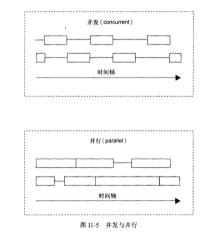

# 并发基础
## 线程安全

* 同一个对象
    * 无状态：没有属性
        * 无状态对象一定是线程安全的
    * 可变状态：只要属性有可能发生变化
        * 可变状态是非线程安全的
        * 原因：竞态条件
            * 竞态条件产生的情况如：
                * 读-修改-写
                * 延时初始化（单例）
                * 如果不存在则add
        * 避免竞态条件产生：保证原子性，可见性，有序性
            * 可变属性只有一个
                * 使用Atomic包提供的类
            * 可变属性多个
                * 加锁  

## 互斥同步
可以通过synchronized或重入锁(java.util.concurrent.locks.ReentrantLock)来实现互斥同步
### synchronized
#### 基本用法
* 修饰实例方法
```java
public class Test {
    // 修饰实例方法
    public synchronized void add() {
        //doSomething
    };
}
```
* 修饰this
```java
public class Test {
    // 同步代码块
    public void test() {
        //doSomething
        synchronized (this) {
            //doSomething
        }
        //doSomething
    }

}
```
* 修饰类方法
```java
public class Test {
    // 修饰类方法
    public static synchronized void add() {
        //doSomething
    };
}
```
* 修饰Test.class
```java
public class Test {
    // 同步代码块
    public static void add() {
        //doSomething
        synchronized (Test.class) {
            //doSomething
        }
        //doSomething
    }
}
```
* 修饰实例属性
```java
public class Test {

    private Object o = new Object();
    // 同步代码块
    public void add() {
        //doSomething
        synchronized (o) {
            //doSomething
        }
        //doSomething
    }
}
```
* 修饰类属性
```java
public class Test {

    private static Object o = new Object();
    // 同步代码块
    public void add() {
        //doSomething
        synchronized (o) {
             //doSomething
        }
        //doSomething
    }
}
```
* synchronized编译后，会在同步块前后形成两个字节码指令
    * monitorenter
    * monitorexit
        * 这两个字节码需要指明锁定和解锁的对象（实例对象或Class对象）
* 每一个对象都有自己的对象锁
    * 在执行monitorenter指令时，首先要尝试获取对象的锁,如果这个对象没被锁定，或者当前线程已经拥有了这个对象锁，那么就把锁的计数器加1（锁在同一线程中可重入）。如果获取对象锁失败，那么当前线程进入阻塞状态，直到对象锁被另外一个线程释放，才有机会获取该对象的锁。
    * 在执行monitorexit指令时，会将锁的计数器减1，当计数器为0时，线程将锁释放。
* Note:
    * 在一个实例的私有属性上使用synchronized，不要在实例方法或this上使用synchronized：
        * method:效率低，应尽可能缩小同步块
        * this:this是整个程序都可以访问的对象引用，很容易造成调用方法的阻塞
    * 在一个私有的静态属性或在Test.class上使用synchronized，不要在类方法或this.getClass()上使用synchronized
        * this.getClass():you shouldn't synchronize on this.getClass() for another reason - it won't work in the presence of inheritance! If class Worker has two child classes, FooWorker and BarWorker, then invocations of .process() will take different locks when invoked on an instance of FooWorker vs. an instance of BarWorker. Agree that the private static variable is a better idea, but if you DO want to synchronize on the class, be explicit: synchronized(Worker.class)
        
[Question about Java synchronized](https://stackoverflow.com/questions/6214229/question-about-java-synchronized)
* 例子
   
   一个对象有如下三个方法：
    ```java
    public synchronized void method1();
    public synchronized void method2();
    public void method3();
    ```
    线程1调用method1,获取对象的锁
    
    线程2调用method1,阻塞，因为锁被线程1持有

    线程3调用method2,阻塞，因为锁被线程1持有

    线程4调用method3,非阻塞，因为调用method3,无需获取锁

## Thread.sleep() 和 wait()
* Thread.sleep(1000):将当前线程暂停约1秒
* wait():让线程进入等待队列
    * obj.wait():线程正在obj上wait
    * this.wait()或wait():线程正在this上wait

### 区别
sleep是Thread类的静态方法，wait是Object的方法
> sleep()是Thread类的静态方法，其作用仅仅是让当前线程暂停,并不会进入等待队列。

> wait()是Object类的方法。这是因为在执行wait()方法后，线程就会暂停操作，进入”等待队列“，由于每个实例都有一个”等待队列“，因此wait方法(或notify，notifyAll)是Object的方法。

何处使用
> sleep()可以在任何地方被调用。执行了slepp方法的线程。

> 调用wait()方法的语句可以写在synchronized方法和synchronized代码块，或者二者调用的其他方法中。因为要执行wait方法(或notify，notifyAll)，线程必须持有锁(这是规则)。**wait,notify,notifyAll本来就是设计用来为线程协作服务的**

> 注意：Thread.yield()可能将线程置为可执行状态，而不是WAITING或TIMED_WAITING(wait())状态。因此，Thread.yield()不会释放锁，所以不能将它写在synchronized中！
## 对象的共享
### 内存可见性
* 为了确保多个线程之间对内存写入操作的可见性，必须使用同步机制。
* 在没有同步的情况下，编译器，处理器，运行时都可能对操作的执行顺序进行一些意想不到的调整。
* 例子

    ```java
    public class Test{
        private int value;
        public int getValue(){
            return value;
        }
        public void setValue(int value) {
            this.value = value;
        }
    }
    ```
    上面这个方法是非线程安全的，调用get方法的线程，不一定能及时读取到调用set的线程设置的value值。


## Volatile、synchronized两者的区别联系


* 1.volatile本质是在告诉jvm当前变量在寄存器（工作内存）中的值是不确定的，需要从主存中读取；synchronized则是锁定当前变量，只有当前线程可以访问该变量，其他线程被阻塞住。
* 2.volatile仅能使用在变量级别；synchronized则可以使用在变量、方法、和类级别的。
* 3.volatile仅能实现变量的修改可见性，不能保证原子性（线程A修改了变量还没结束时,另外的线程B可以看到已修改的值,而且可以修改这个变量,而不用等待A释放锁,因为Volatile 变量没上锁）；而synchronized则可以保证变量的修改可见性和原子性。
* 4.volatile不会造成线程的阻塞；synchronized可能会造成线程的阻塞和上下文切换。
* 5.**volatile标记的变量不会被编译器优化（禁止指令重排）；synchronized标记的变量可以被编译器优化。**
* 6.在使用volatile关键字时要慎重，并不是只要简单类型变量使用volatile修饰，对这个变量的所有操作都是原子操作。当变量的值由自身决定时，如n=n+1、n++ 等，volatile关键字将失效。只有当变量的值和自身无关时对该变量的操作才是原子级别的，如n = m + 1，这个就是原级别的。所以在使用volatile关键时一定要谨慎，如果自己没有把握，可以使用synchronized来代替volatile。
* 7.“锁是昂贵的”，谨慎使用锁机制。

## 并发执行不一定比串行执行快
* 因为上下文切换（CPU切换执行线程，需要保存前一个任务的状态，这都将影响效率）
* 解决方案
    * 无锁并发编程（例如借助于Hash算法取膜分段，不同线程处理不同数据），
    * CAS算法（Atomic包使用了CAS算法），
    * 使用最少线程（比如说设置servlet container的线程池中的线程数为一个合理的值）
    * 协程（nodejs）

## 并发与并行
* 并发
    * 单核计算机，多个线程并不是真的同时运行，而是对时间进行切片，不断切换有操作的线程
* 并行
    * 多核计算机，多个线程有可能是真的同时运行，则线程可能是并行而不是并发

