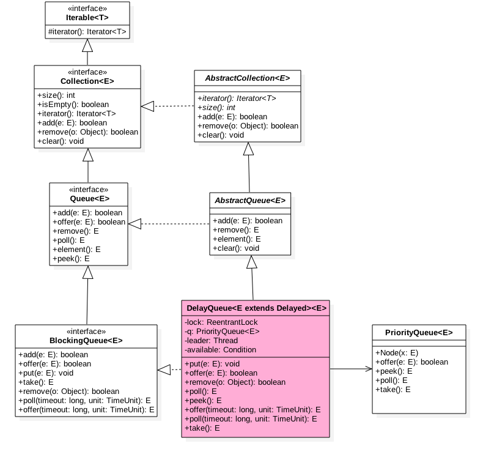

DelayQueue是一个使用优先队列（PriorityQueue）实现的BlockingQueue，优先队列的比较基准值是时间。

DelayQueue队列中每个元素都有个过期时间（每个元素都要实现Delayed接口），并且队列是个优先级队列，当从队列获取元素时候，只有过期元素才会出队列。



```java
public class DelayQueue<E extends Delayed> extends AbstractQueue<E>
    implements BlockingQueue<E> {

    private final transient ReentrantLock lock = new ReentrantLock();
    private final PriorityQueue<E> q = new PriorityQueue<E>();
```
```java
public interface Delayed extends Comparable<Delayed> {

    /**
     * Returns the remaining delay associated with this object, in the
     * given time unit.
     *
     * @param unit the time unit
     * @return the remaining delay; zero or negative values indicate
     * that the delay has already elapsed
     */
    long getDelay(TimeUnit unit);
}
```


如图DelayQueue中内部使用的是PriorityQueue存放数据，使用ReentrantLock实现线程同步，可知是阻塞队列。另外队列里面的元素要实现Delayed接口，一个是获取当前剩余时间的接口，一个是元素比较的接口，因为这个是有优先级的队列。

## offer操作
插入元素到队列，主要插入元素要实现Delayed接口。

```java
public boolean offer(E e) {
    final ReentrantLock lock = this.lock;
    lock.lock();
    try {
        q.offer(e);
        if (q.peek() == e) {（2）
            leader = null;
            available.signal();
        }
        return true;
    } finally {
        lock.unlock();
    }
}
```
首先获取独占锁，然后添加元素到优先级队列，由于q是优先级队列，所以添加元素后，peek并不一定是当前添加的元素，如果（2）为true，说明当前元素e的优先级最小也就即将过期的，这时候激活avaliable变量条件队列里面的线程，通知他们队列里面有元素了。

## take操作
获取并移除队列首元素，如果队列没有过期元素则等待。

```java
public E take() throws InterruptedException {
    final ReentrantLock lock = this.lock;
    lock.lockInterruptibly();
    try {
        for (;;) {
            //获取但不移除队首元素（1)
            E first = q.peek();
            if (first == null)
                available.await();//(2)
            else {
                long delay = first.getDelay(TimeUnit.NANOSECONDS);
                if (delay <= 0)//(3)
                    return q.poll();
                else if (leader != null)//(4)
                    available.await();
                else {
                    Thread thisThread = Thread.currentThread();
                    leader = thisThread;//(5)
                    try {
                        available.awaitNanos(delay);
                    } finally {
                        if (leader == thisThread)
                            leader = null;
                    }
                }
            }
        }
    } finally {
        if (leader == null && q.peek() != null)//(6)
            available.signal();
        lock.unlock();
    }
}
```
第一次调用take时候由于队列空，所以调用（2）把当前线程放入available的条件队列等待，当执行offer并且添加的元素就是队首元素时候就会通知最先等待的线程激活，循环重新获取队首元素，这时候first假如不空，则调用getdelay方法看该元素海剩下多少时间就过期了，如果delay<=0则说明已经过期，则直接出队返回。否者看leader是否为null，不为null则说明是其他线程也在执行take则把该线程放入条件队列，否者是当前线程执行的take方法，则调用(5)await直到剩余过期时间到（这期间该线程会释放锁，所以其他线程可以offer添加元素，也可以take阻塞自己），剩余过期时间到后，该线程会重新竞争得到锁，重新进入循环。

（6）说明当前take返回了元素，如果当前队列还有元素则调用singal激活条件队列里面可能有的等待线程。leader那么为null，那么是第一次调用take获取过期元素的线程，第一次调用的线程调用设置等待时间的await方法等待数据过期，后面调用take的线程则调用await直到signal。

## poll操作
获取并移除队头过期元素，否者返回null
```java
public E poll() {
    final ReentrantLock lock = this.lock;
    lock.lock();
    try {
        E first = q.peek();
        //如果队列为空，或者不为空但是队头元素没有过期则返回null
        if (first == null || first.getDelay(TimeUnit.NANOSECONDS) > 0)
            return null;
        else
            return q.poll();
    } finally {
        lock.unlock();
    }
}
```
## 一个例子
```java
class DelayedEle implements Delayed {

    private final long delayTime; //延迟时间
    private final long expire;  //到期时间
    private String data;   //数据

    public DelayedEle(long delay, String data) {
        delayTime = delay;
        this.data = data;
        expire = System.currentTimeMillis() + delay; 
    }

    /**
     * 剩余时间=到期时间-当前时间
     */
    @Override
    public long getDelay(TimeUnit unit) {
        return unit.convert(this.expire - System.currentTimeMillis() , TimeUnit.MILLISECONDS);
    }

    /**
     * 优先队列里面优先级规则
     */
    @Override
    public int compareTo(Delayed o) {
        return (int) (this.getDelay(TimeUnit.MILLISECONDS) -o.getDelay(TimeUnit.MILLISECONDS));
    }

    @Override
    public String toString() {
        final StringBuilder sb = new StringBuilder("DelayedElement{");
        sb.append("delay=").append(delayTime);
        sb.append(", expire=").append(expire);
        sb.append(", data='").append(data).append('\'');
        sb.append('}');
        return sb.toString();
    }
}

public static void main(String[] args) {


    DelayQueue<DelayedEle> delayQueue = new DelayQueue<DelayedEle>();

    DelayedEle element1 = new DelayedEle(1000,"zlx");
    DelayedEle element2 = new DelayedEle(1000,"gh");

    delayQueue.offer(element1);
    delayQueue.offer(element2);

    element1 =  delayQueue.take();
    System.out.println(element1);

}
```
## 使用场景
TimerQueue的内部实现

ScheduledThreadPoolExecutor中DelayedWorkQueue是对其的优化使用