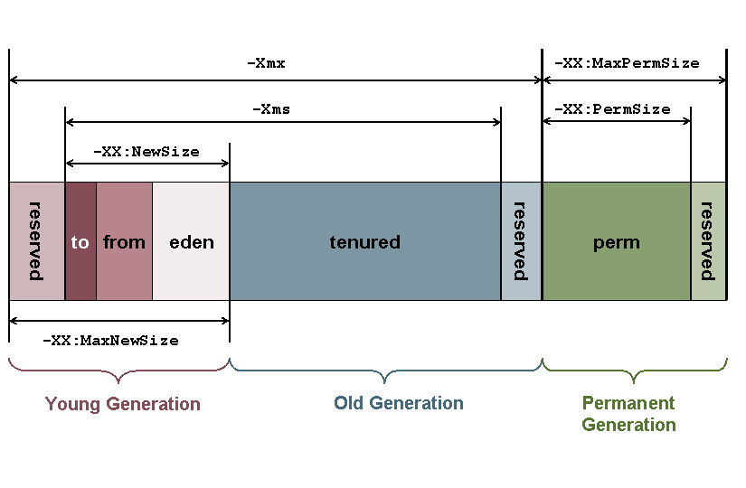

# Java内存模型

堆是JVM中所有线程共享的，因此在其上进行对象内存的分配均需要进行加锁，这也导致了new对象的开销是比较大的
鉴于上面的原因，Sun Hotspot JVM为了提升对象内存分配的效率，对于所创建的线程都会分配一块独立的空间，这块空间又称为TLAB（Thread Local Allocation Buffer），其大小由JVM根据运行的情况计算而得，在TLAB上分配对象时不需要加锁，因此JVM在给线程的对象分配内存时会尽量的在TLAB上分配，在这种情况下JVM中分配对象内存的性能和C基本是一样高效的，但如果对象过大的话则仍然是直接使用堆空间分配
TLAB仅作用于新生代的Eden Space，因此在编写Java程序时，通常多个小的对象比大的对象分配起来更加高效，但这种方法同时也带来了两个问题，一是空间的浪费，二是对象内存的回收上仍然没法做到像Stack那么高效，同时也会增加回收时的资源的消耗，可通过在启动参数上增加-XX:+PrintTLAB来查看TLAB这块的使用情况。

## TLAB
JVM在内存新生代Eden Space中开辟了一小块线程私有的区域，称作TLAB（Thread-local allocation buffer）。默认设定为占用Eden Space的1%。在Java程序中很多对象都是小对象且用过即丢，它们不存在线程共享也适合被快速GC，所以对于小对象通常JVM会优先分配在TLAB上，并且TLAB上的分配由于是线程私有所以没有锁开销。因此在实践中分配多个小对象的效率通常比分配一个大对象的效率要高。
也就是说，Java中每个线程都会有自己的缓冲区称作TLAB（Thread-local allocation buffer），每个TLAB都只有一个线程可以操作，TLAB结合bump-the-pointer技术可以实现快速的对象分配，而不需要任何的锁进行同步，也就是说，在对象分配的时候不用锁住整个堆，而只需要在自己的缓冲区分配即可。
关于对象分配的JDK源码可以参见JVM 之 Java对象创建[初始化]中对OpenJDK源码的分析。

## 如何确定一个对象已经死亡

* 引用计数法

* 可达性分析算法（jvm使用这种算法）