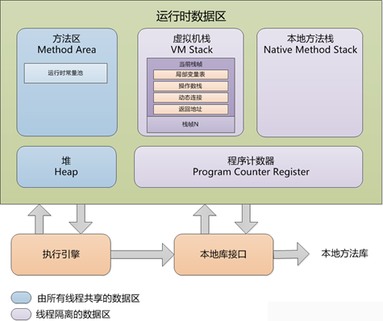

# 运行时数据区域

根据Java虚拟机规范，Java虚拟机所管理的内存包括以下几个运行时数据区域：

* 程序计数器
    * 当前线程所执行的字节码的行号指示器，为了线程切换后能恢复到正确的执行位置 
    * 唯一没有定义任何OutOfMemoryError的区域
* 虚拟机栈
    * 描述java方法执行的内存模型，每个方法在运行时都会创建一个栈帧（stack frame），用于存储
        * 局部变量表
            * 存放编译器可知的基本数据类型和对象引用类型
            * 空间在编译器分配，运行时不会改变局部变量表大小
        * 操作数栈
            * 方法执行中进行算术运算或者是调用其他的方法进行参数传递的时候是通过操作数栈进行的。
            * 在概念模型中，两个栈帧是相互独立的。但是大多数虚拟机的实现都会进行优化，令两个栈帧出现一部分重叠。令下面的部分操作数栈与上面的局部变量表重叠在一块，这样在方法调用的时候可以共用一部分数据，无需进行额外的参数复制传递。
        * 动态链接
            * 每个栈帧都包含一个执行运行时常量池中该栈帧所属方法的引用，持有这个引用是为了支持方法调用过程中的动态连接（Dynamic Linking）。
            * Class 文件中存放了大量的符号引用，字节码中的方法调用指令就是以常量池中指向方法的符号引用作为参数。这些符号引用一部分会在类加载阶段或第一次使用时转化为直接引用，这种转化称为静态解析。另一部分将在每一次运行期间转化为直接引用，这部分称为动态连接。
        * 方法出口信息等 
            * 当一个方法开始执行以后，只有两种方法可以退出当前方法：
                * 当执行遇到返回指令，会将返回值传递给上层的方法调用者，这种退出的方式称为正常完成出口（Normal Method Invocation Completion），一般来说，调用者的PC计数器可以作为返回地址。
                * 当执行遇到异常，并且当前方法体内没有得到处理，就会导致方法退出，此时是没有返回值的，称为异常完成出口（Abrupt Method Invocation Completion），返回地址要通过异常处理器表来确定。
            * 当方法返回时，可能进行3个操作：
                * 恢复上层方法的局部变量表和操作数栈
                * 把返回值压入调用者调用者栈帧的操作数栈
                * 调整 PC 计数器的值以指向方法调用指令后面的一条指令
    * 请求深度大于虚拟机所允许的深度（死循环等），StackOverflowError
    * 无法申请足够的内存，OutOfMemoryError
* 本地方法栈
    * 与虚拟机栈类似，但是为本地的Native方法服务
    * 请求深度大于虚拟机所允许的深度（死循环等），StackOverflowError
    * 无法申请足够的内存，OutOfMemoryError
* 堆
    * 存放对象实例
    * 是垃圾收集器的主要管理区域
    * 无法申请足够的内存，OutOfMemoryError
* 方法区
    * 存储已经被虚拟机加载的类信息，常量，静态变量，即使编译器编译后的代码等数据
    * 无法申请足够的内存，OutOfMemoryError
* 运行时常量池
    * 方法区的一部分
    * 存放编译器生成的各种字面量和符号引用，在类加载后，这部分内容由方法区的运行时常量池存放
* 直接内存
    * 并不是JVM规范中定义的
    * NIO类使用Native函数库直接分配堆外内存。然后通过堆中的DirectByteBuffer对象对这块内存引用，这块内存就是直接内存