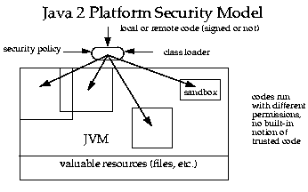
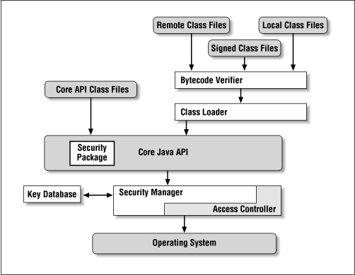
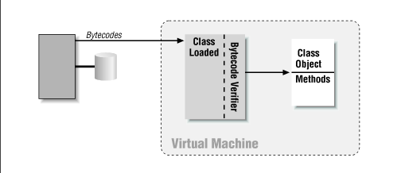
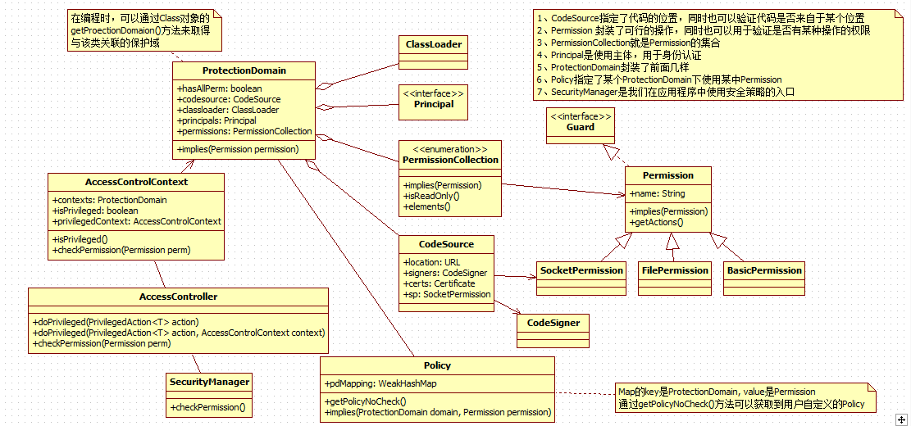
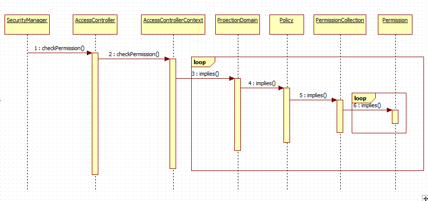

# Security

当类加载器将新加载的JAVA平台类的字节码传递给虚拟机时，这些字节码首先要接受校验器verifier的校验。校验器负责检查那些指令无法执行的明显有破坏性的操作。除了系统类外，其他的类都要被校验。

一旦某个类被加载到虚拟机中，并由检验器检查之后，JAVA平台的第二种安全机制就会启动，这个机制就是安全管理器。安全管理器用来负责控制具体操作是否允许被执行。

[ClassLoader](./classloader.md)-->Verifier-->[SecurityManager](./security_manager.md)


[网上一篇介绍Java Security的文章--Java Se：Java Security](https://www.cnblogs.com/f1194361820/p/4189269.html)

[原文地址：https://www.cnblogs.com/f1194361820/p/4189269.html](https://www.cnblogs.com/f1194361820/p/4189269.html)

Java API中有很多都使用了SecurityManager，这到底是什么玩意？最近看公司的产品的源码，也有不少SecurityManager、AccessControlContext等相关的代码，只是知道它们与安全有关，但是它们到底是怎么一回事呢？Spring也有一个Security框架，与Java Security有什么关联呢？另外有经验的开发人员调试程序时可能会查看ProtectionDomain、CodeSource，这两者又是什么呢？

 

# Java Sandbox
提到Java Security，就不得不说Java Sandbox模型。

SandBox限制一个Java程序可以访问的资源。沙箱范围的扩展建立在信任的基础上。例如，如果你信任一个程序则允许其访问你的文件系统，反正，则禁止他们范围你的文件系统。

Java2 Security Model：

 

 

Java2平台上，加载类时，会形成不同的sandbox，同时也会根据相关的security policy，为这些sandbox生成不同的安全策略，这些安全策略会在应用程序执行时，进行检查，以保护资源被恶意的操作。

 

 

这张图指出了Java应用程序的真实的执行过程。
* bytecode verifier(字节码校验器)
    * 确保Java类文件遵循Java语言规则，从图中可以看出，并非所有的类都要通过字节码校验
* class loader(类加载器)
* access controller(存取控制器)
    * 控制core api对操作系统的存取权限，基于策略而定
* security manager(安全管理器)
    * core api与操作系统的主要接口
* security package(安全软件包)
    * java.security package
* key database(密钥数据库)
    * 它属于security package中的一部分，可以表示为一个外部文件或数据库
## SandBox 要素
### permission(权限)
权限类型，权限名，允许的操作
```java
permission java.security.AllPermission;
permission java.lang.RuntimePermission "stopThread";
permission java.io.FilePermission "/tmp/foo" "read";
```
一般情况下，将这些权限设置在不同的策略文件中，同时还指定了所应用的代码源

### code source(代码源)
Applet会将代码下载到本地运行
* .jar
* / 指定目录下的类文件属于代码基，而该目录下的jar文件不属于代码基
* \* 指定目录下的类文件和jar均属于代码基，但是其子目录下的类文件和jar不属于代码基
* \- 指定目录及其子目录下的类文件和jar均属于代码基
### protection domain(保护域)
为了将代码的权限进行组合而建立的。保护域是默认沙箱中的基本概念。
### policy file(策略文件)
在java策略文件中列出需要的各种权限
策略文件包括一个或多个定义保护域的项，策略文件中的项完成了代码权限的指定任务。
```
keystore "${user.home}${/}.keystore";

// Grant these permissions to code loaded from O'Reilly, regardless of
// whether the code is signed.
grant codeBase "http://www.oreilly.com/" {
  permission java.io.FilePermission "/tmp", "read";
  permission java.lang.RuntimePermission "queuePrintJob";
};

// Grant these permissions to code loaded from Sun but only if it is
// signed by sdo.
grant signedBy "sdo", codeBase "http://www.sun.com/" {
  permission java.security.AllPermission;
};

// Grant these permissions to code signed by jra, no matter where it
// was loaded from
grant signedBy "jra" {
  permission java.net.SocketPermission "*:1024-",
                      "accept, connect, listen, resolve";
};

// Grant these permissions to any code, no matter where it came
// from or whether it is signed
grant {
    permission java.util.PropertyPermission
                     "java.version", "read";
};
```
### keystore(密钥库)
[一篇介绍数字证书和数字签名的科普文](http://www.ruanyifeng.com/blog/2011/08/what_is_a_digital_signature.html)


保存证书
# Java语言规则的实施
## 编译期强制规则验证，而后生成class file

* Java的强制性规则有：
* A: private, protected, default, public 。这个都知道，是关系到可见性，是对应用程序中内存资源的保护。
* B: final的变量初始化后不能被改变
* C: 变量要先初始化后使用

以及一些其他的规则，通过这些规则验证后，就生成class file，也就是常说的字节码文件。
## ClassLoader加载class file后定义类生成Class对象

类加载器也是一道坎，不是说你让它加载，它就加载的，它也是要进行验证的。

假如骇客写了一些java文件编译后放到classpath目录下，或者是将jdk中自带某些核心API反编译后进行某些修改，覆盖原有文件，这样对程序的危害可以极大的。所以类加载时，也是有必要进行检查的。



从这张图片可以看出在类加载器定义类的过程也会对字节码进行检查的，下面可以看一下ClassLoader中defineClass的过程：
```java
protected final Class<?> defineClass(String name, byte[] b, int off, int len,ProtectionDomain protectionDomain) throws ClassFormatError {
    // 检查类加载器是否初始化
    check();
    // 形成为该类生成protectionDomain和codesource
    protectionDomain = preDefineClass(name, protectionDomain);

    Class c = null;
    String source = defineClassSourceLocation(protectionDomain);

    // 真实的定义Class的过程，这个方法是native的，字节码检查的过程也是这里进行的，这里是看不到的，也是不能让我们看到的，如果我们可见，就可以自定义，这样检查就形同虚设。
    try {
        c = defineClass1(name, b, off, len, protectionDomain, source);
    } catch (ClassFormatError cfe) {
        c = defineTransformedClass(name, b, off, len, protectionDomain, cfe, source);
    }

    // 完善证书等信息
    postDefineClass(c, protectionDomain);
    return c;
}
```

既然代码层面，看不到如何检查字节码的，那么至少可以来了解一下，到底做了哪些检查呢？ 

* D：检查class file的格式是否正确，JVM Specification 中说明了class file的格式，感兴趣的话可以到官网下载看看。例如：class file要有正确的长度、模数 等。
模数用于确定文件类型，UNIX系统不是根据扩展名来确定文件类型的，就是根据这个魔数来的。想要知道class file的魔数、以及是怎么定义的，可以参考《深入理解Java虚拟机》。
* E： final的类没有子类
* F： 原生类型的数据有无不合法的类型转换（E.G.: int to Object）
* G： 引用类型的数据有无不合法的类型转换，例如将父类对象转换为子类类型。
* H： 有没有操作数出现栈溢出现象

其实还有两种检查，这两种是在运行时进行的：
* I:  数组不能越界
* J:  数据不能强制转化为其他不相干的类型

# ProtectionDomain
在定义类的过程中，还产生了与这个类相关联的ProtectionDomain。Java Security模块的设计如下图所示。


但并不是所有的ClassLoader都会生成ProtectionDomain。例如我前之前的一篇博客中定义的那个类加载器，又或者时bootstrapClassLoader。 **只有继承了SecurClassLoader的ClassLoader在defineClass时都会生成相关联的ProtectionDomain， 一般情况下我们自定义ClassLoader时都会继承UrlClassLoader，而UrlClassLoader又继承了SecurClassLoader，所以我们定义的ClassLoader在执行defineClass时一般都会生成ProtectionDomain。**

ProtectionDomain的设计模型是很重要的，接下来要说的AccessController和SecurityManager都是在ProtectionDomain的基础上才有所作为的。所以ProtectionDomain就在类加载时就确立。

**默认情况下，一个jar包就对应一个ProtectionDomain。**

## Policy
网上关于Java Security方面的教程，说的最多莫过于Policy了，因为它是配置安全策略的。我们可能不会去定义Permission（Java中定义的Permission已经够我们使用），但是我们不可或缺的要去配置安全策略，来使用这些Permission为我们服务。

### 应用程序访问相关资源
* SecurityManager#checkPermission()

Java提供了安全模型，我们在程序中如何使用呢？

一般来说都是通过SecurityManager来完成的，使用方式为：
```java
SecurityManager sm = getSecurityManager();
if (sm != null) {
   // sm.checkPermission();
}
```
例如： 
```java
System.getProperty(String key)
```
```java
public static String getProperty(String key) {
    checkKey(key);
    SecurityManager sm = getSecurityManager();
    if (sm != null) {
        sm.checkPropertyAccess(key);
     }
     return props.getProperty(key);
}
```
例如： 
```java
public FileInputStream(File file) throws FileNotFoundException {
    String name = (file != null ? file.getPath() : null);
    SecurityManager security = System.getSecurityManager();
    if (security != null) {
        security.checkRead(name);
    }
    if (name == null) {
        throw new NullPointerException();
    }
    fd = new FileDescriptor();
    open(name);
}
```
### 开启Java安全策略
默认情况下，我们的程序并没有开启Java的安全策略。想要看看开启安全策略后你的应用程序会是什么样的，**可以使用JVM参数：-Djava.security.manager** 。 

 **如果要使用代码来开启，可以使用System.setSecurityManager(securitymanager)来启动。**

### SecurityManager#checkPermission()执行过程
在代码中只要像上面那样简单的写上两三行代码就可以检查相应的权限了。那么它们的执行过程是什么呢？

SecurityManager中所有检查权限相关的方法都会调用SecurityManager的checkPermission方法，

下面的这个时序图说明了SecurityManager#checkPermission(Permission)的执行过程。
 

 
从这个图上也能看到最后还是Permission#implies起作用的。

SecurityManager.java
```java
public void checkPermission(Permission perm) {
    java.security.AccessController.checkPermission(perm);
}
``` 
AccessControl.java
```java
public static void checkPermission(Permission perm)
    throws AccessControlException {
    //System.err.println("checkPermission "+perm);
    //Thread.currentThread().dumpStack();

    if (perm == null) {
        throw new NullPointerException("permission can't be null");
    }

    AccessControlContext stack = getStackAccessControlContext();
    // if context is null, we had privileged system code on the stack.
    if (stack == null) {
        Debug debug = AccessControlContext.getDebug();
        boolean dumpDebug = false;
        if (debug != null) {
            dumpDebug = !Debug.isOn("codebase=");
            dumpDebug &= !Debug.isOn("permission=") ||
                Debug.isOn("permission=" + perm.getClass().getCanonicalName());
        }

        if (dumpDebug && Debug.isOn("stack")) {
            Thread.dumpStack();
        }

        if (dumpDebug && Debug.isOn("domain")) {
            debug.println("domain (context is null)");
        }

        if (dumpDebug) {
            debug.println("access allowed "+perm);
        }
        return;
    }

    AccessControlContext acc = stack.optimize();
    acc.checkPermission(perm);
}
```
AccessControlContext.java
```java
public void checkPermission(Permission perm)
    throws AccessControlException {
    boolean dumpDebug = false;

    if (perm == null) {
        throw new NullPointerException("permission can't be null");
    }
    if (getDebug() != null) {
        // If "codebase" is not specified, we dump the info by default.
        dumpDebug = !Debug.isOn("codebase=");
        if (!dumpDebug) {
            // If "codebase" is specified, only dump if the specified code
            // value is in the stack.
            for (int i = 0; context != null && i < context.length; i++) {
                if (context[i].getCodeSource() != null &&
                    context[i].getCodeSource().getLocation() != null &&
                    Debug.isOn("codebase=" + context[i].getCodeSource().getLocation().toString())) {
                    dumpDebug = true;
                    break;
                }
            }
        }

        dumpDebug &= !Debug.isOn("permission=") ||
            Debug.isOn("permission=" + perm.getClass().getCanonicalName());

        if (dumpDebug && Debug.isOn("stack")) {
            Thread.dumpStack();
        }

        if (dumpDebug && Debug.isOn("domain")) {
            if (context == null) {
                debug.println("domain (context is null)");
            } else {
                for (int i=0; i< context.length; i++) {
                    debug.println("domain "+i+" "+context[i]);
                }
            }
        }
    }

    /*
        * iterate through the ProtectionDomains in the context.
        * Stop at the first one that doesn't allow the
        * requested permission (throwing an exception).
        *
        */

    /* if ctxt is null, all we had on the stack were system domains,
        or the first domain was a Privileged system domain. This
        is to make the common case for system code very fast */

    if (context == null) {
        checkPermission2(perm);
        return;
    }

    for (int i=0; i< context.length; i++) {
        if (context[i] != null &&  !context[i].implies(perm)) {
            if (dumpDebug) {
                debug.println("access denied " + perm);
            }

            if (Debug.isOn("failure") && debug != null) {
                // Want to make sure this is always displayed for failure,
                // but do not want to display again if already displayed
                // above.
                if (!dumpDebug) {
                    debug.println("access denied " + perm);
                }
                Thread.dumpStack();
                final ProtectionDomain pd = context[i];
                final Debug db = debug;
                AccessController.doPrivileged (new PrivilegedAction<Void>() {
                    public Void run() {
                        db.println("domain that failed "+pd);
                        return null;
                    }
                });
            }
            throw new AccessControlException("access denied "+perm, perm);
        }
    }

    // allow if all of them allowed access
    if (dumpDebug) {
        debug.println("access allowed "+perm);
    }

    checkPermission2(perm);
}
```
ProtectionDomain.java
```java
public boolean implies(Permission permission) {

    if (hasAllPerm) {
        // internal permission collection already has AllPermission -
        // no need to go to policy
        return true;
    }

    if (!staticPermissions &&
        Policy.getPolicyNoCheck().implies(this, permission))
        return true;
    if (permissions != null)
        return permissions.implies(permission);

    return false;
}
```
PermissionCollection.java
```java
public boolean implies(ProtectionDomain domain, Permission permission) {
    PermissionCollection pc;

    if (pdMapping == null) {
        initPolicy(this);
    }

    synchronized (pdMapping) {
        pc = pdMapping.get(domain.key);
    }

    if (pc != null) {
        return pc.implies(permission);
    }

    pc = getPermissions(domain);
    if (pc == null) {
        return false;
    }

    synchronized (pdMapping) {
        // cache it
        pdMapping.put(domain.key, pc);
    }

    return pc.implies(permission);
}
```
Permission.java
```java
public boolean implies(Permission permission) {
    // No sync; staleness -> skip optimization, which is OK
    if (allPermission != null) {
        return true; // AllPermission has already been added
    } else {
        synchronized (this) {
            PermissionCollection pc = getPermissionCollection(permission,
                false);
            if (pc != null) {
                return pc.implies(permission);
            } else {
                // none found
                return false;
            }
        }
    }
}
```
 

## AccessController.doPrivileged()

有时我们还会在代码中看到使用AccessController.doPrivileged()方法的，这个又是做什么呢？

假设有下列一个应用场景：有一个ProtectionDomain的CodeSource是com目录，在它下面有三个目录:core,moduleA,web，在这个 ProtectionDomain中，对所有的文件都有read权限，只有web目录下的resource目录下的文件，可以有write权限。现在有一需求，要在core目录下的某个文件有write权限。
```
/com
   |--core
   |--moduleA
   |--web
      |--bean
      |--service
      |--dao
      |--resource
```
我们的程序中肯定会这样写：new FileOutputStream(File file)。上面已经粘出来FileInputStream(File file)实现过程。也就是说检查对该文件有无读权限。那么对应的FileOutputStream中肯定也会有检查是否有写权限的过程。上面的描述中已经知道，对于core下没有写权限的，所以我们的需求是无法满足的。那怎么办呢？ 

AccessController.doPrivileged()就可以帮肋完成上述任务。

```java
FileOutputStream fos=null;
String filepath=”./com/core/xx”;
fos=AccessController.doPrivileged(new PriviliegedAction(){
    public FileOutputStream run(){
        return new FileOutputStream(filepath);
    }
});
if(fos!=null){
// xxxxxxxx
}
```
这到底是怎么回事呢？下面贴Java API中AccessController描述中的一段话：

A caller can be marked as being "privileged" (see doPrivileged and below). When making access control decisions, the checkPermission method stops checking if it reaches a caller that was marked as "privileged" via a doPrivileged call without a context argument (see below for information about a context argument). If that caller's domain has the specified permission, no further checking is done and checkPermission returns quietly, indicating that the requested access is allowed. If that domain does not have the specified permission, an exception is thrown, as usual.

这段话大意就是说：

如果使用了doPrivileged方法将调用者标记为privileged，在执行AccessController.checkPermission()做检查时，当检查到这个调用者时，就会终止检查，然后只作一个判断：如果caller所在的域有指定的权限就可以了。

SecurityManager#checkPermission实际上就是调用了AccessController.checkPermission()，所以这个解决方案对于SecurityManager#checkPermission也是适用的。