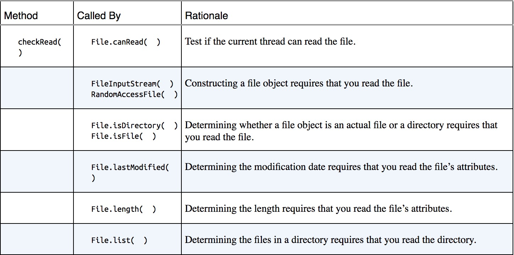
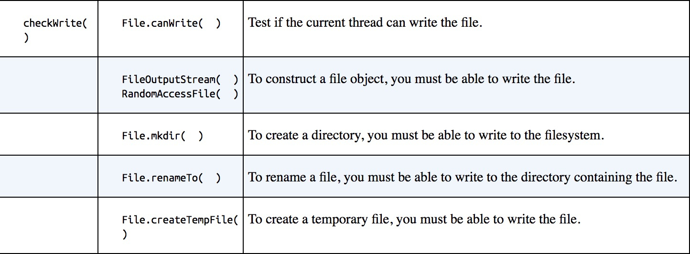
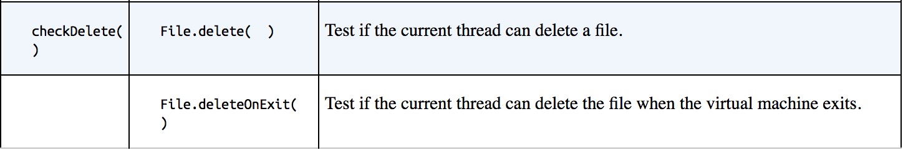
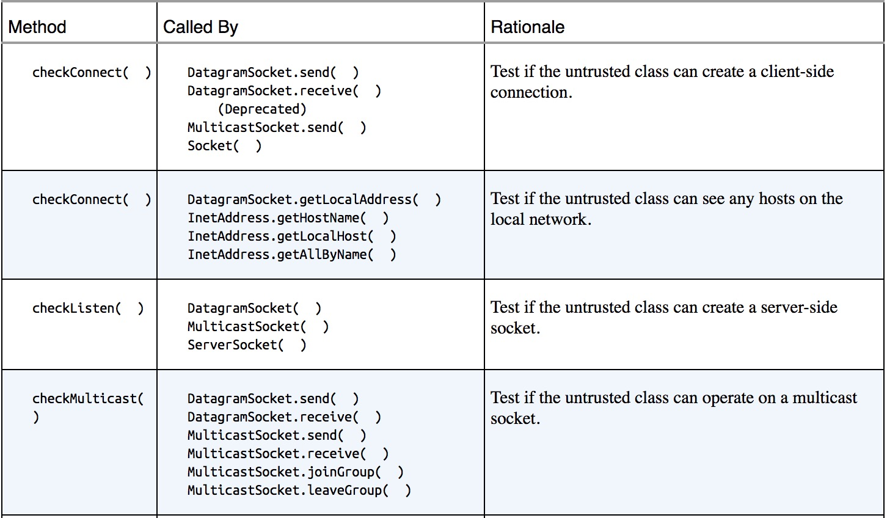
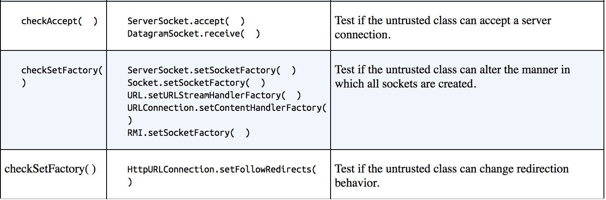
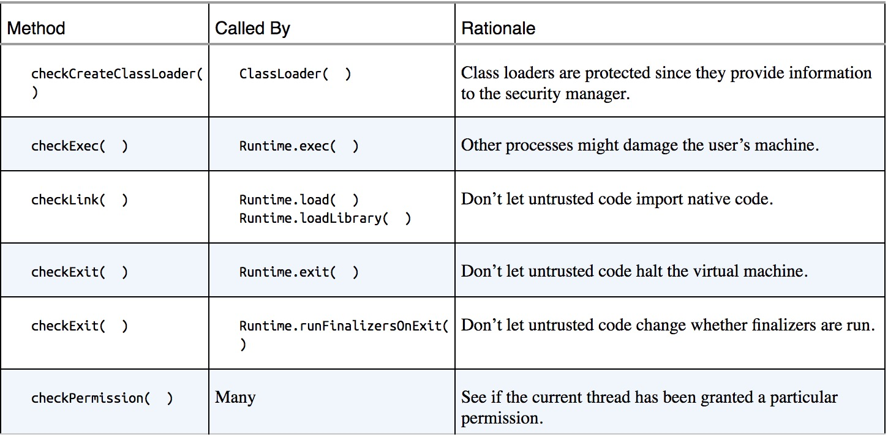
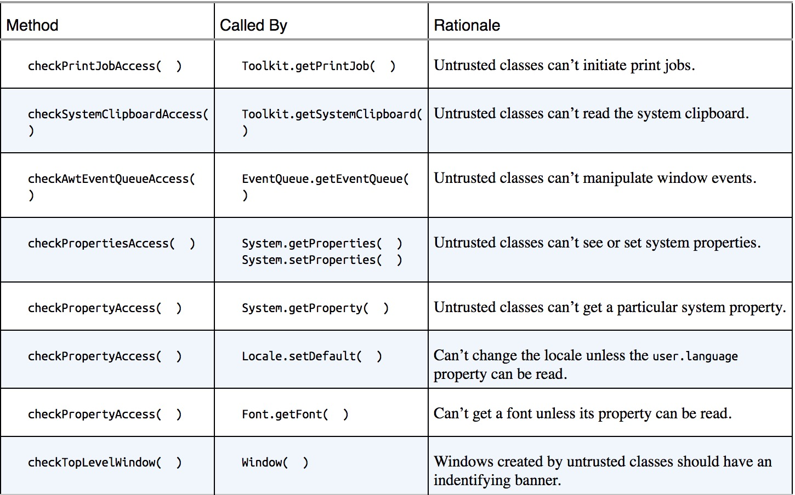
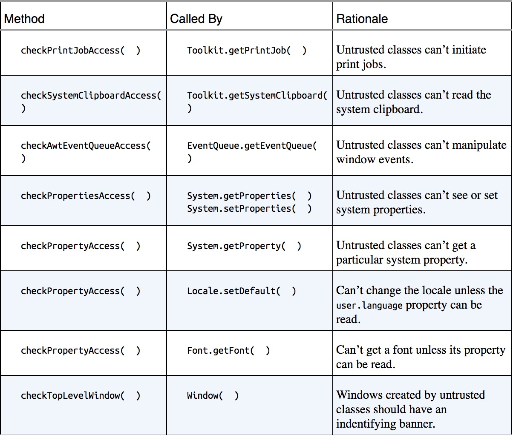
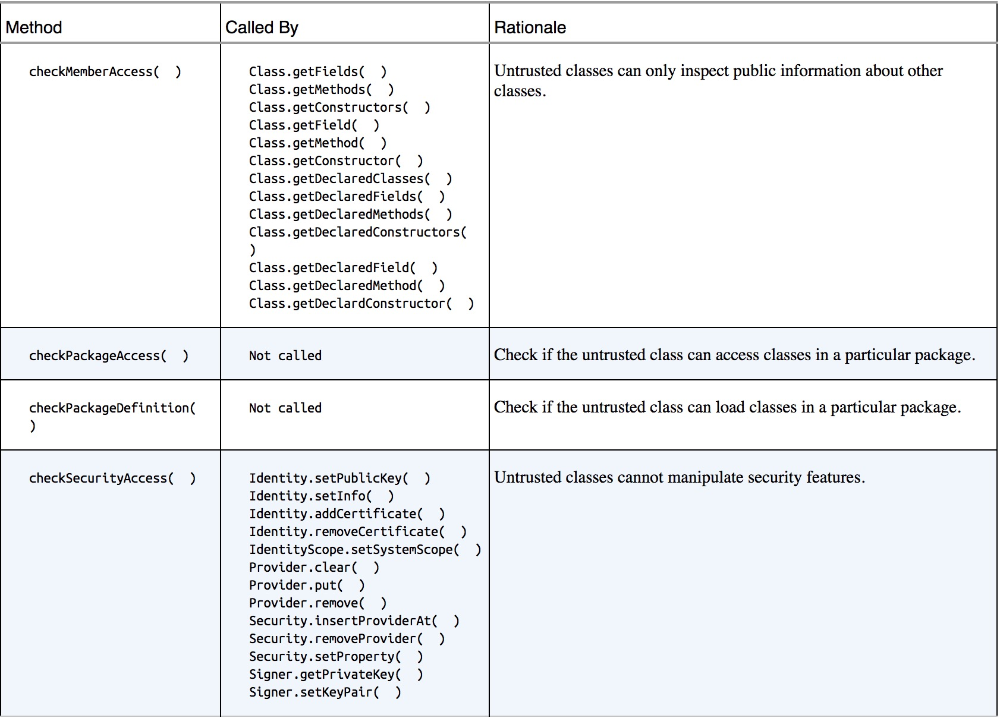

## security manager
```
public class SecurityManager extends Object
     
安全管理器是一个允许应用程序实现安全策略的类。
它允许应用程序在执行一个可能不安全或敏感的操作前确定该操作是什么，
以及是否是在允许执行该操作的安全上下文中执行它。
应用程序可以允许或不允许该操作。

SecurityManager 类包含了很多名称以单词 check 开头的方法。
Java 库中的各种方法在执行某些潜在的敏感操作前可以调用这些方法。
对 check 方法的典型调用如下：

     SecurityManager security = System.getSecurityManager();
     if (security != null) {
         security.checkXXX(argument,  . . . );
     }
 
因此，安全管理器通过抛出异常来提供阻止操作完成的机会。
如果允许执行该操作，则安全管理器例程只是简单地返回，
但如果不允许执行该操作，则抛出一个 SecurityException。
该约定的唯一例外是 checkTopLevelWindow，它返回 boolean 值。

当前的安全管理器由 System 类中的 setSecurityManager 方法设置。
当前的安全管理器由 getSecurityManager 方法获得。

特殊方法 checkPermission(java.security.Permission) 确定是
应该允许还是拒绝由指定权限所指示的访问请求。
默认的实现调用

   AccessController.checkPermission(perm);
 
如果允许访问请求，则安静地返回 。
如果拒绝访问请求，则抛出 SecurityException。

从 Java 2 SDK v1.2 开始，
SecurityManager 中其他所有 check 方法的默认实现都是调用 
SecurityManager checkPermission 方法来确定调用线程是否具有执行所请求操作的权限。

注意，只带有单个权限参数的 checkPermission 方法
总是在当前执行的线程上下文中执行安全检查。
有时，应该在给定上下文中进行的安全检查实际上需要在不同 的上下文（例如，在一个辅助线程中）中进行。
Java 为这种情况提供了包含有上下文参数的 getSecurityContext 方法和 checkPermission 方法。getSecurityContext 方法返回当前调用上下文的一个“快照”
（默认的实现返回一个 AccessControlContext 对象）。
下面是一个示例调用：

   Object context = null;
   SecurityManager sm = System.getSecurityManager();
   if (sm != null) context = sm.getSecurityContext(); 
 
checkPermission 方法使用一个上下文对象，
以及根据该上下文而不是当前执行线程的上下文作出访问决策的权限。
因此另一个上下文中的代码可以调用此方法，传递权限和以前保存的上下文对象。
下面是一个示例调用，它使用了以前示例中获得的 SecurityManager sm：

   if (sm != null) sm.checkPermission(permission, context);
 
权限分为以下类别：文件、套接字、网络、安全性、运行时、属性、AWT、反射和可序列化。
管理各种权限类别的类是 
```
java.io.FilePermission、java.net.SocketPermission、java.net.NetPermission、java.security.SecurityPermission、java.lang.RuntimePermission、java.util.PropertyPermission、java.awt.AWTPermission、java.lang.reflect.ReflectPermission 和 java.io.SerializablePermission。
```
除前两个（FilePermission 和 SocketPermission）类以外的所有类都是 java.security.BasicPermission 的子类，而 java.security.BasicPermission 类又是顶级权限类 java.security.Permission 的抽象子类。BasicPermission 定义了所有权限所需的功能，这些功能的名称遵从分层属性命名惯例（例如“exitVM”、“setFactory”、“queuePrintJob”等等）。在名称的末尾可能出现一个星号，前面是“.”或星号，这表示通配符匹配。例如：“a.*”、“*”是有效的，而“*a”或“a*b”是无效的。

FilePermission 和 SocketPermission 是顶级权限类 (java.security.Permission) 的子类。像这些命名语法比 BasicPermission 所用的语法更为复杂的类都直接是 Permission 的子类，而不是 BasicPermission 的子类。例如，对于 java.io.FilePermission 对象而言，权限名就是文件（或目录）的路径名。

某些权限类具有一个“动作”列表，告知允许对象所执行的动作。例如，对于 java.io.FilePermission 对象，动作列表（如“读、写”）指定了允许对指定文件（或指定目录中的文件）执行哪些动作。

其他权限类是“指定的”权限 - 有名称但没有动作列表的类；您也许有指定的权限，也许没有。

注：还有一个暗指所有权限的 java.security.AllPermission 权限。该权限是为了简化系统管理员的工作而存在的，因为管理员可能需要执行很多需要所有（或许多）权限的任务。
```
有关权限相关的信息，请参阅[Permissions in the Java Development Kit (JDK)](https://docs.oracle.com/javase/8/docs/technotes/guides/security/permissions.html)
# 文件访问相关方法



# 网络访问相关方法


# 保护java虚拟机的方法

# 保护程序线程的方法

# 保护系统资源的方法

# 保护安全性的方法
