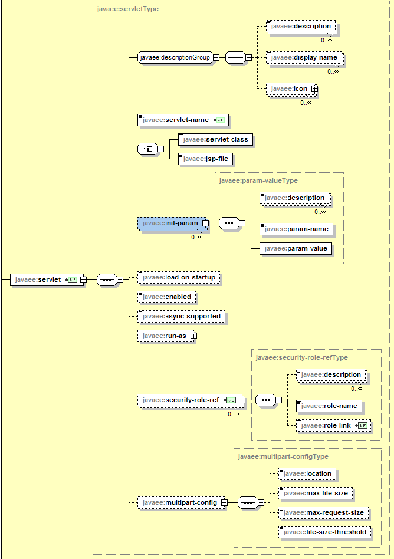
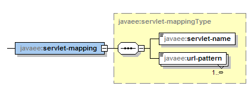

# <servlet></servlet>和&lt;servlet-mapping>&lt;servlet-mapping>

**<center> servlet Element Structure</center>**


**<center> servlet-mapping Element Structure</center>**


* servlet 用来声明一个servlet的数据，它有很多子元素，其中required的两个子元素为

  * servlet-name指定servlet名称（required）
  
  * servlet-class指定servlet类而jsp-file指定jsp文件，一个servlet元素只能有一个servlet-class或一个jsp-file子元素，二者不能同时出现（required）
  
  
* servlet-mapping 用来定义servlet所对应的URL，它有两个required的子元素

  * servlet-name指定servlet名称（required）
  
  * url-pattern指定访问路径（required）


例1：配置servlet
```xml
<servlet>
  <servlet-name>User</servlet-name>
  <servlet-class>User</servlet-class>
</servlet>
<servlet-mapping>
  <servlet-name>User</servlet-name>
  <url-pattern>/User</url-pattern>
</servlet-mapping>
</web-app>  
```
例2：配置jsp
```xml
<servlet>
  <servlet-name>registration.jsp</servlet-name>
  <jsp-file>/registration.jsp</jsp-file>
</servlet>
<servlet-mapping>
  <servlet-name>registration.jsp</servlet-name>
  <url-pattern>/registration.xml</url-pattern>
</servlet-mapping>
```
##url-patter的匹配规则

### 使用 URL 路径
在收到客户端请求时,web 容器确定转发到哪一个 Web 应用。选择的 Web 应用必须具有最长的上下文路径
匹配请求 URL 的开始。当映射到 Servlet 时,URL 匹配的一部分是上下文。

Web 容器接下来必须用下面描述的路径匹配步骤找出 servlet 来处理请求。

用于映射到 Servlet 的路径是请求对象的请求 URL 减去上下文和路径参数部分。下面的 URL 路径映射规则
按顺序使用。使用第一个匹配成功的且不会进一步尝试匹配:

1. 容器将尝试找到一个请求路径到 servlet 路径的精确匹配。成功匹配则选择该 servlet。
2. 容器将递归地尝试匹配最长路径前缀。这是通过一次一个目录的遍历路径树完成的,使用‘/’字符作为
路径分隔符。最长匹配确定选择的 servlet。
3. 如果 URL 最后一部分包含一个扩展名(如 .jsp)
,servlet 容器将视图匹配为扩展名处理请求的 Servlet。
扩展名定义在最后一部分的最后一个‘.’字符之后。
4. 如果前三个规则都没有产生一个 servlet 匹配,容器将试图为请求资源提供相关的内容。如果应用中定义
了一个“default”servlet,它将被使用。许多容器提供了一种隐式的 default servlet 用于提供内容。
容器必须使用区分大小写字符串比较匹配。

### 映射规范

在 web 应用部署描述符中,以下语法用于定义映射:

  ■ 以‘/’字符开始、以‘/\*’后缀结尾的字符串用于路径匹配。

  ■ 以‘\*.’开始的字符串用于扩展名映射。

  ■ 空字符串 “” 是一个特殊的 URL 模式, 其精确映射到应用的上下文根, 即, http://host:port/<context-root>/
请求形式。在这种情况下,路径信息是‘/’且 servlet 路径和上下文路径是空字符串(“”)。

  ■ 只包含“/”字符的字符串表示应用的“default”servlet。在这种情况下,servlet 路径是请求 URL 减去上
下文路径且路径信息。

  ■ 所以其他字符串仅用于精确匹配。

如果一个有效的 web.xml(在从 fragment 和注解合并了信息后)包含任意的 url-pattern,其映射到多个
servlet,那么部署将失败。


### 隐式映射

如果容器有一个内部的 JSP 容器,、\*.jsp 扩展名映射到它,允许执行 JSP 页面的要求。该映射被称为隐式映射。如果 Web 应用定义了一个\*.jsp 映射,它的优先级高于隐式映射。

Servlet 容器允许进行其他的隐式映射,只要显示映射的优先。例如,一个\*.shtml 隐式映射可以映射到包含
在服务器上的功能。

### 示例映射集合
示例映射集合

| Path Pattern | Servlet |
| -- | -- |
| /foo/bar/* | Servlet1 |
| /baz/* | Servlet2 |
| /catalog | Servlet3 |
| *.bop | Servlet4|

将产生以下行为

| Incoming Path | Servlet Handling Request |
| -- | -- |
| /foo/bar/index.html | Servlet1 |
| /foo/bar/index.bop | Servlet1 |
| /baz | Servlet2 |
| /baz/index.html | Servlet2 |
| /catalog | Servlet3 |
| /catalog/index.html | ”default“ Servlet |
| /catalog/racecar.bop | Servlet4 |
| /index.bop | Servlet4 |


## servlet还有如下可选子元素
* init-param 用来定义Servlet范围的参数，可有多个init-param。在servlet类中通过getInitParamenter(String name)方法访问初始化参数

* load-on-startup指定当Web应用启动时，装载Servlet的次序。当值为正数或零时：Servlet容器先加载数值小的servlet，再依次加载其他数值大的servlet。当值为负或未定义：Servlet容器将在Web客户首次访问这个servlet时加载它。

* run-as 元素指定用作一个组件执行的标识。它包含一个可选的 description,和一个由 role-name 元素指定安全角色。

* security-role-ref 元素声明组件中或部署组件的代码中的安全角色引用。它由一个可选的 description,在代码中使用的安全角色名称(role-name),以及一个可选的到一个安全角色 (role-link)的 链 接 组成 。如果没有 指 定 安全 角色 , 部署器 必须选择 一个 合 适 的 安全 角色 。 

* 当 指 定了可 选 的async-supported 元素,指示的 servlet 可以支持异步请求处理。

* 如果一个 servlet 支持文件上传功能和
mime-multipart 请求处理,通过描述文件中的 multipart-config 元素能够提供相同的配置。multipart-config 元
素可用于指定文件存储的位置,上传文件大小的最大值,最大请求大小和文件将写入磁盘之后的大小阈值。

## reference

[servlet mapping web.xml](http://stackoverflow.com/questions/15385596/servlet-mapping-web-xml)

http://jinnianshilongnian.iteye.com/