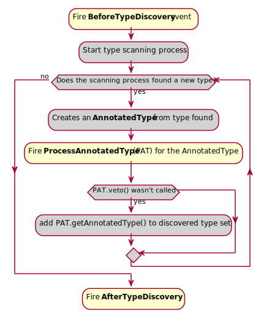
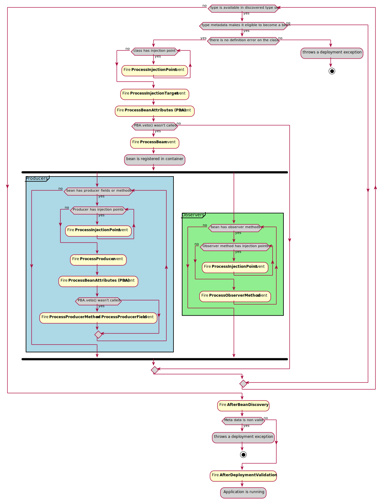

# CDI portable extensions
## What can I do with an extension
在启动时，CDI会扫描classpath中的class,创建configuration和bean graph。此时创建的configuration和meta data大多根据静态的class file,portable extension能够提供动态的特性。

CDI portable extension 允许挂起CDI扫描，改变或者增加由CDI Container创建的meta data的信息。包括add Beans, remove classes from set of type that should become bean, add producers, observers and most of the SPI elements that exist in CDI.

**So to make short, extensions are how developers can configure CDI and override default behaviour created from reading the classes.**

## Getting started with CDI extension
CDI portable extensions are based on Java SE service-provider.

Service interface is 
```java
javax.enterprise.inject.spi.Extension
```
 so to add an extension you’ll need to create a class implementing javax.enterprise.inject.spi.Extension interface and add this class qualified name to the **META-INF/services/javax.enterprise.inject.spi.Extension** service provider text file.

Extension feature是通过在CDI容器的特定lifecycle event上添加observers来实现的。 在启动时，CDI容器将使用service provider mechanism来发现所有extensions并注册这些观察者。

这种方法允许开发者hook on容器的内部生命周期步骤并修改其结果。

让我们来看看这些步骤。
## Extension step by step
To understand how to work with extensions, we can start by splitting container lifecycle in 4 Big steps:


除了Application running外，其他步骤都包含一个或多个lifecycle events，允许开发者在其extension的实现中定义一个或多个observers来 hook on CDI elements discovery and meta data building.

## Types discovery



黄色框的部分是extension可以观察的事件和执行的动作，灰色部分是CDI容器内部行为的简化。

Types discovery的目标是创建一个AnnotatedType set，这些AnnotatedType将成为beans的候选。

这个集合可以在BeforeTypeDiscovery或AfterDiscovery observers 中显式填充

该集合也通过容器的扫描过程自动填充，在这个过程中开发人员可以通过使用ProcessAnnotatedType observer 放置一个hook进行其他操作

### Adding types before scanning (BeforeBeanDiscovery event)
Before CDI container start automatic types scan on the class path, it fires the BeforeBeanDiscovery event.

Observing this events 允许将特定类型添加到AnnotatedType集合或者添加特定的CDI注解，例如qualifier, stereotype or interceptor binding.

```java
public interface BeforeBeanDiscovery {

  // Add a new qualifier with an Annotation, an AnnotatedType or by using the CDI 2.0 AnnotatedTypeConfigurator
  void addQualifier(Class<? extends Annotation> qualifier); 
  // Add a new qualifier with an Annotation, an AnnotatedType or by using the CDI 2.0 AnnotatedTypeConfigurator
  void addQualifier(AnnotatedType<? extends Annotation> qualifier); 
  //Add a new scope Annotation
  void addScope(Class<? extends Annotation> scopeType, boolean normal, boolean passivating); 
  //Define a new Stereotype by giving its Annotation and the Annotations collection it stands for
  void addStereotype(Class<? extends Annotation> stereotype, Annotation... stereotypeDef); 
  //Add a new interceptor binding with an Annotation and its meta annotations, an AnnotatedType or by using the CDI 2.0 AnnotatedTypeConfigurator
  void addInterceptorBinding(AnnotatedType<? extends Annotation> bindingType); 
  //Add a new interceptor binding with an Annotation and its meta annotations, an AnnotatedType or by using the CDI 2.0 AnnotatedTypeConfigurator
  void addInterceptorBinding(Class<? extends Annotation> bindingType, Annotation... bindingTypeDef); 
  //Add a new AnnotatedType from a custom AnnotatedType or by using the CDI 2.0 AnnotatedTypeConfigurator
  void addAnnotatedType(AnnotatedType<?> type, String id); 


  /* New methods in CDI 2.0 */

  //Add a new AnnotatedType from a custom AnnotatedType or by using the CDI 2.0 AnnotatedTypeConfigurator
  <T> AnnotatedTypeConfigurator<T> addAnnotatedType(Class<T> type, String id); 
  // Add a new qualifier with an Annotation, an AnnotatedType or by using the CDI 2.0 AnnotatedTypeConfigurator
  <T extends Annotation> AnnotatedTypeConfigurator<T> configureQualifier(Class<T> qualifier); 
  //Add a new interceptor binding with an Annotation and its meta annotations, an AnnotatedType or by using the CDI 2.0 AnnotatedTypeConfigurator
  <T extends Annotation> AnnotatedTypeConfigurator<T> configureInterceptorBinding(Class<T> bt); 
}
```

example:
The example is a piece of the Dropwizard Metrics CDI integration extension. It declares a standard annotation (@Metrics) as a CDI qualifier
```java
// defining the extension (remember to also add class FQN to META-INF/services/javax.enterprise.inject.spi.Extension text file
public class MetricsExtension implements Extension { 
    // An observer for the BeforeBeanDiscovery lifecycle event
    public void addMetricAsQual(@Observes BeforeBeanDiscovery bbd) { 
        // Declaring an annotation from a 3rd party non-CDI framework as a qualifier
        bbd.addQualifier(Metric.class); 
    }
}
```
You can also transform a non-CDI class to have it discovered as a managed bean by the container:
```java
// class from a legacy framework that we want to integrate into CDI programming model without changing its code
public class MyLegacyFrameworkService { 

    private Configurator config;

    public MyLegacyFrameworkService(Configurator config) {
        this.config = config;
    }
}

...

public class LegacyIntegrationExtension implements Extension {

    public void addLegacyServiceAsBean(@Observes BeforeBeanDiscovery bbd) {
        // using an AnnotatedTypeConfigurator (new in CDI 2.0) based on the MyLegacyFrameworkService class
        bbd.addAnnotatedType(MyLegacyFrameworkService.class,MyLegacyFrameworkService.class.getName()) 
                // adding @ApplicationScoped scope on the AnnotatedTypeConfigurator
                .add(ApplicationScoped.Literal.INSTANCE) 
                .filterConstructors(c -> c.getParameters().size() == 1)
                // find the first constructor with one parameters and add the @Inject on it
                .findFirst().get().add(InjectLiteral.INSTANCE); 
    }
```

The example above use new feature from CDI 2.0: 

the AnnotatedTypeConfigurator returned by one of the addAnnotatedType() methods of BeforeBeanDiscovery event. 

If you are in CDI 1.1 you can don the same but you’ll have to implement your own AnnotatedType to do the same in more verbose way. 

to configure a new AnnotatedType add a scope on it and an @Inject annotation on one of its constructors. 

At the end of observer invocation, the container will automatically build the matching AnnotatedType from this configurator and add it to the discovered type set.

### Automatic types scanning process
第一个事件后，容器开始type discovery(in the application classpath)处理过程。

对于类路径中的每个Bean归档（eg jar or module），可以对此扫描进行不同的配置。

应用程序路径中的每个jar都可能（或不可能）包含beans.xml文件，该文件定义CDI容器将扫描此Bean归档文件的哪些类。

请记住，CDI不提供全局配置文件，因此每个bean归档文件（包括war容器其他bean归档文件）都必须定义其发现模式。

三种发现模式：

* none: no type will be discovered for this bean archive

* annotated (default mode): only class having specific annotations (bean defining annotation^) will be discovered

* all: all types will be discovered
```
The set of bean defining annotations contains:

@ApplicationScoped, @SessionScoped, @ConversationScoped and @RequestScoped annotations,

all other normal scope types,

@Interceptor and @Decorator annotations,

all stereotype annotations (i.e. annotations annotated with @Stereotype),

and the @Dependent scope annotation.
```
通过分析beans.xml文件来推断Discovery mode

```
beans.xml file state	            discovery mode
No beans.xml                        annotated
empty beans.xml                     all
beans.xml using CDI 1.0 xsd         all
beans.xml using CDI 1.1 xsd         value of bean-discovery-mode attribute
```
You can also fine grain(细粒) type discovery by using exclusion filters

**In CDI 2.0 when you are working on Java SE, jars without beans.xml file are ignored by default.**

### ProcessAnnotatedType event
After this scanning phase, the container creates an AnnotatedType and fire the ProcessAnnotatedType event for each  (except for annotations).
在扫描阶段之后，容器将为每个type discovered创建一个AnnotatedType，触发ProcessAnnotatedType事件（除了annotations）
```java
// 	the event is a parameterized type allowing user to only process AnnotatedType based on a given original type
public interface ProcessAnnotatedType<X> {
    // returns the current processed AnnotatedType
    AnnotatedType<X> getAnnotatedType(); 
    // replaces the processed AnnotatedType 
    // by a new one defined by implementing AnnotatedType interface 
    void setAnnotatedType(AnnotatedType<X> type); 
    // remove the processed AnnotatedType from the set of discovered type: this type won’t become a bean
    void veto(); 


    /* New in CDI 2.0 */

    // replaces the processed AnnotatedType 
    // with the help of an AnnotatedTypeConfigurator (new in CDI 2.0)
    AnnotatedTypeConfigurator<X> configureAnnotatedType(); 
}
```
the example below remove adds transactional annotation on the StandardService class in a third party library.
```java
public class AddTranscationalToServiceExtension implements Extension {

    public void addTransactional(@Observes ProcessAnnotatedType<StandardService> pat) { 
        pat.configureAnnotatedType().add(new AnnotationLiteral<Transactional>(){});
    }
```
observer will only be triggered for any AnnotatedType based on StandardService type
It can also be used to veto type implementing an interface or having a specific annotation (thanks to the @WithAnnotations filter).
```java
public class VetEntitiesExtension implements Extension {

    public void vetoEntities(@Observes @WithAnnotations(Entity.class) ProcessAnnotatedType<?> pat) { 
        pat.veto();
    }
```
observer will be triggered for any AnnotatedType based on any type having @Entity annotation
This last example vetoes all JPA entities in the application to avoid using them as CDI beans.

### AfterTypeDiscovery event
这一事件完成type discovery process
```java
public interface AfterTypeDiscovery {
    // these methods give you access to classes list 
    // discovered as possible alternatives beans, interceptors or decorators. 
    // You can use these inventory list to check everything you need is here 
    // or add a new class to them since these lists are mutable
    List<Class<?>> getAlternatives(); 
    List<Class<?>> getInterceptors(); 
    List<Class<?>> getDecorators(); 
    void addAnnotatedType(AnnotatedType<?> type, String id); 

    /* New in CDI 2.0 */

    // as in BeforeBeanDiscovery you can add a custom AnnotatedType to the set of discovered AnnotatedType
    // The following extension checks that 
    // if LastInterceptor class was discovered as an interceptor,
    // this one will be invoked after all other interceptors.
    <T> AnnotatedTypeConfigurator<T> addAnnotatedType(Class<T> type, String id); 
}
```
```java
public class lastInteceptorExtension implements Extension {

    public void lastInterceptorCheck (@Observes AfterTypeDiscovery atd) {
            List<Class<?>> interceptors = atd.getInterceptors();
            if(interceptors.indexOf(LastInterceptor.class) < interceptors.size()) {
                interceptors.remove(LastInterceptor.class);
                interceptors.add(LastInterceptor.class);
            }
        }
    }
```
## Beans discovery phase

在这个阶段，对每个discovered type进行分析，以检查他们是否有资格成为beans。

如果discovered type可以成为一个bean，一系列的事件将被触发去修改未来的bean。

如果这个bean没有被一个extension否决，container launch producers and observers discovring processes.

在此阶段结束时，extension有机会使用AfterBeanDiscovery事件注册custom beans or observers

The phase ends with the validation of all the element by the container and the AfterDeploymentValidation event.


### ProcessInjectionPoint event
对于在此过程中遇到的每个injection point，容器将触发ProcessInjectionPoint事件。 Injection points are fired for managed beans, producer methods and observer methods.
```java
// event is a parameterized type allowing observer to target a specific class T containig the injection point or a specific injection point type X
public interface ProcessInjectionPoint<T, X> { 
    //returns the InjectionPoint processed by this event
    InjectionPoint getInjectionPoint(); 
    void setInjectionPoint
    // allow replacement of processed InjectionPoint either by implementing custom InjectionPoint 
    (InjectionPoint injectionPoint); 
    //allows observer to abort deployment by adding a definition error
    void addDefinitionError(Throwable t); 

    /* New in CDI 2.0 */

    // allow replacement of processed InjectionPoint either by using and InjectionPointConfigurator (new CDI in 2.0)
    InjectionPointConfigurator configureInjectionPoint(); 
}
```

An extension can observe this event for multiple reason. For instance it can be used to collect all types for a given qualifier and later create a bean to match these injection points
```java
public class ConvertExtension implements Extension {

    Set<Type> convertTypes = new HashSet();

    public void captureConfigTypes(@Observes ProcessInjectionPoint<?, ?> pip) {
        InjectionPoint ip = pip.getInjectionPoint();
        if (ip.getQualifiers().contains(Convert.Literal.Instance)) {
            convertTypes.add(ip.getType());
        }
    }
}
```
The example above will create a set of types for all injection points in the application having the @Convert qualifier.

Later it could use this collection to create custom beans matching each types found for instance.

### ProcessInjectionTarget event
一个InjectionTarget可以被看作是一个non managed bean。 它主要提供依赖注入机制和一些回调函数。

```java
// the event is a parameterized type to target a specific base type of the InjectionTarget to process
public interface ProcessInjectionTarget<X> { 
    // returns the AnnotatedType which defined the processed InjectionTarget
    public AnnotatedType<X> getAnnotatedType(); 
    // returns the InjectionTarget processed by this event
    public InjectionTarget<X> getInjectionTarget(); 
    // allows replacing the processed InjectionTarget
    public void setInjectionTarget(InjectionTarget<X> injectionTarget);
    // allows observer to abort deployment by adding a definition error 
    public void addDefinitionError(Throwable t); 
}
```
Observing this event allows an extension to override the default InjectionTarget behaviour and perform specific tasks during injection like calling specific feature on a 3rd party framework.

### ProcessBeanAttributes event

该事件在discovered bean注册到容器前被触发

该事件允许改变attributes或者取消注册

该事件在所有beans类型触发：
```
Managed Beans

Session Beans

Producer Fields

Producer Method

Custom Beans
```
```java
// The event being a parameterized type allows observing this event only for a given type
public interface ProcessBeanAttributes<T> { 
    // returns the Annotated defining the bean 
    // (i.e an AnnotatedType for managed Bean or a session bean, 
    // an AnnotatedField or AnnotatedMethod for a producer 
    // and null for a custom bean)
    public Annotated getAnnotated(); 
    // returns the processed BeanAttributes 
    public BeanAttributes<T> getBeanAttributes(); 
    // allows replacement of processed BeanAttributes by implementing the BeanAttributes interface 
    public void setBeanAttributes(BeanAttributes<T> beanAttributes); 
    // allows observer to abort deployment by adding a definition error
    public void addDefinitionError(Throwable t); 
    // requests the container to ignore the matching bean and skip its registration
    public void veto(); 

    /* New in CDI 2.0 */

    // returns the processed BeanAttributes allows replacement of processed BeanAttributes by using a BeanAttributesConfigurator (new in CDI 2.0)
    public BeanAttributesConfigurator<T> configureBeanAttributes(); 
    // new method in CDI 2.0 to explicitly skip some restriction in the spec regarding proxy creation
    public void ignoreFinalMethods(); 
}
```
The following extension checks that no beans was added by developer for type SpecialClass and no qualifiers will be registered since it will register a custom bean for it
```java
public class CheckExtension implements Extension {

public void filterSpecialClassBean(@Observes ProcessBeanAttributes<SpecialClass> pba) {
        if(pba.getBeanAttributes().getQualifiers().contains(Default.Literal.INSTANCE))
            pba.veto();
    }
}
```
### ProcessBean event
**This event is fired when a bean is registered in the container.**
```java
// Parameterized type for better observer filtering
public interface ProcessBean<X> { 
    // returns the Annotated defining the bean 
    // (i.e an AnnotatedType for managed Bean or a session bean, 
    // an AnnotatedField or AnnotatedMethod for a producer 
    // and null for a custom bean)
    public Annotated getAnnotated(); 
    // returns the created Bean
    public Bean<X> getBean(); 
    // allows observer to abort deployment by adding a definition error
    public void addDefinitionError(Throwable t); 
}
```
这个事件主要是在这里检查一个特定的bean是否被创建，有时会捕获它的定义以供进一步的使用。

An observer on ProcessBean for all kind of bean. If you want to be more specific, you can use a child of this event to only observe the event for a specific kind of bean.


### ProcessProducer event
This event is fired for all producers find in the application.

Remember that a producer is a kind of bean. But its definition and discovery depends on the bean that contains it. In other words, producer defined in a class that will not be discovered as bean will be ignored.

It mainly allows overriding of the producing code (i.e. you can override the code written to produce a specific bean instance in the application from an extension )

public interface ProcessProducer<T, X> { 
    AnnotatedMember<T> getAnnotatedMember(); 
    Producer<X> getProducer(); 
    void addDefinitionError(Throwable t); 
    void setProducer(Producer<X> producer); 

    /* New in CDI 2.0 */
    ProducerConfigurator<X> configureProducer(); 
}
Parameterized type for better observer filtering. T is the bean class of the bean containing the producer, X is the type of the producer
returns the AnnotatedMember defining the producer (i.e an AnnotatedField for a field producer or AnnotatedMethod for a method producer)
returns the producer being processed
allows observer to abort deployment by adding a definition error
Allow replacement of the processed producer, either by implementing the Producer interface or using the ProducerConfigurator helper (new in CDI 2.0)
The following example is inspired by Metrics-CDI extension.

When user will declare a producer for a metric in the app, we want to check in the metric registry that it doesn’t already exist. If it exist, instead of creating an new instance, we’ll return the one in the registry. If it doesn’t exist, we’ll use the producer code to instantiate the metric, add it to the registry and returns it to the application.

public class MetricsExtension implements Extension {

<T extends com.codahale.metrics.Metric> void processMetricProducer(@Observes ProcessProducer<?, T> pp, BeanManager bm) { 
        Metric m = pp.getAnnotatedMember().getAnnotation(Metric.class); 

        if (m != null) { 
            String name = m.name(); 
            Producer<T> prod = pp.getProducer(); 
            pp.configureProducer() 
                    .produceWith(ctx -> { 
                        MetricRegistry reg = bm.createInstance().select(MetricRegistry.class).get(); 
                        if (!reg.getMetrics().containsKey(name)) 
                            reg.register(name, prod.produce(ctx)); 
                        return (T) reg.getMetrics().get(name);  
                    });
        }
    }
}
this observer needs BeanManager. This helper bean can be injected in any observer in an extension
retrieving @Metric annotation on the producer
treatment will be skip if no annotation found
retrieving name of the metric from the annotation
getting the initial producer to be able to use it in call back
we use the new ProducerConfigurator helpers. In CDI 1.2 we would have created our own implementation of Producer interface
we define a functional callback for producing the instance of the producer
retrieving the registry bean instance
looking for a metric with the matching name
if it doesn’t exist we create it by using the original producer code and it to the registry
we return the metric with the matching name from the registry
### ProcessObserverMethod event
This event is fired for all observers declared in enabled beans.

Before CDI 2.0 it was mainly an event to check existence of an observer method. Since CDI 2.0, this gives more control by allowing ObserverMethod replacement or removing of it.

public interface ProcessObserverMethod<T, X> { 
    AnnotatedMethod<X> getAnnotatedMethod(); 
    ObserverMethod<T> getObserverMethod(); 
    void addDefinitionError(Throwable t); 

    /* new in CDI 2.0 */
    void setObserverMethod(ObserverMethod<T> observerMethod); 
    ObserverMethodConfigurator<T> configureObserverMethod(); 
    void veto(); 
}
Parameterized type for better observer filtering. T is the bean class of the bean containing the observer method, X is the type of the event
returns the AnnotatedMethod defining the ObserverMethod
returns the ObserverMethod
allows observer to abort deployment by adding a definition error
allow replacement or overriding of the ObserverMethod either by providing a custom ObserverMethod instance or by using an ObserverMethodConfigurator (new in CDI 2.0)
The example below show how an extension can switch all synchronous observer for MyClass event type to asynchronous behaviour.

public class SwitchExtension implements Extension {

   public void switchToAsync(@Observes ProcessObserverMethod<?, MyClass> pom) {
       pom.configureObserverMethod().async(true);
   }
}
### AfterBeanDiscovery event
This event is fired after all beans, producers and observer discovery.

It is the last occasion to change or enhance discovered meta data.

public interface AfterBeanDiscovery {
    void addDefinitionError(Throwable t); 
    void addBean(Bean<?> bean); 
    void addObserverMethod(ObserverMethod<?> observerMethod); 
    void addContext(Context context); 
    <T> AnnotatedType<T> getAnnotatedType(Class<T> type, String id); 
    <T> Iterable<AnnotatedType<T>> getAnnotatedTypes(Class<T> type); 

    /* New in CDI 2.0 */
    <T> BeanConfigurator<T> addBean(); 
    <T> ObserverMethodConfigurator<T> addObserverMethod(); 
}
allows observer to abort deployment by adding a definition error
allows creation of a custom bean either by creating a custom implementation of Bean interface or by using the BeanConfigurator helper (new in CDI 2.0). registering a custom bean will trigger all the events linked to bean discovery and creation.
allows creation of an ObserverMethod either by creating a custom implementation of ObserverMethod interface or by using the ObserverMethodConfigurator helper (new in CDI 2.0).
add a nex context to the container
returns a discovered AnnotatedType for the given class and id.
returns an Iterable on all the discovered AnnotatedType in the application
### AfterDeploymentValidation event
This last bootstrapping event is only a hook to check that everything is as expected in the meta data (remember that the observer can inject BeanManager to inspect these meta data).

When this event is fired, the meta data in the container are no more mutable and the application is ready to run

public interface AfterDeploymentValidation {
    void addDeploymentProblem(Throwable t); 
}
allows observer to abort deployment by adding a definition error
## Application life and death
From the portable extension perspective we are nearly done.

After this rich phase of bootstrapping, the application runs until an event request its shutting down. It’s when the last portable extension event is fired.

BeforeShutdown Event
This event is a hook, to allow cleaning of specific resource created during application life

public interface BeforeShutdown {
}
## Conclusion
Portable extension are a very powerful tool.

Mastering them may seems difficult, but once you understand most of the SPI and the container lifecycle shown in this post, it’s no more than a kind of big lego box only limited by your imagination.


## javax.enterprise.inject.spi.Bean
Represents an enabled bean. This interface defines everything the container needs to manage instances of the bean.

## javax.enterprise.inject.spi.PassivationCapable
8.4. Passivating scopes and serialization

A passivating scope requires that instances of Web Beans with that scope be serializable, so that their state may be stored to disk when the scope becomes inactive. The process of storing the state of Web Bean instances belonging to a scope that is about to become inactive to disk is called context passivation. Passivating scopes must be explicitly declared @ScopeType(passivating=true).

For example, the built-in session and conversation scopes defined in Section 8.5, “Context management for built-in scopes” are passivating scopes.

The Web Bean manager must validate that every Web Bean declared with a passivating scope truly is serializable:

EJB local objects are serializable. Therefore, an enterprise Web Bean may declare any passivating scope.

Simple Web Beans are not required to be serializable. If a simple Web Bean declares a passivating scope, and the implementation class is not serializable, a DefinitionException is thrown by the Web Bean manager at initialization time.

If a producer method declares a passivating scope and returns a non-serializable object at runtime, an IllegalProductException is thrown by the Web Bean manager.

The built-in session and conversation scopes are passivating. No other built-in scope is passivating.

A Web Bean instance may be serialized under one of two circumstances:

the Web Bean declares a passivating scope type, and context passivation occurs, or

the Web Bean is an EJB stateful session bean, and it is passivated by the EJB container.

In either case, any non-transient field that holds a reference to another Web Bean must be serialized along with the Web Bean that is being serialized. Therefore, the reference must be to a serializable type.

Web Beans client proxies are serializable. Therefore, any reference to a Web Bean which declares a normal scope type is serializable. On the other hand, dependent objects (including interceptors and decorators with scope @Dependent) of a stateful session bean or of a Web Bean with a passivating scope must be serialized and deserialized along with their owner:

EJB local objects are serializable. Therefore, any reference to an enterprise Web Bean of scope @Dependent is serializable.

A simple Web Bean of scope @Dependent may or may not be serializable. If a simple Web Bean of scope @Dependent and a non-serializable implementation class is injected into a stateful session bean, into a non-transient field, Web Bean constructor parameter or initializer method parameter of a Web Bean which declares a passivating scope type, or into a parameter of a producer method which declares a passivating scope type, an UnserializableDependencyException must be thrown by the Web Bean manager at initialization time.

If a producer method of scope @Dependent returns a non-serializable object for injection into a stateful session bean, into a non-transient field, Web Bean constructor parameter or initializer method parameter of a Web Bean which declares a passivating scope type, or into a parameter of a producer method which declares a passivating scope type, an IllegalProductException is thrown by the Web Bean manager.

The Web Bean manager must guarantee that JMS endpoint proxy objects are serializable.

The method Bean.isSerializable() may be used to detect if a Web Bean is serializable.