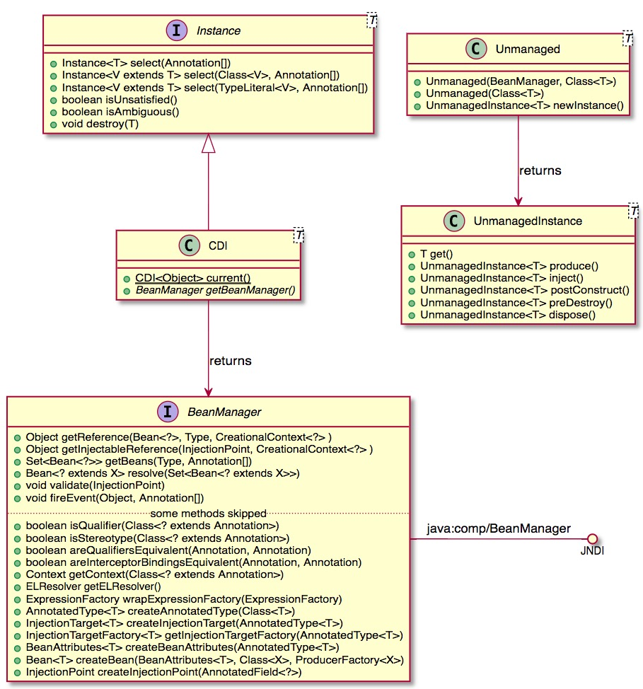
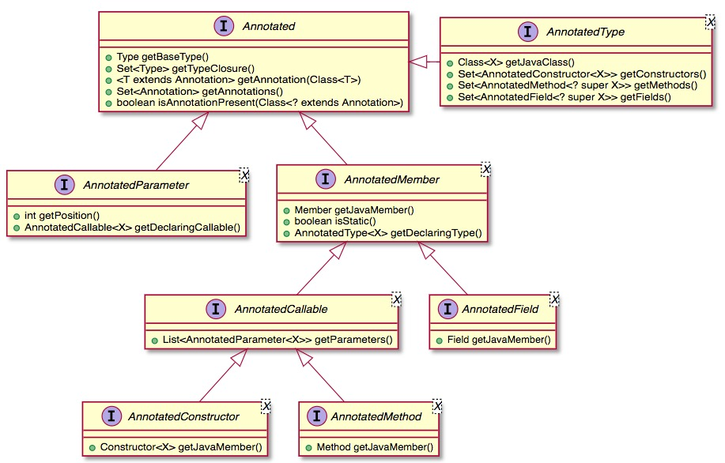

# SPI
* An API is the description of classes/interfaces/methods/…​ that you call and use to achieve a goal
* An SPI is the description of classes/interfaces/methods/…​ that you extend and implement to achieve a goal

* To make short, **CDI provides interfaces that you implement (or that spec implementation implement for you) to perform a specific task. Access to these implementation are usually done through injection or event observation**

# CDI entry points
**SPI providing CDI entry points(CDI integrate入口)**

## BeanManager
BeanManager是CDI SPI的核心接口，通过它可以访问所有的meta-data 和 instantiated components
### CDI 1.0只能通过JNDI获取BeanManager
```java
BeanManager bm = null;
try {
    InitialContext context = new InitialContext();
    bm = (BeanManager) context.lookup("java:comp/BeanManager");
} catch (Exception e) {
    e.printStackTrace();
}
```
```java
BeanManager bm = null;
try {
    InitialContext context = new InitialContext();
    // Retrieving BeanManager thru JNDI
    bm = (BeanManager) context.lookup("java:comp/BeanManager"); 
} catch (Exception e) {
    e.printStackTrace();
}
// 	retrieving all the beans having MyService in their type and the @Default qualifier
Set<Bean<?>> beans = bm.getBeans(MyService.class); 
// apply the ambiguous dependency resolution for the set of beans
Bean<?> bean =  bm.resolve(beans); 
// create a CreationalContext to help contextual instance creation for complex use cases like circularities
CreationalContext<MyService> ctx = bm.createCreationalContext(bean); 
// get the instance
MyService myService = (MyService) bm.getReference(bean, MyService.class, ctx); 
```
### CDI 1.1.提供了其他API来简化这个过程
```java
CDI<Object> cdi = CDI.current();
MyService service = cdi.select(MyService.class).get();
```
### Instance\<Object\>
As CDI extends Instance<Object> it naturally provides contextual instance resolution with programmatic lookup.

To make short accessing CDI in your non CDI code provides the same service than having the following injection in CDI code.

```java
@Inject @Any Instance<Object> cdi;
```
[programmatic lookup](http://docs.jboss.org/cdi/spec/1.2/cdi-spec.html#programmatic_lookup)

## Unmanaged
* Unmanaged允许apply some CDI operation to a non CDI class

假设NonCDI类在一个non CDI archive中
```java
public class NonCDI {

  @Inject
  SomeClass someInstance;

  @PostConstruct
  public void init()  {
  ...
  }

  @Predestroy
  public void cleanUp() {
  ...
  }
}
```
You can obtain an instance of this class with injection point satisfied with this code **(remember @Inject is not part of CDI spec but AtInject spec)**
```java
Unmanaged<NonCDI> unmanaged = new Unmanaged(NonCDI.class);
UnmanagedInstance<NonCDI> inst = unmanaged.newInstance();
NonCDI nonCdi = inst.produce().inject().postConstruct().get();
```

# Type meta-model
As all configuration in CDI is based on annotations, we need a mutable(易变的) meta-model to create or modify existing configuration.



AnnotatedType接口是这种注解中心型meta-model的核心
# CDI meta-model

# SPI dedicated to extensions