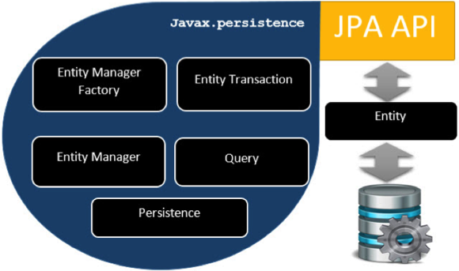
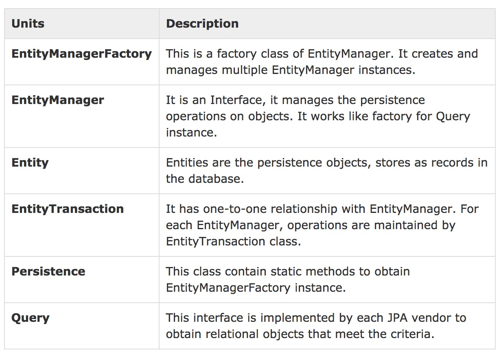
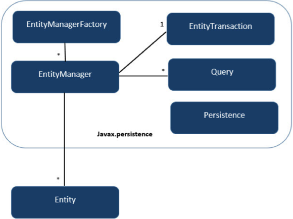
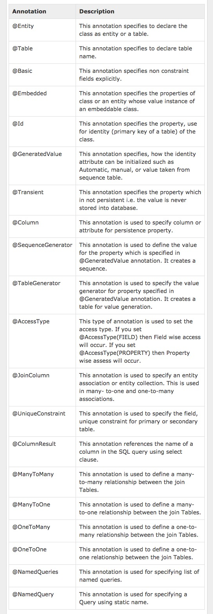

# Class Level Architecture






# Mapping.xml
```xml
<? xml version="1.0" encoding="UTF-8" ?>

<entity-mappings xmlns="http://java.sun.com/xml/ns/persistence/orm"
   xmlns:xsi="http://www.w3.org/2001/XMLSchema-instance"
   xsi:schemaLocation="http://java.sun.com/xml/ns/persistence/orm    
   http://java.sun.com/xml/ns/persistence/orm_1_0.xsd"
   version="1.0">
      
   <description> XML Mapping file</description>
      
   <entity class="Employee">        
      <table name="EMPLOYEETABLE"/>
      <attributes>
      
         <id name="eid">
            <generated-value strategy="TABLE"/>
         </id>

         <basic name="ename">
            <column name="EMP_NAME" length="100"/>
         </basic>
         
         <basic name="salary">
         </basic>
         
         <basic name="deg">
         </basic>
         
      </attributes>
   </entity>
   
</entity-mappings>
```
* \<entity-mappings\> : tag defines the schema definition to allow entity tags into xml file.

* \<description\> : tag defines description about application.

*  \<entity\> : tag defines the entity class which you want to convert into table in a database. Attribute class defines the POJO entity class name.

* \<table\> : tag defines the table name. If you want to keep class name as table name then this tag is not necessary.

*  \<attributes\> : tag defines the attributes (fields in a table).

*  \<id\> : tag defines the primary key of the table. 
    * \<generated-value\> tag defines how to assign the primary key value such as Automatic, Manual, or taken from Sequence.

*  \<basic\> : tag is used for defining remaining attributes for table.

*  \<column-name\> : tag is used to define user defined table field name.

# Annotations


# CRUD
entity
```java
package com.tutorialspoint.eclipselink.entity;

import javax.persistence.Entity;
import javax.persistence.GeneratedValue;
import javax.persistence.GenerationType;
import javax.persistence.Id;
import javax.persistence.Table;

@Entity
@Table
public class Employee {

   @Id
   @GeneratedValue(strategy = GenerationType.AUTO) 	
   
   private int eid;
   private String ename;
   private double salary;
   private String deg;
   
   public Employee(int eid, String ename, double salary, String deg) {
      super( );
      this.eid = eid;
      this.ename = ename;
      this.salary = salary;
      this.deg = deg;
   }

   public Employee( ) {
      super();
   }

   public int getEid( ) {
      return eid;
   }
   
   public void setEid(int eid) {
      this.eid = eid;
   }
   
   public String getEname( ) {
      return ename;
   }
   
   public void setEname(String ename) {
      this.ename = ename;
   }

   public double getSalary( ) {
      return salary;
   }
   
   public void setSalary(double salary) {
      this.salary = salary;
   }

   public String getDeg( ) {
      return deg;
   }
   
   public void setDeg(String deg) {
      this.deg = deg;
   }
   
   @Override
   public String toString() {
      return "Employee [eid=" + eid + ", ename=" + ename + ", salary=" + salary + ", deg=" + deg + "]";
   }
}
```
persistence.xml
```xml
<?xml version="1.0" encoding="UTF-8"?>

<persistence version="2.0" xmlns="http://java.sun.com/xml/ns/persistence"
   xmlns:xsi="http://www.w3.org/2001/XMLSchema-instance" 
   xsi:schemaLocation="http://java.sun.com/xml/ns/persistence 
   http://java.sun.com/xml/ns/persistence/persistence_2_0.xsd">
   
   <persistence-unit name="Eclipselink_JPA" transaction-type="RESOURCE_LOCAL">
   
      <class>com.tutorialspoint.eclipselink.entity.Employee</class>

      <properties>
         <property name="javax.persistence.jdbc.url" value="jdbc:mysql://localhost:3306/jpadb"/>
         <property name="javax.persistence.jdbc.user" value="root"/>
         <property name="javax.persistence.jdbc.password" value="root"/>
         <property name="javax.persistence.jdbc.driver" value="com.mysql.jdbc.Driver"/>
         <property name="eclipselink.logging.level" value="FINE"/>
         <property name="eclipselink.ddl-generation" value="create-tables"/>
      </properties>
      
   </persistence-unit>
</persistence>
```
create
```java
package com.tutorialspoint.eclipselink.service;

import javax.persistence.EntityManager;
import javax.persistence.EntityManagerFactory;
import javax.persistence.Persistence;
import com.tutorialspoint.eclipselink.entity.Employee;

public class CreateEmployee {

   public static void main( String[ ] args ) {
   
      EntityManagerFactory emfactory = Persistence.createEntityManagerFactory( "Eclipselink_JPA" );
      
      EntityManager entitymanager = emfactory.createEntityManager( );
      entitymanager.getTransaction( ).begin( );

      Employee employee = new Employee( ); 
      employee.setEid( 1201 );
      employee.setEname( "Gopal" );
      employee.setSalary( 40000 );
      employee.setDeg( "Technical Manager" );
      
      entitymanager.persist( employee );
      entitymanager.getTransaction( ).commit( );

      entitymanager.close( );
      emfactory.close( );
   }
}
```
update
```java
package com.tutorialspoint.eclipselink.service;

import javax.persistence.EntityManager;
import javax.persistence.EntityManagerFactory;
import javax.persistence.Persistence;
import com.tutorialspoint.eclipselink.entity.Employee;

public class UpdateEmployee {
   public static void main( String[ ] args ) {
      EntityManagerFactory emfactory = Persistence.createEntityManagerFactory( "Eclipselink_JPA" );
      
      EntityManager entitymanager = emfactory.createEntityManager( );
      entitymanager.getTransaction( ).begin( );
      Employee employee = entitymanager.find( Employee.class, 1201 );
      
      //before update
      System.out.println( employee );
      employee.setSalary( 46000 );
      entitymanager.getTransaction( ).commit( );
      
      //after update
      System.out.println( employee );
      entitymanager.close();
      emfactory.close();
   }
}
```

delete
```java
package com.tutorialspoint.eclipselink.service;

import javax.persistence.EntityManager;
import javax.persistence.EntityManagerFactory;
import javax.persistence.Persistence;
import com.tutorialspoint.eclipselink.entity.Employee;

public class DeleteEmployee {
   public static void main( String[ ] args ) {
   
      EntityManagerFactory emfactory = Persistence.createEntityManagerFactory( "Eclipselink_JPA" );
      EntityManager entitymanager = emfactory.createEntityManager( );
      entitymanager.getTransaction( ).begin( );
      
      Employee employee = entitymanager.find( Employee.class, 1201 );
      entitymanager.remove( employee );
      entitymanager.getTransaction( ).commit( );
      entitymanager.close( );
      emfactory.close( );
   }
}
```

find
```java
package com.tutorialspoint.eclipselink.service;

import javax.persistence.EntityManager;
import javax.persistence.EntityManagerFactory;
import javax.persistence.Persistence;
import com.tutorialspoint.eclipselink.entity.Employee;

public class FindEmployee {
   public static void main( String[ ] args ) {
   
      EntityManagerFactory emfactory = Persistence.createEntityManagerFactory( "Eclipselink_JPA" );
      EntityManager entitymanager = emfactory.createEntityManager();
      Employee employee = entitymanager.find( Employee.class, 1201 );

      System.out.println("employee ID = " + employee.getEid( ));
      System.out.println("employee NAME = " + employee.getEname( ));
      System.out.println("employee SALARY = " + employee.getSalary( ));
      System.out.println("employee DESIGNATION = " + employee.getDeg( ));
   }
}
```
# Java Persistence Query language-JPQL
## template
```
SELECT ... FROM ...
[WHERE ...]
[GROUP BY ... [HAVING ...]]
[ORDER BY ...]

DELETE FROM ... [WHERE ...]
 
UPDATE ... SET ... [WHERE ...]
```

## Scalar(标量) and Aggregate(聚合) Functions

Scalar functions returns resultant values based on input values. Aggregate functions returns the resultant values by calculating the input values.

* UPPER():字母大小写转换函数，将字母转成大写 - 返回字符串str，根据当前字符集映射的所有字符更改为大写。
```java
package com.tutorialspoint.eclipselink.service;

import java.util.List;
import javax.persistence.EntityManager;
import javax.persistence.EntityManagerFactory;
import javax.persistence.Persistence;
import javax.persistence.Query;

public class ScalarandAggregateFunctions {
   public static void main( String[ ] args ) {
   
      EntityManagerFactory emfactory = Persistence.createEntityManagerFactory( "Eclipselink_JPA" );
      EntityManager entitymanager = emfactory.createEntityManager();

      //Scalar function
      Query query = entitymanager.
      createQuery("Select UPPER(e.ename) from Employee e");
      List<String> list = query.getResultList();

      for(String e:list) {
         System.out.println("Employee NAME :"+e);
      }
      
      //Aggregate function
      Query query1 = entitymanager.createQuery("Select MAX(e.salary) from Employee e");
      Double result = (Double) query1.getSingleResult();
      System.out.println("Max Employee Salary :" + result);
   }
}
```
## Between, And, Like Keywords
```java
package com.tutorialspoint.eclipselink.service;

import java.util.List;
import javax.persistence.EntityManager;
import javax.persistence.EntityManagerFactory;
import javax.persistence.Persistence;
import javax.persistence.Query;
import com.tutorialspoint.eclipselink.entity.Employee;

public class BetweenAndLikeFunctions {
   public static void main( String[ ] args ) {
   
      EntityManagerFactory emfactory = Persistence.createEntityManagerFactory( "Eclipselink_JPA" );
      EntityManager entitymanager = emfactory.createEntityManager();
      
      //Between
      Query query = entitymanager.createQuery( "Select e " + "from Employee e " + "where e.salary " + "Between 30000 and 40000" );
      
      List<Employee> list=(List<Employee>)query.getResultList( );

      for( Employee e:list ){
         System.out.print("Employee ID :" + e.getEid( ));
         System.out.println("\t Employee salary :" + e.getSalary( ));
      }

      //Like
      Query query1 = entitymanager.createQuery("Select e " + "from Employee e " + "where e.ename LIKE 'M%'");
      
      List<Employee> list1=(List<Employee>)query1.getResultList( );
      
      for( Employee e:list1 ) {
         System.out.print("Employee ID :"+e.getEid( ));
         System.out.println("\t Employee name :"+e.getEname( ));
      }
   }
}
```
## Ordering
```java
package com.tutorialspoint.eclipselink.service;

import java.util.List;
import javax.persistence.EntityManager;
import javax.persistence.EntityManagerFactory;
import javax.persistence.Persistence;
import javax.persistence.Query;
import com.tutorialspoint.eclipselink.entity.Employee;

public class Ordering {

   public static void main( String[ ] args ) {
      EntityManagerFactory emfactory = Persistence.createEntityManagerFactory( "Eclipselink_JPA" );
      EntityManager entitymanager = emfactory.createEntityManager();
      
      //Between
      Query query = entitymanager.createQuery( "Select e " + "from Employee e " + "ORDER BY e.ename ASC" );

      List<Employee> list = (List<Employee>)query.getResultList( );

      for( Employee e:list ) {
         System.out.print("Employee ID :" + e.getEid( ));
         System.out.println("\t Employee Name :" + e.getEname( ));
      }
   }
}

```

## NamedQuery
```java
package com.tutorialspoint.eclipselink.entity;

import javax.persistence.Entity;
import javax.persistence.GeneratedValue;
import javax.persistence.GenerationType;
import javax.persistence.Id;
import javax.persistence.NamedQuery;
import javax.persistence.Table;

@Entity
@Table
@NamedQuery(query = "Select e from Employee e where e.eid = :id", name = "find employee by id")

public class Employee {
   @Id
   @GeneratedValue(strategy = GenerationType.AUTO) 	
   
   private int eid;
   private String ename;
   private double salary;
   private String deg;
   
   public Employee(int eid, String ename, double salary, String deg) {
      super( );
      this.eid = eid;
      this.ename = ename;
      this.salary = salary;
      this.deg = deg;
   }
   
   public Employee( ) {
      super();
   }

   public int getEid( ) {
      return eid;
   }
   
   public void setEid(int eid) {
      this.eid = eid;
   }

   public String getEname( ) {
      return ename;
   }
   
   public void setEname(String ename) {
      this.ename = ename;
   }

   public double getSalary( ) {
      return salary;
   }
   
   public void setSalary(double salary) {
      this.salary = salary;
   }

   public String getDeg( ) {
      return deg;
   }
   
   public void setDeg(String deg) {
      this.deg = deg;
   }
   
   @Override
   public String toString() {
      return "Employee [eid=" + eid + ", ename=" + ename + ", salary=" + salary + ", deg=" + deg + "]";
   }
}
```
```java
package com.tutorialspoint.eclipselink.service;

import java.util.List;
import javax.persistence.EntityManager;
import javax.persistence.EntityManagerFactory;
import javax.persistence.Persistence;
import javax.persistence.Query;
import com.tutorialspoint.eclipselink.entity.Employee;

public class NamedQueries {
   public static void main( String[ ] args ) {
   
      EntityManagerFactory emfactory = Persistence.createEntityManagerFactory( "Eclipselink_JPA" );
      EntityManager entitymanager = emfactory.createEntityManager();
      Query query = entitymanager.createNamedQuery("find employee by id");
      
      query.setParameter("id", 1204);
      List<Employee> list = query.getResultList( );
      
      for( Employee e:list ){
         System.out.print("Employee ID :" + e.getEid( ));
         System.out.println("\t Employee Name :" + e.getEname( ));
      }
   }
}
```

# Eager and Lazy Loading
The main concept of JPA is to make a duplicate copy of the database in cache memory. While transacting with the database, first it will effect on duplicate data and only when it is committed using entity manager, the changes are effected into the database.

There are two ways of fetching records from the database - eager fetch and lazy fetch.

## Eager fetch
Fetching the whole record while finding the record using Primary Key.

## Lazy fetch
It checks for the availability of notifies it with primary key if it exists. Then later if you call any of the getter method of that entity then it fetches the whole.

But lazy fetch is possible when you try to fetch the record for the first time. That way, a copy of the whole record is already stored in cache memory. Performance wise, lazy fetch is preferable.

# Entity Relationships
## @ManyToOne Relation
## @OneToMany Relation
## @OneToOne Relation
## @ManyToMany Relation