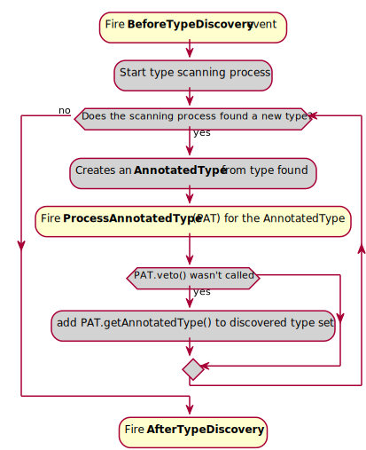
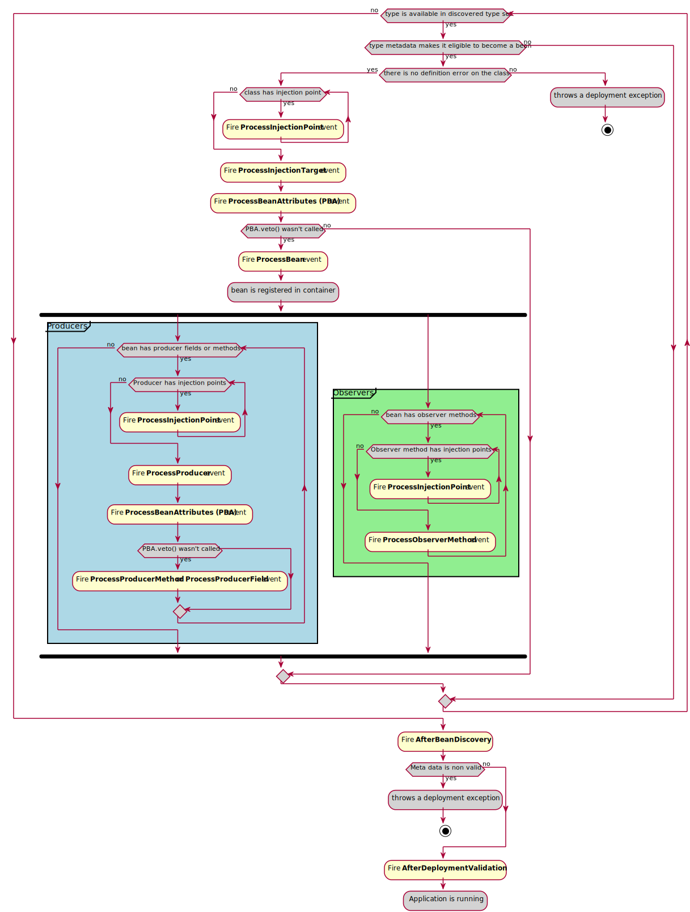

# CDI portable extensions

## Getting started with CDI extension
META-INF/services/javax.enterprise.inject.spi.Extension:
```java
org.glassfish.soteria.cdi.CdiExtension
```

Extension feature是通过在CDI容器的特定lifecycle event上添加observers来实现的。 在启动时，CDI容器将使用service provider mechanism来发现所有extensions并注册这些观察者。

这种方法允许开发者hook on容器的内部生命周期步骤并修改其结果。

让我们来看看这些步骤。
## Extension step by step
To understand how to work with extensions, we can start by splitting container lifecycle in 4 Big steps:


除了Application running外，其他步骤都包含一个或多个lifecycle events，允许开发者在其extension的实现中定义一个或多个observers来 hook on CDI elements discovery and meta data building.

## Types discovery



黄色框的部分是extension可以观察的事件和执行的动作，灰色部分是CDI容器内部行为的简化。

Types discovery的目标是创建一个AnnotatedType set，这些AnnotatedType将成为beans的候选。

这个集合可以在BeforeTypeDiscovery或AfterDiscovery observers 中显式填充

该集合也通过容器的扫描过程自动填充，在这个过程中开发人员可以通过使用ProcessAnnotatedType observer 放置一个hook进行其他操作

### Adding types before scanning (BeforeBeanDiscovery event)
Before CDI container start automatic types scan on the class path, it fires the BeforeBeanDiscovery event.

Observing this events 允许将特定类型添加到AnnotatedType集合或者添加特定的CDI注解，例如qualifier, stereotype or interceptor binding.

```java
public void register(@Observes BeforeBeanDiscovery beforeBean, BeanManager beanManager) {
    addAnnotatedTypes(beforeBean, beanManager,
        AutoApplySessionInterceptor.class,
        RememberMeInterceptor.class,
        LoginToContinueInterceptor.class,
        FormAuthenticationMechanism.class,
        CustomFormAuthenticationMechanism.class,
        SecurityContextImpl.class,
        IdentityStoreHandler.class,
        Pbkdf2PasswordHashImpl.class
    );
}
public static void addAnnotatedTypes(BeforeBeanDiscovery beforeBean, BeanManager beanManager, Class<?>... types) {
    for (Class<?> type : types) {
        beforeBean.addAnnotatedType(beanManager.createAnnotatedType(type), "Soteria " + type.getName());
    }
}
```

### Automatic types scanning process

### ProcessAnnotatedType event

### AfterTypeDiscovery event

## Beans discovery phase

在这个阶段，对每个discovered type进行分析，以检查他们是否有资格成为beans。

如果discovered type可以成为一个bean，一系列的事件将被触发去修改未来的bean。

如果这个bean没有被一个extension否决，container launch producers and observers discovring processes.

在此阶段结束时，extension有机会使用AfterBeanDiscovery事件注册custom beans or observers

The phase ends with the validation of all the element by the container and the AfterDeploymentValidation event.


### ProcessInjectionPoint event

### ProcessInjectionTarget event

### ProcessBeanAttributes event


### ProcessBean event
**This event is fired when a bean is registered in the container.**
```java
// Parameterized type for better observer filtering
public interface ProcessBean<X> { 
    // returns the Annotated defining the bean 
    // (i.e an AnnotatedType for managed Bean or a session bean, 
    // an AnnotatedField or AnnotatedMethod for a producer 
    // and null for a custom bean)
    public Annotated getAnnotated(); 
    // returns the created Bean
    public Bean<X> getBean(); 
    // allows observer to abort deployment by adding a definition error
    public void addDefinitionError(Throwable t); 
}
```
这个事件主要是在这里检查一个特定的bean是否被创建，有时会捕获它的定义以供进一步的使用。

```java
public <T> void processBean(@Observes ProcessBean<T> eventIn, BeanManager beanManager) {

    ProcessBean<T> event = eventIn; // JDK8 u60 workaround

    Class<?> beanClass = event.getBean().getBeanClass();
    Optional<EmbeddedIdentityStoreDefinition> optionalEmbeddedStore = getAnnotation(beanManager, event.getAnnotated(), EmbeddedIdentityStoreDefinition.class);
    optionalEmbeddedStore.ifPresent(embeddedIdentityStoreDefinition -> {
        logActivatedIdentityStore(EmbeddedIdentityStore.class, beanClass);

        identityStoreBeans.add(new CdiProducer<IdentityStore>()
                .scope(ApplicationScoped.class)
                .beanClass(IdentityStore.class)
                .types(Object.class, IdentityStore.class, EmbeddedIdentityStore.class)
                .addToId(EmbeddedIdentityStoreDefinition.class)
                .create(e -> new EmbeddedIdentityStore(embeddedIdentityStoreDefinition))
        );
    });

    Optional<DatabaseIdentityStoreDefinition> optionalDBStore = getAnnotation(beanManager, event.getAnnotated(), DatabaseIdentityStoreDefinition.class);
    optionalDBStore.ifPresent(dataBaseIdentityStoreDefinition -> {
        logActivatedIdentityStore(DatabaseIdentityStoreDefinition.class, beanClass);

        identityStoreBeans.add(new CdiProducer<IdentityStore>()
                .scope(ApplicationScoped.class)
                .beanClass(IdentityStore.class)
                .types(Object.class, IdentityStore.class, DatabaseIdentityStore.class)
                .addToId(DatabaseIdentityStoreDefinition.class)
                .create(e -> new DatabaseIdentityStore(
                    DatabaseIdentityStoreDefinitionAnnotationLiteral.eval(
                        dataBaseIdentityStoreDefinition)))
        );
    });

    Optional<LdapIdentityStoreDefinition> optionalLdapStore = getAnnotation(beanManager, event.getAnnotated(), LdapIdentityStoreDefinition.class);
    optionalLdapStore.ifPresent(ldapIdentityStoreDefinition -> {
        logActivatedIdentityStore(LdapIdentityStoreDefinition.class, beanClass);

        identityStoreBeans.add(new CdiProducer<IdentityStore>()
                .scope(ApplicationScoped.class)
                .beanClass(IdentityStore.class)
                .types(Object.class, IdentityStore.class, LdapIdentityStore.class)
                .addToId(LdapIdentityStoreDefinition.class)
                .create(e -> new LdapIdentityStore(
                    LdapIdentityStoreDefinitionAnnotationLiteral.eval(
                        ldapIdentityStoreDefinition)))
        );
    });

    Optional<BasicAuthenticationMechanismDefinition> optionalBasicMechanism = getAnnotation(beanManager, event.getAnnotated(), BasicAuthenticationMechanismDefinition.class);
    optionalBasicMechanism.ifPresent(basicAuthenticationMechanismDefinition -> {
        logActivatedAuthenticationMechanism(BasicAuthenticationMechanismDefinition.class, beanClass);

        authenticationMechanismBean = new CdiProducer<HttpAuthenticationMechanism>()
                .scope(ApplicationScoped.class)
                .beanClass(BasicAuthenticationMechanism.class)
                .types(Object.class, HttpAuthenticationMechanism.class, BasicAuthenticationMechanism.class)
                .addToId(BasicAuthenticationMechanismDefinition.class)
                .create(e -> new BasicAuthenticationMechanism(
                    BasicAuthenticationMechanismDefinitionAnnotationLiteral.eval(
                        basicAuthenticationMechanismDefinition)));
    });

    Optional<FormAuthenticationMechanismDefinition> optionalFormMechanism = getAnnotation(beanManager, event.getAnnotated(), FormAuthenticationMechanismDefinition.class);
    optionalFormMechanism.ifPresent(formAuthenticationMechanismDefinition -> {
        logActivatedAuthenticationMechanism(FormAuthenticationMechanismDefinition.class, beanClass);

        authenticationMechanismBean = new CdiProducer<HttpAuthenticationMechanism>()
                .scope(ApplicationScoped.class)
                .beanClass(HttpAuthenticationMechanism.class)
                .types(Object.class, HttpAuthenticationMechanism.class)
                .addToId(FormAuthenticationMechanismDefinition.class)
                .create(e -> {
                    return CDI.current()
                            .select(FormAuthenticationMechanism.class)
                            .get()
                            .loginToContinue(
                                LoginToContinueAnnotationLiteral.eval(
                                    formAuthenticationMechanismDefinition.loginToContinue()));
                });
    });

    Optional<CustomFormAuthenticationMechanismDefinition> optionalCustomFormMechanism = getAnnotation(beanManager, event.getAnnotated(), CustomFormAuthenticationMechanismDefinition.class);
    optionalCustomFormMechanism.ifPresent(customFormAuthenticationMechanismDefinition -> {
        logActivatedAuthenticationMechanism(CustomFormAuthenticationMechanismDefinition.class, beanClass);

        authenticationMechanismBean = new CdiProducer<HttpAuthenticationMechanism>()
                .scope(ApplicationScoped.class)
                .beanClass(HttpAuthenticationMechanism.class)
                .types(Object.class, HttpAuthenticationMechanism.class)
                .addToId(CustomFormAuthenticationMechanismDefinition.class)
                .create(e -> {
                    return CDI.current()
                                .select(CustomFormAuthenticationMechanism.class)
                                .get()
                                .loginToContinue(
                                    LoginToContinueAnnotationLiteral.eval(
                                    customFormAuthenticationMechanismDefinition.loginToContinue()));

                });
    });

    if (event.getBean().getTypes().contains(HttpAuthenticationMechanism.class)) {
        // enabled bean implementing the HttpAuthenticationMechanism found
        httpAuthenticationMechanismFound = true;
    }

    checkForWrongUseOfInterceptors(event.getAnnotated(), beanClass);
}

private void checkForWrongUseOfInterceptors(Annotated annotated, Class<?> beanClass) {
    List<Class<? extends Annotation>> annotations = Arrays.asList(AutoApplySession.class, LoginToContinue.class, RememberMe.class);

    for (Class<? extends Annotation> annotation : annotations) {
        // Check if the class is not an interceptor, and is not a valid class to be intercepted.
        if (annotated.isAnnotationPresent(annotation)
                && !annotated.isAnnotationPresent(javax.interceptor.Interceptor.class)
                && !HttpAuthenticationMechanism.class.isAssignableFrom(beanClass)) {
            LOGGER.log(Level.WARNING, "Only classes implementing {0} may be annotated with {1}. {2} is annotated, but the interceptor won't take effect on it.", new Object[]{
                HttpAuthenticationMechanism.class.getName(),
                annotation.getName(),
                beanClass.getName()});
        }
    }
}
```
### ProcessProducer event
This event is fired for all producers find in the application.

Remember that a producer is a kind of bean. But its definition and discovery depends on the bean that contains it. In other words, producer defined in a class that will not be discovered as bean will be ignored.

It mainly allows overriding of the producing code (i.e. you can override the code written to produce a specific bean instance in the application from an extension )

public interface ProcessProducer<T, X> { 
    AnnotatedMember<T> getAnnotatedMember(); 
    Producer<X> getProducer(); 
    void addDefinitionError(Throwable t); 
    void setProducer(Producer<X> producer); 

    /* New in CDI 2.0 */
    ProducerConfigurator<X> configureProducer(); 
}
Parameterized type for better observer filtering. T is the bean class of the bean containing the producer, X is the type of the producer
returns the AnnotatedMember defining the producer (i.e an AnnotatedField for a field producer or AnnotatedMethod for a method producer)
returns the producer being processed
allows observer to abort deployment by adding a definition error
Allow replacement of the processed producer, either by implementing the Producer interface or using the ProducerConfigurator helper (new in CDI 2.0)
The following example is inspired by Metrics-CDI extension.

When user will declare a producer for a metric in the app, we want to check in the metric registry that it doesn’t already exist. If it exist, instead of creating an new instance, we’ll return the one in the registry. If it doesn’t exist, we’ll use the producer code to instantiate the metric, add it to the registry and returns it to the application.

public class MetricsExtension implements Extension {

<T extends com.codahale.metrics.Metric> void processMetricProducer(@Observes ProcessProducer<?, T> pp, BeanManager bm) { 
        Metric m = pp.getAnnotatedMember().getAnnotation(Metric.class); 

        if (m != null) { 
            String name = m.name(); 
            Producer<T> prod = pp.getProducer(); 
            pp.configureProducer() 
                    .produceWith(ctx -> { 
                        MetricRegistry reg = bm.createInstance().select(MetricRegistry.class).get(); 
                        if (!reg.getMetrics().containsKey(name)) 
                            reg.register(name, prod.produce(ctx)); 
                        return (T) reg.getMetrics().get(name);  
                    });
        }
    }
}
this observer needs BeanManager. This helper bean can be injected in any observer in an extension
retrieving @Metric annotation on the producer
treatment will be skip if no annotation found
retrieving name of the metric from the annotation
getting the initial producer to be able to use it in call back
we use the new ProducerConfigurator helpers. In CDI 1.2 we would have created our own implementation of Producer interface
we define a functional callback for producing the instance of the producer
retrieving the registry bean instance
looking for a metric with the matching name
if it doesn’t exist we create it by using the original producer code and it to the registry
we return the metric with the matching name from the registry
### ProcessObserverMethod event
This event is fired for all observers declared in enabled beans.

Before CDI 2.0 it was mainly an event to check existence of an observer method. Since CDI 2.0, this gives more control by allowing ObserverMethod replacement or removing of it.

public interface ProcessObserverMethod<T, X> { 
    AnnotatedMethod<X> getAnnotatedMethod(); 
    ObserverMethod<T> getObserverMethod(); 
    void addDefinitionError(Throwable t); 

    /* new in CDI 2.0 */
    void setObserverMethod(ObserverMethod<T> observerMethod); 
    ObserverMethodConfigurator<T> configureObserverMethod(); 
    void veto(); 
}
Parameterized type for better observer filtering. T is the bean class of the bean containing the observer method, X is the type of the event
returns the AnnotatedMethod defining the ObserverMethod
returns the ObserverMethod
allows observer to abort deployment by adding a definition error
allow replacement or overriding of the ObserverMethod either by providing a custom ObserverMethod instance or by using an ObserverMethodConfigurator (new in CDI 2.0)
The example below show how an extension can switch all synchronous observer for MyClass event type to asynchronous behaviour.

public class SwitchExtension implements Extension {

   public void switchToAsync(@Observes ProcessObserverMethod<?, MyClass> pom) {
       pom.configureObserverMethod().async(true);
   }
}
### AfterBeanDiscovery event
This event is fired after all beans, producers and observer discovery.

It is the last occasion to change or enhance discovered meta data.

public interface AfterBeanDiscovery {
    void addDefinitionError(Throwable t); 
    void addBean(Bean<?> bean); 
    void addObserverMethod(ObserverMethod<?> observerMethod); 
    void addContext(Context context); 
    <T> AnnotatedType<T> getAnnotatedType(Class<T> type, String id); 
    <T> Iterable<AnnotatedType<T>> getAnnotatedTypes(Class<T> type); 

    /* New in CDI 2.0 */
    <T> BeanConfigurator<T> addBean(); 
    <T> ObserverMethodConfigurator<T> addObserverMethod(); 
}
allows observer to abort deployment by adding a definition error
allows creation of a custom bean either by creating a custom implementation of Bean interface or by using the BeanConfigurator helper (new in CDI 2.0). registering a custom bean will trigger all the events linked to bean discovery and creation.
allows creation of an ObserverMethod either by creating a custom implementation of ObserverMethod interface or by using the ObserverMethodConfigurator helper (new in CDI 2.0).
add a nex context to the container
returns a discovered AnnotatedType for the given class and id.
returns an Iterable on all the discovered AnnotatedType in the application
### AfterDeploymentValidation event
This last bootstrapping event is only a hook to check that everything is as expected in the meta data (remember that the observer can inject BeanManager to inspect these meta data).

When this event is fired, the meta data in the container are no more mutable and the application is ready to run

public interface AfterDeploymentValidation {
    void addDeploymentProblem(Throwable t); 
}
allows observer to abort deployment by adding a definition error
## Application life and death
From the portable extension perspective we are nearly done.

After this rich phase of bootstrapping, the application runs until an event request its shutting down. It’s when the last portable extension event is fired.

BeforeShutdown Event
This event is a hook, to allow cleaning of specific resource created during application life

public interface BeforeShutdown {
}
## Conclusion
Portable extension are a very powerful tool.

Mastering them may seems difficult, but once you understand most of the SPI and the container lifecycle shown in this post, it’s no more than a kind of big lego box only limited by your imagination.


## javax.enterprise.inject.spi.Bean
Represents an enabled bean. This interface defines everything the container needs to manage instances of the bean.

## javax.enterprise.inject.spi.PassivationCapable
8.4. Passivating scopes and serialization

A passivating scope requires that instances of Web Beans with that scope be serializable, so that their state may be stored to disk when the scope becomes inactive. The process of storing the state of Web Bean instances belonging to a scope that is about to become inactive to disk is called context passivation. Passivating scopes must be explicitly declared @ScopeType(passivating=true).

For example, the built-in session and conversation scopes defined in Section 8.5, “Context management for built-in scopes” are passivating scopes.

The Web Bean manager must validate that every Web Bean declared with a passivating scope truly is serializable:

EJB local objects are serializable. Therefore, an enterprise Web Bean may declare any passivating scope.

Simple Web Beans are not required to be serializable. If a simple Web Bean declares a passivating scope, and the implementation class is not serializable, a DefinitionException is thrown by the Web Bean manager at initialization time.

If a producer method declares a passivating scope and returns a non-serializable object at runtime, an IllegalProductException is thrown by the Web Bean manager.

The built-in session and conversation scopes are passivating. No other built-in scope is passivating.

A Web Bean instance may be serialized under one of two circumstances:

the Web Bean declares a passivating scope type, and context passivation occurs, or

the Web Bean is an EJB stateful session bean, and it is passivated by the EJB container.

In either case, any non-transient field that holds a reference to another Web Bean must be serialized along with the Web Bean that is being serialized. Therefore, the reference must be to a serializable type.

Web Beans client proxies are serializable. Therefore, any reference to a Web Bean which declares a normal scope type is serializable. On the other hand, dependent objects (including interceptors and decorators with scope @Dependent) of a stateful session bean or of a Web Bean with a passivating scope must be serialized and deserialized along with their owner:

EJB local objects are serializable. Therefore, any reference to an enterprise Web Bean of scope @Dependent is serializable.

A simple Web Bean of scope @Dependent may or may not be serializable. If a simple Web Bean of scope @Dependent and a non-serializable implementation class is injected into a stateful session bean, into a non-transient field, Web Bean constructor parameter or initializer method parameter of a Web Bean which declares a passivating scope type, or into a parameter of a producer method which declares a passivating scope type, an UnserializableDependencyException must be thrown by the Web Bean manager at initialization time.

If a producer method of scope @Dependent returns a non-serializable object for injection into a stateful session bean, into a non-transient field, Web Bean constructor parameter or initializer method parameter of a Web Bean which declares a passivating scope type, or into a parameter of a producer method which declares a passivating scope type, an IllegalProductException is thrown by the Web Bean manager.

The Web Bean manager must guarantee that JMS endpoint proxy objects are serializable.

The method Bean.isSerializable() may be used to detect if a Web Bean is serializable.