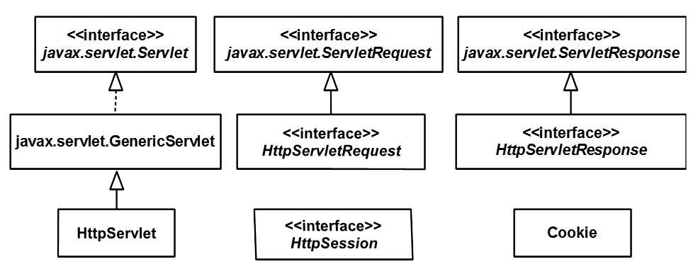

# javax.servlet.http package
**<center>javax.servlet.http</center>**




通常情况下，servlet app处理的是HTTP请求。 javax.servlet.http主要用于提供HTTP相关特性的处理。


## HttpServlet

继承GenericServlet，重写service方法，并提供一个新的service方法，其参数是HttpServletRequest和HttpServletResponse类型。

```java
protected void service(HttpServletRequest request, HttpServletResponse response) 
  throws ServletException, java.io.IOException
```

servlet Container仍然会调用javax.servlet.Servlet中定义的service方法，该方法在HttpServlet中的实现如下
```java
public void service(ServletRequest req, ServletResponse res) throws ServletException, IOException {
  if(req instanceof HttpServletRequest && res instanceof HttpServletResponse) {
      HttpServletRequest request = (HttpServletRequest)req;
      HttpServletResponse response = (HttpServletResponse)res;
      this.service(request, response);
  } else {
      throw new ServletException("non-HTTP request or response");
  }
}
```
首先将servlet Container传递的ServletRequest, ServletResponse向下转型为HttpServletRequest，HttpServletResponse。然后再调用HttpServlet定义的service方法。

HttpServlet自定义的service方法实现如下
```java
protected void service(HttpServletRequest req, HttpServletResponse resp) throws ServletException, IOException {
    String method = req.getMethod();
    long errMsg;
    if(method.equals("GET")) {
        errMsg = this.getLastModified(req);
        if(errMsg == -1L) {
            this.doGet(req, resp);
        } else {
            long ifModifiedSince = req.getDateHeader("If-Modified-Since");
            if(ifModifiedSince < errMsg) {
                this.maybeSetLastModified(resp, errMsg);
                this.doGet(req, resp);
            } else {
                resp.setStatus(304);
            }
        }
    } else if(method.equals("HEAD")) {
        errMsg = this.getLastModified(req);
        this.maybeSetLastModified(resp, errMsg);
        this.doHead(req, resp);
    } else if(method.equals("POST")) {
        this.doPost(req, resp);
    } else if(method.equals("PUT")) {
        this.doPut(req, resp);
    } else if(method.equals("DELETE")) {
        this.doDelete(req, resp);
    } else if(method.equals("OPTIONS")) {
        this.doOptions(req, resp);
    } else if(method.equals("TRACE")) {
        this.doTrace(req, resp);
    } else {
        String errMsg1 = lStrings.getString("http.method_not_implemented");
        Object[] errArgs = new Object[]{method};
        errMsg1 = MessageFormat.format(errMsg1, errArgs);
        resp.sendError(501, errMsg1);
    }

}
```
首先通过request.getMethod获取Http发送请求的方法，然后调用如下七种方法之一：

doGet, doPost, doHead, doPut, doTrace, doOptions, and doDelete. 

其中最常用的两种方式为doGet, doPost。也就是说servlet开发者只需要根据需求重写doGet方法或doPost方法即可。

**总结 ：HttpServlet相对GenericServlet提供如下两点特性**

servlet开发者需要实现的方法是doGet，doPost（少数情况下是其他五中方法）而不再是service方法

servlet需要处理的是HttpServletRequest 和 HttpServletResponse, 而不再是ServletRequest 和 ServletResponse.

## HttpServletRequest

对于HTTP请求，HttpServletRequest用于代表servlet request。

HttpServletRequest继承于javax.servlet.ServletRequest接口，并添加了一些方法。它添加的一些比较常用的方法如下
```java
java.lang.String getContextPath()
Cookie[] getCookies()
java.lang.String getHeader(java.lang.String name)
java.lang.String getMethod()
java.lang.String getQueryString()
HttpSession getSession()
HttpSession getSession(boolean create)
```
## HttpServletResponse
对于HTTP请求，HttpServletResponse用于代表servlet response。

HttpServletResponse继承于javax.servlet.ServletResponse接口，并添加了一些方法。它添加的一些比较常用的方法如下
```java
void addCookie(Cookie cookie)
void addHeader(java.lang.String name, java.lang.String value)
void sendRedirect(java.lang.String location)
```


## HTML Forms
* input field（(a text field, a hidden field, or a password field)）或text area发送给server的是string，empty input field或text area发送给server的是empty string，而不是null。

* select 发送给server的也是string
* multiple-value select发送给server的是string数组，由ServletRequest.getParameterValues获取
* checkbox由ServletRequest.getParameter(fieldName)获取，若没选中则返回null
* Radio buttons发送选中的value给server，如果没有选择则ServletRequest.getParameter(fieldName) 返回null
* 如果一个form有多个名字相同的input，则可通过ServletRequest.getParameterValues 获取，如果通过ServletRequest.getParameter获取则得到的是最后一个。
* 
例
```java
@WebServlet(name = "FormServlet", urlPatterns = { "/form" })
public class FormServlet extends HttpServlet {
    private static final long serialVersionUID = 54L;
    private static final String TITLE = "Order Form";

    @Override
    public void doGet(HttpServletRequest request,
            HttpServletResponse response)
            throws ServletException, IOException {

        response.setContentType("text/html");
        PrintWriter writer = response.getWriter();
        writer.println("<!DOCTYPE html>");
        writer.println("<html>");
        writer.println("<head>");
        writer.println("<title>" + TITLE + "</title></head>");
        writer.println("<body><h1>" + TITLE + "</h1>");
        writer.println("<form method='post'>");
        writer.println("<table>");
        writer.println("<tr>");
        writer.println("<td>Name:</td>");
        writer.println("<td><input name='name'/></td>");
        writer.println("</tr>");
        writer.println("<tr>");
        writer.println("<td>Address:</td>");
        writer.println("<td><textarea name='address' "
                + "cols='40' rows='5'></textarea></td>");
        writer.println("</tr>");
        writer.println("<tr>");
        writer.println("<td>Country:</td>");
        writer.println("<td><select name='country'>");
        writer.println("<option>United States</option>");
        writer.println("<option>Canada</option>");
        writer.println("</select></td>");
        writer.println("</tr>");
        writer.println("<tr>");
        writer.println("<td>Delivery Method:</td>");
        writer.println("<td><input type='radio' " +
                "name='deliveryMethod'"
                + " value='First Class'/>First Class");
        writer.println("<input type='radio' " +
                "name='deliveryMethod' "
                + "value='Second Class'/>Second Class</td>");
        writer.println("</tr>");
        writer.println("<tr>");
        writer.println("<td>Shipping Instructions:</td>");
        writer.println("<td><textarea name='instruction' "
                + "cols='40' rows='5'></textarea></td>");
        writer.println("</tr>");
        writer.println("<tr>");
        writer.println("<td>&nbsp;</td>");
        writer.println("<td><textarea name='instruction' "
                + "cols='40' rows='5'></textarea></td>");
        writer.println("</tr>");
        writer.println("<tr>");
        writer.println("<td>Please send me the latest " +
                "product catalog:</td>");
        writer.println("<td><input type='checkbox' " +
                "name='catalogRequest'/></td>");
        writer.println("</tr>");
        writer.println("<tr>");
        writer.println("<td>&nbsp;</td>");
        writer.println("<td><input type='reset'/>" +
                "<input type='submit'/></td>");
        writer.println("</tr>");
        writer.println("</table>");
        writer.println("</form>");
        writer.println("</body>");
        writer.println("</html>");
    }

    @Override
    public void doPost(HttpServletRequest request,
            HttpServletResponse response)
            throws ServletException, IOException {
        response.setContentType("text/html");
        PrintWriter writer = response.getWriter();
        writer.println("<html>");
        writer.println("<head>");
        writer.println("<title>" + TITLE + "</title></head>");
        writer.println("</head>");
        writer.println("<body><h1>" + TITLE + "</h1>");
        writer.println("<table>");
        writer.println("<tr>");
        writer.println("<td>Name:</td>");
        writer.println("<td>" + request.getParameter("name")
                + "</td>");
        writer.println("</tr>");
        writer.println("<tr>");
        writer.println("<td>Address:</td>");
        writer.println("<td>" + request.getParameter("address")
                + "</td>");
        writer.println("</tr>");
        writer.println("<tr>");
        writer.println("<td>Country:</td>");
        writer.println("<td>" + request.getParameter("country")
                + "</td>");
        writer.println("</tr>");
        writer.println("<tr>");
        writer.println("<td>Shipping Instructions:</td>");
        writer.println("<td>");
        String[] instructions = request
                .getParameterValues("instruction");
        if (instructions != null) {
            for (String instruction : instructions) {
                writer.println(instruction + "<br/>");
            }
        }
        writer.println("</td>");
        writer.println("</tr>");
        writer.println("<tr>");
        writer.println("<td>Delivery Method:</td>");
        writer.println("<td>"
                + request.getParameter("deliveryMethod")
                + "</td>");
        writer.println("</tr>");
        writer.println("<tr>");
        writer.println("<td>Catalog Request:</td>");
        writer.println("<td>");
        if (request.getParameter("catalogRequest") == null) {
            writer.println("No");
        } else {
            writer.println("Yes");
        }
        writer.println("</td>");
        writer.println("</tr>");
        writer.println("</table>");
        writer.println("<div style='border:1px solid #ddd;" +
        		"margin-top:40px;font-size:90%'>");

        writer.println("Debug Info<br/>");
        Enumeration<String> parameterNames = request
                .getParameterNames();
        while (parameterNames.hasMoreElements()) {
            String paramName = parameterNames.nextElement();
            writer.println(paramName + ": ");
            String[] paramValues = request
                    .getParameterValues(paramName);
            for (String paramValue : paramValues) {
                writer.println(paramValue + "<br/>");
            }
        }
        writer.println("</div>");
        writer.println("</body>");
        writer.println("</html>");
    }
}
```


