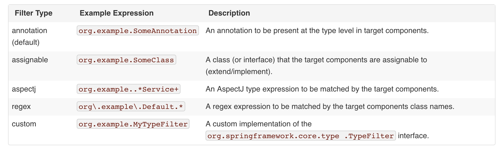

# DI
## 自动化装配
* 组件扫描component scamming
    * 发现context中的bean
* 自动装配autowiring
    * 自动创建这些bean之间的依赖
### 自动扫描创建Bean
* @Component：
    * 声明一个类为组件，并告知spring<font color=#98FB98>创建这个bean</font>
    * 每一个component都有一个id，默认为类名首字母小写
    * <font color=#98FB98>对标@Named</font>
    * 开启@Component,默认关闭
        * Java Config方式
        ```java
        package soundsystem;
        import org.springframework.context.annotation.ComponentScan;
        import org.springframework.context.annotation.Configuration;

        @Configuration
        // 默认为扫描当前包及子包，查找被@component注解的类
        @ComponentScan
        public class CDPlayerConfig { 
        }
        ```
        * Xml方式
        ```xml
        <?xml version="1.0" encoding="UTF-8"?>
        <beans xmlns="http://www.springframework.org/schema/beans"
            xmlns:xsi="http://www.w3.org/2001/XMLSchema-instance"
            xmlns:context="http://www.springframework.org/schema/context"
            xmlns:c="http://www.springframework.org/schema/c"
            xmlns:p="http://www.springframework.org/schema/p"
            xsi:schemaLocation="http://www.springframework.org/schema/beans
                http://www.springframework.org/schema/beans/spring-beans.xsd
		        http://www.springframework.org/schema/context
                http://www.springframework.org/schema/context/spring-context.xsd">

            <context:component-scan base-package="soundsystem" />
        </beans>
        ```
    * 命名component
        * @Component("newName")
* @ComponentScan
    * 指定要扫描的包
    ```java
    @Configuration
    @ComponentScan(basePackages = "org.example")
    public class AppConfig  {
        ...
    }
    ```
    * 指定多个
    ```java
    @Configuration
    @ComponentScan(basePackages = {"org.example1","org.example2"})
    public class AppConfig  {
        ...
    }
    ```
    * 指定扫描包中的类或接口
    ```java
    @Configuration
    @ComponentScan(basePackageClasses={A.class,B.class})
    public class C {
        ...
    }
    ```
    * filter
    
        * The following example shows the configuration ignoring all @Repository annotations and using "stub" repositories instead. 
            ```java
            @Configuration
            @ComponentScan(basePackages = "org.example",
                includeFilters = @Filter(type = FilterType.REGEX, pattern = ".*Stub.*Repository"),
                excludeFilters = @Filter(Repository.class))
            public class AppConfig {
                ...
            }
            ```
            xml如下
            ```xml
            <beans>
                <context:component-scan base-package="org.example">
                    <context:include-filter type="regex"
                            expression=".*Stub.*Repository"/>
                    <context:exclude-filter type="annotation"
                            expression="org.springframework.stereotype.Repository"/>
                </context:component-scan>
            </beans>
            ```
        * 如果添加和排除的是相同，则必须include-filter在前，exclude-filter在后
        * You can also disable the default filters by setting <font color=#98FB98>useDefaultFilters=false</font> on the annotation or providing <font color=#98FB98>use-default-filters="false"</font> as an attribute of the <component-scan/> element. This will in effect disable automatic detection of classes annotated with @Component, @Repository, @Service, @Controller, or @Configuration.

### 自动装配
* @Autowired
    * 自动装配就是让spring自动满足bean依赖的一种方式
    * <font color=#98FB98>对标@Inject</font>
    * @ Autowired可以用在
        * 构造函数
            ```java
            public class MovieRecommender {

            private final CustomerPreferenceDao customerPreferenceDao;

            @Autowired
            public MovieRecommender(CustomerPreferenceDao customerPreferenceDao) {
                this.customerPreferenceDao = customerPreferenceDao;
            }

            // ...
            }
            ```
            * Spring Framework 4.3, the @Autowired constructor is no longer necessary if the target bean only defines one constructor. If several constructors are available, at least one must be annotated to teach the container which one it has to use.

        * setter方法
            ```java
            public class SimpleMovieLister {

                private MovieFinder movieFinder;

                @Autowired
                public void setMovieFinder(MovieFinder movieFinder) {
                    this.movieFinder = movieFinder;
                }
                // ...
            }
            ```

        * 任意方法
            ```java
            public class MovieRecommender {

                private MovieCatalog movieCatalog;

                private CustomerPreferenceDao customerPreferenceDao;

                @Autowired
                public void prepare(MovieCatalog movieCatalog,
                        CustomerPreferenceDao customerPreferenceDao) {
                    this.movieCatalog = movieCatalog;
                    this.customerPreferenceDao = customerPreferenceDao;
                }
                // ...
            }
            ```

        * fields and even mix it with constructors
            ```java
            public class MovieRecommender {

                private final CustomerPreferenceDao customerPreferenceDao;

                @Autowired
                private MovieCatalog movieCatalog;

                @Autowired
                public MovieRecommender(CustomerPreferenceDao customerPreferenceDao) {
                    this.customerPreferenceDao = customerPreferenceDao;
                }
                // ...
            }
            ````
        * It is also possible to provide all beans of a particular type from the ApplicationContext by adding the annotation to a field or method that expects an array of that type:
            ```java
            public class MovieRecommender {

                @Autowired
                private MovieCatalog[] movieCatalogs;
                // ...
            }
            ```
            ```java
            public class MovieRecommender {

                private Set<MovieCatalog> movieCatalogs;

                @Autowired
                public void setMovieCatalogs(Set<MovieCatalog> movieCatalogs) {
                    this.movieCatalogs = movieCatalogs;
                }
                // ...
            }
            ```
            * Your beans can implement the org.springframework.core.Ordered interface or either use the @Order or standard @Priority annotation if you want items in the array or list to be sorted into a specific order.
        * map,key需要是string
            ```java
            public class MovieRecommender {

                private Map<String, MovieCatalog> movieCatalogs;

                @Autowired
                public void setMovieCatalogs(Map<String, MovieCatalog> movieCatalogs) {
                    this.movieCatalogs = movieCatalogs;
                }
                // ...
            }
            ```
        * You can also use @Autowired for interfaces that are well-known resolvable dependencies: BeanFactory, ApplicationContext, Environment, ResourceLoader, ApplicationEventPublisher, and MessageSource. These interfaces and their extended interfaces, such as ConfigurableApplicationContext or ResourcePatternResolver, are automatically resolved, with no special setup necessary.
            ```java
            public class MovieRecommender {

                @Autowired
                private ApplicationContext context;

                public MovieRecommender() {
                }
                // ...
            }
            ```
    * 如果在context中没有找到匹配的bean,会抛出异常,通过将属性required置为false,可以避免异常
        ```java
        public class SimpleMovieLister {

            private MovieFinder movieFinder;

            @Autowired(required=false)
            public void setMovieFinder(MovieFinder movieFinder) {
                this.movieFinder = movieFinder;
            }
            // ...
        }
        ```
    


### 测试
CD 接口
```java
package soundsystem;

public interface CompactDisc {
  void play();
}
``` 
MediaPlayer接口
```java
package soundsystem;

public interface MediaPlayer {
  void play();
}
```

component
```java
package soundsystem;
import org.springframework.stereotype.Component;

@Component
public class SgtPeppers implements CompactDisc {

  private String title = "Sgt. Pepper's Lonely Hearts Club Band";  
  private String artist = "The Beatles";
  
  public void play() {
    System.out.println("Playing " + title + " by " + artist);
  }
  
}
```
component autowired bean
```java
package soundsystem;
import org.springframework.beans.factory.annotation.Autowired;
import org.springframework.stereotype.Component;

@Component
public class CDPlayer implements MediaPlayer {
  private CompactDisc cd;

  @Autowired
  public CDPlayer(CompactDisc cd) {
    this.cd = cd;
  }

  public void play() {
    cd.play();
  }

}
```
Annotation配置文件
```java

package soundsystem;
import org.springframework.context.annotation.ComponentScan;
import org.springframework.context.annotation.Configuration;

// 表明这是一个配置类
@Configuration
// 扫描
@ComponentScan
public class CDPlayerConfig { 
}
```
xml配置文件
/resources/META-INF.spring/soundsystem.xml
```xml
<?xml version="1.0" encoding="UTF-8"?>
<beans xmlns="http://www.springframework.org/schema/beans"
  xmlns:xsi="http://www.w3.org/2001/XMLSchema-instance"
  xmlns:context="http://www.springframework.org/schema/context"
  xmlns:c="http://www.springframework.org/schema/c"
  xmlns:p="http://www.springframework.org/schema/p"
  xsi:schemaLocation="http://www.springframework.org/schema/beans http://www.springframework.org/schema/beans/spring-beans.xsd
		http://www.springframework.org/schema/context http://www.springframework.org/schema/context/spring-context.xsd">

  <context:component-scan base-package="soundsystem" />

</beans>
```
Test
```java
package soundsystem;

import static org.junit.Assert.*;

import org.junit.Rule;
import org.junit.Test;
import org.junit.contrib.java.lang.system.StandardOutputStreamLog;
import org.junit.runner.RunWith;
import org.springframework.beans.factory.annotation.Autowired;
import org.springframework.test.context.ContextConfiguration;
import org.springframework.test.context.junit4.SpringJUnit4ClassRunner;

// 测试开始时，自动创建spring应用上下文
@RunWith(SpringJUnit4ClassRunner.class)
// 指定配置文件
@ContextConfiguration(classes=CDPlayerConfig.class)
public class CDPlayerTest {

  @Rule
  public final StandardOutputStreamLog log = new StandardOutputStreamLog();

  @Autowired
  private MediaPlayer player;
  
  @Autowired
  private CompactDisc cd;
  
  @Test
  public void cdShouldNotBeNull() {
    assertNotNull(cd);
  }

  @Test
  public void play() {
    player.play();
    assertEquals(
        "Playing Sgt. Pepper's Lonely Hearts Club Band by The Beatles\n", 
        log.getLog());
  }

}
```
```java
package soundsystem;

import static org.junit.Assert.*;

import org.junit.Rule;
import org.junit.Test;
import org.junit.contrib.java.lang.system.StandardOutputStreamLog;
import org.junit.runner.RunWith;
import org.springframework.beans.factory.annotation.Autowired;
import org.springframework.test.context.ContextConfiguration;
import org.springframework.test.context.junit4.SpringJUnit4ClassRunner;

@RunWith(SpringJUnit4ClassRunner.class)
@ContextConfiguration(locations="classpath:META-INF/spring/soundsystem.xml")
public class CDPlayerXMLConfigTest {

  @Rule
  public final StandardOutputStreamLog log = new StandardOutputStreamLog();

  @Autowired
  private MediaPlayer player;

  @Autowired
  private CompactDisc cd;

  @Test
  public void cdShouldNotBeNull() {
    assertNotNull(cd);
  }
  
  @Test
  public void play() {
    player.play();
    assertEquals(
        "Playing Sgt. Pepper's Lonely Hearts Club Band by The Beatles\n", 
        log.getLog());
  }

}
```
## 通过Java代码装配bean
当要使用第三方组件时，没有办法对其中的类添加@Component，此时需要使用java或xml装配
### 声明bean
* @Bean
    * 类似于\<bean\/\>
    * 支出\<bean\/\>的属性，如init-method,destory-method,autowiring,name
    * @Bean可以用在由@Configuration或@Component注解的Class中
    * 是方法级别的注解
    * bean的名字默认为注解的方法名
    * 用法
        ```java
        @Configuration
        public class AppConfig {

            @Bean
            public TransferService transferService() {
                return new TransferServiceImpl();
            }

        }
        ```
        等同于
        ```xml
        <beans>
            <bean id="transferService" class="com.acme.TransferServiceImpl"/>
        </beans>
        ```
        这两种方式，都会使得Context中注册了一个名为transferService的bean，该bean的类型为com.acme.TransferServiceImpl

### 测试
CD接口
```java
package soundsystem;

public interface CompactDisc {

  void play();

}
```
MediaPlayer接口
```java
package soundsystem;

public interface MediaPlayer {

  void play();

}
```
Bean
```java
package soundsystem;


public class SgtPeppers implements CompactDisc {

  private String title = "Sgt. Pepper's Lonely Hearts Club Band";  
  private String artist = "The Beatles";
  
  public void play() {
    System.out.println("Playing " + title + " by " + artist);
  }

}
```
Bean 
```java
package soundsystem;
import org.springframework.beans.factory.annotation.Autowired;

public class CDPlayer implements MediaPlayer {
  private CompactDisc cd;

  @Autowired
  public CDPlayer(CompactDisc cd) {
    this.cd = cd;
  }

  public void play() {
    cd.play();
  }

}
```
使用java声明bean
```java
package soundsystem;
import org.springframework.context.annotation.Bean;
import org.springframework.context.annotation.Configuration;

@Configuration
public class CDPlayerConfig {
  
  @Bean
  public CompactDisc compactDisc() {
    return new SgtPeppers();
  }
  
  @Bean
  public CDPlayer cdPlayer(CompactDisc compactDisc) {
    return new CDPlayer(compactDisc);
  }

}
```
## 通过xml装配bean
* Difference between using bean id and name in Spring configuration file
    https://stackoverflow.com/questions/874505/difference-between-using-bean-id-and-name-in-spring-configuration-file
### 声明bean
* 声明bean模板
    ```xml
    <?xml version="1.0" encoding="UTF-8"?>
    <beans xmlns="http://www.springframework.org/schema/beans"
        xmlns:xsi="http://www.w3.org/2001/XMLSchema-instance"
        xsi:schemaLocation="http://www.springframework.org/schema/beans
            http://www.springframework.org/schema/beans/spring-beans.xsd">

        <bean id="..." class="...">
            <!-- collaborators and configuration for this bean go here -->
        </bean>

        <bean id="..." class="...">
            <!-- collaborators and configuration for this bean go here -->
        </bean>

        <!-- more bean definitions go here -->

    </beans>
    ```
* 推荐配置多个xml文件，每个文件代表一个module
* load bean definitions from another file or files
    ```xml
    <beans>
        <import resource="services.xml"/>
        <import resource="resources/messageSource.xml"/>
        <import resource="/resources/themeSource.xml"/>

        <bean id="bean1" class="..."/>
        <bean id="bean2" class="..."/>
    </beans>
    ```

### DI 
#### Constructor-based dependency injection
* 两种注入方案
    * \<constructor-arg\>
    * c-命名空间（spring3.0引入）
        * c:paramName-ref="beanid"
            * c:构造函数参数名-ref="要注入的bean id"
        * c:_index-ref="beanid"
            * c:构造函数参数位置从0开始-ref="要注入的bean id"

* 注入bean引用
    * \<constructor-arg\>
        ```java
        package x.y;

        public class Foo {

            public Foo(Bar bar, Baz baz) {
                // ...
            }

        }
        ```
        ```xml
        <beans>
            <bean id="foo" class="x.y.Foo">
                <constructor-arg ref="bar"/>
                <constructor-arg ref="baz"/>
            </bean>

            <bean id="bar" class="x.y.Bar"/>

            <bean id="baz" class="x.y.Baz"/>
        </beans>
        ```
    * c-命名空间
        ```java
        package x.y;

        public class Foo {

            public Foo(Bar bar, Baz baz) {
                // ...
            }

        }
        ```
        ```xml
        <beans xmlns="http://www.springframework.org/schema/beans"
            xmlns:xsi="http://www.w3.org/2001/XMLSchema-instance"
            xmlns:c="http://www.springframework.org/schema/c"
            xsi:schemaLocation="http://www.springframework.org/schema/beans
                http://www.springframework.org/schema/beans/spring-beans.xsd">

            <bean id="bar" class="x.y.Bar"/>
            <bean id="baz" class="x.y.Baz"/>

            <!-- c-namespace declaration -->
            <bean id="foo" class="x.y.Foo" c:bar-ref="bar" c:baz-ref="baz" c:email="foo@bar.com"/>

        </beans>
        ```
        或者
        ```xml
        <beans xmlns="http://www.springframework.org/schema/beans"
            xmlns:xsi="http://www.w3.org/2001/XMLSchema-instance"
            xmlns:c="http://www.springframework.org/schema/c"
            xsi:schemaLocation="http://www.springframework.org/schema/beans
                http://www.springframework.org/schema/beans/spring-beans.xsd">

            <bean id="bar" class="x.y.Bar"/>
            <bean id="baz" class="x.y.Baz"/>

            <!-- c-namespace declaration -->
            <bean id="foo" class="x.y.Foo" c:_0-ref="bar" c:_1-ref="baz" c:email="foo@bar.com"/>

        </beans>
        ```
* 注入字面量
    * \<constructor-arg\>
        ```java
        package examples;

        public class ExampleBean {

            // Number of years to calculate the Ultimate Answer
            private int years;

            // The Answer to Life, the Universe, and Everything
            private String ultimateAnswer;

            public ExampleBean(int years, String ultimateAnswer) {
                this.years = years;
                this.ultimateAnswer = ultimateAnswer;
            }

        }
        ```
        * 通过类型指定属性值
            ```xml
            <bean id="exampleBean" class="examples.ExampleBean">
                <constructor-arg type="int" value="7500000"/>
                <constructor-arg type="java.lang.String" value="42"/>
            </bean>
            ```
        * 通过参数位置指定属性值
            ```xml
            <bean id="exampleBean" class="examples.ExampleBean">
                <constructor-arg index="0" value="7500000"/>
                <constructor-arg index="1" value="42"/>
            </bean>
            ```
        * 通过参数名指定属性值
            ```xml
            <bean id="exampleBean" class="examples.ExampleBean">
                <constructor-arg name="years" value="7500000"/>
                <constructor-arg name="ultimateAnswer" value="42"/>
            </bean>
            ```
        * 使用@ConstructorProperties JDK annotation显示注解构造函数参数
            * Keep in mind that to make this work out of the box your code must be compiled with the debug flag enabled so that Spring can look up the parameter name from the constructor. If you can’t compile your code with debug flag (or don’t want to) you can use @ConstructorProperties JDK annotation to explicitly name your constructor arguments. 
            * 
                ```java
                package examples;

                public class ExampleBean {

                    // Fields omitted

                    @ConstructorProperties({"years", "ultimateAnswer"})
                    public ExampleBean(int years, String ultimateAnswer) {
                        this.years = years;
                        this.ultimateAnswer = ultimateAnswer;
                    }

                }
                ```
    * c-命名空间
        ```java
        package examples;

        public class ExampleBean {

            // Number of years to calculate the Ultimate Answer
            private int years;

            // The Answer to Life, the Universe, and Everything
            private String ultimateAnswer;

            public ExampleBean(int years, String ultimateAnswer) {
                this.years = years;
                this.ultimateAnswer = ultimateAnswer;
            }

        }
        ```
        * 通过参数位置指定属性值
            ```xml
            <bean id="exampleBean" class="examples.ExampleBean" 
                c:_0="750000"
                c:_1="42" />
            ```
        * 通过参数名指定属性值
            ```xml
            <bean id="exampleBean" class="examples.ExampleBean"
                c:_years="750000"
                c:_ultimateAnswer="42" />
            ```
* 注入集合
    * 只能使用\<constructor-arg\>
    * 集合
        ```java
        public class BlankDisc implements CompactDisc {
            private String title;
            private String artist;
            private List<String> tracks;

            public BlankDisc(String title, String artist, List<String> tracks) {
                this.title = title;
                this.artist = artist;
                this.tracks = tracks;
            }

            public void play() {
                System.out.println("Playing " + title + " by " + artist);
                for (String track : tracks) {
                System.out.println("-Track: " + track);
                }
            }

        }
        ```
        ```xml
        <?xml version="1.0" encoding="UTF-8"?>
            <beans xmlns="http://www.springframework.org/schema/beans"
            xmlns:xsi="http://www.w3.org/2001/XMLSchema-instance"
            xsi:schemaLocation="http://www.springframework.org/schema/beans http://www.springframework.org/schema/beans/spring-beans.xsd">

            <bean id="compactDisc" class="soundsystem.collections.BlankDisc">
                <constructor-arg value="Sgt. Pepper's Lonely Hearts Club Band" />
                <constructor-arg value="The Beatles" />
                <constructor-arg>
                <list>
                    <value>Sgt. Pepper's Lonely Hearts Club Band</value>
                    <value>With a Little Help from My Friends</value>
                    <value>Lucy in the Sky with Diamonds</value>
                    <value>Getting Better</value>
                    <value>Fixing a Hole</value>
                    <value>She's Leaving Home</value>
                    <value>Being for the Benefit of Mr. Kite!</value>
                    <value>Within You Without You</value>
                    <value>When I'm Sixty-Four</value>
                    <value>Lovely Rita</value>
                    <value>Good Morning Good Morning</value>
                    <value>Sgt. Pepper's Lonely Hearts Club Band (Reprise)</value>
                    <value>A Day in the Life</value>
                </list>
                </constructor-arg>
            </bean>
        </beans>
        ```
        * 如果list中是引用对象，则用ref替换value即可
        * 集合是set，把list替换为set即可
#### Setter-based dependency injection
* 两种注入方案
    * \<property\>
    * p-命名空间（spring3.0引入）
        * p:propertyName-ref="beanid"
            * p:属性名-ref="要注入的bean id"
* 注入bean引用
    * \<property\>
        ```java
        public class ExampleBean {

            private AnotherBean beanOne;
            private YetAnotherBean beanTwo;
            private int i;

            public void setBeanOne(AnotherBean beanOne) {
                this.beanOne = beanOne;
            }

            public void setBeanTwo(YetAnotherBean beanTwo) {
                this.beanTwo = beanTwo;
            }

            public void setIntegerProperty(int i) {
                this.i = i;
            }

        }
        ```
        ```xml
        <bean id="exampleBean" class="examples.ExampleBean">
            <!-- setter injection using the nested ref element -->
            <property name="beanOne">
                <ref bean="anotherExampleBean"/>
            </property>

            <!-- setter injection using the neater ref attribute -->
            <property name="beanTwo" ref="yetAnotherBean"/>
            <property name="integerProperty" value="1"/>
        </bean>

        <bean id="anotherExampleBean" class="examples.AnotherBean"/>
        <bean id="yetAnotherBean" class="examples.YetAnotherBean"/>
        ```
    * p-命名空间
        ```java
        public class ExampleBean {

            private AnotherBean beanOne;
            private YetAnotherBean beanTwo;
            private int i;

            public void setBeanOne(AnotherBean beanOne) {
                this.beanOne = beanOne;
            }

            public void setBeanTwo(YetAnotherBean beanTwo) {
                this.beanTwo = beanTwo;
            }

            public void setIntegerProperty(int i) {
                this.i = i;
            }

        }
        ```
        ```xml
        <beans xmlns="http://www.springframework.org/schema/beans"
            xmlns:xsi="http://www.w3.org/2001/XMLSchema-instance"
            xmlns:p="http://www.springframework.org/schema/p"
            xsi:schemaLocation="http://www.springframework.org/schema/beans
                http://www.springframework.org/schema/beans/spring-beans.xsd">

            <bean id="exampleBean" class="examples.ExampleBean"
                p:beanOne-ref="anotherExampleBean"
                P:beanTwo-ref="yetAnotherBean"
                p:integerProperty="1"/>

            <bean id="anotherExampleBean" class="examples.AnotherBean"/>
            <bean id="yetAnotherBean" class="examples.YetAnotherBean"/>

        </beans>
        ```
* 注入字面量
    ```java
    package soundsystem.collections;

    import java.util.List;
    import soundsystem.CompactDisc;

    public class BlankDisc implements CompactDisc {

        private String title;
        private String artist;
        private List<String> tracks;

        public BlankDisc(String title, String artist, List<String> tracks) {
            this.title = title;
            this.artist = artist;
            this.tracks = tracks;
        }

        public void play() {
            System.out.println("Playing " + title + " by " + artist);
            for (String track : tracks) {
            System.out.println("-Track: " + track);
            }
        }

    }
    ```
    ```xml
    <?xml version="1.0" encoding="UTF-8"?>
    <beans xmlns="http://www.springframework.org/schema/beans"
    xmlns:xsi="http://www.w3.org/2001/XMLSchema-instance"
    xmlns:p="http://www.springframework.org/schema/p"
    xsi:schemaLocation="http://www.springframework.org/schema/beans http://www.springframework.org/schema/beans/spring-beans.xsd">

    <bean id="compactDisc"
            class="soundsystem.properties.BlankDisc"
            p:title="Sgt. Pepper's Lonely Hearts Club Band"
            p:artist="The Beatles">
        <property name="tracks">
        <list>
            <value>Sgt. Pepper's Lonely Hearts Club Band</value>
            <value>With a Little Help from My Friends</value>
            <value>Lucy in the Sky with Diamonds</value>
            <value>Getting Better</value>
            <value>Fixing a Hole</value>
            <value>She's Leaving Home</value>
            <value>Being for the Benefit of Mr. Kite!</value>
            <value>Within You Without You</value>
            <value>When I'm Sixty-Four</value>
            <value>Lovely Rita</value>
            <value>Good Morning Good Morning</value>
            <value>Sgt. Pepper's Lonely Hearts Club Band (Reprise)</value>
            <value>A Day in the Life</value>
        </list>
        </property>
    </bean>
            
    <bean id="cdPlayer"
            class="soundsystem.properties.CDPlayer"
            p:compactDisc-ref="compactDisc" />

    </beans>
    ```
* 集合
    ```xml
    <bean id="moreComplexObject" class="example.ComplexObject">
        <!-- results in a setAdminEmails(java.util.Properties) call -->
        <property name="adminEmails">
            <props>
                <prop key="administrator">administrator@example.org</prop>
                <prop key="support">support@example.org</prop>
                <prop key="development">development@example.org</prop>
            </props>
        </property>
        <!-- results in a setSomeList(java.util.List) call -->
        <property name="someList">
            <list>
                <value>a list element followed by a reference</value>
                <ref bean="myDataSource" />
            </list>
        </property>
        <!-- results in a setSomeMap(java.util.Map) call -->
        <property name="someMap">
            <map>
                <entry key="an entry" value="just some string"/>
                <entry key ="a ref" value-ref="myDataSource"/>
            </map>
        </property>
        <!-- results in a setSomeSet(java.util.Set) call -->
        <property name="someSet">
            <set>
                <value>just some string</value>
                <ref bean="myDataSource" />
            </set>
        </property>
    </bean>
    ```    
#### idref element
* 作用
    * 1）方便xml检查 
    * 2）它和\<value\>差不多，那么差在哪里呢？\<value\>用来给property或者constructor-arg一个String类型的值，而idref虽然也是给他们一个String类型的值，但这个值必须是容器中存在的bean的id.
    ```xml
    <bean id="theTargetBean" class="..."/>

    <bean id="theClientBean" class="...">
        <property name="targetName">
            <idref bean="theTargetBean"/>
        </property>
    </bean>
    ```
    以上代码功能类似于
    ```xml
    <bean id="theTargetBean" class="..." />

    <bean id="client" class="...">
        <property name="targetName" value="theTargetBean"/>
    </bean>
    ```
* idref虽然看起来和ref有点像但是二者并没有关系
    
* 官方推荐用法
    * A common place (at least in versions earlier than Spring 2.0) where the <idref/> element brings value is in the configuration of AOP interceptors in a ProxyFactoryBean bean definition. Using <idref/> elements when you specify the interceptor names prevents you from misspelling an interceptor id.


#### ref
* 同样在\<constructor-arg\/\>或者\<property\/\>元素内部也可以使用ref元素。用来将bean中指定属性的值设置为对容器中的另外一个bean的引用
* attribute 
    * bean
    * local 
        * 4.0后被取消，可替换为bean
    * parent
        * creates a reference to a bean that is in a parent container of the current container.
            ```xml
            <!-- in the parent context -->
            <bean id="accountService" class="com.foo.SimpleAccountService">
                <!-- insert dependencies as required as here -->
            </bean>
            ```
            ```xml
            <!-- in the child (descendant) context -->
            <bean id="accountService" <!-- bean name is the same as the parent bean -->
                class="org.springframework.aop.framework.ProxyFactoryBean">
                <property name="target">
                    <ref parent="accountService"/> <!-- notice how we refer to the parent bean -->
                </property>
                <!-- insert other configuration and dependencies as required here -->
            </bean>
            ```

#### Inner beans
* inner bean不需要id，name。始终是匿名的（即就算指定了id,name也会被忽略）。只有外部bean才能创建它，访问它。可以自定义scope，但是大多数情况下都与外部bean使用相同的scope.
    ```xml
    <bean id="outer" class="...">
        <!-- instead of using a reference to a target bean, simply define the target bean inline -->
        <property name="target">
            <bean class="com.example.Person"> <!-- this is the inner bean -->
                <property name="name" value="Fiona Apple"/>
                <property name="age" value="25"/>
            </bean>
        </property>
    </bean>
    ```

#### collection merging
```xml
<beans>
    <bean id="parent" abstract="true" class="example.ComplexObject">
        <property name="adminEmails">
            <props>
                <prop key="administrator">administrator@example.com</prop>
                <prop key="support">support@example.com</prop>
            </props>
        </property>
    </bean>
    <bean id="child" parent="parent">
        <property name="adminEmails">
            <!-- the merge is specified on the child collection definition -->
            <props merge="true">
                <prop key="sales">sales@example.com</prop>
                <prop key="support">support@example.co.uk</prop>
            </props>
        </property>
    </bean>
<beans>
```
结果为
```
administrator=administrator@example.com
sales=sales@example.com
support=support@example.co.uk
```
#### null
```xml
<bean class="ExampleBean">
    <property name="email">
        <null/>
    </property>
</bean>
````
#### empty string
```xml
<bean class="ExampleBean">
    <property name="email" value=""/>
</bean>
```
#### Compound property names
* foo有一个属性fred,fred有一个属性bob，bob有一个属性sammy，它的value是123
    ```xml
    <bean id="foo" class="foo.Bar">
        <property name="fred.bob.sammy" value="123" />
    </bean>
    ```
* 要注意fred bob sammy 不能为null,否则报错NPE
#### depends-on
* 通常一个bean依赖于另一个bean，是因为它作为这个bean的属性，spring通过ref 完成依赖配置。
* 然而有些情况，这种依赖关系并不直接，例如database driver registration
* depends-on 可以force其依赖的Bean在其初始化前被初始化
    ```xml
    <bean id="beanOne" class="ExampleBean" depends-on="manager"/>
    <bean id="manager" class="ManagerBean" />
    ```
    ```xml
    <bean id="beanOne" class="ExampleBean" depends-on="manager,accountDao">
        <property name="manager" ref="manager" />
    </bean>

    <bean id="manager" class="ManagerBean" />
    <bean id="accountDao" class="x.y.jdbc.JdbcAccountDao" />
    ```
#### util命名空间

# todo
## 混合装配bean
### 在JavaConfig中引用XML配置
通过JavaConfig配置bean
```java
package soundsystem;
import org.springframework.context.annotation.Bean;
import org.springframework.context.annotation.Configuration;

@Configuration
public class CDPlayerConfig {
  
  @Bean
  public CDPlayer cdPlayer(CompactDisc compactDisc) {
    return new CDPlayer(compactDisc);
  }

}
```
通过JavaConfig配置bean
```java
package soundsystem;

import org.springframework.context.annotation.Bean;
import org.springframework.context.annotation.Configuration;

@Configuration
public class CDConfig {
  @Bean
  public CompactDisc compactDisc() {
    return new SgtPeppers();
  }
}
```
通过xml配置bean
```xml
<?xml version="1.0" encoding="UTF-8"?>
<beans xmlns="http://www.springframework.org/schema/beans"
  xmlns:xsi="http://www.w3.org/2001/XMLSchema-instance"
  xmlns:c="http://www.springframework.org/schema/c"
  xsi:schemaLocation="http://www.springframework.org/schema/beans http://www.springframework.org/schema/beans/spring-beans.xsd">

  <bean id="compactDisc"
        class="soundsystem.BlankDisc"
        c:_0="Sgt. Pepper's Lonely Hearts Club Band"
        c:_1="The Beatles">
    <constructor-arg>
      <list>
        <value>Sgt. Pepper's Lonely Hearts Club Band</value>
        <value>With a Little Help from My Friends</value>
        <value>Lucy in the Sky with Diamonds</value>
        <value>Getting Better</value>
        <value>Fixing a Hole</value>
        <!-- ...other tracks omitted for brevity... -->
      </list>
    </constructor-arg>
  </bean>

</beans>
```
将所有配置混合在一起
```java
package soundsystem;

import org.springframework.context.annotation.Configuration;
import org.springframework.context.annotation.Import;
import org.springframework.context.annotation.ImportResource;

@Configuration
@Import(CDPlayerConfig.class,CDConfig.class)
@ImportResource("classpath:cd-config.xml")
public class SoundSystemConfig {

}
```
### 在XML配置中引用JavaConfig
通过JavaConfig配置bean
```java
package soundsystem;

import org.springframework.context.annotation.Bean;
import org.springframework.context.annotation.Configuration;

@Configuration
public class CDConfig {
  @Bean
  public CompactDisc compactDisc() {
    return new SgtPeppers();
  }
}
```
通过xml配置bean
```xml
<?xml version="1.0" encoding="UTF-8"?>
<beans xmlns="http://www.springframework.org/schema/beans"
  xmlns:xsi="http://www.w3.org/2001/XMLSchema-instance"
  xmlns:c="http://www.springframework.org/schema/c"
  xsi:schemaLocation="http://www.springframework.org/schema/beans http://www.springframework.org/schema/beans/spring-beans.xsd">

  <bean class="soundsystem.CDConfig" />

  <bean id="cdPlayer"
        class="soundsystem.CDPlayer"
        c:cd-ref="compactDisc" />
        
</beans>
``` 
将所有配置混合在一起
```xml
<?xml version="1.0" encoding="UTF-8"?>
<beans xmlns="http://www.springframework.org/schema/beans"
  xmlns:xsi="http://www.w3.org/2001/XMLSchema-instance"
  xmlns:c="http://www.springframework.org/schema/c"
  xsi:schemaLocation="http://www.springframework.org/schema/beans http://www.springframework.org/schema/beans/spring-beans.xsd">

  <import resource="cdplayer-config.xml>
  <bean class="soundsystem.CDConfig" />        
</beans>
```