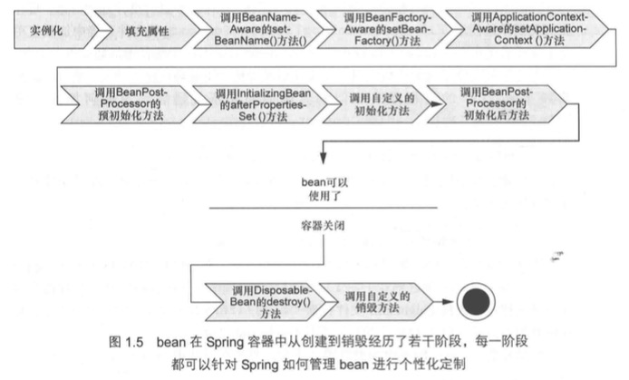

# spring IOC container
## overview

* 管理应用组件，负责实例化，配置和装配bean。
* basic for spring ioc container
    * 接口org.springframework.beans.factory.beanFactory
        * 提供管理bean的基础能力
    * 接口org.springframework.context.ApplicationContext
        * 继承beanFactory，对其进行扩展，包括整合AOP特性，消息处理，事件发布，以及应用级别的context，例如用于webapp的WebApplicationContext
* 对于大多数的应用场景，无需显示的实例化ApplicationContext，比如在springmvc中，只需在配置文件中配置即可。


```

```


### 最常用的ApplicationContext
* AnnotationConfigApplicationContext
* AnnotationConfigWebApplicationContext
* ClassPathXmlApplicationContext
* FileSystemXmlapplicationContext
* XmlWebApplicationContext
## configuration metadata
* 用于告知Spring容器如何实例化，配置和装配应用程序中的对象。
* 有如下三种方式
    * XML-based metadata
    * Annotation-based configuration
        * http://docs.spring.io/spring/docs/current/spring-framework-reference/htmlsingle/#beans-annotation-config
    * Java-based configuration
        * http://docs.spring.io/spring/docs/current/spring-framework-reference/htmlsingle/#beans-java

## Using the container
* services.xml
    ```xml
    <?xml version="1.0" encoding="UTF-8"?>
    <beans xmlns="http://www.springframework.org/schema/beans"
        xmlns:xsi="http://www.w3.org/2001/XMLSchema-instance"
        xsi:schemaLocation="http://www.springframework.org/schema/beans
            http://www.springframework.org/schema/beans/spring-beans.xsd">

        <!-- services -->

        <bean id="petStore" class="org.springframework.samples.jpetstore.services.PetStoreServiceImpl">
            <property name="accountDao" ref="accountDao"/>
            <property name="itemDao" ref="itemDao"/>
            <!-- additional collaborators and configuration for this bean go here -->
        </bean>

        <!-- more bean definitions for services go here -->

    </beans>
    ```
* daos.xml
    ```xml
    <?xml version="1.0" encoding="UTF-8"?>
    <beans xmlns="http://www.springframework.org/schema/beans"
        xmlns:xsi="http://www.w3.org/2001/XMLSchema-instance"
        xsi:schemaLocation="http://www.springframework.org/schema/beans
            http://www.springframework.org/schema/beans/spring-beans.xsd">

        <bean id="accountDao"
            class="org.springframework.samples.jpetstore.dao.jpa.JpaAccountDao">
            <!-- additional collaborators and configuration for this bean go here -->
        </bean>

        <bean id="itemDao" class="org.springframework.samples.jpetstore.dao.jpa.JpaItemDao">
            <!-- additional collaborators and configuration for this bean go here -->
        </bean>

        <!-- more bean definitions for data access objects go here -->

    </beans>
    ```
### ClassPathXmlApplicationContext
```java
// create and configure beans
ApplicationContext context = new ClassPathXmlApplicationContext("services.xml", "daos.xml");

// retrieve configured instance
PetStoreService service = context.getBean("petStore", PetStoreService.class);

// use configured instance
List<String> userList = service.getUsernameList();
```
### AnnotationConfigApplicationContext
```java
AnnotationConfigApplicationContext context = new AnnotationConfigApplicationContext(DataConfig.class);
```

### GenericGroovyApplicationContext
```java
ApplicationContext context = new GenericGroovyApplicationContext("services.groovy", "daos.groovy");
```
### GenericApplicationContext
```java
GenericApplicationContext context = new GenericApplicationContext();
new XmlBeanDefinitionReader(context).loadBeanDefinitions("services.xml", "daos.xml");
context.refresh();
```
```java
GenericApplicationContext context = new GenericApplicationContext();
new GroovyBeanDefinitionReader(context).loadBeanDefinitions("services.groovy", "daos.groovy");
context.refresh();
```

## bean
### bean生命周期 



