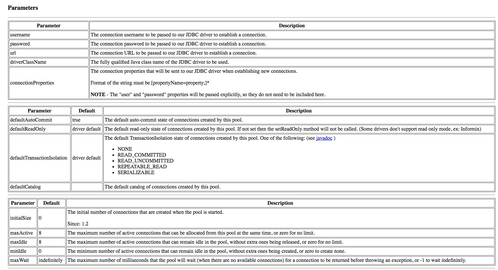
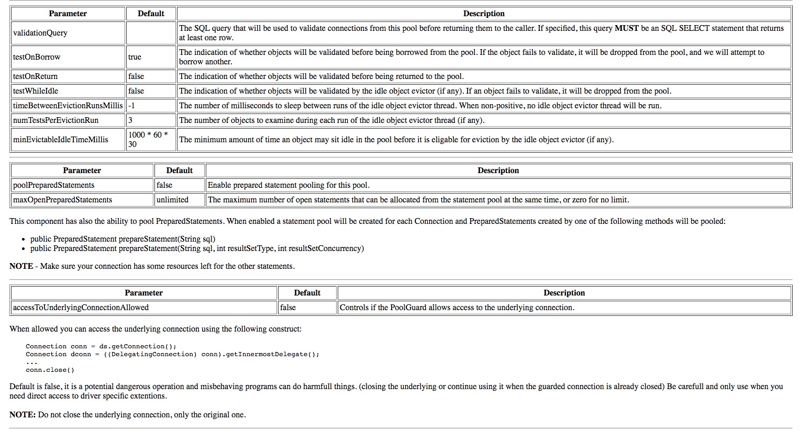
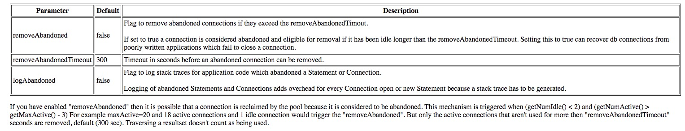

# DataSource
## HikariCP (活跃)
[HikariCP](https://brettwooldridge.github.io/HikariCP/)

[Config](https://github.com/brettwooldridge/HikariCP#initialization)

Config
```java
package org.zxy.config;

import com.zaxxer.hikari.HikariConfig;
import com.zaxxer.hikari.HikariDataSource;
import org.springframework.context.annotation.Bean;
import org.springframework.context.annotation.ComponentScan;
import org.springframework.context.annotation.Configuration;
import org.springframework.jdbc.core.JdbcOperations;
import org.springframework.jdbc.core.JdbcTemplate;
import org.springframework.jdbc.datasource.DriverManagerDataSource;

import javax.sql.DataSource;


@Configuration
@ComponentScan(basePackages = "org.zxy")
public class DataConfig {


    @Bean
    public DataSource dataSource() {

        /*DriverManagerDataSource ds = new DriverManagerDataSource();
        ds.setDriverClassName("com.mysql.jdbc.Driver");
        ds.setUrl("jdbc:mysql://localhost/test");
        ds.setUsername("root");
        ds.setPassword("19900221");
        return ds;*/
        HikariConfig hikariConfig = new HikariConfig();
        hikariConfig.setDriverClassName("com.mysql.jdbc.Driver");
        hikariConfig.setJdbcUrl("jdbc:mysql://localhost:3306/test");
        hikariConfig.setUsername("root");
        hikariConfig.setPassword("19900221");

        hikariConfig.setMaximumPoolSize(5);
        hikariConfig.setConnectionTestQuery("SELECT 1");
        hikariConfig.setPoolName("springHikariCP");

        hikariConfig.addDataSourceProperty("dataSource.cachePrepStmts", "true");
        hikariConfig.addDataSourceProperty("dataSource.prepStmtCacheSize", "250");
        hikariConfig.addDataSourceProperty("dataSource.prepStmtCacheSqlLimit", "2048");
        hikariConfig.addDataSourceProperty("dataSource.useServerPrepStmts", "true");

        HikariDataSource dataSource = new HikariDataSource(hikariConfig);

        return dataSource;

    }

    @Bean
    public JdbcOperations jdbcTemplate(DataSource dataSource) {
        return new JdbcTemplate(dataSource);
    }
}
```
## tomcat-JDBC Connection Pool
The JDBC Connection Pool org.apache.tomcat.jdbc.pool is a replacement or an alternative to the Apache Commons DBCP connection pool.

[tomcat-jdbc](https://tomcat.apache.org/tomcat-7.0-doc/jdbc-pool.html#Configuring_JDBC_interceptors)
```java
PoolProperties p = new PoolProperties();
p.setUrl("jdbc:mysql://localhost:3306/mysql");
p.setDriverClassName("com.mysql.jdbc.Driver");
p.setUsername("root");
p.setPassword("password");
p.setJmxEnabled(true);
p.setTestWhileIdle(false);
p.setTestOnBorrow(true);
p.setValidationQuery("SELECT 1");
p.setTestOnReturn(false);
p.setValidationInterval(30000);
p.setTimeBetweenEvictionRunsMillis(30000);
p.setMaxActive(100);
p.setInitialSize(10);
p.setMaxWait(10000);
p.setRemoveAbandonedTimeout(60);
p.setMinEvictableIdleTimeMillis(30000);
p.setMinIdle(10);
p.setLogAbandoned(true);
p.setRemoveAbandoned(true);
p.setJdbcInterceptors(
"org.apache.tomcat.jdbc.pool.interceptor.ConnectionState;"+
"org.apache.tomcat.jdbc.pool.interceptor.StatementFinalizer");
DataSource datasource = new DataSource();
datasource.setPoolProperties(p);
```

## vibur
[vibur](http://www.vibur.org/)

[Gitbuh](https://github.com/vibur/vibur-dbcp)

## BoneCP（很久不更新了）
[BoneCP](http://www.jolbox.com/)

[Github](https://github.com/wwadge/bonecp)


## provided by spring(开发环境使用，不适用于生产环境)
### DriverManagerDataSource
在每个连接请求时返回一个新建的连接，没有池管理
> Only use the DriverManagerDataSource class should only be used for testing purposes since it does not provide pooling and will perform poorly when multiple requests for a connection are made.
### SimpleDriverDataSource
直接使用JDBC驱动，解决特定环境下的类加载问题，如OSGI
### SingleConnectionDataSource
在每个连接请求时返回同一个连接，可以将它看做只有一个连接的池
### config
java code
```java
DriverManagerDataSource dataSource = new DriverManagerDataSource();
dataSource.setDriverClassName("org.hsqldb.jdbcDriver");
dataSource.setUrl("jdbc:hsqldb:hsql://localhost:");
dataSource.setUsername("sa");
dataSource.setPassword("");
```
Here is the corresponding XML configuration:
```xml
<bean id="dataSource" class="org.springframework.jdbc.datasource.DriverManagerDataSource">
    <property name="driverClassName" value="${jdbc.driverClassName}"/>
    <property name="url" value="${jdbc.url}"/>
    <property name="username" value="${jdbc.username}"/>
    <property name="password" value="${jdbc.password}"/>
</bean>

<context:property-placeholder location="jdbc.properties"/>
```
## DBCP（已经很久不更新了）
[DBCP](https://commons.apache.org/proper/commons-dbcp/)
```xml
<bean id="dataSource" class="org.apache.commons.dbcp.BasicDataSource" destroy-method="close">
    <property name="driverClassName" value="${jdbc.driverClassName}"/>
    <property name="url" value="${jdbc.url}"/>
    <property name="username" value="${jdbc.username}"/>
    <property name="password" value="${jdbc.password}"/>
</bean>

<context:property-placeholder location="jdbc.properties"/>
```
[Config](http://people.apache.org/~dirkv/dbcp/configuration.html)





## C3P0（已经很久不更新了）
[C3P0](http://www.mchange.com/projects/c3p0/)
```xml
<bean id="dataSource" class="com.mchange.v2.c3p0.ComboPooledDataSource" destroy-method="close">
    <property name="driverClass" value="${jdbc.driverClassName}"/>
    <property name="jdbcUrl" value="${jdbc.url}"/>
    <property name="user" value="${jdbc.username}"/>
    <property name="password" value="${jdbc.password}"/>
</bean>

<context:property-placeholder location="jdbc.properties"/>
```
[Config](http://www.mchange.com/projects/c3p0/#configuration)