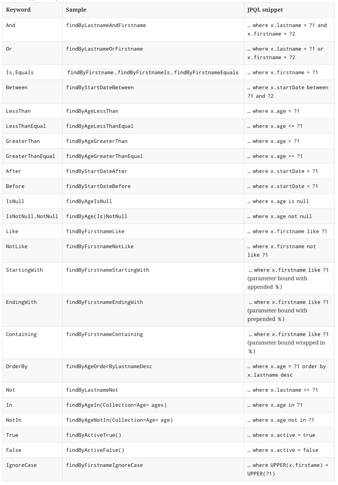

# Core
Spring data jpa提供如下核心接口

Repository
```java
package org.springframework.data.repository;

import java.io.Serializable;

public interface Repository<T, ID extends Serializable> {
}
```
CRUD
```java
//
// Source code recreated from a .class file by IntelliJ IDEA
// (powered by Fernflower decompiler)
//

package org.springframework.data.repository;

import java.io.Serializable;

@NoRepositoryBean
public interface CrudRepository<T, ID extends Serializable> extends Repository<T, ID> {
    <S extends T> S save(S var1);

    <S extends T> Iterable<S> save(Iterable<S> var1);

    T findOne(ID var1);

    boolean exists(ID var1);

    Iterable<T> findAll();

    Iterable<T> findAll(Iterable<ID> var1);

    long count();

    void delete(ID var1);

    void delete(T var1);

    void delete(Iterable<? extends T> var1);

    void deleteAll();
}
```
分页
```java
//
// Source code recreated from a .class file by IntelliJ IDEA
// (powered by Fernflower decompiler)
//

package org.springframework.data.repository;

import java.io.Serializable;
import org.springframework.data.domain.Page;
import org.springframework.data.domain.Pageable;
import org.springframework.data.domain.Sort;

@NoRepositoryBean
public interface PagingAndSortingRepository<T, ID extends Serializable> extends CrudRepository<T, ID> {
    Iterable<T> findAll(Sort var1);

    Page<T> findAll(Pageable var1);
}
```
JpaRepository
```java
//
// Source code recreated from a .class file by IntelliJ IDEA
// (powered by Fernflower decompiler)
//

package org.springframework.data.jpa.repository;

import java.io.Serializable;
import java.util.List;
import org.springframework.data.domain.Example;
import org.springframework.data.domain.Sort;
import org.springframework.data.repository.NoRepositoryBean;
import org.springframework.data.repository.PagingAndSortingRepository;
import org.springframework.data.repository.query.QueryByExampleExecutor;

@NoRepositoryBean
public interface JpaRepository<T, ID extends Serializable> extends PagingAndSortingRepository<T, ID>, QueryByExampleExecutor<T> {
    List<T> findAll();

    List<T> findAll(Sort var1);

    List<T> findAll(Iterable<ID> var1);

    <S extends T> List<S> save(Iterable<S> var1);

    void flush();

    <S extends T> S saveAndFlush(S var1);

    void deleteInBatch(Iterable<T> var1);

    void deleteAllInBatch();

    T getOne(ID var1);

    <S extends T> List<S> findAll(Example<S> var1);

    <S extends T> List<S> findAll(Example<S> var1, Sort var2);
}
```
MongoRepository
```java
package org.springframework.data.mongodb.repository; 
 
import java.io.Serializable; 
import java.util.List; 
 
import org.springframework.data.domain.Sort; 
import org.springframework.data.repository.NoRepositoryBean; 
import org.springframework.data.repository.PagingAndSortingRepository; 
 
/**
 * Mongo specific {@link org.springframework.data.repository.Repository} interface. 
 *  
 * @author Oliver Gierke 
 */ 
@NoRepositoryBean 
public interface MongoRepository<T, ID extends Serializable> extends PagingAndSortingRepository<T, ID> { 
 
 /*
  * (non-Javadoc) 
  * @see org.springframework.data.repository.CrudRepository#save(java.lang.Iterable) 
  */ 
 <S extends T> List<S> save(Iterable<S> entites); 
 
 /*
  * (non-Javadoc) 
  * @see org.springframework.data.repository.CrudRepository#findAll() 
  */ 
 List<T> findAll(); 
 
 /*
  * (non-Javadoc) 
  * @see org.springframework.data.repository.PagingAndSortingRepository#findAll(org.springframework.data.domain.Sort) 
  */ 
 List<T> findAll(Sort sort); 
}
```

Repository 接口是 Spring Data 的一个核心接口，它不提供任何方法，开发者需要在自己定义的接口中声明需要的方法。

如果持久层接口较多，且每一个接口都需要声明相似的增删改查方法，直接继承 Repository 就显得有些啰嗦，这时可以继承 CrudRepository，它会自动为域对象创建增删改查方法，供业务层直接使用。

但是，使用 CrudRepository 也有副作用，它可能暴露了你不希望暴露给业务层的方法。比如某些接口你只希望提供增加的操作而不希望提供删除的方法。针对这种情况，开发者只能退回到 Repository 接口，然后到 CrudRepository 中把希望保留的方法声明复制到自定义的接口中即可。

Selectively exposing CRUD methods
```java
@NoRepositoryBean
interface MyBaseRepository<T, ID extends Serializable> extends Repository<T, ID> {

  T findOne(ID id);

  T save(T entity);
}

interface UserRepository extends MyBaseRepository<User, Long> {
  User findByEmailAddress(EmailAddress emailAddress);
}
```

分页查询和排序是持久层常用的功能，Spring Data 为此提供了 PagingAndSortingRepository 接口，它继承自 CrudRepository 接口，在 CrudRepository 基础上新增了两个与分页有关的方法。但是，我们很少会将自定义的持久层接口直接继承自 PagingAndSortingRepository，而是在继承 Repository 或 CrudRepository 的基础上，在自己声明的方法参数列表最后增加一个 Pageable 或 Sort 类型的参数，用于指定分页或排序信息即可，这比直接使用 PagingAndSortingRepository 提供了更大的灵活性。

JpaRepository 是继承自 PagingAndSortingRepository 的针对 JPA 技术提供的接口，它在父接口的基础上，提供了其他一些方法，比如 flush()，saveAndFlush()，deleteInBatch() 等。如果有这样的需求，则可以继承该接口。

# use
* 声明一个接口，继承自Repository或其子接口，该接口使用了泛型，需要为其提供两个类型：第一个为该接口处理的domain对象类型，第二个为该domain对象的主键类型。
    ```java
    interface PersonRepository extends Repository<Person, Long> { … }
    ``` 
    * @ RepositoryDefinition等价于继承接口Repository
        ```java
        public interface UserDao extends Repository<AccountInfo, Long> { …… } 
        
        @RepositoryDefinition(domainClass = AccountInfo.class, idClass = Long.class) 
        public interface UserDao { …… }
        ```
* 定义查询方法
    ```java
    interface PersonRepository extends Repository<Person, Long> {
        List<Person> findByLastname(String lastname);
    }
    ```
    findByLastname 方法名称拆分为：
    ```
    查询动词-主题-断言
    ```
    * 查询动词
        ```
        返回对象
        get
        read
        find
        返回数量
        count
        ```
    * 主题可省略

        主要是为使方法名有有意，findPersonByLastname与findByLastname没有什么区别

        一种例外的情况是，如果主题以Distinct开头，则返回的结果不包含重复记录
    * 断言关键字

    

框架在进行方法名解析时，会先把方法名多余的前缀截取掉，比如 find、findBy、read、readBy、get、getBy，然后对剩下部分进行解析。并且如果方法的最后一个参数是 Sort 或者 Pageable 类型，也会提取相关的信息，以便按规则进行排序或者分页查询。

在创建查询时，我们通过在方法名中使用属性名称来表达，比如 findByUserAddressZip ()。框架在解析该方法时，首先剔除 findBy，然后对剩下的属性进行解析，详细规则如下（此处假设该方法针对的域对象为 AccountInfo 类型）：

先判断 userAddressZip （根据 POJO 规范，首字母变为小写，下同）是否为 AccountInfo 的一个属性，如果是，则表示根据该属性进行查询；如果没有该属性，继续第二步；
从右往左截取第一个大写字母开头的字符串（此处为 Zip），然后检查剩下的字符串是否为 AccountInfo 的一个属性，如果是，则表示根据该属性进行查询；如果没有该属性，则重复第二步，继续从右往左截取；最后假设 user 为 AccountInfo 的一个属性；

接着处理剩下部分（ AddressZip ），先判断 user 所对应的类型是否有 addressZip 属性，如果有，则表示该方法最终是根据 "AccountInfo.user.addressZip" 的取值进行查询；否则继续按照步骤 2 的规则从右往左截取，最终表示根据 "AccountInfo.user.address.zip" 的值进行查询。

可能会存在一种特殊情况，比如 AccountInfo 包含一个 user 的属性，也有一个 userAddress 属性，此时会存在混淆。读者可以明确在属性之间加上 "_" 以显式表达意图，比如 "findByUser_AddressZip()" 或者 "findByUserAddress_Zip()"。


# config    
* JavaConfig
    ```java
    package org.zxy.config;

    import com.zaxxer.hikari.HikariConfig;
    import com.zaxxer.hikari.HikariDataSource;
    import org.springframework.context.annotation.Bean;
    import org.springframework.context.annotation.ComponentScan;
    import org.springframework.context.annotation.Configuration;
    import org.springframework.data.jpa.repository.config.EnableJpaRepositories;
    import org.springframework.orm.jpa.JpaTransactionManager;
    import org.springframework.orm.jpa.JpaVendorAdapter;
    import org.springframework.orm.jpa.LocalContainerEntityManagerFactoryBean;
    import org.springframework.orm.jpa.vendor.Database;
    import org.springframework.orm.jpa.vendor.HibernateJpaVendorAdapter;
    import org.springframework.transaction.PlatformTransactionManager;
    import org.springframework.transaction.annotation.EnableTransactionManagement;

    import javax.persistence.EntityManagerFactory;
    import javax.sql.DataSource;


    /**
    * Created by xinyuan.zhang on 8/31/17.
    */

    @ComponentScan(basePackages = "org.zxy")
    @Configuration
    // proxy by spring
    @EnableJpaRepositories(basePackages = "org.zxy")
    @EnableTransactionManagement
    public class JpaConfiguration {

        // datasource
        @Bean
        public DataSource dataSource() {
            // HikariDataSource
            HikariConfig hikariConfig = new HikariConfig();
            hikariConfig.setDriverClassName("com.mysql.jdbc.Driver");
            hikariConfig.setJdbcUrl("jdbc:mysql://localhost:3306/test");
            hikariConfig.setUsername("root");
            hikariConfig.setPassword("19900221");

            hikariConfig.setMaximumPoolSize(5);
            hikariConfig.setConnectionTestQuery("SELECT 1");
            hikariConfig.setPoolName("springHikariCP");

            hikariConfig.addDataSourceProperty("dataSource.cachePrepStmts", "true");
            hikariConfig.addDataSourceProperty("dataSource.prepStmtCacheSize", "250");
            hikariConfig.addDataSourceProperty("dataSource.prepStmtCacheSqlLimit", "2048");
            hikariConfig.addDataSourceProperty("dataSource.useServerPrepStmts", "true");

            HikariDataSource dataSource = new HikariDataSource(hikariConfig);

            return dataSource;
        }

        // Hiberanate提供的JPA实现
        @Bean
        public JpaVendorAdapter jpaVendorAdapter() {
            HibernateJpaVendorAdapter adapter = new HibernateJpaVendorAdapter();
            adapter.setDatabase(Database.MYSQL);
            adapter.setShowSql(true);
            adapter.setGenerateDdl(false);
            adapter.setDatabasePlatform("org.hibernate.dialect.MySQL5Dialect");
            return adapter;
        }

        // EntityManagerFactory
        @Bean
        public LocalContainerEntityManagerFactoryBean entityManagerFactory() {
            LocalContainerEntityManagerFactoryBean emf = new LocalContainerEntityManagerFactoryBean();
            emf.setDataSource(dataSource());
            emf.setPersistenceUnitName("person");
            emf.setJpaVendorAdapter(jpaVendorAdapter());
            emf.setPackagesToScan("org.zxy");
            return emf;
        }

        // TransactionManager
        @Bean
        public PlatformTransactionManager transactionManager(final EntityManagerFactory emf) {
            JpaTransactionManager transactionManager = new JpaTransactionManager();
            transactionManager.setEntityManagerFactory(emf);
            return transactionManager;
        }

    }
    ```
* XML configuration:
    ```xml
    <?xml version="1.0" encoding="UTF-8"?>
    <beans xmlns="http://www.springframework.org/schema/beans"
    xmlns:xsi="http://www.w3.org/2001/XMLSchema-instance"
    xmlns:jpa="http://www.springframework.org/schema/data/jpa"
    xsi:schemaLocation="http://www.springframework.org/schema/beans
        http://www.springframework.org/schema/beans/spring-beans.xsd
        http://www.springframework.org/schema/data/jpa
        http://www.springframework.org/schema/data/jpa/spring-jpa.xsd">

    <jpa:repositories base-package="com.acme.repositories"/>

    </beans>
    ```

repository 

```java
Get the repository instance injected and use it.

public class SomeClient {

    @Autowired
    private PersonRepository repository;

    public void doSomething() {
        List<Person> persons = repository.findByLastname("Matthews");
    }
}
```

