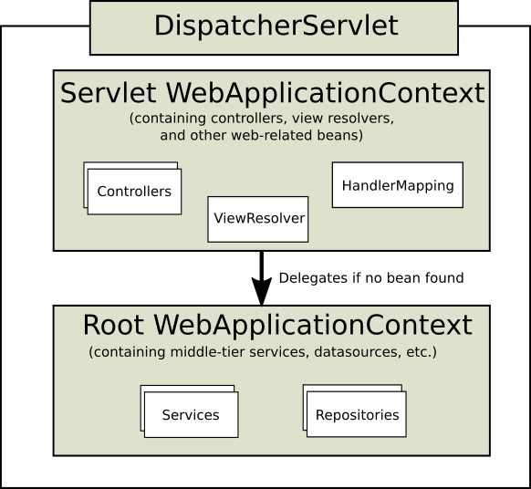

# DispatcherServlet
* Spring mvc front controller（前端控制器）

## 通过继承AbstractAnnotationConfigDispatcherServletInitializer来配置container（servlet3.0+）（推荐）
* ServletContainerInitializer是servlet提供的接口，Servlet Container寻找实现了该接口的类来配置自己
    * Spring提供了上述接口的实现类SpringServletContainerInitializer
        * SpringServletContainerInitializer将实际的配置任务交给实现了WebApplicationInitializer接口的类来完成。
            * AbstractAnnotationConfigDispatcherServletInitializer是Spring提供的一个对WebApplicationInitializer接口的基础实现。
                * 因此，实际开发中，通过继承AbstractAnnotationConfigDispatcherServletInitializer来完成配置
                    ```java
                    package spittr.config;

                    import org.springframework.web.servlet.support.AbstractAnnotationConfigDispatcherServletInitializer;

                    import spittr.web.WebConfig;

                    public class SpitterWebInitializer extends AbstractAnnotationConfigDispatcherServletInitializer {

                    @Override
                    protected Class<?>[] getRootConfigClasses() {
                        return new Class<?>[] { RootConfig.class };
                    }

                    // 指定使用定义在WebConfig配置类中的bean
                    @Override
                    protected Class<?>[] getServletConfigClasses() {
                        return new Class<?>[] { WebConfig.class };
                    }

                    // /表示DispatcherServlet是默认的servlet,将处理所有请求
                    @Override
                    protected String[] getServletMappings() {
                        return new String[] { "/" };
                    }

                    }
 
                    ```
## 通过实现WebApplicationInitializer接口来配置Container（servlet3.0+）
### java config
```java
public class MyWebApplicationInitializer implements WebApplicationInitializer {

  @Override
  public void onStartup(ServletContext servletCxt) {

    // Load Spring web application configuration
    AnnotationConfigWebApplicationContext cxt = new AnnotationConfigWebApplicationContext();
    cxt.register(AppConfig.class);
    cxt.refresh();

    // Create DispatcherServlet
    DispatcherServlet servlet = new DispatcherServlet(cxt);

    // Register and map the Servlet
    ServletRegistration.Dynamic registration = servletCxt.addServlet("app", servlet);
    registration.setLoadOnStartup(1);
    registration.addMapping("/app/*");
  }

}
```
### web.xml config
```xml
<web-app>

  <listener>
    <listener-class>org.springframework.web.context.ContextLoaderListener</listener-class>
  </listener>

  <context-param>
    <param-name>contextConfigLocation</param-name>
    <param-value>/WEB-INF/app-context.xml</param-value>
  </context-param>

  <servlet>
    <servlet-name>app</servlet-name>
    <servlet-class>org.springframework.web.servlet.DispatcherServlet</servlet-class>
    <init-param>
      <param-name>contextConfigLocation</param-name>
      <param-value></param-value>
    </init-param>
    <load-on-startup>1</load-on-startup>
  </servlet>

  <servlet-mapping>
    <servlet-name>app</servlet-name>
    <url-pattern>/app/*</url-pattern>
  </servlet-mapping>

</web-app>
```


## ApplicationContext Hierarchies
* Spring的ApplicationContext Hierarchies机制

    每一个DispatcherServlet对应着他自己的WebApplicationContext，当一个web app中有多个DispatcherServlets时，存在的一些common beans（eg,datasources）希望被所有的WebApplicationContexts共享。这时，可以创建一个root ApplicationContext来包含这些common beans,WebApplicationContexts则通过继承来共享这些common beans。

    These inherited beans can be overridden in the servlet-specific scope, and you can define new scope-specific beans local to a given Servlet instance.
* Typical context hierarchy in Spring Web MVC

    
* Single root context in Spring Web MVC

    

### 示例
一个简单的场景，在Spring MVC中使用Spring Security和Spring Data JPA。我们需要三个配置文件
* WebConfig
    * 包含web相关配置
        * such as ViewResolvers, Controllers, ArgumentResolvers, etc. 
            ```java
                @EnableWebMvc
                @Configuration
                @ComponentScan(basePackages = "com.so.web")
                public class WebConfig extends WebMvcConfigurerAdapter {
                    @Bean
                    public InternalResourceViewResolver viewResolver() {
                        InternalResourceViewResolver viewResolver = new InternalResourceViewResolver();
                        viewResolver.setPrefix("/WEB-INF/views/");
                        viewResolver.setSuffix(".jsp");

                        return viewResolver;
                    }

                    @Override
                    public void configurePathMatch(PathMatchConfigurer configurer) {
                        final boolean DO_NOT_USE_SUFFIX_PATTERN_MATCHING = false;
                        configurer.setUseSuffixPatternMatch(DO_NOT_USE_SUFFIX_PATTERN_MATCHING);
                    }
                }
            ```
* RepositoryConfig
    * 配置Data Source相关
        * such as DataSource, EntityManagerFactory, TransactionManager, etc.  
            ```java
            @Configuration
            @EnableTransactionManagement
            @EnableJpaRepositories(basePackages = "com.so.repository")
            public class RepositoryConfig {
                @Bean
                public DataSource dataSource() { ... }

                @Bean
                public LocalContainerEntityManagerFactoryBean entityManagerFactory() { ... }

                @Bean
                public PlatformTransactionManager transactionManager() { ... }
            }
            ```
* SecurityConfig
    * 配置security相关
        ```java
        @Configuration
        @EnableWebSecurity
        public class SecurityConfig extends WebSecurityConfigurerAdapter {
            @Override
            @Autowired
            protected void configure(AuthenticationManagerBuilder auth) throws Exception { ... }

            @Override
            protected void configure(HttpSecurity http) throws Exception { ... }
        }
        ```
* typical hierarchical ApplicationContext
    * adding RepositoryConfig and SecurityConfig in root context 
    * add WebConfig in their child context:
        ```java
        public class ServletInitializer extends AbstractAnnotationConfigDispatcherServletInitializer {
            @Override
            protected Class<?>[] getRootConfigClasses() {
                return new Class<?>[] { RepositoryConfig.class, SecurityConfig.class };
            }

            @Override
            protected Class<?>[] getServletConfigClasses() {
                return new Class<?>[] { WebConfig.class };
            }

            @Override
            protected String[] getServletMappings() {
                return new String[] { "/" };
            }
        }
        ```
* Single DispatcherServlet here
    * add the WebConfig to the root context and make the servlet context empty:
        ```java
        public class ServletInitializer extends AbstractAnnotationConfigDispatcherServletInitializer {
            @Override
            protected Class<?>[] getRootConfigClasses() {
                return new Class<?>[] { RepositoryConfig.class, SecurityConfig.class, WebConfig.class };
            }

            @Override
            protected Class<?>[] getServletConfigClasses() {
                return null;
            }

            @Override
            protected String[] getServletMappings() {
                return new String[] { "/" };
            }
        }
        ```

## Special Bean Types
DispatcherServlet 委托 special beans 处理请求并渲染view。 "special beans" 指的是
Spring-managed Object instances that implement one of the framework contracts listed in the table below. Spring MVC provides built-in implementations of these contracts but you can also customize, extend, or replace them.

| Bean type       | Explanation           | 
| ------------- |:-------------:|
| HandlerMapping      | Map a request to a handler along with a list of interceptors for pre- and post-processing. The mapping is based on some criteria the details of which vary by HandlerMapping implementation. The two main HandlerMapping implementations are RequestMappingHandlerMapping which supports @RequestMapping annotated methods and SimpleUrlHandlerMapping which maintains explicit registrations of URI path patterns to handlers. | 
| HandlerAdapter      | Help the DispatcherServlet to invoke a handler mapped to a request regardless of how the handler is actually invoked. For example, invoking an annotated controller requires resolving annotations. The main purpose of a HandlerAdapter is to shield the DispatcherServlet from such details.      |  
| HandlerExceptionResolver | Strategy to resolve exceptions possibly mapping them to handlers, or to HTML error views, or other. See Exception Handling.      |   
| ViewResolver | Resolve logical String-based view names returned from a handler to an actual View to render to the response with. See View Resolution and View Technologies.      |
| LocaleResolver, LocaleContextResolver | Resolve the Locale a client is using and possibly their time zone, in order to be able to offer internationalized views. See Locale.      |
| ThemeResolver | Resolve themes your web application can use, for example, to offer personalized layouts. See Themes.      |
| MultipartResolver | 	Abstraction for parsing a multi-part request (e.g. browser form file upload) with the help of some multipart parsing library. See Multipart requests.    |
| FlashMapManager | Store and retrieve the "input" and the "output" FlashMap that can be used to pass attributes from one request to another, usually across a redirect. See Flash attributes.      |

For each type of special bean, the DispatcherServlet checks for the WebApplicationContext first. If there are no matching bean types, it falls back on the default types listed in DispatcherServlet.properties.

**DispatcherServlet.java**

首先设置DispatcherServlet.properties中的默认的策略，
```java
static {
    // Load default strategy implementations from properties file.
    // This is currently strictly internal and not meant to be customized
    // by application developers.
    try {
        ClassPathResource resource = new ClassPathResource(DEFAULT_STRATEGIES_PATH, DispatcherServlet.class);
        defaultStrategies = PropertiesLoaderUtils.loadProperties(resource);
    }
    catch (IOException ex) {
        throw new IllegalStateException("Could not load '" + DEFAULT_STRATEGIES_PATH + "': " + ex.getMessage());
    }
}
```
初始化以上special beans,如果在config中配置了，则使用声明的bean初始化，否则使用DispatcherServlet.properties中spring提供的默认类型初始化。
```java
protected void initStrategies(ApplicationContext context) {
    this.initMultipartResolver(context);
    this.initLocaleResolver(context);
    this.initThemeResolver(context);
    this.initHandlerMappings(context);
    this.initHandlerAdapters(context);
    this.initHandlerExceptionResolvers(context);
    this.initRequestToViewNameTranslator(context);
    this.initViewResolvers(context);
    this.initFlashMapManager(context);
}
```
**DispatcherServlet.properties**
```peroperty
# Default implementation classes for DispatcherServlet's strategy interfaces.
# Used as fallback when no matching beans are found in the DispatcherServlet context.
# Not meant to be customized by application developers.

org.springframework.web.servlet.LocaleResolver=org.springframework.web.servlet.i18n.AcceptHeaderLocaleResolver

org.springframework.web.servlet.ThemeResolver=org.springframework.web.servlet.theme.FixedThemeResolver

org.springframework.web.servlet.HandlerMapping=org.springframework.web.servlet.handler.BeanNameUrlHandlerMapping,\
	org.springframework.web.servlet.mvc.method.annotation.RequestMappingHandlerMapping

org.springframework.web.servlet.HandlerAdapter=org.springframework.web.servlet.mvc.HttpRequestHandlerAdapter,\
	org.springframework.web.servlet.mvc.SimpleControllerHandlerAdapter,\
	org.springframework.web.servlet.mvc.method.annotation.RequestMappingHandlerAdapter

org.springframework.web.servlet.HandlerExceptionResolver=org.springframework.web.servlet.mvc.method.annotation.ExceptionHandlerExceptionResolver,\
	org.springframework.web.servlet.mvc.annotation.ResponseStatusExceptionResolver,\
	org.springframework.web.servlet.mvc.support.DefaultHandlerExceptionResolver

org.springframework.web.servlet.RequestToViewNameTranslator=org.springframework.web.servlet.view.DefaultRequestToViewNameTranslator

org.springframework.web.servlet.ViewResolver=org.springframework.web.servlet.view.InternalResourceViewResolver

org.springframework.web.servlet.FlashMapManager=org.springframework.web.servlet.support.SessionFlashMapManager

```

## DispatcherServlet processes requests
**The DispatcherServlet processes requests as follows:**
```java
protected void doService(HttpServletRequest request, HttpServletResponse response) throws Exception {
    if(this.logger.isDebugEnabled()) {
        String resumed = WebAsyncUtils.getAsyncManager(request).hasConcurrentResult()?" resumed":"";
        this.logger.debug("DispatcherServlet with name '" + this.getServletName() + "'" + resumed + " processing " + request.getMethod() + " request for [" + getRequestUri(request) + "]");
    }

    Map<String, Object> attributesSnapshot = null;
    if(WebUtils.isIncludeRequest(request)) {
        attributesSnapshot = new HashMap();
        Enumeration attrNames = request.getAttributeNames();

        label108:
        while(true) {
            String attrName;
            do {
                if(!attrNames.hasMoreElements()) {
                    break label108;
                }

                attrName = (String)attrNames.nextElement();
            } while(!this.cleanupAfterInclude && !attrName.startsWith("org.springframework.web.servlet"));

            attributesSnapshot.put(attrName, request.getAttribute(attrName));
        }
    }
    // 初始化，将在配置文件中声明的一些特殊的bean,设置为request的参数
    /*
    1.The WebApplicationContext is searched for and bound in the request as an attribute
    that the controller and other elements in the process can use. 
    It is bound by default under the key DispatcherServlet.WEB_APPLICATION_CONTEXT_ATTRIBUTE.
    */
    request.setAttribute(WEB_APPLICATION_CONTEXT_ATTRIBUTE, this.getWebApplicationContext());
    /*
    2.The locale resolver is bound to the request to enable elements in the process to 
    resolve the locale to use when processing the request (rendering the view, preparing data, and so on). 
    If you do not need locale resolving, you do not need it.
    */
    request.setAttribute(LOCALE_RESOLVER_ATTRIBUTE, this.localeResolver);
    /*
    3.The theme resolver is bound to the request to let elements such as views determine which theme to use. 
    If you do not use themes, you can ignore it.
    */
    request.setAttribute(THEME_RESOLVER_ATTRIBUTE, this.themeResolver);
    request.setAttribute(THEME_SOURCE_ATTRIBUTE, this.getThemeSource());
    FlashMap inputFlashMap = this.flashMapManager.retrieveAndUpdate(request, response);
    if(inputFlashMap != null) {
        request.setAttribute(INPUT_FLASH_MAP_ATTRIBUTE, Collections.unmodifiableMap(inputFlashMap));
    }

    request.setAttribute(OUTPUT_FLASH_MAP_ATTRIBUTE, new FlashMap());
    request.setAttribute(FLASH_MAP_MANAGER_ATTRIBUTE, this.flashMapManager);

    try {
        this.doDispatch(request, response);
    } finally {
        if(!WebAsyncUtils.getAsyncManager(request).isConcurrentHandlingStarted() && attributesSnapshot != null) {
            this.restoreAttributesAfterInclude(request, attributesSnapshot);
        }

    }

}
```
```java
protected void doDispatch(HttpServletRequest request, HttpServletResponse response) throws Exception {
    HttpServletRequest processedRequest = request;
    HandlerExecutionChain mappedHandler = null;
    boolean multipartRequestParsed = false;
    WebAsyncManager asyncManager = WebAsyncUtils.getAsyncManager(request);

    try {
        try {
            ModelAndView mv = null;
            Object dispatchException = null;

            try {
                // 检查request是不是multipart/form-data request（文件上传），将request包装为MultipartHttpServletRequest，以便于进一步的处理
                /*
                4.If you specify a multipart file resolver, 
                the request is inspected for multiparts; 
                if multiparts are found, 
                the request is wrapped in a MultipartHttpServletRequest for 
                further processing by other elements in the process. 
                See Multipart requests for further information about multipart handling.
                */
                processedRequest = this.checkMultipart(request);
                multipartRequestParsed = processedRequest != request;
                // 由HandlerMapping查找合适的HandlerExecutionChain(handler包装类)。
                // 然后，DispatcherServlet执行定义在链中的处理器(controller)和拦截器(interceptor)。并返回model
                /*
                5.An appropriate handler is searched for. 
                If a handler is found, the execution chain associated with the handler (preprocessors, postprocessors, and controllers) is executed 
                in order to prepare a model or rendering. 
                Or alternatively for annotated controllers, 
                the response may be rendered (within the HandlerAdapter) instead of returning a view.
                */
                // Determine handler for the current request.
                mappedHandler = this.getHandler(processedRequest);
                if(mappedHandler == null || mappedHandler.getHandler() == null) {
                    this.noHandlerFound(processedRequest, response);
                    return;
                }
                // Determine handler adapter for the current request.
                HandlerAdapter ha = this.getHandlerAdapter(mappedHandler.getHandler());
                // Process last-modified header, if supported by the handler.
                String method = request.getMethod();
                boolean isGet = "GET".equals(method);
                /*
                The Spring DispatcherServlet also supports the return of the last-modification-date, 
                as specified by the Servlet API. 
                The process of determining the last modification date for a specific request is straightforward: 
                the DispatcherServlet looks up an appropriate handler mapping and tests whether the handler that is found implements the LastModified interface. 
                If so, the value of the long getLastModified(request) method of the LastModified interface is returned to the client.
                */
                if(isGet || "HEAD".equals(method)) {
                    long lastModified = ha.getLastModified(request, mappedHandler.getHandler());
                    if(this.logger.isDebugEnabled()) {
                        this.logger.debug("Last-Modified value for [" + getRequestUri(request) + "] is: " + lastModified);
                    }

                    if((new ServletWebRequest(request, response)).checkNotModified(lastModified) && isGet) {
                        return;
                    }
                }

                if(!mappedHandler.applyPreHandle(processedRequest, response)) {
                    return;
                }
                // Actually invoke the handler.
                mv = ha.handle(processedRequest, response, mappedHandler.getHandler());
                if(asyncManager.isConcurrentHandlingStarted()) {
                    return;
                }

                this.applyDefaultViewName(processedRequest, mv);
                mappedHandler.applyPostHandle(processedRequest, response, mv);
            } catch (Exception var20) {
                dispatchException = var20;
            } catch (Throwable var21) {
                dispatchException = new NestedServletException("Handler dispatch failed", var21);
            }
            // 如果前面的步骤返回了model,则渲染view
            /*
            6.If a model is returned, the view is rendered. 
            If no model is returned, 
            (may be due to a preprocessor or postprocessor intercepting the request, perhaps for security reasons), 
            no view is rendered, because the request could already have been fulfilled.
            */
            this.processDispatchResult(processedRequest, response, mappedHandler, mv, (Exception)dispatchException);
        } catch (Exception var22) {
            this.triggerAfterCompletion(processedRequest, response, mappedHandler, var22);
        } catch (Throwable var23) {
            this.triggerAfterCompletion(processedRequest, response, mappedHandler, new NestedServletException("Handler processing failed", var23));
        }

    } finally {
        if(asyncManager.isConcurrentHandlingStarted()) {
            // Instead of postHandle and afterCompletion
            if(mappedHandler != null) {
                mappedHandler.applyAfterConcurrentHandlingStarted(processedRequest, response);
            }
        } else if(multipartRequestParsed) {
            // Clean up any resources used by a multipart request.
            this.cleanupMultipart(processedRequest);
        }

    }
}
```
```java
/**
    * Convert the request into a multipart request, and make multipart resolver available.
    * <p>If no multipart resolver is set, simply use the existing request.
    * @param request current HTTP request
    * @return the processed request (multipart wrapper if necessary)
    * @see MultipartResolver#resolveMultipart
    */
protected HttpServletRequest checkMultipart(HttpServletRequest request) throws MultipartException {
    if (this.multipartResolver != null && this.multipartResolver.isMultipart(request)) {
        if (WebUtils.getNativeRequest(request, MultipartHttpServletRequest.class) != null) {
            logger.debug("Request is already a MultipartHttpServletRequest - if not in a forward, " +
                    "this typically results from an additional MultipartFilter in web.xml");
        }
        else if (hasMultipartException(request) ) {
            logger.debug("Multipart resolution failed for current request before - " +
                    "skipping re-resolution for undisturbed error rendering");
        }
        else {
            try {
                return this.multipartResolver.resolveMultipart(request);
            }
            catch (MultipartException ex) {
                if (request.getAttribute(WebUtils.ERROR_EXCEPTION_ATTRIBUTE) != null) {
                    logger.debug("Multipart resolution failed for error dispatch", ex);
                    // Keep processing error dispatch with regular request handle below
                }
                else {
                    throw ex;
                }
            }
        }
    }
    // If not returned before: return original request.
    return request;
}
```
```java
/**
    * Handle the result of handler selection and handler invocation, which is
    * either a ModelAndView or an Exception to be resolved to a ModelAndView.
    */
private void processDispatchResult(HttpServletRequest request, HttpServletResponse response,
        @Nullable HandlerExecutionChain mappedHandler, @Nullable ModelAndView mv,
        @Nullable Exception exception) throws Exception {

    boolean errorView = false;

    if (exception != null) {
        if (exception instanceof ModelAndViewDefiningException) {
            logger.debug("ModelAndViewDefiningException encountered", exception);
            mv = ((ModelAndViewDefiningException) exception).getModelAndView();
        }
        else {
            Object handler = (mappedHandler != null ? mappedHandler.getHandler() : null);
            mv = processHandlerException(request, response, handler, exception);
            errorView = (mv != null);
        }
    }

    // Did the handler return a view to render?
    if (mv != null && !mv.wasCleared()) {
        render(mv, request, response);
        if (errorView) {
            WebUtils.clearErrorRequestAttributes(request);
        }
    }
    else {
        if (logger.isDebugEnabled()) {
            logger.debug("Null ModelAndView returned to DispatcherServlet with name '" + getServletName() +
                    "': assuming HandlerAdapter completed request handling");
        }
    }

    if (WebAsyncUtils.getAsyncManager(request).isConcurrentHandlingStarted()) {
        // Concurrent handling started during a forward
        return;
    }

    if (mappedHandler != null) {
        mappedHandler.triggerAfterCompletion(request, response, null);
    }
}
```

## HandlerMapping

### api-doc Interface org.springframework.web.servlet.HandlerMapping

* All Known Subinterfaces:
    * MatchableHandlerMapping
* All Known Implementing Classes:
    * AbstractDetectingUrlHandlerMapping, 
    * AbstractHandlerMapping, 
    * AbstractHandlerMethodMapping, 
    * AbstractUrlHandlerMapping, 
    * BeanNameUrlHandlerMapping, 
    * RequestMappingHandlerMapping, 
    * RequestMappingInfoHandlerMapping, 
    * SimpleUrlHandlerMapping, 
    * WebSocketHandlerMapping

* public interface HandlerMapping
    * Interface to be implemented by objects that define a mapping between requests and handler objects.
    * This class can be implemented by application developers, although this is not necessary, as BeanNameUrlHandlerMapping and RequestMappingHandlerMapping are included in the framework. The former is the default if no HandlerMapping bean is registered in the application context.

    * HandlerMapping implementations can support mapped interceptors but do not have to. A handler will always be wrapped in a HandlerExecutionChain instance, optionally accompanied by some HandlerInterceptor instances. The DispatcherServlet will first call each HandlerInterceptor's preHandle method in the given order, finally invoking the handler itself if all preHandle methods have returned true.

    * The ability to parameterize this mapping is a powerful and unusual capability of this MVC framework. For example, it is possible to write a custom mapping based on session state, cookie state or many other variables. No other MVC framework seems to be equally flexible.

* Note: 
    * Implementations can implement the Ordered interface to be able to specify a sorting order and thus a priority for getting applied by DispatcherServlet. Non-Ordered instances get treated as lowest priority.

* See Also:
    * Ordered, AbstractHandlerMapping, BeanNameUrlHandlerMapping, RequestMappingHandlerMapping

```java
/**
    * Initialize the HandlerMappings used by this class.
    * <p>If no HandlerMapping beans are defined in the BeanFactory for this namespace,
    * we default to BeanNameUrlHandlerMapping.
    */
private void initHandlerMappings(ApplicationContext context) {
    this.handlerMappings = null;

    if (this.detectAllHandlerMappings) {
        // Find all HandlerMappings in the ApplicationContext, including ancestor contexts.
        Map<String, HandlerMapping> matchingBeans =
                BeanFactoryUtils.beansOfTypeIncludingAncestors(context, HandlerMapping.class, true, false);
        if (!matchingBeans.isEmpty()) {
            this.handlerMappings = new ArrayList<>(matchingBeans.values());
            // We keep HandlerMappings in sorted order.
            AnnotationAwareOrderComparator.sort(this.handlerMappings);
        }
    }
    else {
        try {
            HandlerMapping hm = context.getBean(HANDLER_MAPPING_BEAN_NAME, HandlerMapping.class);
            this.handlerMappings = Collections.singletonList(hm);
        }
        catch (NoSuchBeanDefinitionException ex) {
            // Ignore, we'll add a default HandlerMapping later.
        }
    }

    // Ensure we have at least one HandlerMapping, by registering
    // a default HandlerMapping if no other mappings are found.
    if (this.handlerMappings == null) {
        this.handlerMappings = getDefaultStrategies(context, HandlerMapping.class);
        if (logger.isDebugEnabled()) {
            logger.debug("No HandlerMappings found in servlet '" + getServletName() + "': using default");
        }
    }
}
```


### AbstractAnnotationConfigDispatcherServletInitializer方法解析
#### getServletMappings
```java
@Override
protected String[] getServletMappings() {
    return new String[] { "/" };
}
```
表示将一个或多个路径映射到DispatcherServlet上，在本例中，它映射的是"/",表示这是应用默认的Servlet.
#### getRootConfigClasses和getServletConfigClasses
* getServletConfigClasses
    * 返回的带有@Configuration注解的类将会用来定义DispatcherServlet应用上下文（WebApplicationContext）中的bean
* getRootConfigClasses
    * 返回的带有@Configuration注解的类将会用来配置ContextLoaderListener创建的应用上下文（root ApplicationContext）中的bean

## 配置
### WebConfig
```java
package spittr.web;

import org.springframework.context.annotation.Bean;
import org.springframework.context.annotation.ComponentScan;
import org.springframework.context.annotation.Configuration;
import org.springframework.web.servlet.ViewResolver;
import org.springframework.web.servlet.config.annotation.DefaultServletHandlerConfigurer;
import org.springframework.web.servlet.config.annotation.EnableWebMvc;
import org.springframework.web.servlet.config.annotation.ResourceHandlerRegistry;
import org.springframework.web.servlet.config.annotation.WebMvcConfigurerAdapter;
import org.springframework.web.servlet.view.InternalResourceViewResolver;

@Configuration
// 启动Spring MVC
@EnableWebMvc
// 扫描包spittr.web
@ComponentScan("spittr.web")
public class WebConfig extends WebMvcConfigurerAdapter {

  // 配置JSF视图解析器
  @Bean
  public ViewResolver viewResolver() {
    InternalResourceViewResolver resolver = new InternalResourceViewResolver();
    resolver.setPrefix("/WEB-INF/views/");
    resolver.setSuffix(".jsp");
    return resolver;
  }
  
  // DispatcherServlet将对静态资源的请求转发到Servlet容器的默认Servle上，而不是使用DispatcherServlet本身处理此类请求
  @Override
  public void configureDefaultServletHandling(DefaultServletHandlerConfigurer configurer) {
    configurer.enable();
  }
  
  @Override
  public void addResourceHandlers(ResourceHandlerRegistry registry) {
    // TODO Auto-generated method stub
    super.addResourceHandlers(registry);
  }

}
```
### RootConfig
```java
package spittr.config;

import java.util.regex.Pattern;

import org.springframework.context.annotation.ComponentScan;
import org.springframework.context.annotation.ComponentScan.Filter;
import org.springframework.context.annotation.Configuration;
import org.springframework.context.annotation.FilterType;
import org.springframework.context.annotation.Import;
import org.springframework.core.type.filter.RegexPatternTypeFilter;

import spittr.config.RootConfig.WebPackage;

@Configuration
@Import(DataConfig.class)
@ComponentScan(basePackages={"spittr"}, 
    excludeFilters={
        @Filter(type=FilterType.CUSTOM, value=WebPackage.class)
    })
public class RootConfig {
  public static class WebPackage extends RegexPatternTypeFilter {
    public WebPackage() {
      super(Pattern.compile("spittr\\.web"));
    }    
  }
}
```
# @Controller
## @RequestMapping
```java
package spittr.web;

import static org.springframework.web.bind.annotation.RequestMethod.*;

import org.springframework.stereotype.Controller;
import org.springframework.ui.Model;
import org.springframework.web.bind.annotation.RequestMapping;

// 声明为一个Controller
@Controller
public class HomeController {

  // 处理对"/"的GET请求
  @RequestMapping(value="/",method = GET)
  public String home(Model model) {
    // view name 是home  
    return "home";
  }

}
```
鉴于我们配置的InternalResourceViewResolver，view name home将被解析为/WEB-INF/views/home.jsp

## 类级别的@RequestMapping
```java
package spittr.web;

import static org.springframework.web.bind.annotation.RequestMethod.*;

import org.springframework.stereotype.Controller;
import org.springframework.ui.Model;
import org.springframework.web.bind.annotation.RequestMapping;

@Controller
@RequestMapping("/")
public class HomeController {

  @RequestMapping(method = GET)
  public String home(Model model) {
    return "home";
  }

}
```
### value属性可以接收一个String类型的数组
```java
package spittr.web;

import static org.springframework.web.bind.annotation.RequestMethod.*;

import org.springframework.stereotype.Controller;
import org.springframework.ui.Model;
import org.springframework.web.bind.annotation.RequestMapping;

@Controller
@RequestMapping({"/","/homepage"})
public class HomeController {

  //...

}
```