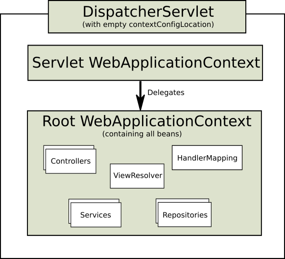

# DispatcherServlet
* Spring mvc 入口

## 通过继承AbstractAnnotationConfigDispatcherServletInitializer来配置的原理
* ServletContainerInitializer是servlet提供的接口，Servlet Container寻找实现了该接口的类来配置自己
    * Spring提供了上述接口的实现类SpringServletContainerInitializer
        * SpringServletContainerInitializer将实际的配置任务交给实现了WebApplicationInitializer接口的类来完成。
            * AbstractAnnotationConfigDispatcherServletInitializer是Spring提供的一个对WebApplicationInitializer接口的基础实现。
                * 因此，实际开发中，通过继承AbstractAnnotationConfigDispatcherServletInitializer来完成配置
                    ```java
                    package spittr.config;

                    import org.springframework.web.servlet.support.AbstractAnnotationConfigDispatcherServletInitializer;

                    import spittr.web.WebConfig;

                    public class SpitterWebInitializer extends AbstractAnnotationConfigDispatcherServletInitializer {

                    @Override
                    protected Class<?>[] getRootConfigClasses() {
                        return new Class<?>[] { RootConfig.class };
                    }

                    // 指定使用定义在WebConfig配置类中的bean
                    @Override
                    protected Class<?>[] getServletConfigClasses() {
                        return new Class<?>[] { WebConfig.class };
                    }

                    // /表示DispatcherServlet是默认的servlet,将处理所有请求
                    @Override
                    protected String[] getServletMappings() {
                        return new String[] { "/" };
                    }

                    }
                    ```
## ApplicationContext Hierarchies
* Spring的ApplicationContext Hierarchies机制

    每一个DispatcherServlets对应着他自己的WebApplicationContexts，当一个web app中有多个DispatcherServlets时，存在的一些common beans（eg,datasources）希望被所有的WebApplicationContexts共享。这是，可以创建一个root ApplicationContext来包含这些common beans,WebApplicationContexts则通过继承来共享这些common beans。

    These inherited beans can be overridden in the servlet-specific scope, and you can define new scope-specific beans local to a given Servlet instance.
* Typical context hierarchy in Spring Web MVC

    
* Single root context in Spring Web MVC

    

### 示例
一个简单的场景，在Spring MVC中使用Spring Security和Spring Data JPA。我们需要三个配置文件
* WebConfig
    * 包含web相关配置
        * such as ViewResolvers, Controllers, ArgumentResolvers, etc. 
            ```java
                @EnableWebMvc
                @Configuration
                @ComponentScan(basePackages = "com.so.web")
                public class WebConfig extends WebMvcConfigurerAdapter {
                    @Bean
                    public InternalResourceViewResolver viewResolver() {
                        InternalResourceViewResolver viewResolver = new InternalResourceViewResolver();
                        viewResolver.setPrefix("/WEB-INF/views/");
                        viewResolver.setSuffix(".jsp");

                        return viewResolver;
                    }

                    @Override
                    public void configurePathMatch(PathMatchConfigurer configurer) {
                        final boolean DO_NOT_USE_SUFFIX_PATTERN_MATCHING = false;
                        configurer.setUseSuffixPatternMatch(DO_NOT_USE_SUFFIX_PATTERN_MATCHING);
                    }
                }
            ```
* RepositoryConfig
    * 配置Data Source相关
        * such as DataSource, EntityManagerFactory, TransactionManager, etc.  
            ```java
            @Configuration
            @EnableTransactionManagement
            @EnableJpaRepositories(basePackages = "com.so.repository")
            public class RepositoryConfig {
                @Bean
                public DataSource dataSource() { ... }

                @Bean
                public LocalContainerEntityManagerFactoryBean entityManagerFactory() { ... }

                @Bean
                public PlatformTransactionManager transactionManager() { ... }
            }
            ```
* SecurityConfig
    * 配置security相关
        ```java
        @Configuration
        @EnableWebSecurity
        public class SecurityConfig extends WebSecurityConfigurerAdapter {
            @Override
            @Autowired
            protected void configure(AuthenticationManagerBuilder auth) throws Exception { ... }

            @Override
            protected void configure(HttpSecurity http) throws Exception { ... }
        }
        ```
* typical hierarchical ApplicationContext
    * adding RepositoryConfig and SecurityConfig in root context 
    * add WebConfig in their child context:
        ```java
        public class ServletInitializer extends AbstractAnnotationConfigDispatcherServletInitializer {
            @Override
            protected Class<?>[] getRootConfigClasses() {
                return new Class<?>[] { RepositoryConfig.class, SecurityConfig.class };
            }

            @Override
            protected Class<?>[] getServletConfigClasses() {
                return new Class<?>[] { WebConfig.class };
            }

            @Override
            protected String[] getServletMappings() {
                return new String[] { "/" };
            }
        }
        ```
* Single DispatcherServlet here
    * add the WebConfig to the root context and make the servlet context empty:
        ```java
        public class ServletInitializer extends AbstractAnnotationConfigDispatcherServletInitializer {
            @Override
            protected Class<?>[] getRootConfigClasses() {
                return new Class<?>[] { RepositoryConfig.class, SecurityConfig.class, WebConfig.class };
            }

            @Override
            protected Class<?>[] getServletConfigClasses() {
                return null;
            }

            @Override
            protected String[] getServletMappings() {
                return new String[] { "/" };
            }
        }
        ```
### AbstractAnnotationConfigDispatcherServletInitializer方法解析
#### getServletMappings
```java
@Override
protected String[] getServletMappings() {
    return new String[] { "/" };
}
```
表示将一个或多个路径映射到DispatcherServlet上，在本例中，它映射的是"/",表示这是应用默认的Servlet.
#### getRootConfigClasses和getServletConfigClasses
* getServletConfigClasses
    * 返回的带有@Configuration注解的类将会用来定义DispatcherServlet应用上下文（WebApplicationContext）中的bean
* getRootConfigClasses
    * 返回的带有@Configuration注解的类将会用来配置ContextLoaderListener创建的应用上下文（root ApplicationContext）中的bean

## 配置
### WebConfig
```java
package spittr.web;

import org.springframework.context.annotation.Bean;
import org.springframework.context.annotation.ComponentScan;
import org.springframework.context.annotation.Configuration;
import org.springframework.web.servlet.ViewResolver;
import org.springframework.web.servlet.config.annotation.DefaultServletHandlerConfigurer;
import org.springframework.web.servlet.config.annotation.EnableWebMvc;
import org.springframework.web.servlet.config.annotation.ResourceHandlerRegistry;
import org.springframework.web.servlet.config.annotation.WebMvcConfigurerAdapter;
import org.springframework.web.servlet.view.InternalResourceViewResolver;

@Configuration
// 启动Spring MVC
@EnableWebMvc
// 扫描包spittr.web
@ComponentScan("spittr.web")
public class WebConfig extends WebMvcConfigurerAdapter {

  // 配置JSF视图解析器
  @Bean
  public ViewResolver viewResolver() {
    InternalResourceViewResolver resolver = new InternalResourceViewResolver();
    resolver.setPrefix("/WEB-INF/views/");
    resolver.setSuffix(".jsp");
    return resolver;
  }
  
  // DispatcherServlet将对静态资源的请求转发到Servlet容器的默认Servle上，而不是使用DispatcherServlet本身处理此类请求
  @Override
  public void configureDefaultServletHandling(DefaultServletHandlerConfigurer configurer) {
    configurer.enable();
  }
  
  @Override
  public void addResourceHandlers(ResourceHandlerRegistry registry) {
    // TODO Auto-generated method stub
    super.addResourceHandlers(registry);
  }

}
```
### RootConfig
```java
package spittr.config;

import java.util.regex.Pattern;

import org.springframework.context.annotation.ComponentScan;
import org.springframework.context.annotation.ComponentScan.Filter;
import org.springframework.context.annotation.Configuration;
import org.springframework.context.annotation.FilterType;
import org.springframework.context.annotation.Import;
import org.springframework.core.type.filter.RegexPatternTypeFilter;

import spittr.config.RootConfig.WebPackage;

@Configuration
@Import(DataConfig.class)
@ComponentScan(basePackages={"spittr"}, 
    excludeFilters={
        @Filter(type=FilterType.CUSTOM, value=WebPackage.class)
    })
public class RootConfig {
  public static class WebPackage extends RegexPatternTypeFilter {
    public WebPackage() {
      super(Pattern.compile("spittr\\.web"));
    }    
  }
}
```
# @Controller
## @RequestMapping
```java
package spittr.web;

import static org.springframework.web.bind.annotation.RequestMethod.*;

import org.springframework.stereotype.Controller;
import org.springframework.ui.Model;
import org.springframework.web.bind.annotation.RequestMapping;

// 声明为一个Controller
@Controller
public class HomeController {

  // 处理对"/"的GET请求
  @RequestMapping(value="/",method = GET)
  public String home(Model model) {
    // view name 是home  
    return "home";
  }

}
```
鉴于我们配置的InternalResourceViewResolver，view name home将被解析为/WEB-INF/views/home.jsp

## 类级别的@RequestMapping
```java
package spittr.web;

import static org.springframework.web.bind.annotation.RequestMethod.*;

import org.springframework.stereotype.Controller;
import org.springframework.ui.Model;
import org.springframework.web.bind.annotation.RequestMapping;

@Controller
@RequestMapping("/")
public class HomeController {

  @RequestMapping(method = GET)
  public String home(Model model) {
    return "home";
  }

}
```
### value属性可以接收一个String类型的数组
```java
package spittr.web;

import static org.springframework.web.bind.annotation.RequestMethod.*;

import org.springframework.stereotype.Controller;
import org.springframework.ui.Model;
import org.springframework.web.bind.annotation.RequestMapping;

@Controller
@RequestMapping({"/","/homepage"})
public class HomeController {

  //...

}
```