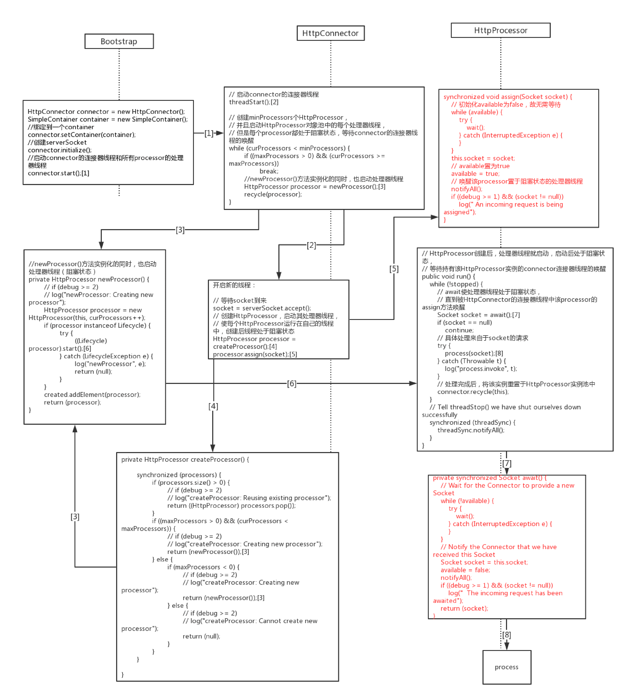

# Tomcat默认连接器
## source
https://github.com/iir0221/myServletLearning/tree/master/src/ex04/pyrmont
## assign与await配合流程图

在其他窗口打开，查看大图

## 文档

[https://tomcat.apache.org/tomcat-9.0-doc/connectors.html](https://tomcat.apache.org/tomcat-9.0-doc/connectors.html)

