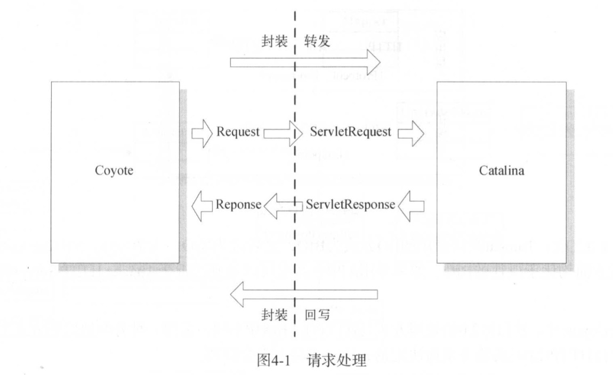
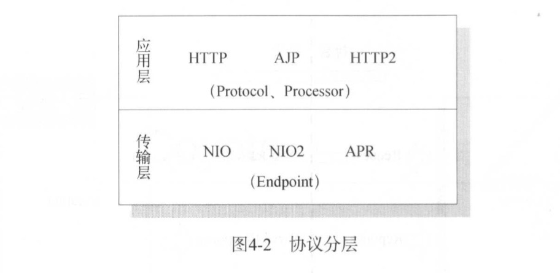
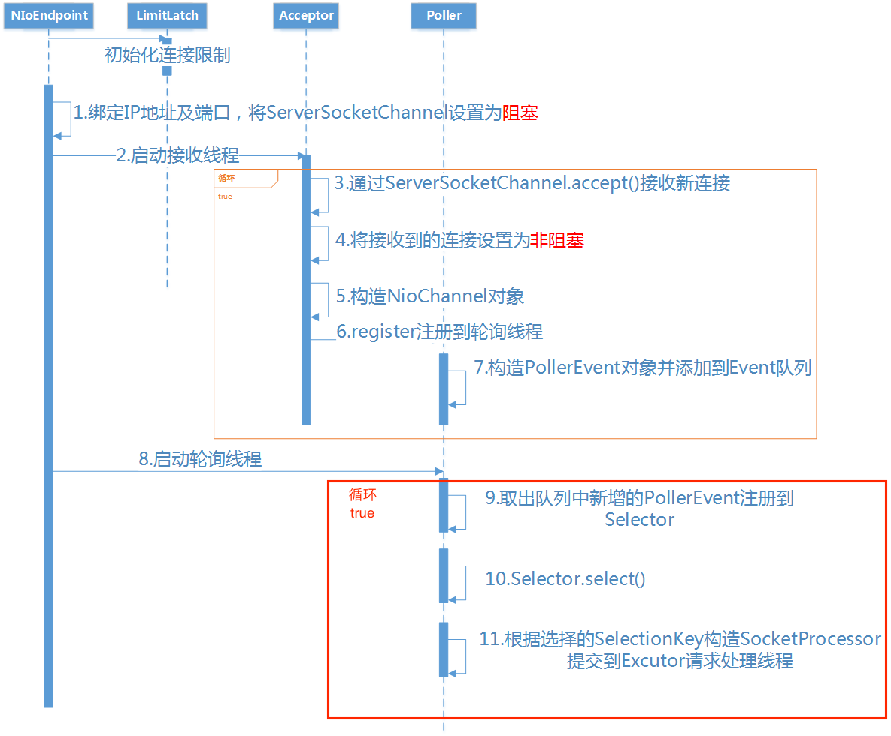

# Coyoto
Coyote是Tomcat链接器框架，客户端通过Coyote与服务器建立链接，发送请求并接收响应。

Coyote封装了底层的网络通信（Socket请求及响应处理），为Catalina容器提供了统一的接口，使Catalina容器与具体的请求协议及I/O方式解耦。

Coyote将Socket输入转换为Request对象，交由Catalina处理，处理完请求后，Catalnia通过Coyote提供的Response对象将结果写入输出流。

Coyote作为独立模块，只负责具体协议和I/O处理，与Servlet规范没有直接关系，因此，即便是Request和Response对象也并未实现Servlet规范对应的接口，而是在Catalina中将它们进一步封装为ServletRequest何ServletResponse。




# default http/1.1 NIO
Connector.java
```java
// ------------------------------------------------------------ Constructor

/**
    * Defaults to using HTTP/1.1 NIO implementation.
    */
public Connector() {
    this("org.apache.coyote.http11.Http11NioProtocol");
}
```
# connector init
注意，这里设置ServerSocketChannel为阻塞模式。（原因：？）
```java
// Separated out to make it easier for folks that extend NioEndpoint to
// implement custom [server]sockets
protected void initServerSocket() throws Exception {
    serverSock = ServerSocketChannel.open();
    socketProperties.setProperties(serverSock.socket());
    InetSocketAddress addr = (getAddress()!=null?new InetSocketAddress(getAddress(),getPort()):new InetSocketAddress(getPort()));
    serverSock.socket().bind(addr,getAcceptCount());
    serverSock.configureBlocking(true); //mimic APR behavior
}
```
# connector start
由StandardService启动connector
```java
protected void startInternal() throws LifecycleException {

    // Start our defined Connectors second
    synchronized (connectorsLock) {
        for (Connector connector: connectors) {
            // If it has already failed, don't try and start it
            if (connector.getState() != LifecycleState.FAILED) {
                connector.start();
            }
        }
    }
}
```
其中
```
connectors = {Connector[2]@2579} 
         0 = {Connector@2632} "Connector[HTTP/1.1-8080]"
         1 = {Connector@2577} "Connector[AJP/1.3-8009]"
 ```

 * 当Connector启动时，会同时启动所持有的ProtocolHandler实例

Connector.startInternal
```java
protected void startInternal() throws LifecycleException {

    // Validate settings before starting
    if (getPort() < 0) {
        throw new LifecycleException(sm.getString(
                "coyoteConnector.invalidPort", Integer.valueOf(getPort())));
    }

    setState(LifecycleState.STARTING);

    try {
        // Coyote协议接口，通过封装Endpoint和Processor，
        // 实现针对具体协议的处理功能
        protocolHandler.start();
    } catch (Exception e) {
        throw new LifecycleException(
                sm.getString("coyoteConnector.protocolHandlerStartFailed"), e);
    }
}
```
* 当ProtocolHandler启动时，会同时启动所持有的Endpoint实例

AbstractProtocol.start
```java
@Override
public void start() throws Exception {
    if (getLog().isInfoEnabled()) {
        getLog().info(sm.getString("abstractProtocolHandler.start", getName()));
    }

    endpoint.start();

    // Start async timeout thread
    asyncTimeout = new AsyncTimeout();
    Thread timeoutThread = new Thread(asyncTimeout, getNameInternal() + "-AsyncTimeout");
    int priority = endpoint.getThreadPriority();
    if (priority < Thread.MIN_PRIORITY || priority > Thread.MAX_PRIORITY) {
        priority = Thread.NORM_PRIORITY;
    }
    timeoutThread.setPriority(priority);
    timeoutThread.setDaemon(true);
    timeoutThread.start();
}
```
AbstractEndpoint.start
```java
public final void start() throws Exception {
    if (bindState == BindState.UNBOUND) {
        bind();
        bindState = BindState.BOUND_ON_START;
    }
    startInternal();
}
```
* Endpoint并行运行多个线程来接收处理Socket
    * Start acceptor thread
        * 1个
    * Start poller threads
        * TOMCAT的NIO处理是有POLLER线程来接管的，它的线程数一般等于CPU的核数
    

NioEndpoint.startInternal

```java
/**
    * Start the NIO endpoint, creating acceptor, poller threads.
    */
@Override
public void startInternal() throws Exception {

    if (!running) {
        running = true;
        paused = false;

        processorCache = new SynchronizedStack<>(SynchronizedStack.DEFAULT_SIZE,
                socketProperties.getProcessorCache());
        eventCache = new SynchronizedStack<>(SynchronizedStack.DEFAULT_SIZE,
                        socketProperties.getEventCache());
        nioChannels = new SynchronizedStack<>(SynchronizedStack.DEFAULT_SIZE,
                socketProperties.getBufferPool());

        // Create worker collection
        if ( getExecutor() == null ) {
            createExecutor();
        }

        initializeConnectionLatch();

        // 1.Start poller threads
        pollers = new Poller[getPollerThreadCount()];
        for (int i=0; i<pollers.length; i++) {
            pollers[i] = new Poller();
            Thread pollerThread = new Thread(pollers[i], getName() + "-ClientPoller-"+i);
            pollerThread.setPriority(threadPriority);
            pollerThread.setDaemon(true);
            pollerThread.start();
        }

        // 2.Start acceptor threads
        startAcceptorThreads();
    }
}
```
如代码所示，将启动poller threads和acceptor threads

### Start acceptor threads


* 监听端口通信，而且只要Endpoint处于运行状态，始终循环监听,**阻塞的**接收socket（因为ServerSocketChannel设计为阻塞模式）。

startAcceptorThreads();
```java
@Override
public void run() {

    int errorDelay = 0;

    // Loop until we receive a shutdown command
    while (endpoint.isRunning()) {

        // Loop if endpoint is paused
        while (endpoint.isPaused() && endpoint.isRunning()) {
            state = AcceptorState.PAUSED;
            try {
                Thread.sleep(50);
            } catch (InterruptedException e) {
                // Ignore
            }
        }

        if (!endpoint.isRunning()) {
            break;
        }
        state = AcceptorState.RUNNING;

        try {
            //if we have reached max connections, wait
            endpoint.countUpOrAwaitConnection();

            // Endpoint might have been paused while waiting for latch
            // If that is the case, don't accept new connections
            if (endpoint.isPaused()) {
                continue;
            }

            // NIO下U 是SocketChannel
            U socket = null;
            try {
                // Accept the next incoming connection from the server
                // socket
                socket = endpoint.serverSocketAccept();
            } catch (Exception ioe) {
                // We didn't get a socket
                endpoint.countDownConnection();
                if (endpoint.isRunning()) {
                    // Introduce delay if necessary
                    errorDelay = handleExceptionWithDelay(errorDelay);
                    // re-throw
                    throw ioe;
                } else {
                    break;
                }
            }
            // Successful accept, reset the error delay
            errorDelay = 0;

            // Configure the socket
            if (endpoint.isRunning() && !endpoint.isPaused()) {
                // setSocketOptions() will hand the socket off to
                // an appropriate processor if successful
                if (!endpoint.setSocketOptions(socket)) {
                    endpoint.closeSocket(socket);
                }
            } else {
                endpoint.destroySocket(socket);
            }
        } catch (Throwable t) {
            ExceptionUtils.handleThrowable(t);
            String msg = sm.getString("endpoint.accept.fail");
            // APR specific.
            // Could push this down but not sure it is worth the trouble.
            if (t instanceof Error) {
                Error e = (Error) t;
                if (e.getError() == 233) {
                    // Not an error on HP-UX so log as a warning
                    // so it can be filtered out on that platform
                    // See bug 50273
                    log.warn(msg, t);
                } else {
                    log.error(msg, t);
                }
            } else {
                    log.error(msg, t);
            }
        }
    }
    state = AcceptorState.ENDED;
}
```
* 将接收到的新链接SocketChannel设置为**非阻塞模式**，封装为NIOChannel实例，并注册到Poller线程。
```java
/**
    * Process the specified connection.
    * @param socket The socket channel
    * @return <code>true</code> if the socket was correctly configured
    *  and processing may continue, <code>false</code> if the socket needs to be
    *  close immediately
    */
@Override
protected boolean setSocketOptions(SocketChannel socket) {
    // Process the connection
    try {
        //disable blocking, APR style, we are gonna be polling it
        socket.configureBlocking(false);
        Socket sock = socket.socket();
        socketProperties.setProperties(sock);

        NioChannel channel = nioChannels.pop();
        if (channel == null) {
            SocketBufferHandler bufhandler = new SocketBufferHandler(
                    socketProperties.getAppReadBufSize(),
                    socketProperties.getAppWriteBufSize(),
                    socketProperties.getDirectBuffer());
            if (isSSLEnabled()) {
                channel = new SecureNioChannel(socket, bufhandler, selectorPool, this);
            } else {
                channel = new NioChannel(socket, bufhandler);
            }
        } else {
            channel.setIOChannel(socket);
            channel.reset();
        }
        getPoller0().register(channel);
    } catch (Throwable t) {
        ExceptionUtils.handleThrowable(t);
        try {
            log.error("",t);
        } catch (Throwable tt) {
            ExceptionUtils.handleThrowable(tt);
        }
        // Tell to close the socket
        return false;
    }
    return true;
}
```

* 创建一个PollerEvent实例，添加到事件队列
```java
/**
    * Registers a newly created socket with the poller.
    *
    * @param socket    The newly created socket
    */
public void register(final NioChannel socket) {
    socket.setPoller(this);
    NioSocketWrapper ka = new NioSocketWrapper(socket, NioEndpoint.this);
    socket.setSocketWrapper(ka);
    ka.setPoller(this);
    ka.setReadTimeout(getConnectionTimeout());
    ka.setWriteTimeout(getConnectionTimeout());
    ka.setKeepAliveLeft(NioEndpoint.this.getMaxKeepAliveRequests());
    ka.setSecure(isSSLEnabled());
    PollerEvent r = eventCache.pop();
    // 设置NioSocketWrapper.interestOps==SelectionKey.OP_READ（NioSocketWrapper封装了SocketChannel)
    ka.interestOps(SelectionKey.OP_READ);//this is what OP_REGISTER turns into.
    // 设置PollerEvent.interestOps==OP_REGISTER 
    if ( r==null) r = new PollerEvent(socket,ka,OP_REGISTER);
    else r.reset(socket,ka,OP_REGISTER);
    addEvent(r);
}
```

###  Start poller threads
* 轮询线程，此部分根据I/O方式的不同处理会有所不同，如NIO采用轮询的方式检测SelectionKey是否就绪。如果就绪，则获取一个有效的SocketProcess对象并提交线程池处理

NioEndpoint.Poller.java
```java
/**
    * The background thread that adds sockets to the Poller, checks the
    * poller for triggered events and hands the associated socket off to an
    * appropriate processor as events occur.
    */
@Override
public void run() {
    // Loop until destroy() is called
    while (true) {

        boolean hasEvents = false;

        try {
            if (!close) {
                // 注释1
                hasEvents = events();
                if (wakeupCounter.getAndSet(-1) > 0) {
                    // 执行Select.select
                    //if we are here, means we have other stuff to do
                    //do a non blocking select
                    keyCount = selector.selectNow();
                } else {
                    keyCount = selector.select(selectorTimeout);
                }
                wakeupCounter.set(0);
            }
            if (close) {
                events();
                timeout(0, false);
                try {
                    selector.close();
                } catch (IOException ioe) {
                    log.error(sm.getString("endpoint.nio.selectorCloseFail"), ioe);
                }
                break;
            }
        } catch (Throwable x) {
            ExceptionUtils.handleThrowable(x);
            log.error("",x);
            continue;
        }
        //either we timed out or we woke up, process events first
        if ( keyCount == 0 ) hasEvents = (hasEvents | events());

        Iterator<SelectionKey> iterator =
            keyCount > 0 ? selector.selectedKeys().iterator() : null;
        // Walk through the collection of ready keys and dispatch
        // any active event.
        while (iterator != null && iterator.hasNext()) {
            SelectionKey sk = iterator.next();
            NioSocketWrapper attachment = (NioSocketWrapper)sk.attachment();
            // Attachment may be null if another thread has called
            // cancelledKey()
            if (attachment == null) {
                iterator.remove();
            } else {
                // 注释2
                iterator.remove();
                processKey(sk, attachment);
            }
        }//while

        //process timeouts
        timeout(keyCount,hasEvents);
    }//while

    getStopLatch().countDown();
}
```
#### 注释1
* 首先取得轮询事件队列中的PollerEvent：events()
```java
/**
    * Processes events in the event queue of the Poller.
    *
    * @return <code>true</code> if some events were processed,
    *   <code>false</code> if queue was empty
    */
public boolean events() {
    boolean result = false;

    PollerEvent pe = null;
    for (int i = 0, size = events.size(); i < size && (pe = events.poll()) != null; i++ ) {
        result = true;
        try {
            pe.run();
            pe.reset();
            if (running && !paused) {
                eventCache.push(pe);
            }
        } catch ( Throwable x ) {
            log.error("",x);
        }
    }

    return result;
}
```
* 然后运行事件，将SocketChannel的读事件OP_READ注册到Poller持有的Selector上
```java
public void run() {
    if (interestOps == OP_REGISTER) {
        try {
            socket.getIOChannel().register(
                    socket.getPoller().getSelector(), SelectionKey.OP_READ, socketWrapper);
        } catch (Exception x) {
            log.error(sm.getString("endpoint.nio.registerFail"), x);
        }
    } else {
        final SelectionKey key = socket.getIOChannel().keyFor(socket.getPoller().getSelector());
        try {
            if (key == null) {
                // The key was cancelled (e.g. due to socket closure)
                // and removed from the selector while it was being
                // processed. Count down the connections at this point
                // since it won't have been counted down when the socket
                // closed.
                socket.socketWrapper.getEndpoint().countDownConnection();
            } else {
                final NioSocketWrapper socketWrapper = (NioSocketWrapper) key.attachment();
                if (socketWrapper != null) {
                    //we are registering the key to start with, reset the fairness counter.
                    int ops = key.interestOps() | interestOps;
                    socketWrapper.interestOps(ops);
                    key.interestOps(ops);
                } else {
                    socket.getPoller().cancelledKey(key);
                }
            }
        } catch (CancelledKeyException ckx) {
            try {
                socket.getPoller().cancelledKey(key);
            } catch (Exception ignore) {}
        }
    }
}
```
#### 注释2
* 对应就绪的SelectionKey,当捕获到SocketEvent.OPEN_READ事件时，构造SocketProcessor，并提交到线程池进行请求处理
```java
protected void processKey(SelectionKey sk, NioSocketWrapper attachment) {
    try {
        if ( close ) {
            cancelledKey(sk);
        } else if ( sk.isValid() && attachment != null ) {
            if (sk.isReadable() || sk.isWritable() ) {
                if ( attachment.getSendfileData() != null ) {
                    processSendfile(sk,attachment, false);
                } else {
                    unreg(sk, attachment, sk.readyOps());
                    boolean closeSocket = false;
                    // Read goes before write
                    if (sk.isReadable()) {
                        if (!processSocket(attachment, SocketEvent.OPEN_READ, true)) {
                            closeSocket = true;
                        }
                    }
                    if (!closeSocket && sk.isWritable()) {
                        if (!processSocket(attachment, SocketEvent.OPEN_WRITE, true)) {
                            closeSocket = true;
                        }
                    }
                    if (closeSocket) {
                        cancelledKey(sk);
                    }
                }
            }
        } else {
            //invalid key
            cancelledKey(sk);
        }
    } catch ( CancelledKeyException ckx ) {
        cancelledKey(sk);
    } catch (Throwable t) {
        ExceptionUtils.handleThrowable(t);
        log.error("",t);
    }
}
```
* 获取一个有效的SocketProcessor对象并提交线程池处理


```java
/**
    * Process the given SocketWrapper with the given status. Used to trigger
    * processing as if the Poller (for those endpoints that have one)
    * selected the socket.
    *
    * @param socketWrapper The socket wrapper to process
    * @param event         The socket event to be processed
    * @param dispatch      Should the processing be performed on a new
    *                          container thread
    *
    * @return if processing was triggered successfully
    */
public boolean processSocket(SocketWrapperBase<S> socketWrapper,
        SocketEvent event, boolean dispatch) {
    try {
        if (socketWrapper == null) {
            return false;
        }
        SocketProcessorBase<S> sc = processorCache.pop();
        if (sc == null) {
            sc = createSocketProcessor(socketWrapper, event);
        } else {
            sc.reset(socketWrapper, event);
        }
        Executor executor = getExecutor();
        if (dispatch && executor != null) {
            executor.execute(sc);
        } else {
            sc.run();
        }
    } catch (RejectedExecutionException ree) {
        getLog().warn(sm.getString("endpoint.executor.fail", socketWrapper) , ree);
        return false;
    } catch (Throwable t) {
        ExceptionUtils.handleThrowable(t);
        // This means we got an OOM or similar creating a thread, or that
        // the pool and its queue are full
        getLog().error(sm.getString("endpoint.process.fail"), t);
        return false;
    }
    return true;
}
```
SocketProcessorBase.java
```java
@Override
public final void run() {
    synchronized (socketWrapper) {
        // It is possible that processing may be triggered for read and
        // write at the same time. The sync above makes sure that processing
        // does not occur in parallel. The test below ensures that if the
        // first event to be processed results in the socket being closed,
        // the subsequent events are not processed.
        if (socketWrapper.isClosed()) {
            return;
        }
        doRun();
    }
}
```
SocketProcessor.java

SocketProcessor:This class is the equivalent of the Worker, but will simply use in an external Executor thread pool.

首先判断socket状态，然后提交到ConnectionHandler处理

```java

/**
    * This class is the equivalent of the Worker, but will simply use in an
    * external Executor thread pool.
    */
protected class SocketProcessor extends SocketProcessorBase<NioChannel> {

    public SocketProcessor(SocketWrapperBase<NioChannel> socketWrapper, SocketEvent event) {
        super(socketWrapper, event);
    }

    @Override
    protected void doRun() {
        NioChannel socket = socketWrapper.getSocket();
        SelectionKey key = socket.getIOChannel().keyFor(socket.getPoller().getSelector());

        try {
            int handshake = -1;

            try {
                if (key != null) {
                    if (socket.isHandshakeComplete()) {
                        // No TLS handshaking required. Let the handler
                        // process this socket / event combination.
                        handshake = 0;
                    } else if (event == SocketEvent.STOP || event == SocketEvent.DISCONNECT ||
                            event == SocketEvent.ERROR) {
                        // Unable to complete the TLS handshake. Treat it as
                        // if the handshake failed.
                        handshake = -1;
                    } else {
                        handshake = socket.handshake(key.isReadable(), key.isWritable());
                        // The handshake process reads/writes from/to the
                        // socket. status may therefore be OPEN_WRITE once
                        // the handshake completes. However, the handshake
                        // happens when the socket is opened so the status
                        // must always be OPEN_READ after it completes. It
                        // is OK to always set this as it is only used if
                        // the handshake completes.
                        event = SocketEvent.OPEN_READ;
                    }
                }
            } catch (IOException x) {
                handshake = -1;
                if (log.isDebugEnabled()) log.debug("Error during SSL handshake",x);
            } catch (CancelledKeyException ckx) {
                handshake = -1;
            }
            if (handshake == 0) {
                SocketState state = SocketState.OPEN;
                // Process the request from this socket
                if (event == null) {
                    state = getHandler().process(socketWrapper, SocketEvent.OPEN_READ);
                } else {
                    state = getHandler().process(socketWrapper, event);
                }
                if (state == SocketState.CLOSED) {
                    close(socket, key);
                }
            } else if (handshake == -1 ) {
                close(socket, key);
            } else if (handshake == SelectionKey.OP_READ){
                socketWrapper.registerReadInterest();
            } else if (handshake == SelectionKey.OP_WRITE){
                socketWrapper.registerWriteInterest();
            }
        } catch (CancelledKeyException cx) {
            socket.getPoller().cancelledKey(key);
        } catch (VirtualMachineError vme) {
            ExceptionUtils.handleThrowable(vme);
        } catch (Throwable t) {
            log.error("", t);
            socket.getPoller().cancelledKey(key);
        } finally {
            socketWrapper = null;
            event = null;
            //return to cache
            if (running && !paused) {
                processorCache.push(this);
            }
        }
    }
}
```
为链接选择一个合适的Process实现以进行请求处理

ConnectionHandler.java
```java
@Override
public SocketState process(SocketWrapperBase<S> wrapper, SocketEvent status) {
    if (getLog().isDebugEnabled()) {
        getLog().debug(sm.getString("abstractConnectionHandler.process",
                wrapper.getSocket(), status));
    }
    if (wrapper == null) {
        // Nothing to do. Socket has been closed.
        return SocketState.CLOSED;
    }

    S socket = wrapper.getSocket();

    // 注3.1 processor为单例，Tomcat在同一次连接中复用processor
    Processor processor = connections.get(socket);
    if (getLog().isDebugEnabled()) {
        getLog().debug(sm.getString("abstractConnectionHandler.connectionsGet",
                processor, socket));
    }

    if (processor != null) {
        // Make sure an async timeout doesn't fire
        getProtocol().removeWaitingProcessor(processor);
    } else if (status == SocketEvent.DISCONNECT || status == SocketEvent.ERROR) {
        // Nothing to do. Endpoint requested a close and there is no
        // longer a processor associated with this socket.
        return SocketState.CLOSED;
    }

    ContainerThreadMarker.set();

    try {
        if (processor == null) {
            String negotiatedProtocol = wrapper.getNegotiatedProtocol();
            if (negotiatedProtocol != null) {
                UpgradeProtocol upgradeProtocol =
                        getProtocol().getNegotiatedProtocol(negotiatedProtocol);
                if (upgradeProtocol != null) {
                    processor = upgradeProtocol.getProcessor(
                            wrapper, getProtocol().getAdapter());
                } else if (negotiatedProtocol.equals("http/1.1")) {
                    // Explicitly negotiated the default protocol.
                    // Obtain a processor below.
                } else {
                    // TODO:
                    // OpenSSL 1.0.2's ALPN callback doesn't support
                    // failing the handshake with an error if no
                    // protocol can be negotiated. Therefore, we need to
                    // fail the connection here. Once this is fixed,
                    // replace the code below with the commented out
                    // block.
                    if (getLog().isDebugEnabled()) {
                        getLog().debug(sm.getString(
                            "abstractConnectionHandler.negotiatedProcessor.fail",
                            negotiatedProtocol));
                    }
                    return SocketState.CLOSED;
                    /*
                        * To replace the code above once OpenSSL 1.1.0 is
                        * used.
                    // Failed to create processor. This is a bug.
                    throw new IllegalStateException(sm.getString(
                            "abstractConnectionHandler.negotiatedProcessor.fail",
                            negotiatedProtocol));
                    */
                }
            }
        }
        if (processor == null) {
            processor = recycledProcessors.pop();
            if (getLog().isDebugEnabled()) {
                getLog().debug(sm.getString("abstractConnectionHandler.processorPop",
                        processor));
            }
        }
        if (processor == null) {
            processor = getProtocol().createProcessor();
            register(processor);
        }

        processor.setSslSupport(
                wrapper.getSslSupport(getProtocol().getClientCertProvider()));

        // Associate the processor with the connection
        connections.put(socket, processor);

        SocketState state = SocketState.CLOSED;
        do {
            // process处理socket
            state = processor.process(wrapper, status);

            if (state == SocketState.UPGRADING) {
                // Get the HTTP upgrade handler
                UpgradeToken upgradeToken = processor.getUpgradeToken();
                // Retrieve leftover input
                ByteBuffer leftOverInput = processor.getLeftoverInput();
                if (upgradeToken == null) {
                    // Assume direct HTTP/2 connection
                    UpgradeProtocol upgradeProtocol = getProtocol().getUpgradeProtocol("h2c");
                    if (upgradeProtocol != null) {
                        processor = upgradeProtocol.getProcessor(
                                wrapper, getProtocol().getAdapter());
                        wrapper.unRead(leftOverInput);
                        // Associate with the processor with the connection
                        connections.put(socket, processor);
                    } else {
                        if (getLog().isDebugEnabled()) {
                            getLog().debug(sm.getString(
                                "abstractConnectionHandler.negotiatedProcessor.fail",
                                "h2c"));
                        }
                        return SocketState.CLOSED;
                    }
                } else {
                    HttpUpgradeHandler httpUpgradeHandler = upgradeToken.getHttpUpgradeHandler();
                    // Release the Http11 processor to be re-used
                    release(processor);
                    // Create the upgrade processor
                    processor = getProtocol().createUpgradeProcessor(wrapper, upgradeToken);
                    if (getLog().isDebugEnabled()) {
                        getLog().debug(sm.getString("abstractConnectionHandler.upgradeCreate",
                                processor, wrapper));
                    }
                    wrapper.unRead(leftOverInput);
                    // Mark the connection as upgraded
                    wrapper.setUpgraded(true);
                    // Associate with the processor with the connection
                    // 注3.1 processor为单例，Tomcat在同一次连接中复用processor
                    connections.put(socket, processor);
                    // Initialise the upgrade handler (which may trigger
                    // some IO using the new protocol which is why the lines
                    // above are necessary)
                    // This cast should be safe. If it fails the error
                    // handling for the surrounding try/catch will deal with
                    // it.
                    if (upgradeToken.getInstanceManager() == null) {
                        httpUpgradeHandler.init((WebConnection) processor);
                    } else {
                        ClassLoader oldCL = upgradeToken.getContextBind().bind(false, null);
                        try {
                            httpUpgradeHandler.init((WebConnection) processor);
                        } finally {
                            upgradeToken.getContextBind().unbind(false, oldCL);
                        }
                    }
                }
            }
        } while ( state == SocketState.UPGRADING);

        if (state == SocketState.LONG) {
            // In the middle of processing a request/response. Keep the
            // socket associated with the processor. Exact requirements
            // depend on type of long poll
            longPoll(wrapper, processor);
            if (processor.isAsync()) {
                getProtocol().addWaitingProcessor(processor);
            }
        } else if (state == SocketState.OPEN) {
            // In keep-alive but between requests. OK to recycle
            // processor. Continue to poll for the next request.
            connections.remove(socket);
            release(processor);
            wrapper.registerReadInterest();
        } else if (state == SocketState.SENDFILE) {
            // Sendfile in progress. If it fails, the socket will be
            // closed. If it works, the socket either be added to the
            // poller (or equivalent) to await more data or processed
            // if there are any pipe-lined requests remaining.
        } else if (state == SocketState.UPGRADED) {
            // Don't add sockets back to the poller if this was a
            // non-blocking write otherwise the poller may trigger
            // multiple read events which may lead to thread starvation
            // in the connector. The write() method will add this socket
            // to the poller if necessary.
            if (status != SocketEvent.OPEN_WRITE) {
                longPoll(wrapper, processor);
            }
        } else if (state == SocketState.SUSPENDED) {
            // Don't add sockets back to the poller.
            // The resumeProcessing() method will add this socket
            // to the poller.
        } else {
            // Connection closed. OK to recycle the processor. Upgrade
            // processors are not recycled.
            connections.remove(socket);
            if (processor.isUpgrade()) {
                UpgradeToken upgradeToken = processor.getUpgradeToken();
                HttpUpgradeHandler httpUpgradeHandler = upgradeToken.getHttpUpgradeHandler();
                InstanceManager instanceManager = upgradeToken.getInstanceManager();
                if (instanceManager == null) {
                    httpUpgradeHandler.destroy();
                } else {
                    ClassLoader oldCL = upgradeToken.getContextBind().bind(false, null);
                    try {
                        httpUpgradeHandler.destroy();
                    } finally {
                        try {
                            instanceManager.destroyInstance(httpUpgradeHandler);
                        } catch (Throwable e) {
                            ExceptionUtils.handleThrowable(e);
                            getLog().error(sm.getString("abstractConnectionHandler.error"), e);
                        }
                        upgradeToken.getContextBind().unbind(false, oldCL);
                    }
                }
            } else {
                release(processor);
            }
        }
        return state;
    } catch(java.net.SocketException e) {
        // SocketExceptions are normal
        getLog().debug(sm.getString(
                "abstractConnectionHandler.socketexception.debug"), e);
    } catch (java.io.IOException e) {
        // IOExceptions are normal
        getLog().debug(sm.getString(
                "abstractConnectionHandler.ioexception.debug"), e);
    } catch (ProtocolException e) {
        // Protocol exceptions normally mean the client sent invalid or
        // incomplete data.
        getLog().debug(sm.getString(
                "abstractConnectionHandler.protocolexception.debug"), e);
    }
    // Future developers: if you discover any other
    // rare-but-nonfatal exceptions, catch them here, and log as
    // above.
    catch (Throwable e) {
        ExceptionUtils.handleThrowable(e);
        // any other exception or error is odd. Here we log it
        // with "ERROR" level, so it will show up even on
        // less-than-verbose logs.
        getLog().error(sm.getString("abstractConnectionHandler.error"), e);
    } finally {
        ContainerThreadMarker.clear();
    }

    // Make sure socket/processor is removed from the list of current
    // connections
    connections.remove(socket);
    release(processor);
    return SocketState.CLOSED;
}

```
AbstractProcessorLight.java
```java
@Override
public SocketState process(SocketWrapperBase<?> socketWrapper, SocketEvent status)
        throws IOException {

    SocketState state = SocketState.CLOSED;
    Iterator<DispatchType> dispatches = null;
    do {
        if (dispatches != null) {
            DispatchType nextDispatch = dispatches.next();
            state = dispatch(nextDispatch.getSocketStatus());
        } else if (status == SocketEvent.DISCONNECT) {
            // Do nothing here, just wait for it to get recycled
        } else if (isAsync() || isUpgrade() || state == SocketState.ASYNC_END) {
            state = dispatch(status);
            if (state == SocketState.OPEN) {
                // There may be pipe-lined data to read. If the data isn't
                // processed now, execution will exit this loop and call
                // release() which will recycle the processor (and input
                // buffer) deleting any pipe-lined data. To avoid this,
                // process it now.
                state = service(socketWrapper);
            }
        } else if (status == SocketEvent.OPEN_WRITE) {
            // Extra write event likely after async, ignore
            state = SocketState.LONG;
        } else if (status == SocketEvent.OPEN_READ){
            state = service(socketWrapper);
        } else {
            // Default to closing the socket if the SocketEvent passed in
            // is not consistent with the current state of the Processor
            state = SocketState.CLOSED;
        }

        if (state != SocketState.CLOSED && isAsync()) {
            state = asyncPostProcess();
        }

        if (getLog().isDebugEnabled()) {
            getLog().debug("Socket: [" + socketWrapper +
                    "], Status in: [" + status +
                    "], State out: [" + state + "]");
        }

        if (dispatches == null || !dispatches.hasNext()) {
            // Only returns non-null iterator if there are
            // dispatches to process.
            dispatches = getIteratorAndClearDispatches();
        }
    } while (state == SocketState.ASYNC_END ||
            dispatches != null && state != SocketState.CLOSED);

    return state;
}
```
Http11Processor.java
```java
@Override
public SocketState service(SocketWrapperBase<?> socketWrapper)
    throws IOException {
    RequestInfo rp = request.getRequestProcessor();
    rp.setStage(org.apache.coyote.Constants.STAGE_PARSE);

    // Setting up the I/O
    setSocketWrapper(socketWrapper);
    inputBuffer.init(socketWrapper);
    outputBuffer.init(socketWrapper);

    // Flags
    keepAlive = true;
    openSocket = false;
    readComplete = true;
    boolean keptAlive = false;
    SendfileState sendfileState = SendfileState.DONE;

    while (!getErrorState().isError() && keepAlive && !isAsync() && upgradeToken == null &&
            sendfileState == SendfileState.DONE && !protocol.isPaused()) {

        // Parsing the request header
        try {
            if (!inputBuffer.parseRequestLine(keptAlive, protocol.getConnectionTimeout(),
                    protocol.getKeepAliveTimeout())) {
                if (inputBuffer.getParsingRequestLinePhase() == -1) {
                    return SocketState.UPGRADING;
                } else if (handleIncompleteRequestLineRead()) {
                    break;
                }
            }

            if (protocol.isPaused()) {
                // 503 - Service unavailable
                response.setStatus(503);
                setErrorState(ErrorState.CLOSE_CLEAN, null);
            } else {
                keptAlive = true;
                // Set this every time in case limit has been changed via JMX
                request.getMimeHeaders().setLimit(protocol.getMaxHeaderCount());
                if (!inputBuffer.parseHeaders()) {
                    // We've read part of the request, don't recycle it
                    // instead associate it with the socket
                    openSocket = true;
                    readComplete = false;
                    break;
                }
                if (!protocol.getDisableUploadTimeout()) {
                    socketWrapper.setReadTimeout(protocol.getConnectionUploadTimeout());
                }
            }
        } catch (IOException e) {
            if (log.isDebugEnabled()) {
                log.debug(sm.getString("http11processor.header.parse"), e);
            }
            setErrorState(ErrorState.CLOSE_CONNECTION_NOW, e);
            break;
        } catch (Throwable t) {
            ExceptionUtils.handleThrowable(t);
            UserDataHelper.Mode logMode = userDataHelper.getNextMode();
            if (logMode != null) {
                String message = sm.getString("http11processor.header.parse");
                switch (logMode) {
                    case INFO_THEN_DEBUG:
                        message += sm.getString("http11processor.fallToDebug");
                        //$FALL-THROUGH$
                    case INFO:
                        log.info(message, t);
                        break;
                    case DEBUG:
                        log.debug(message, t);
                }
            }
            // 400 - Bad Request
            response.setStatus(400);
            setErrorState(ErrorState.CLOSE_CLEAN, t);
            getAdapter().log(request, response, 0);
        }

        // Has an upgrade been requested?
        Enumeration<String> connectionValues = request.getMimeHeaders().values("Connection");
        boolean foundUpgrade = false;
        while (connectionValues.hasMoreElements() && !foundUpgrade) {
            foundUpgrade = connectionValues.nextElement().toLowerCase(
                    Locale.ENGLISH).contains("upgrade");
        }

        if (foundUpgrade) {
            // Check the protocol
            String requestedProtocol = request.getHeader("Upgrade");

            UpgradeProtocol upgradeProtocol = protocol.getUpgradeProtocol(requestedProtocol);
            if (upgradeProtocol != null) {
                if (upgradeProtocol.accept(request)) {
                    // TODO Figure out how to handle request bodies at this
                    // point.
                    response.setStatus(HttpServletResponse.SC_SWITCHING_PROTOCOLS);
                    response.setHeader("Connection", "Upgrade");
                    response.setHeader("Upgrade", requestedProtocol);
                    action(ActionCode.CLOSE,  null);
                    getAdapter().log(request, response, 0);

                    InternalHttpUpgradeHandler upgradeHandler =
                            upgradeProtocol.getInternalUpgradeHandler(
                                    socketWrapper, getAdapter(), cloneRequest(request));
                    UpgradeToken upgradeToken = new UpgradeToken(upgradeHandler, null, null);
                    action(ActionCode.UPGRADE, upgradeToken);
                    return SocketState.UPGRADING;
                }
            }
        }

        if (!getErrorState().isError()) {
            // Setting up filters, and parse some request headers
            rp.setStage(org.apache.coyote.Constants.STAGE_PREPARE);
            try {
                prepareRequest();
            } catch (Throwable t) {
                ExceptionUtils.handleThrowable(t);
                if (log.isDebugEnabled()) {
                    log.debug(sm.getString("http11processor.request.prepare"), t);
                }
                // 500 - Internal Server Error
                response.setStatus(500);
                setErrorState(ErrorState.CLOSE_CLEAN, t);
                getAdapter().log(request, response, 0);
            }
        }

        int maxKeepAliveRequests = protocol.getMaxKeepAliveRequests();
        if (maxKeepAliveRequests == 1) {
            keepAlive = false;
        } else if (maxKeepAliveRequests > 0 &&
                socketWrapper.decrementKeepAlive() <= 0) {
            keepAlive = false;
        }

        // Process the request in the adapter
        if (!getErrorState().isError()) {
            try {
                rp.setStage(org.apache.coyote.Constants.STAGE_SERVICE);
                getAdapter().service(request, response);
                // Handle when the response was committed before a serious
                // error occurred.  Throwing a ServletException should both
                // set the status to 500 and set the errorException.
                // If we fail here, then the response is likely already
                // committed, so we can't try and set headers.
                if(keepAlive && !getErrorState().isError() && !isAsync() &&
                        statusDropsConnection(response.getStatus())) {
                    setErrorState(ErrorState.CLOSE_CLEAN, null);
                }
            } catch (InterruptedIOException e) {
                setErrorState(ErrorState.CLOSE_CONNECTION_NOW, e);
            } catch (HeadersTooLargeException e) {
                log.error(sm.getString("http11processor.request.process"), e);
                // The response should not have been committed but check it
                // anyway to be safe
                if (response.isCommitted()) {
                    setErrorState(ErrorState.CLOSE_NOW, e);
                } else {
                    response.reset();
                    response.setStatus(500);
                    setErrorState(ErrorState.CLOSE_CLEAN, e);
                    response.setHeader("Connection", "close"); // TODO: Remove
                }
            } catch (Throwable t) {
                ExceptionUtils.handleThrowable(t);
                log.error(sm.getString("http11processor.request.process"), t);
                // 500 - Internal Server Error
                response.setStatus(500);
                setErrorState(ErrorState.CLOSE_CLEAN, t);
                getAdapter().log(request, response, 0);
            }
        }

        // Finish the handling of the request
        rp.setStage(org.apache.coyote.Constants.STAGE_ENDINPUT);
        if (!isAsync()) {
            // If this is an async request then the request ends when it has
            // been completed. The AsyncContext is responsible for calling
            // endRequest() in that case.
            endRequest();
        }
        rp.setStage(org.apache.coyote.Constants.STAGE_ENDOUTPUT);

        // If there was an error, make sure the request is counted as
        // and error, and update the statistics counter
        if (getErrorState().isError()) {
            response.setStatus(500);
        }

        if (!isAsync() || getErrorState().isError()) {
            request.updateCounters();
            if (getErrorState().isIoAllowed()) {
                inputBuffer.nextRequest();
                outputBuffer.nextRequest();
            }
        }

        if (!protocol.getDisableUploadTimeout()) {
            int connectionTimeout = protocol.getConnectionTimeout();
            if(connectionTimeout > 0) {
                socketWrapper.setReadTimeout(connectionTimeout);
            } else {
                socketWrapper.setReadTimeout(0);
            }
        }

        rp.setStage(org.apache.coyote.Constants.STAGE_KEEPALIVE);

        sendfileState = processSendfile(socketWrapper);
    }

    rp.setStage(org.apache.coyote.Constants.STAGE_ENDED);

    if (getErrorState().isError() || protocol.isPaused()) {
        return SocketState.CLOSED;
    } else if (isAsync()) {
        return SocketState.LONG;
    } else if (isUpgrade()) {
        return SocketState.UPGRADING;
    } else {
        if (sendfileState == SendfileState.PENDING) {
            return SocketState.SENDFILE;
        } else {
            if (openSocket) {
                if (readComplete) {
                    return SocketState.OPEN;
                } else {
                    return SocketState.LONG;
                }
            } else {
                return SocketState.CLOSED;
            }
        }
    }
}
```
CoyoteAdapter.java
```java
@Override
public void service(org.apache.coyote.Request req, org.apache.coyote.Response res)
        throws Exception {

    Request request = (Request) req.getNote(ADAPTER_NOTES);
    Response response = (Response) res.getNote(ADAPTER_NOTES);

    if (request == null) {
        // Create objects
        request = connector.createRequest();
        request.setCoyoteRequest(req);
        response = connector.createResponse();
        response.setCoyoteResponse(res);

        // Link objects
        request.setResponse(response);
        response.setRequest(request);

        // Set as notes
        req.setNote(ADAPTER_NOTES, request);
        res.setNote(ADAPTER_NOTES, response);

        // Set query string encoding
        req.getParameters().setQueryStringCharset(connector.getURICharset());
    }

    if (connector.getXpoweredBy()) {
        response.addHeader("X-Powered-By", POWERED_BY);
    }

    boolean async = false;
    boolean postParseSuccess = false;

    req.getRequestProcessor().setWorkerThreadName(THREAD_NAME.get());

    try {
        // Parse and set Catalina and configuration specific
        // request parameters
        postParseSuccess = postParseRequest(req, request, res, response);
        if (postParseSuccess) {
            //check valves if we support async
            request.setAsyncSupported(
                    connector.getService().getContainer().getPipeline().isAsyncSupported());
            // Calling the container
            connector.getService().getContainer().getPipeline().getFirst().invoke(
                    request, response);
        }
        if (request.isAsync()) {
            async = true;
            ReadListener readListener = req.getReadListener();
            if (readListener != null && request.isFinished()) {
                // Possible the all data may have been read during service()
                // method so this needs to be checked here
                ClassLoader oldCL = null;
                try {
                    oldCL = request.getContext().bind(false, null);
                    if (req.sendAllDataReadEvent()) {
                        req.getReadListener().onAllDataRead();
                    }
                } finally {
                    request.getContext().unbind(false, oldCL);
                }
            }

            Throwable throwable =
                    (Throwable) request.getAttribute(RequestDispatcher.ERROR_EXCEPTION);

            // If an async request was started, is not going to end once
            // this container thread finishes and an error occurred, trigger
            // the async error process
            if (!request.isAsyncCompleting() && throwable != null) {
                request.getAsyncContextInternal().setErrorState(throwable, true);
            }
        } else {
            request.finishRequest();
            response.finishResponse();
        }

    } catch (IOException e) {
        // Ignore
    } finally {
        AtomicBoolean error = new AtomicBoolean(false);
        res.action(ActionCode.IS_ERROR, error);

        if (request.isAsyncCompleting() && error.get()) {
            // Connection will be forcibly closed which will prevent
            // completion happening at the usual point. Need to trigger
            // call to onComplete() here.
            res.action(ActionCode.ASYNC_POST_PROCESS,  null);
            async = false;
        }

        // Access log
        if (!async && postParseSuccess) {
            // Log only if processing was invoked.
            // If postParseRequest() failed, it has already logged it.
            Context context = request.getContext();
            // If the context is null, it is likely that the endpoint was
            // shutdown, this connection closed and the request recycled in
            // a different thread. That thread will have updated the access
            // log so it is OK not to update the access log here in that
            // case.
            if (context != null) {
                context.logAccess(request, response,
                        System.currentTimeMillis() - req.getStartTime(), false);
            }
        }

        req.getRequestProcessor().setWorkerThreadName(null);

        // Recycle the wrapper request and response
        if (!async) {
            request.recycle();
            response.recycle();
        }
    }
}

```
4562

