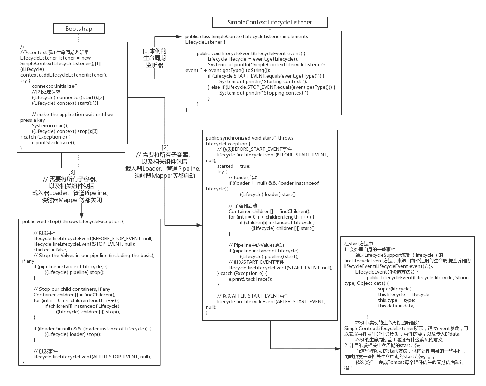

# Lifecycle

## Lifecycle接口

* 通过实现Lifecycle接口，可以达到统一启动/关闭这些组件的效果，
* Catalina允许组件包含其他组件，因此父组件要负责启动/关闭子组件，
    * **从而实现启动一个组件（大部分组件都实现了这个接口）**，就将全部应用的组件全部启动的效果，
    * 这种单一启动/关闭的机制正是通过Lifecycle接口实现的

* Lifecycle（Tomcat 9）接口如下：
    * 13种LifecycleEvent事件类型
        * 用于LifecycleEvent事件的type属性中，作用是区分组件发出的LifecycleEvent事件的状态。从而可以让多种状态发送同一类型的事件。然后用其中一个属性来区分多种状态而不用定义多种事件。
    * 3个管理监听器的方法
        * 同于管理监听器
    * 4个生命周期方法
        * 用于执行生命周期各个阶段的操作
    * 2个获取当前状态的方法
        * 用于获取当前状态
```java
package org.apache.catalina;


/**
 * Common interface for component life cycle methods.  Catalina components
 * may implement this interface (as well as the appropriate interface(s) for
 * the functionality they support) in order to provide a consistent mechanism
 * to start and stop the component.
 * <br>
 * The valid state transitions for components that support {@link Lifecycle}
 * are:
 * <pre>
 *            start()
 *  -----------------------------
 *  |                           |
 *  | init()                    |
 * NEW -»-- INITIALIZING        |
 * | |           |              |     ------------------«-----------------------
 * | |           |auto          |     |                                        |
 * | |          \|/    start() \|/   \|/     auto          auto         stop() |
 * | |      INITIALIZED --»-- STARTING_PREP --»- STARTING --»- STARTED --»---  |
 * | |         |                                                            |  |
 * | |destroy()|                                                            |  |
 * | --»-----«--    ------------------------«--------------------------------  ^
 * |     |          |                                                          |
 * |     |         \|/          auto                 auto              start() |
 * |     |     STOPPING_PREP ----»---- STOPPING ------»----- STOPPED -----»-----
 * |    \|/                               ^                     |  ^
 * |     |               stop()           |                     |  |
 * |     |       --------------------------                     |  |
 * |     |       |                                              |  |
 * |     |       |    destroy()                       destroy() |  |
 * |     |    FAILED ----»------ DESTROYING ---«-----------------  |
 * |     |                        ^     |                          |
 * |     |     destroy()          |     |auto                      |
 * |     --------»-----------------    \|/                         |
 * |                                 DESTROYED                     |
 * |                                                               |
 * |                            stop()                             |
 * ----»-----------------------------»------------------------------
 *
 * Any state can transition to FAILED.
 *
 * Calling start() while a component is in states STARTING_PREP, STARTING or
 * STARTED has no effect.
 *
 * Calling start() while a component is in state NEW will cause init() to be
 * called immediately after the start() method is entered.
 *
 * Calling stop() while a component is in states STOPPING_PREP, STOPPING or
 * STOPPED has no effect.
 *
 * Calling stop() while a component is in state NEW transitions the component
 * to STOPPED. This is typically encountered when a component fails to start and
 * does not start all its sub-components. When the component is stopped, it will
 * try to stop all sub-components - even those it didn't start.
 *
 * Attempting any other transition will throw {@link LifecycleException}.
 *
 * </pre>
 * The {@link LifecycleEvent}s fired during state changes are defined in the
 * methods that trigger the changed. No {@link LifecycleEvent}s are fired if the
 * attempted transition is not valid.
 *
 * @author Craig R. McClanahan
 */
public interface Lifecycle {


    // ----------------------------------------------------- Manifest Constants
    /**
     * The LifecycleEvent type for the "component before init" event.
     */
    public static final String BEFORE_INIT_EVENT = "before_init";
    /**
     * The LifecycleEvent type for the "component after init" event.
     */
    public static final String AFTER_INIT_EVENT = "after_init";
    /**
     * The LifecycleEvent type for the "component start" event.
     */
    public static final String START_EVENT = "start";
    /**
     * The LifecycleEvent type for the "component before start" event.
     */
    public static final String BEFORE_START_EVENT = "before_start";
    /**
     * The LifecycleEvent type for the "component after start" event.
     */
    public static final String AFTER_START_EVENT = "after_start";
    /**
     * The LifecycleEvent type for the "component stop" event.
     */
    public static final String STOP_EVENT = "stop";
    /**
     * The LifecycleEvent type for the "component before stop" event.
     */
    public static final String BEFORE_STOP_EVENT = "before_stop";
    /**
     * The LifecycleEvent type for the "component after stop" event.
     */
    public static final String AFTER_STOP_EVENT = "after_stop";
    /**
     * The LifecycleEvent type for the "component after destroy" event.
     */
    public static final String AFTER_DESTROY_EVENT = "after_destroy";
    /**
     * The LifecycleEvent type for the "component before destroy" event.
     */
    public static final String BEFORE_DESTROY_EVENT = "before_destroy";
    /**
     * The LifecycleEvent type for the "periodic" event.
     */
    public static final String PERIODIC_EVENT = "periodic";
    /**
     * The LifecycleEvent type for the "configure_start" event. Used by those
     * components that use a separate component to perform configuration and
     * need to signal when configuration should be performed - usually after
     * {@link #BEFORE_START_EVENT} and before {@link #START_EVENT}.
     */
    public static final String CONFIGURE_START_EVENT = "configure_start";
    /**
     * The LifecycleEvent type for the "configure_stop" event. Used by those
     * components that use a separate component to perform configuration and
     * need to signal when de-configuration should be performed - usually after
     * {@link #STOP_EVENT} and before {@link #AFTER_STOP_EVENT}.
     */
    public static final String CONFIGURE_STOP_EVENT = "configure_stop";
    // --------------------------------------------------------- Public Methods
    /**
     * Add a LifecycleEvent listener to this component.
     *
     * @param listener The listener to add
     */
    public void addLifecycleListener(LifecycleListener listener);
    /**
     * Get the life cycle listeners associated with this life cycle.
     *
     * @return An array containing the life cycle listeners associated with this
     *         life cycle. If this component has no listeners registered, a
     *         zero-length array is returned.
     */
    public LifecycleListener[] findLifecycleListeners();
    /**
     * Remove a LifecycleEvent listener from this component.
     *
     * @param listener The listener to remove
     */
    public void removeLifecycleListener(LifecycleListener listener);
    /**
     * Prepare the component for starting. This method should perform any
     * initialization required post object creation. The following
     * {@link LifecycleEvent}s will be fired in the following order:
     * <ol>
     *   <li>INIT_EVENT: On the successful completion of component
     *                   initialization.</li>
     * </ol>
     *
     * @exception LifecycleException if this component detects a fatal error
     *  that prevents this component from being used
     */
    public void init() throws LifecycleException;
    /**
     * Prepare for the beginning of active use of the public methods other than
     * property getters/setters and life cycle methods of this component. This
     * method should be called before any of the public methods other than
     * property getters/setters and life cycle methods of this component are
     * utilized. The following {@link LifecycleEvent}s will be fired in the
     * following order:
     * <ol>
     *   <li>BEFORE_START_EVENT: At the beginning of the method. It is as this
     *                           point the state transitions to
     *                           {@link LifecycleState#STARTING_PREP}.</li>
     *   <li>START_EVENT: During the method once it is safe to call start() for
     *                    any child components. It is at this point that the
     *                    state transitions to {@link LifecycleState#STARTING}
     *                    and that the public methods other than property
     *                    getters/setters and life cycle methods may be
     *                    used.</li>
     *   <li>AFTER_START_EVENT: At the end of the method, immediately before it
     *                          returns. It is at this point that the state
     *                          transitions to {@link LifecycleState#STARTED}.
     *                          </li>
     * </ol>
     *
     * @exception LifecycleException if this component detects a fatal error
     *  that prevents this component from being used
     */
    public void start() throws LifecycleException;
    /**
     * Gracefully terminate the active use of the public methods other than
     * property getters/setters and life cycle methods of this component. Once
     * the STOP_EVENT is fired, the public methods other than property
     * getters/setters and life cycle methods should not be used. The following
     * {@link LifecycleEvent}s will be fired in the following order:
     * <ol>
     *   <li>BEFORE_STOP_EVENT: At the beginning of the method. It is at this
     *                          point that the state transitions to
     *                          {@link LifecycleState#STOPPING_PREP}.</li>
     *   <li>STOP_EVENT: During the method once it is safe to call stop() for
     *                   any child components. It is at this point that the
     *                   state transitions to {@link LifecycleState#STOPPING}
     *                   and that the public methods other than property
     *                   getters/setters and life cycle methods may no longer be
     *                   used.</li>
     *   <li>AFTER_STOP_EVENT: At the end of the method, immediately before it
     *                         returns. It is at this point that the state
     *                         transitions to {@link LifecycleState#STOPPED}.
     *                         </li>
     * </ol>
     *
     * Note that if transitioning from {@link LifecycleState#FAILED} then the
     * three events above will be fired but the component will transition
     * directly from {@link LifecycleState#FAILED} to
     * {@link LifecycleState#STOPPING}, bypassing
     * {@link LifecycleState#STOPPING_PREP}
     *
     * @exception LifecycleException if this component detects a fatal error
     *  that needs to be reported
     */
    public void stop() throws LifecycleException;
    /**
     * Prepare to discard the object. The following {@link LifecycleEvent}s will
     * be fired in the following order:
     * <ol>
     *   <li>DESTROY_EVENT: On the successful completion of component
     *                      destruction.</li>
     * </ol>
     *
     * @exception LifecycleException if this component detects a fatal error
     *  that prevents this component from being used
     */
    public void destroy() throws LifecycleException;
    /**
     * Obtain the current state of the source component.
     *
     * @return The current state of the source component.
     */
    public LifecycleState getState();
    /**
     * Obtain a textual representation of the current component state. Useful
     * for JMX. The format of this string may vary between point releases and
     * should not be relied upon to determine component state. To determine
     * component state, use {@link #getState()}.
     *
     * @return The name of the current component state.
     */
    public String getStateName();
    /**
     * Marker interface used to indicate that the instance should only be used
     * once. Calling {@link #stop()} on an instance that supports this interface
     * will automatically call {@link #destroy()} after {@link #stop()}
     * completes.
     */
    public interface SingleUse {
    }
}
```

**其中start\(\)和stop\(\)方法必须提供实现，以供父类调用，实现对它的启动/关闭**

## 管理监听器
Lifecycle接口的默认实现类为LifecycleBase,所有实现了生命周期的组件都直接或间接的继承自LifecycleBase。

早期Tomcat的监听器管理，专门使用了一个类LifecycleSupport来完成。Tomcat9中，直接通过LifecycleBase完成。

LifecycleBase中定义了一个List来保存监听器：
```java
private final List<LifecycleListener> lifecycleListeners = new CopyOnWriteArrayList<>();
```
LifecycleBase通过以下三个方法来添加查找删除监听器：
```
public void addLifecycleListener(LifecycleListener listener) {
    lifecycleListeners.add(listener);
}

public LifecycleListener[] findLifecycleListeners() {
    return lifecycleListeners.toArray(new LifecycleListener[0]);
}

public void removeLifecycleListener(LifecycleListener listener) {
    lifecycleListeners.remove(listener);
}
```
LifecycleBase中还定义了处理LifecycleEvent的fireLifecycleEvent方法,该方法将会对所有监听器进行处理
```java
protected void fireLifecycleEvent(String type, Object data) {
    LifecycleEvent event = new LifecycleEvent(this, type, data);
    for (LifecycleListener listener : lifecycleListeners) {
        listener.lifecycleEvent(event);
    }
}
```
如前所述，Tomcat中的监听器会通过判断Event的type，来决定要做什么处理,以ContextConfig为例：
```java
@Override
public void lifecycleEvent(LifecycleEvent event) {

    // Identify the context we are associated with
    try {
        context = (Context) event.getLifecycle();
    } catch (ClassCastException e) {
        log.error(sm.getString("contextConfig.cce", event.getLifecycle()), e);
        return;
    }

    // Process the event that has occurred
    if (event.getType().equals(Lifecycle.CONFIGURE_START_EVENT)) {
        configureStart();
    } else if (event.getType().equals(Lifecycle.BEFORE_START_EVENT)) {
        beforeStart();
    } else if (event.getType().equals(Lifecycle.AFTER_START_EVENT)) {
        // Restore docBase for management tools
        if (originalDocBase != null) {
            context.setDocBase(originalDocBase);
        }
    } else if (event.getType().equals(Lifecycle.CONFIGURE_STOP_EVENT)) {
        configureStop();
    } else if (event.getType().equals(Lifecycle.AFTER_INIT_EVENT)) {
        init();
    } else if (event.getType().equals(Lifecycle.AFTER_DESTROY_EVENT)) {
        destroy();
    }

}
```
### LifecycleEvent类：生命周期事件

```java
import java.util.EventObject;

/**
 * General event for notifying listeners of significant changes on a component
 * that implements the Lifecycle interface.
 *
 * @author Craig R. McClanahan
 */
public final class LifecycleEvent extends EventObject {

    private static final long serialVersionUID = 1L;


    /**
     * Construct a new LifecycleEvent with the specified parameters.
     *
     * @param lifecycle Component on which this event occurred
     * @param type Event type (required)
     * @param data Event data (if any)
     */
    public LifecycleEvent(Lifecycle lifecycle, String type, Object data) {
        super(lifecycle);
        this.type = type;
        this.data = data;
    }


    /**
     * The event data associated with this event.
     */
    private final Object data;


    /**
     * The event type this instance represents.
     */
    private final String type;


    /**
     * @return the event data of this event.
     */
    public Object getData() {
        return data;
    }


    /**
     * @return the Lifecycle on which this event occurred.
     */
    public Lifecycle getLifecycle() {
        return (Lifecycle) getSource();
    }


    /**
     * @return the event type of this event.
     */
    public String getType() {
        return this.type;
    }
}
```

### LifecycleListener接口：生命周期监听器
```java
public interface LifecycleListener {
    // 当某个事件监听器监听到相关事件发生时，会调用该方法
    public void lifecycleEvent(LifecycleEvent event);
}
```
Tomcat9中，以下类实现了该接口：
```
JreMemoryLeakPreventionListener (org.apache.catalina.core)
GlobalResourcesLifecycleListener (org.apache.catalina.mbeans)
FixContextListener in Tomcat (org.apache.catalina.startup)
JmxRemoteLifecycleListener (org.apache.catalina.mbeans)
AccessLogListener in StandardEngine (org.apache.catalina.core)
SetIdListener in TestApplicationContext (org.apache.catalina.core)
HostConfig (org.apache.catalina.startup)
EngineConfig (org.apache.catalina.startup)
MemoryLeakTrackingListener in StandardHost (org.apache.catalina.core)
HeartbeatListener (org.apache.catalina.ha.backend)
StateTracker in TestHostConfigAutomaticDeployment (org.apache.catalina.startup)
ThreadLocalLeakPreventionListener (org.apache.catalina.core)
MapperListener (org.apache.catalina.mapper)
DefaultWebXmlListener in Tomcat (org.apache.catalina.startup)
UserConfig (org.apache.catalina.startup)
ExpandedDirectoryRemovalListener in HostConfig (org.apache.catalina.startup)
NamingContextListener (org.apache.catalina.core)
ContextConfig (org.apache.catalina.startup)
    AbsoluteOrderContextConfig in TestStandardContextResources (org.apache.catalina.core)
CustomContextConfig in TestTomcat (org.apache.catalina.startup)
VersionLoggerListener (org.apache.catalina.startup)
SecurityListener (org.apache.catalina.security)
StoreConfigLifecycleListener (org.apache.catalina.storeconfig)
FailingLifecycleListener in TestStandardContext (org.apache.catalina.core)
AprLifecycleListener (org.apache.catalina.core)
```

## 生命周期方法
Lifecycle提供了四个生命周期方法，这些方法首先会判断当前的状态和要处理的方法是否匹配，如果不匹配会执行相应方法使其匹配（如在init之前调用了start，会先执行init方法），或者抛出异常。如果匹配或者处理匹配了，则会调用相应的模板方法并设置相应的状态。
LifecycleBase是其他所有Lifecycle实现类的父类，所以实际调用的是LifecycleBase的生命周期方法，进而调用各子类的模板方法：

```java
@Override
public final synchronized void init() throws LifecycleException {
    if (!state.equals(LifecycleState.NEW)) {
        invalidTransition(Lifecycle.BEFORE_INIT_EVENT);
    }

    try {
        setStateInternal(LifecycleState.INITIALIZING, null, false);
        initInternal();
        setStateInternal(LifecycleState.INITIALIZED, null, false);
    } catch (Throwable t) {
        handleSubClassException(t, "lifecycleBase.initFail", toString());
    }
}

/**
    * {@inheritDoc}
    */
@Override
public final synchronized void start() throws LifecycleException {

    if (LifecycleState.STARTING_PREP.equals(state) || LifecycleState.STARTING.equals(state) ||
            LifecycleState.STARTED.equals(state)) {

        if (log.isDebugEnabled()) {
            Exception e = new LifecycleException();
            log.debug(sm.getString("lifecycleBase.alreadyStarted", toString()), e);
        } else if (log.isInfoEnabled()) {
            log.info(sm.getString("lifecycleBase.alreadyStarted", toString()));
        }

        return;
    }

    if (state.equals(LifecycleState.NEW)) {
        init();
    } else if (state.equals(LifecycleState.FAILED)) {
        stop();
    } else if (!state.equals(LifecycleState.INITIALIZED) &&
            !state.equals(LifecycleState.STOPPED)) {
        invalidTransition(Lifecycle.BEFORE_START_EVENT);
    }

    try {
        setStateInternal(LifecycleState.STARTING_PREP, null, false);
        startInternal();
        if (state.equals(LifecycleState.FAILED)) {
            // This is a 'controlled' failure. The component put itself into the
            // FAILED state so call stop() to complete the clean-up.
            stop();
        } else if (!state.equals(LifecycleState.STARTING)) {
            // Shouldn't be necessary but acts as a check that sub-classes are
            // doing what they are supposed to.
            invalidTransition(Lifecycle.AFTER_START_EVENT);
        } else {
            setStateInternal(LifecycleState.STARTED, null, false);
        }
    } catch (Throwable t) {
        // This is an 'uncontrolled' failure so put the component into the
        // FAILED state and throw an exception.
        handleSubClassException(t, "lifecycleBase.startFail", toString());
    }
}

/**
    * {@inheritDoc}
    */
@Override
public final synchronized void stop() throws LifecycleException {

    if (LifecycleState.STOPPING_PREP.equals(state) || LifecycleState.STOPPING.equals(state) ||
            LifecycleState.STOPPED.equals(state)) {

        if (log.isDebugEnabled()) {
            Exception e = new LifecycleException();
            log.debug(sm.getString("lifecycleBase.alreadyStopped", toString()), e);
        } else if (log.isInfoEnabled()) {
            log.info(sm.getString("lifecycleBase.alreadyStopped", toString()));
        }

        return;
    }

    if (state.equals(LifecycleState.NEW)) {
        state = LifecycleState.STOPPED;
        return;
    }

    if (!state.equals(LifecycleState.STARTED) && !state.equals(LifecycleState.FAILED)) {
        invalidTransition(Lifecycle.BEFORE_STOP_EVENT);
    }

    try {
        if (state.equals(LifecycleState.FAILED)) {
            // Don't transition to STOPPING_PREP as that would briefly mark the
            // component as available but do ensure the BEFORE_STOP_EVENT is
            // fired
            fireLifecycleEvent(BEFORE_STOP_EVENT, null);
        } else {
            setStateInternal(LifecycleState.STOPPING_PREP, null, false);
        }

        stopInternal();

        // Shouldn't be necessary but acts as a check that sub-classes are
        // doing what they are supposed to.
        if (!state.equals(LifecycleState.STOPPING) && !state.equals(LifecycleState.FAILED)) {
            invalidTransition(Lifecycle.AFTER_STOP_EVENT);
        }

        setStateInternal(LifecycleState.STOPPED, null, false);
    } catch (Throwable t) {
        handleSubClassException(t, "lifecycleBase.stopFail", toString());
    } finally {
        if (this instanceof Lifecycle.SingleUse) {
            // Complete stop process first
            setStateInternal(LifecycleState.STOPPED, null, false);
            destroy();
        }
    }
}

@Override
public final synchronized void destroy() throws LifecycleException {
    if (LifecycleState.FAILED.equals(state)) {
        try {
            // Triggers clean-up
            stop();
        } catch (LifecycleException e) {
            // Just log. Still want to destroy.
            log.warn(sm.getString(
                    "lifecycleBase.destroyStopFail", toString()), e);
        }
    }

    if (LifecycleState.DESTROYING.equals(state) || LifecycleState.DESTROYED.equals(state)) {
        if (log.isDebugEnabled()) {
            Exception e = new LifecycleException();
            log.debug(sm.getString("lifecycleBase.alreadyDestroyed", toString()), e);
        } else if (log.isInfoEnabled() && !(this instanceof Lifecycle.SingleUse)) {
            // Rather than have every component that might need to call
            // destroy() check for SingleUse, don't log an info message if
            // multiple calls are made to destroy()
            log.info(sm.getString("lifecycleBase.alreadyDestroyed", toString()));
        }

        return;
    }

    if (!state.equals(LifecycleState.STOPPED) && !state.equals(LifecycleState.FAILED) &&
            !state.equals(LifecycleState.NEW) && !state.equals(LifecycleState.INITIALIZED)) {
        invalidTransition(Lifecycle.BEFORE_DESTROY_EVENT);
    }

    try {
        setStateInternal(LifecycleState.DESTROYING, null, false);
        destroyInternal();
        setStateInternal(LifecycleState.DESTROYED, null, false);
    } catch (Throwable t) {
        handleSubClassException(t, "lifecycleBase.destroyFail", toString());
    }
}
```


## 模拟

### SimpleContext

本例的context：SimpleContext实现了Lifecycle接口，拥有LifecycleSupport属性\(实现了Lifecycle接口的组件可以使用LifecycleSupport类\)

```java
protected LifecycleSupport lifecycle = new LifecycleSupport(this);
```

与上一节相比SimpleContext在实现了Context, Pipeline的基础上，又实现了Lifecycle接口，几个方法实现如下：

添加事件监听器\[LifecycleListener\]：

```java
// 如前所述，通过LifecycleSupport实例，完成addLifecycleListener，removeLifecycleListener
public void addLifecycleListener(LifecycleListener listener) {
    lifecycle.addLifecycleListener(listener);
}
```

移除事件监听器\[LifecycleListener\]：

```java
public void removeLifecycleListener(LifecycleListener listener) {
    lifecycle.removeLifecycleListener(listener);
}
```

start，stop

```java
// 需要将所有子容器、以及相关组件包括载入器Loader、管道Pipeline、映射器Mapper等都启动
public synchronized void start() throws LifecycleException {

    // 触发BEFORE_START_EVENT事件
    lifecycle.fireLifecycleEvent(BEFORE_START_EVENT, null);
    started = true;

    // loader启动
    if ((loader != null) && (loader instanceof Lifecycle))
        ((Lifecycle) loader).start();

    // 子容器启动
    Container children[] = findChildren();
    for (int i = 0; i < children.length; i++) {
        if (children[i] instanceof Lifecycle)
            ((Lifecycle) children[i]).start();
    }

    //Pipeline中的Value启动 
    if (pipeline instanceof Lifecycle)
        ((Lifecycle) pipeline).start();

    // 触发START_EVENT事件
    lifecycle.fireLifecycleEvent(START_EVENT, null);

    // 触发AFTER_START_EVENT事件
    lifecycle.fireLifecycleEvent(AFTER_START_EVENT, null);
}

public void stop() throws LifecycleException {

    // 触发事件
    lifecycle.fireLifecycleEvent(BEFORE_STOP_EVENT, null);
    lifecycle.fireLifecycleEvent(STOP_EVENT, null);
    started = false;
    // Stop the Valves in our pipeline (including the basic), if any
    if (pipeline instanceof Lifecycle) {
        ((Lifecycle) pipeline).stop();
    }

    // Stop our child containers, if any
    Container children[] = findChildren();
    for (int i = 0; i < children.length; i++) {
        if (children[i] instanceof Lifecycle)
            ((Lifecycle) children[i]).stop();
    }

    if ((loader != null) && (loader instanceof Lifecycle)) {
        ((Lifecycle) loader).stop();
    }

    // 触发事件
    lifecycle.fireLifecycleEvent(AFTER_STOP_EVENT, null);
}
```

触发事件的具体机制：

借助于工具类LifecycleSupport来触发某个事件。

```java
lifecycle.fireLifecycleEvent()
```

fireLifecycleEvent方法会调用LifecycleListener实例的lifecycleEvent\(event\)方法实际进行动作：

```java
for (int i = 0; i < interested.length; i++)
    interested[i].lifecycleEvent(event);
```

### SimpleContextLifecycleListener

本例实现了一个生命周期监听器

```java
public class SimpleContextLifecycleListener implements LifecycleListener {

    public void lifecycleEvent(LifecycleEvent event) {
        Lifecycle lifecycle = event.getLifecycle();
        System.out.println("SimpleContextLifecycleListener's event " + event.getType().toString());
        if (Lifecycle.START_EVENT.equals(event.getType())) {
            System.out.println("Starting context.");
        } else if (Lifecycle.STOP_EVENT.equals(event.getType())) {
            System.out.println("Stopping context.");
        }
    }
}
```

### Bootstrap：

与前面不一样的部分：  
为context添加生命周期监听器

```java
LifecycleListener listener = new SimpleContextLifecycleListener();
((Lifecycle) context).addLifecycleListener(listener);
```

```java
启动context的生命周期
((Lifecycle) context).start();
```

## 流程图



