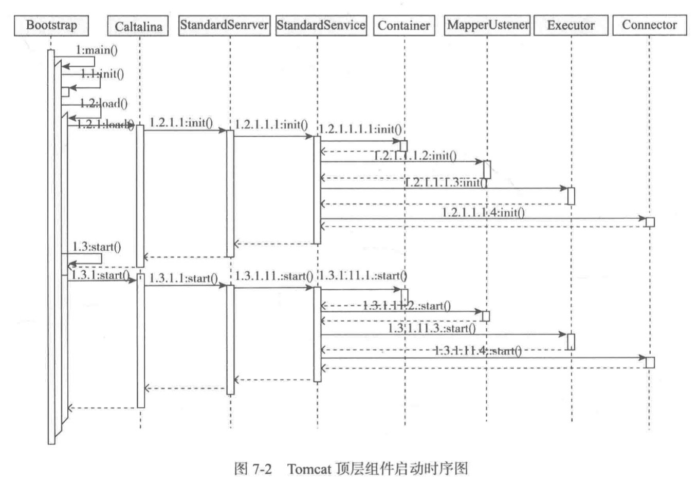

# Lifecycle

## 1. Lifecycle接口

* 通过实现Lifecycle接口，可以达到统一启动/关闭这些组件的效果，
* Catalina允许组件包含其他组件，因此父组件要负责启动/关闭子组件，
    * **从而实现启动一个组件（大部分组件都实现了这个接口）**，就将全部应用的组件全部启动的效果，
    * 这种单一启动/关闭的机制正是通过Lifecycle接口实现的

* Lifecycle（Tomcat 9）接口如下：
    * 13中LifecycleEvent事件类型
    * 3个管理监听器的方法
    * 4个声明周期方法
    * 2个获取当前状态的方法
```java
package org.apache.catalina;


/**
 * Common interface for component life cycle methods.  Catalina components
 * may implement this interface (as well as the appropriate interface(s) for
 * the functionality they support) in order to provide a consistent mechanism
 * to start and stop the component.
 * <br>
 * The valid state transitions for components that support {@link Lifecycle}
 * are:
 * <pre>
 *            start()
 *  -----------------------------
 *  |                           |
 *  | init()                    |
 * NEW -»-- INITIALIZING        |
 * | |           |              |     ------------------«-----------------------
 * | |           |auto          |     |                                        |
 * | |          \|/    start() \|/   \|/     auto          auto         stop() |
 * | |      INITIALIZED --»-- STARTING_PREP --»- STARTING --»- STARTED --»---  |
 * | |         |                                                            |  |
 * | |destroy()|                                                            |  |
 * | --»-----«--    ------------------------«--------------------------------  ^
 * |     |          |                                                          |
 * |     |         \|/          auto                 auto              start() |
 * |     |     STOPPING_PREP ----»---- STOPPING ------»----- STOPPED -----»-----
 * |    \|/                               ^                     |  ^
 * |     |               stop()           |                     |  |
 * |     |       --------------------------                     |  |
 * |     |       |                                              |  |
 * |     |       |    destroy()                       destroy() |  |
 * |     |    FAILED ----»------ DESTROYING ---«-----------------  |
 * |     |                        ^     |                          |
 * |     |     destroy()          |     |auto                      |
 * |     --------»-----------------    \|/                         |
 * |                                 DESTROYED                     |
 * |                                                               |
 * |                            stop()                             |
 * ----»-----------------------------»------------------------------
 *
 * Any state can transition to FAILED.
 *
 * Calling start() while a component is in states STARTING_PREP, STARTING or
 * STARTED has no effect.
 *
 * Calling start() while a component is in state NEW will cause init() to be
 * called immediately after the start() method is entered.
 *
 * Calling stop() while a component is in states STOPPING_PREP, STOPPING or
 * STOPPED has no effect.
 *
 * Calling stop() while a component is in state NEW transitions the component
 * to STOPPED. This is typically encountered when a component fails to start and
 * does not start all its sub-components. When the component is stopped, it will
 * try to stop all sub-components - even those it didn't start.
 *
 * Attempting any other transition will throw {@link LifecycleException}.
 *
 * </pre>
 * The {@link LifecycleEvent}s fired during state changes are defined in the
 * methods that trigger the changed. No {@link LifecycleEvent}s are fired if the
 * attempted transition is not valid.
 *
 * @author Craig R. McClanahan
 */
public interface Lifecycle {


    // ----------------------------------------------------- Manifest Constants
    /**
     * The LifecycleEvent type for the "component before init" event.
     */
    public static final String BEFORE_INIT_EVENT = "before_init";
    /**
     * The LifecycleEvent type for the "component after init" event.
     */
    public static final String AFTER_INIT_EVENT = "after_init";
    /**
     * The LifecycleEvent type for the "component start" event.
     */
    public static final String START_EVENT = "start";
    /**
     * The LifecycleEvent type for the "component before start" event.
     */
    public static final String BEFORE_START_EVENT = "before_start";
    /**
     * The LifecycleEvent type for the "component after start" event.
     */
    public static final String AFTER_START_EVENT = "after_start";
    /**
     * The LifecycleEvent type for the "component stop" event.
     */
    public static final String STOP_EVENT = "stop";
    /**
     * The LifecycleEvent type for the "component before stop" event.
     */
    public static final String BEFORE_STOP_EVENT = "before_stop";
    /**
     * The LifecycleEvent type for the "component after stop" event.
     */
    public static final String AFTER_STOP_EVENT = "after_stop";
    /**
     * The LifecycleEvent type for the "component after destroy" event.
     */
    public static final String AFTER_DESTROY_EVENT = "after_destroy";
    /**
     * The LifecycleEvent type for the "component before destroy" event.
     */
    public static final String BEFORE_DESTROY_EVENT = "before_destroy";
    /**
     * The LifecycleEvent type for the "periodic" event.
     */
    public static final String PERIODIC_EVENT = "periodic";
    /**
     * The LifecycleEvent type for the "configure_start" event. Used by those
     * components that use a separate component to perform configuration and
     * need to signal when configuration should be performed - usually after
     * {@link #BEFORE_START_EVENT} and before {@link #START_EVENT}.
     */
    public static final String CONFIGURE_START_EVENT = "configure_start";
    /**
     * The LifecycleEvent type for the "configure_stop" event. Used by those
     * components that use a separate component to perform configuration and
     * need to signal when de-configuration should be performed - usually after
     * {@link #STOP_EVENT} and before {@link #AFTER_STOP_EVENT}.
     */
    public static final String CONFIGURE_STOP_EVENT = "configure_stop";
    // --------------------------------------------------------- Public Methods
    /**
     * Add a LifecycleEvent listener to this component.
     *
     * @param listener The listener to add
     */
    public void addLifecycleListener(LifecycleListener listener);
    /**
     * Get the life cycle listeners associated with this life cycle.
     *
     * @return An array containing the life cycle listeners associated with this
     *         life cycle. If this component has no listeners registered, a
     *         zero-length array is returned.
     */
    public LifecycleListener[] findLifecycleListeners();
    /**
     * Remove a LifecycleEvent listener from this component.
     *
     * @param listener The listener to remove
     */
    public void removeLifecycleListener(LifecycleListener listener);
    /**
     * Prepare the component for starting. This method should perform any
     * initialization required post object creation. The following
     * {@link LifecycleEvent}s will be fired in the following order:
     * <ol>
     *   <li>INIT_EVENT: On the successful completion of component
     *                   initialization.</li>
     * </ol>
     *
     * @exception LifecycleException if this component detects a fatal error
     *  that prevents this component from being used
     */
    public void init() throws LifecycleException;
    /**
     * Prepare for the beginning of active use of the public methods other than
     * property getters/setters and life cycle methods of this component. This
     * method should be called before any of the public methods other than
     * property getters/setters and life cycle methods of this component are
     * utilized. The following {@link LifecycleEvent}s will be fired in the
     * following order:
     * <ol>
     *   <li>BEFORE_START_EVENT: At the beginning of the method. It is as this
     *                           point the state transitions to
     *                           {@link LifecycleState#STARTING_PREP}.</li>
     *   <li>START_EVENT: During the method once it is safe to call start() for
     *                    any child components. It is at this point that the
     *                    state transitions to {@link LifecycleState#STARTING}
     *                    and that the public methods other than property
     *                    getters/setters and life cycle methods may be
     *                    used.</li>
     *   <li>AFTER_START_EVENT: At the end of the method, immediately before it
     *                          returns. It is at this point that the state
     *                          transitions to {@link LifecycleState#STARTED}.
     *                          </li>
     * </ol>
     *
     * @exception LifecycleException if this component detects a fatal error
     *  that prevents this component from being used
     */
    public void start() throws LifecycleException;
    /**
     * Gracefully terminate the active use of the public methods other than
     * property getters/setters and life cycle methods of this component. Once
     * the STOP_EVENT is fired, the public methods other than property
     * getters/setters and life cycle methods should not be used. The following
     * {@link LifecycleEvent}s will be fired in the following order:
     * <ol>
     *   <li>BEFORE_STOP_EVENT: At the beginning of the method. It is at this
     *                          point that the state transitions to
     *                          {@link LifecycleState#STOPPING_PREP}.</li>
     *   <li>STOP_EVENT: During the method once it is safe to call stop() for
     *                   any child components. It is at this point that the
     *                   state transitions to {@link LifecycleState#STOPPING}
     *                   and that the public methods other than property
     *                   getters/setters and life cycle methods may no longer be
     *                   used.</li>
     *   <li>AFTER_STOP_EVENT: At the end of the method, immediately before it
     *                         returns. It is at this point that the state
     *                         transitions to {@link LifecycleState#STOPPED}.
     *                         </li>
     * </ol>
     *
     * Note that if transitioning from {@link LifecycleState#FAILED} then the
     * three events above will be fired but the component will transition
     * directly from {@link LifecycleState#FAILED} to
     * {@link LifecycleState#STOPPING}, bypassing
     * {@link LifecycleState#STOPPING_PREP}
     *
     * @exception LifecycleException if this component detects a fatal error
     *  that needs to be reported
     */
    public void stop() throws LifecycleException;
    /**
     * Prepare to discard the object. The following {@link LifecycleEvent}s will
     * be fired in the following order:
     * <ol>
     *   <li>DESTROY_EVENT: On the successful completion of component
     *                      destruction.</li>
     * </ol>
     *
     * @exception LifecycleException if this component detects a fatal error
     *  that prevents this component from being used
     */
    public void destroy() throws LifecycleException;
    /**
     * Obtain the current state of the source component.
     *
     * @return The current state of the source component.
     */
    public LifecycleState getState();
    /**
     * Obtain a textual representation of the current component state. Useful
     * for JMX. The format of this string may vary between point releases and
     * should not be relied upon to determine component state. To determine
     * component state, use {@link #getState()}.
     *
     * @return The name of the current component state.
     */
    public String getStateName();
    /**
     * Marker interface used to indicate that the instance should only be used
     * once. Calling {@link #stop()} on an instance that supports this interface
     * will automatically call {@link #destroy()} after {@link #stop()}
     * completes.
     */
    public interface SingleUse {
    }
}
```

**其中start\(\)和stop\(\)方法必须提供实现，以供父类调用，实现对它的启动/关闭**

以下三个方法则与事件监听相关\(观察者模式\)

```java
addLifecycleListener 

findLifecycleListeners 

removeLifecycleListener
```

## 2. LifecycleEvent类：生命周期事件

```java
public final class LifecycleEvent extends EventObject {

    public LifecycleEvent(Lifecycle lifecycle, String type) {
        this(lifecycle, type, null);
    }

    public LifecycleEvent(Lifecycle lifecycle, String type, Object data) {
        super(lifecycle);
        this.lifecycle = lifecycle;
        this.type = type;
        this.data = data;
    }

    private Object data = null;

    private Lifecycle lifecycle = null;

    private String type = null;

    public Object getData() {
        return (this.data);
    }

    public Lifecycle getLifecycle() {
        return (this.lifecycle);
    }

    public String getType() {
        return (this.type);
    }
}
```

## 3. LifecycleListener接口：生命周期监听器

```java
public interface LifecycleListener {
    // 当某个事件监听器监听到相关事件发生时，会调用该方法
    public void lifecycleEvent(LifecycleEvent event);
}
```

## 4. 工具类LifecycleSupport

**LifecycleSupport将所有的LifecycleListener存在数组listeners中**

实现了Lifecycle接口的组件可以使用LifecycleSupport类

```java
public final class LifecycleSupport {
    public LifecycleSupport(Lifecycle lifecycle) {
        super();
        this.lifecycle = lifecycle;
    }

    private Lifecycle lifecycle = null;
    private LifecycleListener listeners[] = new LifecycleListener[0];

    public void addLifecycleListener(LifecycleListener listener) {

        synchronized (listeners) {
            LifecycleListener results[] = new LifecycleListener[listeners.length + 1];
            for (int i = 0; i < listeners.length; i++)
                results[i] = listeners[i];
            results[listeners.length] = listener;
            listeners = results;
        }

    }

    public LifecycleListener[] findLifecycleListeners() {
        return listeners;
    }

    public void fireLifecycleEvent(String type, Object data) {
        LifecycleEvent event = new LifecycleEvent(lifecycle, type, data);
        LifecycleListener interested[] = null;
        synchronized (listeners) {
            interested = (LifecycleListener[]) listeners.clone();
        }
        for (int i = 0; i < interested.length; i++)
            interested[i].lifecycleEvent(event);
    }

    public void removeLifecycleListener(LifecycleListener listener) {
        synchronized (listeners) {
            int n = -1;
            for (int i = 0; i < listeners.length; i++) {
                if (listeners[i] == listener) {
                    n = i;
                    break;
                }
            }
            if (n < 0)
                return;
            LifecycleListener results[] = new LifecycleListener[listeners.length - 1];
            int j = 0;
            for (int i = 0; i < listeners.length; i++) {
                if (i != n)
                    results[j++] = listeners[i];
            }
            listeners = results;
        }
    }
}
```

## lifecycle的工作流程

### SimpleContext

本例的context：SimpleContext实现了Lifecycle接口，拥有LifecycleSupport属性\(实现了Lifecycle接口的组件可以使用LifecycleSupport类\)

```java
protected LifecycleSupport lifecycle = new LifecycleSupport(this);
```

与上一节相比SimpleContext在实现了Context, Pipeline的基础上，又实现了Lifecycle接口，几个方法实现如下：

添加事件监听器\[LifecycleListener\]：

```java
// 如前所述，通过LifecycleSupport实例，完成addLifecycleListener，removeLifecycleListener
public void addLifecycleListener(LifecycleListener listener) {
    lifecycle.addLifecycleListener(listener);
}
```

移除事件监听器\[LifecycleListener\]：

```java
public void removeLifecycleListener(LifecycleListener listener) {
    lifecycle.removeLifecycleListener(listener);
}
```

start，stop

```java
// 需要将所有子容器、以及相关组件包括载入器Loader、管道Pipeline、映射器Mapper等都启动
public synchronized void start() throws LifecycleException {

    // 触发BEFORE_START_EVENT事件
    lifecycle.fireLifecycleEvent(BEFORE_START_EVENT, null);
    started = true;

    // loader启动
    if ((loader != null) && (loader instanceof Lifecycle))
        ((Lifecycle) loader).start();

    // 子容器启动
    Container children[] = findChildren();
    for (int i = 0; i < children.length; i++) {
        if (children[i] instanceof Lifecycle)
            ((Lifecycle) children[i]).start();
    }

    //Pipeline中的Value启动 
    if (pipeline instanceof Lifecycle)
        ((Lifecycle) pipeline).start();

    // 触发START_EVENT事件
    lifecycle.fireLifecycleEvent(START_EVENT, null);

    // 触发AFTER_START_EVENT事件
    lifecycle.fireLifecycleEvent(AFTER_START_EVENT, null);
}

public void stop() throws LifecycleException {

    // 触发事件
    lifecycle.fireLifecycleEvent(BEFORE_STOP_EVENT, null);
    lifecycle.fireLifecycleEvent(STOP_EVENT, null);
    started = false;
    // Stop the Valves in our pipeline (including the basic), if any
    if (pipeline instanceof Lifecycle) {
        ((Lifecycle) pipeline).stop();
    }

    // Stop our child containers, if any
    Container children[] = findChildren();
    for (int i = 0; i < children.length; i++) {
        if (children[i] instanceof Lifecycle)
            ((Lifecycle) children[i]).stop();
    }

    if ((loader != null) && (loader instanceof Lifecycle)) {
        ((Lifecycle) loader).stop();
    }

    // 触发事件
    lifecycle.fireLifecycleEvent(AFTER_STOP_EVENT, null);
}
```

触发事件的具体机制：

借助于工具类LifecycleSupport来触发某个事件。

```java
lifecycle.fireLifecycleEvent()
```

fireLifecycleEvent方法会调用LifecycleListener实例的lifecycleEvent\(event\)方法实际进行动作：

```java
for (int i = 0; i < interested.length; i++)
    interested[i].lifecycleEvent(event);
```

### SimpleContextLifecycleListener

本例实现了一个生命周期监听器

```java
public class SimpleContextLifecycleListener implements LifecycleListener {

    public void lifecycleEvent(LifecycleEvent event) {
        Lifecycle lifecycle = event.getLifecycle();
        System.out.println("SimpleContextLifecycleListener's event " + event.getType().toString());
        if (Lifecycle.START_EVENT.equals(event.getType())) {
            System.out.println("Starting context.");
        } else if (Lifecycle.STOP_EVENT.equals(event.getType())) {
            System.out.println("Stopping context.");
        }
    }
}
```

### Bootstrap：

与前面不一样的部分：  
为context添加生命周期监听器

```java
LifecycleListener listener = new SimpleContextLifecycleListener();
((Lifecycle) context).addLifecycleListener(listener);
```

```java
启动context的生命周期
((Lifecycle) context).start();
```

## 流程图


# Lifecycle与Bootstrap
* Tomcat的组件均拥有start,stop等生命周期方法，拥有管理生命周期的特性，这一特性抽象为Lifecycle接口
* Tomcat所有组件均实现了Lifecycle接口：
    * **LifecycleBase**：Lifecycle的默认实现类是LifecycleBase
        * **init(),start(),stop(),destroy()方法的实现就在这个类中。**
        * **start()方法会检查LifecycleState是否为NEW,如果是，则将先调用init()方法首先进行初始化**
        * **这四个方法又会调用模板方法initInternal(),startInternal(),stopInternal(),destroyInternal()，这些模板方法由各个组件具体实现。**
    * **LifecycleMBeanBase**：抽象类LifecycleMBeanBase继承自LifecycleBase，并实现了接口JmxEnabled（public interface JmxEnabled extends MBeanRegistration）从而将自身注册为MBean(JMX)。Tomcat可利用管理工具对其进行动态维护，参见Tomcat文档
    [Monitoring and Managing Tomcat](http://tomcat.apache.org/tomcat-9.0-doc/monitoring.html)
    * StandardServer，StandardService通过继承LifecycleMBeanBase间接实现Lifecycle接口
    * ContainerBase通过继承LifecycleMBeanBase间接实现Lifecycle接口
        * 四个Container通过继承ContainerBase间接实现Lifecycle接口

## BootStrap:Tomcat入口类
```java
/**
    * Main method and entry point when starting Tomcat via the provided
    * scripts.
    *
    * @param args Command line arguments to be processed
    */
public static void main(String args[]) {

    if (daemon == null) {
        // Don't set daemon until init() has completed
        Bootstrap bootstrap = new Bootstrap();
        try {
            // 初始化ClassLoader，通过ClassLoader创建Catalina实例，并将其赋给属性catalinaDaemon
            bootstrap.init();
        } catch (Throwable t) {
            handleThrowable(t);
            t.printStackTrace();
            return;
        }
        daemon = bootstrap;
    } else {
        // When running as a service the call to stop will be on a new
        // thread so make sure the correct class loader is used to prevent
        // a range of class not found exceptions.
        Thread.currentThread().setContextClassLoader(daemon.catalinaLoader);
    }

    // 处理传入的命令，如果args参数为空，默认执行start
    try {
        String command = "start";
        if (args.length > 0) {
            command = args[args.length - 1];
        }

        if (command.equals("startd")) {
            args[args.length - 1] = "start";
            daemon.load(args);
            daemon.start();
        } else if (command.equals("stopd")) {
            args[args.length - 1] = "stop";
            daemon.stop();
        } else if (command.equals("start")) {
            daemon.setAwait(true);
            daemon.load(args);
            daemon.start();
        } else if (command.equals("stop")) {
            daemon.stopServer(args);
        } else if (command.equals("configtest")) {
            daemon.load(args);
            if (null==daemon.getServer()) {
                System.exit(1);
            }
            System.exit(0);
        } else {
            log.warn("Bootstrap: command \"" + command + "\" does not exist.");
        }
    } catch (Throwable t) {
        // Unwrap the Exception for clearer error reporting
        if (t instanceof InvocationTargetException &&
                t.getCause() != null) {
            t = t.getCause();
        }
        handleThrowable(t);
        t.printStackTrace();
        System.exit(1);
    }

}

```
start命令的处理调用了三个方法setAwait(),load(),start()。在这三个方法内部具体通过Catalina的实例catalinaDaemon属性，通过反射来调用catalinaDaemon的方法执行。以start()方法为例：
```java
/**
    * Start the Catalina daemon.
    * @throws Exception Fatal start error
    */
public void start() throws Exception {
    // 先判断catalinaDaemon有没有实例化，如果没有，则实例化
    if( catalinaDaemon==null ) 
        init();
    // 通过反射调用catalinaDaemon的start()方法
    Method method = catalinaDaemon.getClass()
                    .getMethod("start", (Class [] )null);
    method.invoke(catalinaDaemon, (Object [])null);

}
```
## Catalina
* Bootstrap处理start命令，会通过反射调用Catalina的setAwait(),load(),start()方法。

### setAwait()方法
* 设置Tomcat启动完成后是否进入等待状态的flag：await属性，该属性会在start()方法中被用与判断是否进入等待状态
```java
public boolean isAwait() {
    return await;
}
```
### load()方法
* **根据配置文件conf/server.xml创建Server对象，并赋值给属性server**(即创建整个tomcat组件实例)
* 具体的解析操作由Apache开源项目Digester完成
* 调用server的init()方法，开始生命周期的初始化工作
```java
/**
* Start a new server instance.
*/
public void load() {

    long t1 = System.nanoTime();

    initDirs();

    // Before digester - it may be needed
    initNaming();

    // Create and execute our Digester
    Digester digester = createStartDigester();
    // 通过Digester创建Server实例,并赋值给属性server
    InputSource inputSource = null;
    InputStream inputStream = null;
    File file = null;
    try {
        try {
            file = configFile();
            inputStream = new FileInputStream(file);
            inputSource = new InputSource(file.toURI().toURL().toString());
        } catch (Exception e) {
            if (log.isDebugEnabled()) {
                log.debug(sm.getString("catalina.configFail", file), e);
            }
        }
        if (inputStream == null) {
            try {
                inputStream = getClass().getClassLoader()
                    .getResourceAsStream(getConfigFile());
                inputSource = new InputSource
                    (getClass().getClassLoader()
                    .getResource(getConfigFile()).toString());
            } catch (Exception e) {
                if (log.isDebugEnabled()) {
                    log.debug(sm.getString("catalina.configFail",
                            getConfigFile()), e);
                }
            }
        }

        // This should be included in catalina.jar
        // Alternative: don't bother with xml, just create it manually.
        if (inputStream == null) {
            try {
                inputStream = getClass().getClassLoader()
                        .getResourceAsStream("server-embed.xml");
                inputSource = new InputSource
                (getClass().getClassLoader()
                        .getResource("server-embed.xml").toString());
            } catch (Exception e) {
                if (log.isDebugEnabled()) {
                    log.debug(sm.getString("catalina.configFail",
                            "server-embed.xml"), e);
                }
            }
        }


        if (inputStream == null || inputSource == null) {
            if  (file == null) {
                log.warn(sm.getString("catalina.configFail",
                        getConfigFile() + "] or [server-embed.xml]"));
            } else {
                log.warn(sm.getString("catalina.configFail",
                        file.getAbsolutePath()));
                if (file.exists() && !file.canRead()) {
                    log.warn("Permissions incorrect, read permission is not allowed on the file.");
                }
            }
            return;
        }

        try {
            inputSource.setByteStream(inputStream);
            digester.push(this);
            digester.parse(inputSource);
        } catch (SAXParseException spe) {
            log.warn("Catalina.start using " + getConfigFile() + ": " +
                    spe.getMessage());
            return;
        } catch (Exception e) {
            log.warn("Catalina.start using " + getConfigFile() + ": " , e);
            return;
        }
    } finally {
        if (inputStream != null) {
            try {
                inputStream.close();
            } catch (IOException e) {
                // Ignore
            }
        }
    }

    // 
    getServer().setCatalina(this);
    getServer().setCatalinaHome(Bootstrap.getCatalinaHomeFile());
    getServer().setCatalinaBase(Bootstrap.getCatalinaBaseFile());

    // Stream redirection
    initStreams();

    // Start the new server
    try {
        // 正式开启Tomcat生命周期，调用server的init()方法
        getServer().init();
    } catch (LifecycleException e) {
        if (Boolean.getBoolean("org.apache.catalina.startup.EXIT_ON_INIT_FAILURE")) {
            throw new java.lang.Error(e);
        } else {
            log.error("Catalina.start", e);
        }
    }

    long t2 = System.nanoTime();
    if(log.isInfoEnabled()) {
        log.info("Initialization processed in " + ((t2 - t1) / 1000000) + " ms");
    }
}
```
### start()方法
* 调用server的start()方法，开始启动工作
* 根据属性await判断是否让程序进入等待状态
```java
/**
    * Start a new server instance.
    */
public void start() {

    // 首先判断server是否实例化，如果没有，则实例化
    if (getServer() == null) {
        load();
    }

    if (getServer() == null) {
        log.fatal("Cannot start server. Server instance is not configured.");
        return;
    }

    long t1 = System.nanoTime();

    // Start the new server
    try {
        // 调用server的start()方法启动服务器
        getServer().start();
    } catch (LifecycleException e) {
        log.fatal(sm.getString("catalina.serverStartFail"), e);
        try {
            getServer().destroy();
        } catch (LifecycleException e1) {
            log.debug("destroy() failed for failed Server ", e1);
        }
        return;
    }

    long t2 = System.nanoTime();
    if(log.isInfoEnabled()) {
        log.info("Server startup in " + ((t2 - t1) / 1000000) + " ms");
    }

    // Register shutdown hook
    if (useShutdownHook) {
        if (shutdownHook == null) {
            shutdownHook = new CatalinaShutdownHook();
        }
        // 注册一个新的虚拟机关闭挂钩（即一个简单初始化但还没有启动的线程）
        // 程序退出时,启动该线程
        // 将会调用Catalina.this.stop()方法
        Runtime.getRuntime().addShutdownHook(shutdownHook);

        // If JULI is being used, disable JULI's shutdown hook since
        // shutdown hooks run in parallel and log messages may be lost
        // if JULI's hook completes before the CatalinaShutdownHook()
        LogManager logManager = LogManager.getLogManager();
        if (logManager instanceof ClassLoaderLogManager) {
            ((ClassLoaderLogManager) logManager).setUseShutdownHook(
                    false);
        }
    }
    // 进入等待状态，等待tomcat的stop命令
    if (await) {
        // 调用server的await()方法
        await();
        stop();
    }
}
```

## Server
### init
* Bootstrap处理start命令，会通过反射调用Catalina的setAwait(),load(),start()方法
    * Catalina的load()方法将会调用Server的init()方法，开始生命周期的初始化工作。
* Server的init()方法首先被调用：Server实现了Lifecycle接口，实际调用的是父类LifecycleBase的init()方法，而该方法将调用StandardServer的模板方法initInternal()：

```java
/**
    * Invoke a pre-startup initialization. This is used to allow connectors
    * to bind to restricted ports under Unix operating environments.
    */
@Override
protected void initInternal() throws LifecycleException {

    // 调用LifecycleMBeanBase的initInternal()方法,注册为MBean
    super.initInternal();

    // Register global String cache
    // Note although the cache is global, if there are multiple Servers
    // present in the JVM (may happen when embedding) then the same cache
    // will be registered under multiple names
    onameStringCache = register(new StringCache(), "type=StringCache");

    // Register the MBeanFactory
    MBeanFactory factory = new MBeanFactory();
    factory.setContainer(this);
    onameMBeanFactory = register(factory, "type=MBeanFactory");

    // Register the naming resources
    globalNamingResources.init();

    // Populate the extension validator with JARs from common and shared
    // class loaders
    if (getCatalina() != null) {
        ClassLoader cl = getCatalina().getParentClassLoader();
        // Walk the class loader hierarchy. Stop at the system class loader.
        // This will add the shared (if present) and common class loaders
        while (cl != null && cl != ClassLoader.getSystemClassLoader()) {
            if (cl instanceof URLClassLoader) {
                URL[] urls = ((URLClassLoader) cl).getURLs();
                for (URL url : urls) {
                    if (url.getProtocol().equals("file")) {
                        try {
                            File f = new File (url.toURI());
                            if (f.isFile() &&
                                    f.getName().endsWith(".jar")) {
                                ExtensionValidator.addSystemResource(f);
                            }
                        } catch (URISyntaxException e) {
                            // Ignore
                        } catch (IOException e) {
                            // Ignore
                        }
                    }
                }
            }
            cl = cl.getParent();
        }
    }
    // Initialize our defined Services
    for (int i = 0; i < services.length; i++) {
        services[i].init();
    }
}
```
### start
* Bootstrap处理start命令，会通过反射调用Catalina的setAwait(),load(),start()方法
    * Catalina的start()方法将会调用Server的start(),await()，启动服务器并进入等待状态。当shutdown命令到来时，调用Server的stop()方法关闭服务器。

* Server的start()方法首先被调用：Server实现了Lifecycle接口，实际调用的是父类LifecycleBase的start()方法，而该方法将调用StandardServer的模板方法startInternal()：
    * Server将启动naming resources
    * Server将启动所有的Service。
    ```java
    @Override
    protected void startInternal() throws LifecycleException {

        fireLifecycleEvent(CONFIGURE_START_EVENT, null);
        setState(LifecycleState.STARTING);
        // 调用NamingResourcesImpl的startInternal()方法
        globalNamingResources.start();

        // Start our defined Services
        synchronized (servicesLock) {
            for (int i = 0; i < services.length; i++) {
                // 调用Service的startInternal()方法
                services[i].start();
            }
        }
    }
    ```
* Server的await()方法随后被调用：
    * 根据conf/server.xml中的配置
    ```xml
    <Server port="8005" shutdown="SHUTDOWN">
    ```
    * 首先判断端口号port，然后根据port的值有三种处理方法
    
    ```java
    /**
        * Wait until a proper shutdown command is received, then return.
        * This keeps the main thread alive - the thread pool listening for http
        * connections is daemon threads.
        */
    @Override
    public void await() {
        // Negative values - don't wait on port - tomcat is embedded or we just don't like ports
        // 当在配置文件中设置port为-2,不进入await状态，直接退出tomcat
        if( port == -2 ) {
            // undocumented yet - for embedding apps that are around, alive.
            return;
        }
        // 当在配置文件中设置port为-1，则进入await循环，该循环内部没有break语句
        // 即只有在外部调用了stop()方法将stopAwait置为true，才能关闭Tomcat
        if( port==-1 ) {
            try {
                awaitThread = Thread.currentThread();
                while(!stopAwait) {
                    try {
                        Thread.sleep( 10000 );
                    } catch( InterruptedException ex ) {
                        // continue and check the flag
                    }
                }
            } finally {
                awaitThread = null;
            }
            return;
        }
        // 当在配置文件中设置port为其他值，在port端口启动一个ServerSocket监听关闭命令。
        // 进入await循环，如果接收到退出命令，则退出循环，关闭tomcat。
        // Set up a server socket to wait on
        try {
            awaitSocket = new ServerSocket(port, 1,
                    InetAddress.getByName(address));
        } catch (IOException e) {
            log.error("StandardServer.await: create[" + address
                                + ":" + port
                                + "]: ", e);
            return;
        }

        try {
            awaitThread = Thread.currentThread();

            // Loop waiting for a connection and a valid command
            while (!stopAwait) {
                ServerSocket serverSocket = awaitSocket;
                if (serverSocket == null) {
                    break;
                }

                // Wait for the next connection
                Socket socket = null;
                StringBuilder command = new StringBuilder();
                try {
                    InputStream stream;
                    long acceptStartTime = System.currentTimeMillis();
                    try {
                        socket = serverSocket.accept();
                        socket.setSoTimeout(10 * 1000);  // Ten seconds
                        stream = socket.getInputStream();
                    } catch (SocketTimeoutException ste) {
                        // This should never happen but bug 56684 suggests that
                        // it does.
                        log.warn(sm.getString("standardServer.accept.timeout",
                                Long.valueOf(System.currentTimeMillis() - acceptStartTime)), ste);
                        continue;
                    } catch (AccessControlException ace) {
                        log.warn("StandardServer.accept security exception: "
                                + ace.getMessage(), ace);
                        continue;
                    } catch (IOException e) {
                        if (stopAwait) {
                            // Wait was aborted with socket.close()
                            break;
                        }
                        log.error("StandardServer.await: accept: ", e);
                        break;
                    }

                    // Read a set of characters from the socket
                    int expected = 1024; // Cut off to avoid DoS attack
                    while (expected < shutdown.length()) {
                        if (random == null)
                            random = new Random();
                        expected += (random.nextInt() % 1024);
                    }
                    while (expected > 0) {
                        int ch = -1;
                        try {
                            ch = stream.read();
                        } catch (IOException e) {
                            log.warn("StandardServer.await: read: ", e);
                            ch = -1;
                        }
                        // Control character or EOF (-1) terminates loop
                        if (ch < 32 || ch == 127) {
                            break;
                        }
                        command.append((char) ch);
                        expected--;
                    }
                } finally {
                    // Close the socket now that we are done with it
                    try {
                        if (socket != null) {
                            socket.close();
                        }
                    } catch (IOException e) {
                        // Ignore
                    }
                }

                // Match against our command string
                boolean match = command.toString().equals(shutdown);
                if (match) {
                    log.info(sm.getString("standardServer.shutdownViaPort"));
                    break;
                } else
                    log.warn("StandardServer.await: Invalid command '"
                            + command.toString() + "' received");
            }
        } finally {
            ServerSocket serverSocket = awaitSocket;
            awaitThread = null;
            awaitSocket = null;

            // Close the server socket and return
            if (serverSocket != null) {
                try {
                    serverSocket.close();
                } catch (IOException e) {
                    // Ignore
                }
            }
        }
    }
    ```

## Service
### start
* Bootstrap.main(
    * Catalina.start()
        * Server.start()
        * StandardServer.startInternal()
            * Service.start()
            * StandardService.startInternal()

* 启动Engine
* 启动Executor
* 启动MapperListener
* 启动Connector
```java
/**
    * Start nested components ({@link Executor}s, {@link Connector}s and
    * {@link Container}s) and implement the requirements of
    * {@link org.apache.catalina.util.LifecycleBase#startInternal()}.
    *
    * @exception LifecycleException if this component detects a fatal error
    *  that prevents this component from being used
    */
@Override
protected void startInternal() throws LifecycleException {

    if(log.isInfoEnabled())
        log.info(sm.getString("standardService.start.name", this.name));
    setState(LifecycleState.STARTING);

    // Start our defined Container first
    if (engine != null) {
        synchronized (engine) {
            engine.start();
        }
    }

    synchronized (executors) {
        for (Executor executor: executors) {
            executor.start();
        }
    }

    mapperListener.start();

    // Start our defined Connectors second
    synchronized (connectorsLock) {
        for (Connector connector: connectors) {
            // If it has already failed, don't try and start it
            if (connector.getState() != LifecycleState.FAILED) {
                connector.start();
            }
        }
    }
}
```
