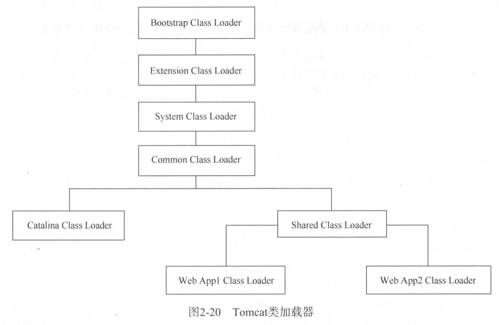
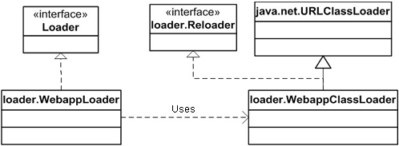

# loader

## tomcat的类加载器，需要满足如下功能
**Servlet规范要求每个web应用都有一个独立的类加载器实例**
* 隔离性，web应用类库相互隔离
* 灵活性,重新部署web应用不影响其他应用(热部署)
* 性能，不会搜索其他web应用jar包

## Tomcat ClassLoader层次结构

Tomcat提供了三个基础的类加载器和Web应用类加载器,三个类加载器指向的路径和包列表由catalina.properties配置

* Common,顶层的公用类加载器，路径为common.loader,默认指向$CATALINA_HOME/lib下的包
    * Tomcat应用服务器内部和Web应用均可见的类
* Catalina,用来加载Tomcat应用服务器的类加载器，路径为server.loader,默认为空。此时Tomcat使用Common类加载器加载应用服务器
    * 只有Tomcat应用服务器内部可见的类
* Shared,所有Web应用的父加载器，路径为shared.loader，默认为空，此时Tomcat使用Common类加载器作为Web应用的父加载器。
* Web应用,加载/WEB-INF/classes目录下的未压缩的Class和资源文件以及/WEB-INF/lib目录下的Jar包。

**默认情况下，Common,Calatina,Shared三个类加载器是同一个**

catalina.property
```xml
common.loader="${catalina.base}/lib","${catalina.base}/lib/*.jar","${catalina.home}/lib","${catalina.home}/lib/*.jar"
server.loader=
shared.loader=
```


## Web应用类加载器加载顺序
* 从缓存中加载
* 从JVM的Bootstrap类加载器加载
* 从当前类加载器加载（顺序WEB-INF/classes,WEB-INF/lib）
* 从父类加载器加载，父类加载器裁采用默认的委派模式。
### delegate属性
context.xml文件配置\<Loader delegate="true" /\>

默认为false，用于控制是否启用JAVA委派模式，当配置为true时，Tomcat使用JAVA默认的委派模式
* 从缓存中加载
* 从JVM的Bootstrap类加载器加载
* 从父类加载器加载，父类加载器裁采用默认的委派模式。
* 从当前类加载器加载（顺序WEB-INF/classes,WEB-INF/lib）

### 默认情况delegate=false时，应该注意的问题
不要在web应用中包含Servlet规范相关API，否则会覆盖Tomcat提供的Servlet API。
## Loader接口

Tomcat载入器是web app载入器，而不仅仅是类载入器。Tomcat载入器\(web app class loader\)会使用一个自定义的类载入器\(class loader\).

Tomcat载入器实现接口Loader

```java
package org.apache.catalina;

import java.beans.PropertyChangeListener;

public interface Loader {

    // ------------------------------------------------------------- Properties

    /**
     * Return the Java class loader to be used by this Container.
     */
    public ClassLoader getClassLoader();

    // Tomcat载入器通常和context级别的container关联
    /**
     * Return the Container with which this Loader has been associated.
     */
    public Container getContainer();

    /**
     * Set the Container with which this Loader has been associated.
     *
     * @param container
     *            The associated Container
     */
    public void setContainer(Container container);

    /**
     * Return the DefaultContext with which this Manager is associated.
     */
    public DefaultContext getDefaultContext();

    /**
     * Set the DefaultContext with which this Manager is associated.
     *
     * @param defaultContext
     *            The newly associated DefaultContext
     */
    public void setDefaultContext(DefaultContext defaultContext);

    // 指明载入器的实现是否委托给父类载入器完成
    /**
     * Return the "follow standard delegation model" flag used to configure our
     * ClassLoader.
     */
    public boolean getDelegate();

    /**
     * Set the "follow standard delegation model" flag used to configure our
     * ClassLoader.
     *
     * @param delegate
     *            The new flag
     */
    public void setDelegate(boolean delegate);

    /**
     * Return descriptive information about this Loader implementation and the corresponding version number, in the format
     * <code>&lt;description&gt;/&lt;version&gt;</code>.
     */
    public String getInfo();

    // 指明是否支持类的重载
    /**
     * Return the reloadable flag for this Loader.
     */
    public boolean getReloadable();

    /**
     * Set the reloadable flag for this Loader.
     *
     * @param reloadable
     *            The new reloadable flag
     */
    public void setReloadable(boolean reloadable);

    // --------------------------------------------------------- Public Methods

    /**
     * Add a property change listener to this component.
     *
     * @param listener
     *            The listener to add
     */
    public void addPropertyChangeListener(PropertyChangeListener listener);

    // 对仓库集合进行操作（WEB-INFO/lib，WEB-INFO/classes）
    /**
     * Add a new repository to the set of repositories for this class loader.
     *
     * @param repository
     *            Repository to be added
     */
    public void addRepository(String repository);

    /**
     * Return the set of repositories defined for this class loader. If none are
     * defined, a zero-length array is returned.
     */
    public String[] findRepositories();

    // 支持类的重载
    /**
     * Has the internal repository associated with this Loader been modified,
     * such that the loaded classes should be reloaded?
     */
    public boolean modified();

    /**
     * Remove a property change listener from this component.
     *
     * @param listener
     *            The listener to remove
     */
    public void removePropertyChangeListener(PropertyChangeListener listener);

}
```

**Catalina提供WebappLoader作为Loader的实现类**

**WebappLoader使用WebappClassLoader（extends URLClassLoader）作为类载入器**

如图所示：




## Reloader接口
```java
package org.apache.catalina.loader;

/**
 * Internal interface that <code>ClassLoader</code> implementations may
 * optionally implement to support the auto-reload functionality of the
 * classloader associated with the context.
 *
 * @author Craig R. McClanahan
 * @version $Revision: 1.5 $ $Date: 2001/07/22 20:25:10 $
 */

public interface Reloader {

	/**
	 * Add a new repository to the set of places this ClassLoader can look for
	 * classes to be loaded.
	 *
	 * @param repository
	 *            Name of a source of classes to be loaded, such as a directory
	 *            pathname, a JAR file pathname, or a ZIP file pathname
	 *
	 * @exception IllegalArgumentException
	 *                if the specified repository is invalid or does not exist
	 */
	public void addRepository(String repository);

	/**
	 * Return a String array of the current repositories for this class loader.
	 * If there are no repositories, a zero-length array is returned.
	 */
	public String[] findRepositories();
	
	// 如果web应用程序中的某个servlet或相关类被修改了，该方法返回true
	/**
	 * Have one or more classes or resources been modified so that a reload is
	 * appropriate?
	 */
	public boolean modified();

}
```
## WebappLoader：web应用程序载入器

### 启动
WebappLoader也实现了Lifecycle接口，根据lifecycle一节可知，webappLoader将由container启动（start方法）

SimpleWrapper.java
```java
public synchronized void start() throws LifecycleException {
    //...
    // Start our subordinate components, if any
    if ((loader != null) && (loader instanceof Lifecycle))
        ((Lifecycle) loader).start();

    //...
}
```
WebappLoader.java
```java
public void start() throws LifecycleException {

	// Validate and update our current component state
	if (started)
		throw new LifecycleException(sm.getString("webappLoader.alreadyStarted"));
	if (debug >= 1)
		log(sm.getString("webappLoader.starting"));
	lifecycle.fireLifecycleEvent(START_EVENT, null);
	started = true;

	if (container.getResources() == null)
		return;

	// Register a stream handler factory for the JNDI protocol
	URLStreamHandlerFactory streamHandlerFactory = new DirContextURLStreamHandlerFactory();
	try {
		URL.setURLStreamHandlerFactory(streamHandlerFactory);
	} catch (Throwable t) {
		// Ignore the error here.
	}

	// Construct a class loader based on our current repositories list
	try {
        // 通过私有方法createClassLoader创建默认的类载入器
		classLoader = createClassLoader();
		classLoader.setResources(container.getResources());
		classLoader.setDebug(this.debug);
		classLoader.setDelegate(this.delegate);

		for (int i = 0; i < repositories.length; i++) {
			classLoader.addRepository(repositories[i]);
		}

		// Configure our repositories
		setRepositories();
		setClassPath();

		setPermissions();

		if (classLoader instanceof Lifecycle)
			((Lifecycle) classLoader).start();

		// Binding the Webapp class loader to the directory context
		DirContextURLStreamHandler.bind((ClassLoader) classLoader, this.container.getResources());

	} catch (Throwable t) {
		throw new LifecycleException("start: ", t);
	}

	// Validate that all required packages are actually available
	validatePackages();

	// Start our background thread if we are reloadable
	if (reloadable) {
		log(sm.getString("webappLoader.reloading"));
		try {
			threadStart();
		} catch (IllegalStateException e) {
			throw new LifecycleException(e);
		}
	}

}
```

### 创建类加载器
在WebappLoader启动时，将会调用createClassLoader方法创建默认的类载入器实例:org.apache.catalina.loader.WebappClassLoader


```java
private WebappClassLoader createClassLoader() throws Exception {
    // private String loaderClass = "org.apache.catalina.loader.WebappClassLoader";
    
	Class clazz = Class.forName(loaderClass);
	WebappClassLoader classLoader = null;

	if (parentClassLoader == null) {
		// Will cause a ClassCast is the class does not extend WCL, but
		// this is on purpose (the exception will be caught and rethrown)
		classLoader = (WebappClassLoader) clazz.newInstance();
	} else {
		Class[] argTypes = { ClassLoader.class };
		Object[] args = { parentClassLoader };
		Constructor constr = clazz.getConstructor(argTypes);
		classLoader = (WebappClassLoader) constr.newInstance(args);
	}

	return classLoader;

}
```

可以继承WebappClassLoader以自己实现类加载器，并通过get set方法，改变类加载器

### 设置仓库
在WebappLoader启动时，将会调用setRepositories方法设置默认的仓库为WEB-INF/classes目录和WEB-INF/lib目录
```java
private void setRepositories() {
    // ...	
	String classesPath = "/WEB-INF/classes";
	
	// Adding the repository to the class loader
	classLoader.addRepository(classesPath + "/", classRepository);

	// Setting up the JAR repository (/WEB-INF/lib), if it exists

	String libPath = "/WEB-INF/lib";

	classLoader.setJarPath(libPath);
    // ...

```

### 设置类路径
在WebappLoader启动时，将会调用setClassPath方法设置类路径，该方法将会在servlet上下文中为Jasper JSP编译器设置一个字符串形式的属性来指明类路径信息。
```java
private void setClassPath() {
	// Store the assembled class path as a servlet context attribute
	servletContext.setAttribute(Globals.CLASS_PATH_ATTR, classpath.toString());

}
```
### 设置访问权限
在WebappLoader启动时，将会调用setPermissions方法为类载入器设置访问相关目录的权限（只允许访问/WEB-INF/classes/，/WEB-INF/lib/），若没有使用安全管理器，则什么也不做

### 开启新线程执行类的重新载入
```java
// Loop until the termination semaphore is set
while (!threadDone) {

    // Wait for our check interval
    threadSleep();

    if (!started)
        break;

    try {
        // Perform our modification check
        if (!classLoader.modified())
            continue;
    } catch (Exception e) {
        log(sm.getString("webappLoader.failModifiedCheck"), e);
        continue;
    }

    // Handle a need for reloading
    notifyContext();
    break;

}
```


