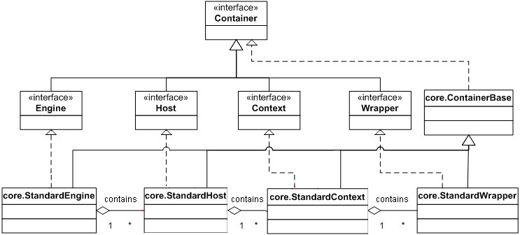
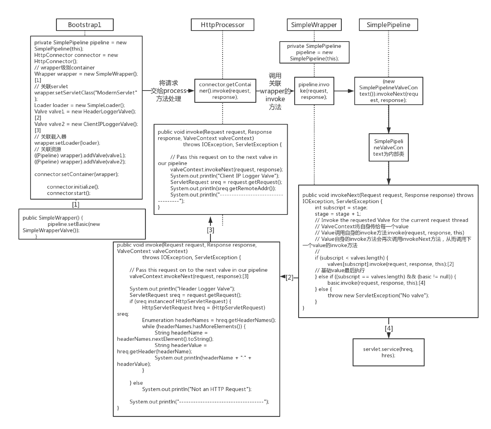
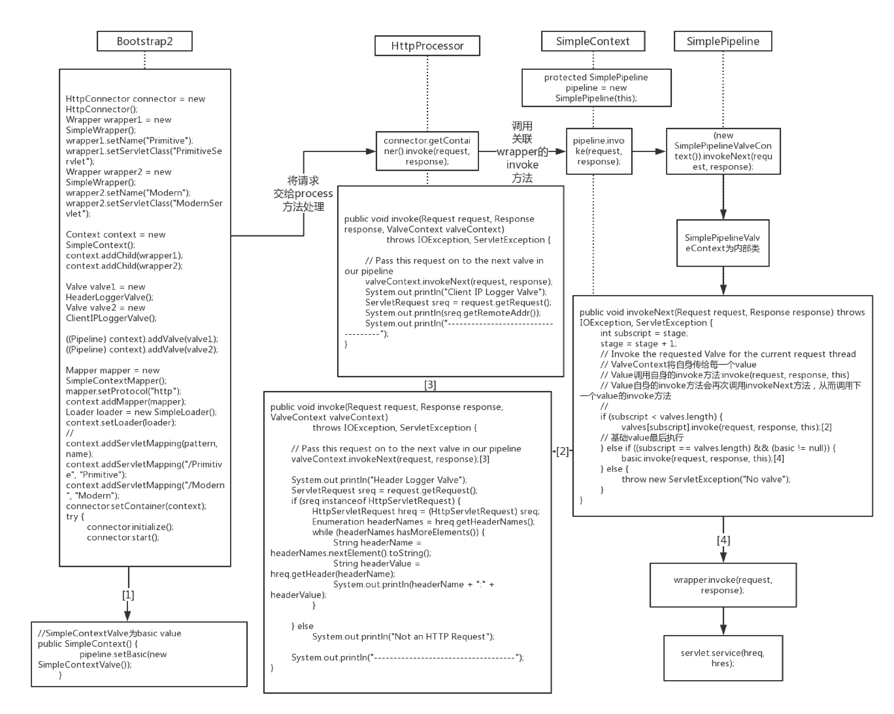

# Tomcat的四种容器



Engine：整个Catalina servlet引擎

Host:表示包含一个或多个context容器的虚拟主机

Context：表示一个Web应用，可以有多个Wrapper

Wrapper：表示一个独立的servlet

# Container接口提供增删查子容器的方法

```java
public void addChild(Container child);
public void removeChild(Container child);
public Container findChild(String name);
public Container[] findChildren();
```

# 组件

**容器包含组件：载入器，记录器，管理器，领域，资源**

**Container接口提供getter，setter方法将这些组件与容器关联**

```java
public Loader getLoader();
public void setLoader(Loader loader);
public Logger getLogger();
public void setLogger(Logger logger);
public Manager getManager();
public void setManager(Manager manager);
public Cluster getCluster();
public void setCluster(Cluster cluster);    
public Realm getRealm();
public void setRealm(Realm realm);
public DirContext getResources();
public void setResources(DirContext resources);
```

# pipeline：管道任务

管道包含该servlet容器要调用的任务。

一个阈表示一个具体的执行任务。

在servlet容器中，有一个基础阈。

可以添加任意多个阈。

也可以通过Tomcat配置文件server.xml动态的添加阈。

管道任务保证所有阈（value）以及基础阈（basic value）都被调用一次！

**管道任务采用了责任链设计模式**

工作流程图如下：

container为Wrapper（查看大图）：


container为Context（查看大图）：

