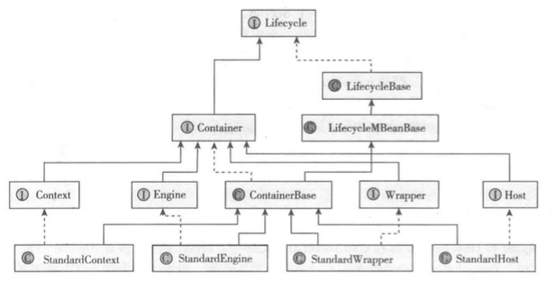

# 顶层结构
* Server
    * Service 
        * Connector 
        * Container
            * Engine
            * Host
            * Context
            * Wrapper
            



## Server
代表整个Tomcat应用服务器

* Server接口：
    * set global naming resources，定义了服务器的全局JNDI资源
    * 管理Tomcat shutdown
    * 管理Service，可以有多个service
    * Server实现类：StandardServer
    * 从配置文件来看Server：
```xml
<?xml version="1.0" encoding="UTF-8"?>
<!-- Note:  A "Server" is not itself a "Container", so you may not
     define subcomponents such as "Valves" at this level.
     Documentation at /docs/config/server.html
 -->
<Server port="8005" shutdown="SHUTDOWN">
  <Listener className="org.apache.catalina.startup.VersionLoggerListener" />
  <!-- Security listener. Documentation at /docs/config/listeners.html
  <Listener className="org.apache.catalina.security.SecurityListener" />
  -->
  <!--APR library loader. Documentation at /docs/apr.html -->
  <Listener className="org.apache.catalina.core.AprLifecycleListener" SSLEngine="on" />
  <!-- Prevent memory leaks due to use of particular java/javax APIs-->
  <Listener className="org.apache.catalina.core.JreMemoryLeakPreventionListener" />
  <Listener className="org.apache.catalina.mbeans.GlobalResourcesLifecycleListener" />
  <Listener className="org.apache.catalina.core.ThreadLocalLeakPreventionListener" />

  <!-- Global JNDI resources
       Documentation at /docs/jndi-resources-howto.html
  -->
  <GlobalNamingResources>
    <!-- Editable user database that can also be used by
         UserDatabaseRealm to authenticate users
    -->
    <Resource name="UserDatabase" auth="Container"
              type="org.apache.catalina.UserDatabase"
              description="User database that can be updated and saved"
              factory="org.apache.catalina.users.MemoryUserDatabaseFactory"
              pathname="conf/tomcat-users.xml" />
  </GlobalNamingResources>

  <!-- A "Service" is a collection of one or more "Connectors" that share
       a single "Container" Note:  A "Service" is not itself a "Container",
       so you may not define subcomponents such as "Valves" at this level.
       Documentation at /docs/config/service.html
   -->
  <Service name="Catalina">

    ...
  </Service>
</Server>
```
## Service
* Server中的Services相互独立，Service组合了连接器（监听请求的到来，返回响应，处理各种底层网络协议）和Servlet容器(具体处理请求)，一个 Service可以设置多个 Connector，但是只能有一个Container
* **通过多个Service来实现一个Tomcat安装多个对同名webApp**
* **Service的作用主要是解耦Continer和Connector**
* 从配置文件来看Service：
```xml
<?xml version="1.0" encoding="UTF-8"?>
<Server port="8005" shutdown="SHUTDOWN">
  ...
  <Service name="Catalina">

    <!--The connectors can use a shared executor, you can define one or more named thread pools-->
    <!--
    <Executor name="tomcatThreadPool" namePrefix="catalina-exec-"
        maxThreads="150" minSpareThreads="4"/>
    -->


    <!-- A "Connector" represents an endpoint by which requests are received
         and responses are returned. Documentation at :
         Java HTTP Connector: /docs/config/http.html
         Java AJP  Connector: /docs/config/ajp.html
         APR (HTTP/AJP) Connector: /docs/apr.html
         Define a non-SSL/TLS HTTP/1.1 Connector on port 8080
    -->
    <Connector port="8080" protocol="HTTP/1.1"
               connectionTimeout="20000"
               redirectPort="8443" />
    <!-- A "Connector" using the shared thread pool-->
    <!--
    <Connector executor="tomcatThreadPool"
               port="8080" protocol="HTTP/1.1"
               connectionTimeout="20000"
               redirectPort="8443" />
    -->
    <!-- Define a SSL/TLS HTTP/1.1 Connector on port 8443
         This connector uses the NIO implementation. The default
         SSLImplementation will depend on the presence of the APR/native
         library and the useOpenSSL attribute of the
         AprLifecycleListener.
         Either JSSE or OpenSSL style configuration may be used regardless of
         the SSLImplementation selected. JSSE style configuration is used below.
    -->
    <!--
    <Connector port="8443" protocol="org.apache.coyote.http11.Http11NioProtocol"
               maxThreads="150" SSLEnabled="true">
        <SSLHostConfig>
            <Certificate certificateKeystoreFile="conf/localhost-rsa.jks"
                         type="RSA" />
        </SSLHostConfig>
    </Connector>
    -->
    <!-- Define a SSL/TLS HTTP/1.1 Connector on port 8443 with HTTP/2
         This connector uses the APR/native implementation which always uses
         OpenSSL for TLS.
         Either JSSE or OpenSSL style configuration may be used. OpenSSL style
         configuration is used below.
    -->
    <!--
    <Connector port="8443" protocol="org.apache.coyote.http11.Http11AprProtocol"
               maxThreads="150" SSLEnabled="true" >
        <UpgradeProtocol className="org.apache.coyote.http2.Http2Protocol" />
        <SSLHostConfig>
            <Certificate certificateKeyFile="conf/localhost-rsa-key.pem"
                         certificateFile="conf/localhost-rsa-cert.pem"
                         certificateChainFile="conf/localhost-rsa-chain.pem"
                         type="RSA" />
        </SSLHostConfig>
    </Connector>
    -->

    <!-- Define an AJP 1.3 Connector on port 8009 -->
    <Connector port="8009" protocol="AJP/1.3" redirectPort="8443" />


    <!-- An Engine represents the entry point (within Catalina) that processes
         every request.  The Engine implementation for Tomcat stand alone
         analyzes the HTTP headers included with the request, and passes them
         on to the appropriate Host (virtual host).
         Documentation at /docs/config/engine.html -->

    <!-- You should set jvmRoute to support load-balancing via AJP ie :
    <Engine name="Catalina" defaultHost="localhost" jvmRoute="jvm1">
    -->
    <Engine name="Catalina" defaultHost="localhost">
      ...
    </Engine>
  </Service>
</Server>
```
## Container
所有子容器都必须实现Container接口，Container使用了**责任链的设计模式**，Tomcat有四个子容器，分别是：Engine、Host、Context、Wrapper，这四个组件不是平行的，而是父子关系，Engine 包含 Host,Host 包含 Context，Context 包含 Wrapper。通常**一个 Servlet class 对应一个 Wrapper，一个web app对应一个Context**

### ContainerBase
* Container的默认子接口，四个Container都继承自ContainerBase类。
* ContainerBase提供了Container接口的默认实现

### Engine
* 最顶层的父容器
* 管理Cluster
* 管理Realm
* 实现类是StandardEngine
* 子容器是Host
* 从配置文件来看Engine：
```xml
<?xml version="1.0" encoding="UTF-8"?>
<Server port="8005" shutdown="SHUTDOWN">
  ...
  <Service name="Catalina">
    ...
    <Engine name="Catalina" defaultHost="localhost">

      <!--For clustering, please take a look at documentation at:
          /docs/cluster-howto.html  (simple how to)
          /docs/config/cluster.html (reference documentation) -->
      <!--
      <Cluster className="org.apache.catalina.ha.tcp.SimpleTcpCluster"/>
      -->

      <!-- Use the LockOutRealm to prevent attempts to guess user passwords
           via a brute-force attack -->
      <Realm className="org.apache.catalina.realm.LockOutRealm">
        <!-- This Realm uses the UserDatabase configured in the global JNDI
             resources under the key "UserDatabase".  Any edits
             that are performed against this UserDatabase are immediately
             available for use by the Realm.  -->
        <Realm className="org.apache.catalina.realm.UserDatabaseRealm"
               resourceName="UserDatabase"/>
      </Realm>

      <Host name="localhost"  appBase="webapps"
            unpackWARs="true" autoDeploy="true">
        ...
      </Host>
    </Engine>
  </Service>
</Server>
```
### Host
* 一个 Host 在 Engine 中代表一个虚拟主机,它负责
* **管理多个webapp,包括deploy webapp,unparck war等**
* **保存一个主机应该有的信息**。
* 实现类是StandardHost
* 除了所有容器都继承的 ContainerBase 外，StandardHost 还实现了 Deployer 接口，Deployer接口定义了deploy/undeploy,start/stop web app等等方法，Host通过这些方法完成对web app的部署
* Deployer 接口的实现是 StandardHostDeployer
* 子容器是Context
* 从配置文件来看Host:
```xml
<?xml version="1.0" encoding="UTF-8"?>
<Server port="8005" shutdown="SHUTDOWN">
  ...
  <Service name="Catalina">
    ...
    <Engine name="Catalina" defaultHost="localhost">
      ...
      <Host name="localhost"  appBase="webapps"
            unpackWARs="true" autoDeploy="true">

        <!-- SingleSignOn valve, share authentication between web applications
             Documentation at: /docs/config/valve.html -->
        <!--
        <Valve className="org.apache.catalina.authenticator.SingleSignOn" />
        -->

        <!-- Access log processes all example.
             Documentation at: /docs/config/valve.html
             Note: The pattern used is equivalent to using pattern="common" -->
        <Valve className="org.apache.catalina.valves.AccessLogValve" directory="logs"
               prefix="localhost_access_log" suffix=".txt"
               pattern="%h %l %u %t &quot;%r&quot; %s %b" />
      </Host>
    </Engine>
  </Service>
</Server>
```
### Context
* Context 代表 Servlet 的 Context(即对应一个web app)，它具备了 Servlet 运行的基本环境。
* Context 管理它里面的 Servlet 实例，Servlet 实例在 Context 中是以 Wrapper 出现的
* Context 如何才能找到正确的 Servlet 来执行它呢？ Tomcat5 以前是通过一个 Mapper 类来管理的，Tomcat5 以后这个功能被移到了 request 中。
* 它主要是设置各种资源属性和管理组件，还有非常重要的就是启动子容器和 Pipeline等。

* Context 的配置文件中有个 reloadable 属性，如下面配置：

    server.xml
    ```xml
    <Context
        path="/library"
        docBase="D:\projects\library\deploy\target\library.war"
        reloadable="true"
    />
    ```
    当这个 reloadable 设为 true 时，war 被修改后 Tomcat 会自动的重新加载这个应用.详见[hot_roload and hot_redeploy](./hot_reload_redeploy.md)

Context.xml
```xml
<?xml version="1.0" encoding="UTF-8"?>
<Context>

    <!-- Default set of monitored resources. If one of these changes, the    -->
    <!-- web application will be reloaded.                                   -->
    <WatchedResource>WEB-INF/web.xml</WatchedResource>
    <WatchedResource>${catalina.base}/conf/web.xml</WatchedResource>

    <!-- Uncomment this to disable session persistence across Tomcat restarts -->
    <!--
    <Manager pathname="" />
    -->
</Context>
```
### Wrapper
* Wrapper 代表一个 Servlet，它负责管理一个 Servlet，包括的 Servlet 的装载、初始化、执行以及资源回收
* Wrapper 是最底层的容器，它没有子容器
* Wrapper 的实现类是 StandardWrapper，StandardWrapper 还实现了拥有一个 Servlet 初始化信息的 ServletConfig，由此看出 StandardWrapper 将直接和 Servlet 的各种信息打交道。
```java
/**
    * Load and initialize an instance of this servlet, if there is not already
    * at least one initialized instance.  This can be used, for example, to
    * load servlets that are marked in the deployment descriptor to be loaded
    * at server startup time.
    * @return the loaded Servlet instance
    * @throws ServletException for a Servlet load error
    */
public synchronized Servlet loadServlet() throws ServletException {

    // Nothing to do if we already have an instance or an instance pool
    if (!singleThreadModel && (instance != null))
        return instance;

    PrintStream out = System.out;
    if (swallowOutput) {
        SystemLogHandler.startCapture();
    }

    Servlet servlet;
    try {
        long t1=System.currentTimeMillis();
        // Complain if no servlet class has been specified
        if (servletClass == null) {
            unavailable(null);
            throw new ServletException
                (sm.getString("standardWrapper.notClass", getName()));
        }

        InstanceManager instanceManager = ((StandardContext)getParent()).getInstanceManager();
        try {
            servlet = (Servlet) instanceManager.newInstance(servletClass);
        } catch (ClassCastException e) {
            unavailable(null);
            // Restore the context ClassLoader
            throw new ServletException
                (sm.getString("standardWrapper.notServlet", servletClass), e);
        } catch (Throwable e) {
            e = ExceptionUtils.unwrapInvocationTargetException(e);
            ExceptionUtils.handleThrowable(e);
            unavailable(null);

            // Added extra log statement for Bugzilla 36630:
            // http://bz.apache.org/bugzilla/show_bug.cgi?id=36630
            if(log.isDebugEnabled()) {
                log.debug(sm.getString("standardWrapper.instantiate", servletClass), e);
            }

            // Restore the context ClassLoader
            throw new ServletException
                (sm.getString("standardWrapper.instantiate", servletClass), e);
        }

        if (multipartConfigElement == null) {
            MultipartConfig annotation =
                    servlet.getClass().getAnnotation(MultipartConfig.class);
            if (annotation != null) {
                multipartConfigElement =
                        new MultipartConfigElement(annotation);
            }
        }

        processServletSecurityAnnotation(servlet.getClass());

        // Special handling for ContainerServlet instances
        if ((servlet instanceof ContainerServlet) &&
                (isContainerProvidedServlet(servletClass) ||
                        ((Context) getParent()).getPrivileged() )) {
            ((ContainerServlet) servlet).setWrapper(this);
        }

        classLoadTime=(int) (System.currentTimeMillis() -t1);

        if (servlet instanceof SingleThreadModel) {
            if (instancePool == null) {
                instancePool = new Stack<>();
            }
            singleThreadModel = true;
        }

        initServlet(servlet);

        fireContainerEvent("load", this);

        loadTime=System.currentTimeMillis() -t1;
    } finally {
        if (swallowOutput) {
            String log = SystemLogHandler.stopCapture();
            if (log != null && log.length() > 0) {
                if (getServletContext() != null) {
                    getServletContext().log(log);
                } else {
                    out.println(log);
                }
            }
        }
    }
    return servlet;

}
```


