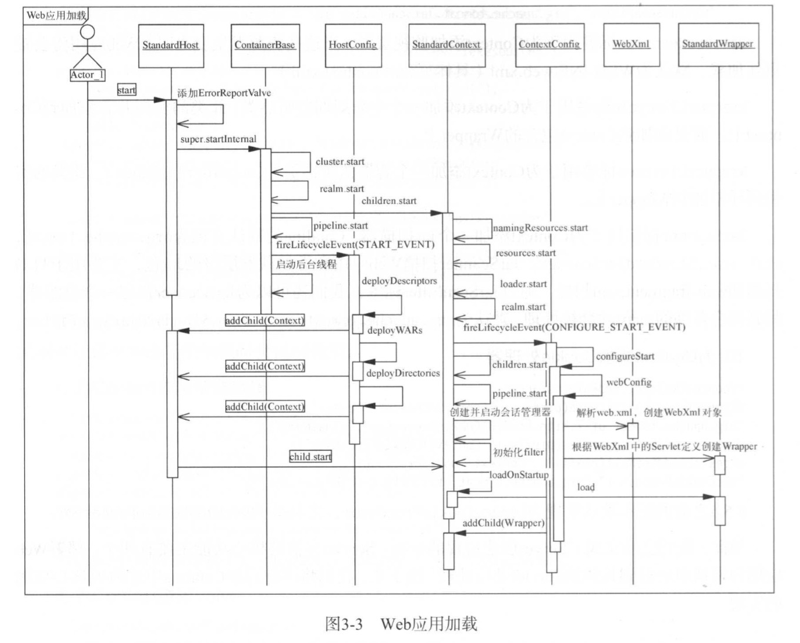

# WebApp Deploy Process
## Catalina对Web App的加载过程


## Catalina对Web App的加载过程主要涉及的类
* StandardHost
* HostConfig
* StandardContext
* ContextConfig
* StandardWrapper

## StandardHost加载Web App的两个路口
### Context配置在server.xml中
* [如果server.xml的Host元素存在子元素Context，则在解析server.xml时，一并完成Context的创建，并在Host启动时，调用其子容器的start()方法启动。](#1)
    * 这种方式可以实现Context配置的深度定制（例如为Context增加安全管理，甚至重新指定Context和Wrapper的实现类，添加Context支持的属性和子元素而不局限于其默认配置）
### HostConfig自动扫描
* [由HostConfig自动扫描部署目录或独立的Context配置文件，创建Context实例并启动](#STARTING)
    * 大多数web app采用这种方式

#### HostConfig自动扫描部署目录或独立的Context配置文件，将处理以下三种部署方式
* 通过Context描述符部署
* 将包含webapp所有资源的目录放到Host指定的appBase目录下
* 将包含webapp所有资源的War包放到Host指定的appBase目录下


先通过一篇转载的文章，了解context描述符部署webapp
[Tomcat Context config](./config/context_config.md)


Tomcat 部署Webapp过程如下
# Engine Start
Engine由StandardService启动

[如Bootstrap中所述，tomcat通过实现生命周期接口来启动各组件](./bootstrap.md)
* Bootstrap.main(
    * Catalina.start()
        * Server.start()
        * StandardServer.startInternal()
            * Service.start()
            * StandardService.startInternal()
                * 启动Engine
                * 启动Executor
                * 启动MapperListener
                * 启动Connector

StandardService#startInternal()将启动Engine
```java
// Start our defined Container first
if (engine != null) {
    synchronized (engine) {
        engine.start();
    }
}
```
StandardEngine#startInternal()
```java
@Override
protected synchronized void startInternal() throws LifecycleException {

    // Log our server identification information
    if(log.isInfoEnabled())
        log.info( "Starting Servlet Engine: " + ServerInfo.getServerInfo());

    // Standard container startup
    super.startInternal();
}
```
## 调用ContainerBase#startInternal()
```java
/**
    * Start this component and implement the requirements
    * of {@link org.apache.catalina.util.LifecycleBase#startInternal()}.
    *
    * @exception LifecycleException if this component detects a fatal error
    *  that prevents this component from being used
    */
@Override
protected synchronized void startInternal() throws LifecycleException {

    // Start our subordinate components, if any
    logger = null;
    getLogger();
    Cluster cluster = getClusterInternal();
    if (cluster instanceof Lifecycle) {
        ((Lifecycle) cluster).start();
    }
    Realm realm = getRealmInternal();
    if (realm instanceof Lifecycle) {
        ((Lifecycle) realm).start();
    }

    // Start our child containers, if any
    Container children[] = findChildren();
    List<Future<Void>> results = new ArrayList<>();
    for (int i = 0; i < children.length; i++) {
        results.add(startStopExecutor.submit(new StartChild(children[i])));
    }

    boolean fail = false;
    for (Future<Void> result : results) {
        try {
            result.get();
        } catch (Exception e) {
            log.error(sm.getString("containerBase.threadedStartFailed"), e);
            fail = true;
        }

    }
    if (fail) {
        throw new LifecycleException(
                sm.getString("containerBase.threadedStartFailed"));
    }

    // Start the Valves in our pipeline (including the basic), if any
    if (pipeline instanceof Lifecycle)
        ((Lifecycle) pipeline).start();


    setState(LifecycleState.STARTING);

    // Start our thread
    threadStart();

}
```

* 如果配置了Cluster启动
* 如果配置了Realm启动
* 启动子节点Host
```java
// ----------------------------- Inner classes used with start/stop Executor

private static class StartChild implements Callable<Void> {

    private Container child;

    public StartChild(Container child) {
        this.child = child;
    }

    @Override
    public Void call() throws LifecycleException {
        // 启动Host
        child.start();
        return null;
    }
}
```
* 启动Engine持有的pipeline
* 设置Engine状态为LifecycleState.STARTING，此举会触发START_EVENT生命周期事件。EngineConfig监听到该事件，仅仅打印日志
* 启动Engine层级后台任务处理
    * Cluster后台任务
    * Realm后台任务
    * Pipeline中Value的后台任务
### Cluster等启动放在ContainerBase中的原因
Cluster专用于配置Tomcat集群的元素，**可用于Engine和Host容器中**。在用于Engine容器中时，Engine中的所有Host均支持集群功能。在Cluster元素中，需要直接定义一个Manager元素，这个Manager元素有一个其值为org.apache.catalina.ha.session.DeltaManager或org.apache.catalina.ha.session.BackupManager的className属性。同时，Cluster中还需要分别定义一个Channel和ClusterListener元素。

# Host Start
与Engine相似，ContainerBase#startInternal()通过线程池使用其他线程来启动Host

```java
/**
    * Start this component and implement the requirements
    * of {@link org.apache.catalina.util.LifecycleBase#startInternal()}.
    *
    * @exception LifecycleException if this component detects a fatal error
    *  that prevents this component from being used
    */
@Override
protected synchronized void startInternal() throws LifecycleException {

    // Set error report valve
    String errorValve = getErrorReportValveClass();
    if ((errorValve != null) && (!errorValve.equals(""))) {
        try {
            boolean found = false;
            Valve[] valves = getPipeline().getValves();
            for (Valve valve : valves) {
                if (errorValve.equals(valve.getClass().getName())) {
                    found = true;
                    break;
                }
            }
            if(!found) {
                Valve valve =
                    (Valve) Class.forName(errorValve).getConstructor().newInstance();
                getPipeline().addValve(valve);
            }
        } catch (Throwable t) {
            ExceptionUtils.handleThrowable(t);
            log.error(sm.getString(
                    "standardHost.invalidErrorReportValveClass",
                    errorValve), t);
        }
    }
    super.startInternal();
}
```
## 添加ErrorReportValve
主要用于在服务器处理异常时输出错误页面，如果没有在web.xml中添加错误页面，则异常栈页面由它来生成

通过在web.xml中添加\<error-page\>来添加错误处理页面

也可以通过设置Host的errorReportValveClass来指定全局的错误处理页面
## 调用ContainerBase#startInternal()启动Host
* 如果配置了Cluster启动
* 如果配置了Realm启动
* <span id="1">**启动子节点(StandHost加载Web App的第一种路口)**</span>
    * 如果server.xml中配置了Context元素，则Context将在Catalina构造Server实例时被
* 启动Host持有的pipeline
* <span id="STARTING">**设置Host状态为LifecycleState.STARTING，此举会触发START_EVENT生命周期事件。HostConfig监听到该事件，扫描Web部署目录，对于部署描述文件，WAR包，目录会自动创建StandardContext实例，添加到Host并启动(StandHost加载Web App的第二种路口)**</span>
    ```java
    public enum LifecycleState {
        NEW(false, null),
        INITIALIZING(false, Lifecycle.BEFORE_INIT_EVENT),
        INITIALIZED(false, Lifecycle.AFTER_INIT_EVENT),
        STARTING_PREP(false, Lifecycle.BEFORE_START_EVENT),
        STARTING(true, Lifecycle.START_EVENT),
        STARTED(true, Lifecycle.AFTER_START_EVENT),
        STOPPING_PREP(true, Lifecycle.BEFORE_STOP_EVENT),
        STOPPING(false, Lifecycle.STOP_EVENT),
        STOPPED(false, Lifecycle.AFTER_STOP_EVENT),
        DESTROYING(false, Lifecycle.BEFORE_DESTROY_EVENT),
        DESTROYED(false, Lifecycle.AFTER_DESTROY_EVENT),
        FAILED(false, null);

        private final boolean available;
        private final String lifecycleEvent;

        private LifecycleState(boolean available, String lifecycleEvent) {
            this.available = available;
            this.lifecycleEvent = lifecycleEvent;
        }
        public String getLifecycleEvent() {
            return lifecycleEvent;
        }
    }
    ```
    ```java
    protected synchronized void startInternal() throws LifecycleException {
        ...
        setState(LifecycleState.STARTING);
        // Start our thread
        threadStart();
    }
    ```
    ```java
    protected synchronized void setState(LifecycleState state) throws LifecycleException {
        setStateInternal(state, null, true);
    }
    ```
    ```java
    private synchronized void setStateInternal(LifecycleState state, Object data, boolean check)
            throws LifecycleException {

        if (log.isDebugEnabled()) {
            log.debug(sm.getString("lifecycleBase.setState", this, state));
        }

        if (check) {
            // Must have been triggered by one of the abstract methods (assume
            // code in this class is correct)
            // null is never a valid state
            if (state == null) {
                invalidTransition("null");
                // Unreachable code - here to stop eclipse complaining about
                // a possible NPE further down the method
                return;
            }

            // Any method can transition to failed
            // startInternal() permits STARTING_PREP to STARTING
            // stopInternal() permits STOPPING_PREP to STOPPING and FAILED to
            // STOPPING
            if (!(state == LifecycleState.FAILED ||
                    (this.state == LifecycleState.STARTING_PREP &&
                            state == LifecycleState.STARTING) ||
                    (this.state == LifecycleState.STOPPING_PREP &&
                            state == LifecycleState.STOPPING) ||
                    (this.state == LifecycleState.FAILED &&
                            state == LifecycleState.STOPPING))) {
                // No other transition permitted
                invalidTransition(state.name());
            }
        }

        this.state = state;
        String lifecycleEvent = state.getLifecycleEvent();
        if (lifecycleEvent != null) {
            // 触发START_EVENT
            fireLifecycleEvent(lifecycleEvent, data);
        }
    }
    ```
* 启动Host层级后台任务处理
    * Cluster后台任务
    * Realm后台任务
    * Pipeline中Value的后台任务
# HostConfig
HostConfig是一个生命周期监听器。[由Catalina默认添加到Host实例上](./bootstrap.md)
```java
public class HostConfig implements LifecycleListener {
```
server.xml中有如下默认配置，（并不包含Context相关配置）即我们将war包置于$CATALINA_BASE/webapps路径下时，Tomcat将会自动扫描部署该webapp[(StandHost加载Web App路口2)](#STARTING)。

server.xml
```xml
<Host name="localhost"  appBase="webapps"
            unpackWARs="true" autoDeploy="true">
```
这是通过HostConfig实现的。HostConfig（该类位于包org.apache.catalina.startup下）仅用于容器启动时的Web应用部署（且需要Host的deployOnStartup属性为true）。而Tomcat的Web App可以还可以通过其他多种方式进行部署，如后台定时加载，通过管理工具部署，集群部署等。


**HostConfig处理如下生命周期事件**
```java
@Override
public void lifecycleEvent(LifecycleEvent event) {

    // Identify the host we are associated with
    try {
        host = (Host) event.getLifecycle();
        if (host instanceof StandardHost) {
            setCopyXML(((StandardHost) host).isCopyXML());
            setDeployXML(((StandardHost) host).isDeployXML());
            setUnpackWARs(((StandardHost) host).isUnpackWARs());
            setContextClass(((StandardHost) host).getContextClass());
        }
    } catch (ClassCastException e) {
        log.error(sm.getString("hostConfig.cce", event.getLifecycle()), e);
        return;
    }

    // Process the event that has occurred
    if (event.getType().equals(Lifecycle.PERIODIC_EVENT)) {
        check();
    } else if (event.getType().equals(Lifecycle.BEFORE_START_EVENT)) {
        beforeStart();
    } else if (event.getType().equals(Lifecycle.START_EVENT)) {
        start();
    } else if (event.getType().equals(Lifecycle.STOP_EVENT)) {
        stop();
    }
}
```
## Lifecycle.BEFORE_START_EVENT
```java
public void beforeStart() {
    if (host.getCreateDirs()) {
        File[] dirs = new File[] {host.getAppBaseFile(),host.getConfigBaseFile()};
        for (int i=0; i<dirs.length; i++) {
            if (!dirs[i].mkdirs() && !dirs[i].isDirectory()) {
                log.error(sm.getString("hostConfig.createDirs",dirs[i]));
            }
        }
    }
}
```
## Lifecycle.START_EVENT
[Host启动过程中，会设置Host状态为LifecycleState.STARTING，此举会触发START_EVENT生命周期事件](#STARTING)。该事件仅用于容器启动时触发，完成容器启动时的Web应用部署（只有当Host的deployOnStartup属性为true时）。而Tomcat的Web App可以还可以通过其他多种方式进行部署，如后台定时加载，通过管理工具部署，集群部署等。
```java
/**
    * Process a "start" event for this Host.
    */
public void start() {

    if (log.isDebugEnabled())
        log.debug(sm.getString("hostConfig.start"));

    try {
        ObjectName hostON = host.getObjectName();
        oname = new ObjectName
            (hostON.getDomain() + ":type=Deployer,host=" + host.getName());
        Registry.getRegistry(null, null).registerComponent
            (this, oname, this.getClass().getName());
    } catch (Exception e) {
        log.error(sm.getString("hostConfig.jmx.register", oname), e);
    }

    if (!host.getAppBaseFile().isDirectory()) {
        log.error(sm.getString("hostConfig.appBase", host.getName(),
                host.getAppBaseFile().getPath()));
        host.setDeployOnStartup(false);
        host.setAutoDeploy(false);
    }

    // deployOnStartup属性为true时，服务器才会在启动阶段部署web app(deployOnStartup默认为true)
    if (host.getDeployOnStartup())
        deployApps();

}
```
```java
/**
    * Deploy applications for any directories or WAR files that are found
    * in our "application root" directory.
    */
protected void deployApps() {

    File appBase = host.getAppBaseFile();
    File configBase = host.getConfigBaseFile();
    String[] filteredAppPaths = filterAppPaths(appBase.list());
    // Deploy XML descriptors from configBase
    deployDescriptors(configBase, configBase.list());
    // Deploy WARs
    deployWARs(appBase, filteredAppPaths);
    // Deploy expanded folders
    deployDirectories(appBase, filteredAppPaths);

}
```
### Context描述文件部署[不常用]
Tomcat支出通过一个独立的Context描述文件来配置并启动Web应用，配置方式与server.xml中的Context元素的配置相同

[如前所述，Context描述文件一个有三种级别，建议不要在server.xml中对其进行配置](./config/context_config.md)

Context描述文件的存储路径由Host的xmlBase属性指定，若没指定则默认值为$CATALINA_BASE/conf/<Engine名称>/<Host名称>。

默认情况下，该描述符的路径为$CATALINA_BASE/conf/Catalina/localhost

#### Context描述符文件部署示例：
* 在路径$CATALINA_BASE/conf/Catalina/localhost下创建文件命名为myApp.xml,内容为：
```xml
<Context docBase="test/myApp" path="myApp" reloadable="false">
    <WatchedResource>WEB-INF/web.xml</WatchedResource>
<Context>
```
* 将目录名为myApp的web app复制到test目录下，此时Tomcat将自动部署该Web App

#### Context描述文件的部署过程
##### 扫描Host配置文件并由线程池完成解析部署
```java
/**
    * Deploy XML context descriptors.
    * @param configBase The config base
    * @param files The XML descriptors which should be deployed
    */
protected void deployDescriptors(File configBase, String[] files) {

    if (files == null)
        return;

    ExecutorService es = host.getStartStopExecutor();
    List<Future<?>> results = new ArrayList<>();

    for (int i = 0; i < files.length; i++) {
        // 扫描Host配置文件基础目录，即$CATALINA_BASE/conf/Engine名称/Host名称
        // 默认为$CATALINA_BASE/conf/Catalina/localhost
        // 对于该目录下的每个配置文件，由线程池完成解析部署
        File contextXml = new File(configBase, files[i]);

        if (files[i].toLowerCase(Locale.ENGLISH).endsWith(".xml")) {
            ContextName cn = new ContextName(files[i], true);

            if (isServiced(cn.getName()) || deploymentExists(cn.getName()))
                continue;

            results.add(
                    es.submit(new DeployDescriptor(this, cn, contextXml)));
        }
    }

    for (Future<?> result : results) {
        try {
            result.get();
        } catch (Exception e) {
            log.error(sm.getString(
                    "hostConfig.deployDescriptor.threaded.error"), e);
        }
    }
}
```
```java
private static class DeployDescriptor implements Runnable {

    private HostConfig config;
    private ContextName cn;
    private File descriptor;

    public DeployDescriptor(HostConfig config, ContextName cn,
            File descriptor) {
        this.config = config;
        this.cn = cn;
        this.descriptor= descriptor;
    }

    @Override
    public void run() {
        config.deployDescriptor(cn, descriptor);
    }
}
```
##### 对于每个文件的部署线程，进行如下操作
```java
/**
    * Deploy specified context descriptor.
    * @param cn The context name
    * @param contextXml The descriptor
    */
@SuppressWarnings("null") // context is not null
protected void deployDescriptor(ContextName cn, File contextXml) {

    DeployedApplication deployedApp =
            new DeployedApplication(cn.getName(), true);

    long startTime = 0;
    // Assume this is a configuration descriptor and deploy it
    if(log.isInfoEnabled()) {
        startTime = System.currentTimeMillis();
        log.info(sm.getString("hostConfig.deployDescriptor",
                contextXml.getAbsolutePath()));
    }

    Context context = null;
    boolean isExternalWar = false;
    boolean isExternal = false;
    File expandedDocBase = null;

    // 使用digester解析配置文件，创建context实例
    try (FileInputStream fis = new FileInputStream(contextXml)) {
        synchronized (digesterLock) {
            try {
                context = (Context) digester.parse(fis);
            } catch (Exception e) {
                log.error(sm.getString(
                        "hostConfig.deployDescriptor.error",
                        contextXml.getAbsolutePath()), e);
            } finally {
                digester.reset();
                if (context == null) {
                    context = new FailedContext();
                }
            }
        }

        Class<?> clazz = Class.forName(host.getConfigClass());
        LifecycleListener listener =
            (LifecycleListener) clazz.newInstance();
        // 添加ContextConfig生命周期监听器
        context.addLifecycleListener(listener);

        // 设置相关配置
        context.setConfigFile(contextXml.toURI().toURL());
        context.setName(cn.getName());
        context.setPath(cn.getPath());
        context.setWebappVersion(cn.getVersion());
        // Add the associated docBase to the redeployed list if it's a WAR
        if (context.getDocBase() != null) {
            File docBase = new File(context.getDocBase());
            if (!docBase.isAbsolute()) {
                docBase = new File(host.getAppBaseFile(), context.getDocBase());
            }
            // If external docBase, register .xml as redeploy first
            if (!docBase.getCanonicalPath().startsWith(
                    host.getAppBaseFile().getAbsolutePath() + File.separator)) {
                isExternal = true;
                deployedApp.redeployResources.put(
                        contextXml.getAbsolutePath(),
                        Long.valueOf(contextXml.lastModified()));
                deployedApp.redeployResources.put(docBase.getAbsolutePath(),
                        Long.valueOf(docBase.lastModified()));
                if (docBase.getAbsolutePath().toLowerCase(Locale.ENGLISH).endsWith(".war")) {
                    isExternalWar = true;
                }
            } else {
                log.warn(sm.getString("hostConfig.deployDescriptor.localDocBaseSpecified",
                            docBase));
                // Ignore specified docBase
                context.setDocBase(null);
            }
        }

        // 将Context实例添加到Host，该方法会判断Host是否启动，如果是，则直接启动Context
        host.addChild(context);
    } catch (Throwable t) {
        ExceptionUtils.handleThrowable(t);
        log.error(sm.getString("hostConfig.deployDescriptor.error",
                                contextXml.getAbsolutePath()), t);
    } finally {
        // 将Context描述文件，Web目录及web.xml等添加到守护资源，
        // 以便文件发生变更时（使用资源文件的上次修改时间进行判断），
        // 重新部署或者加重Web App
        // Get paths for WAR and expanded WAR in appBase

        // default to appBase dir + name
        expandedDocBase = new File(host.getAppBaseFile(), cn.getBaseName());
        if (context.getDocBase() != null
                && !context.getDocBase().toLowerCase(Locale.ENGLISH).endsWith(".war")) {
            // first assume docBase is absolute
            expandedDocBase = new File(context.getDocBase());
            if (!expandedDocBase.isAbsolute()) {
                // if docBase specified and relative, it must be relative to appBase
                expandedDocBase = new File(host.getAppBaseFile(), context.getDocBase());
            }
        }

        boolean unpackWAR = unpackWARs;
        if (unpackWAR && context instanceof StandardContext) {
            unpackWAR = ((StandardContext) context).getUnpackWAR();
        }

        // Add the eventual unpacked WAR and all the resources which will be
        // watched inside it
        if (isExternalWar) {
            if (unpackWAR) {
                deployedApp.redeployResources.put(expandedDocBase.getAbsolutePath(),
                        Long.valueOf(expandedDocBase.lastModified()));
                addWatchedResources(deployedApp, expandedDocBase.getAbsolutePath(), context);
            } else {
                addWatchedResources(deployedApp, null, context);
            }
        } else {
            // Find an existing matching war and expanded folder
            if (!isExternal) {
                File warDocBase = new File(expandedDocBase.getAbsolutePath() + ".war");
                if (warDocBase.exists()) {
                    deployedApp.redeployResources.put(warDocBase.getAbsolutePath(),
                            Long.valueOf(warDocBase.lastModified()));
                } else {
                    // Trigger a redeploy if a WAR is added
                    deployedApp.redeployResources.put(
                            warDocBase.getAbsolutePath(),
                            Long.valueOf(0));
                }
            }
            if (unpackWAR) {
                deployedApp.redeployResources.put(expandedDocBase.getAbsolutePath(),
                        Long.valueOf(expandedDocBase.lastModified()));
                addWatchedResources(deployedApp,
                        expandedDocBase.getAbsolutePath(), context);
            } else {
                addWatchedResources(deployedApp, null, context);
            }
            if (!isExternal) {
                // For external docBases, the context.xml will have been
                // added above.
                deployedApp.redeployResources.put(
                        contextXml.getAbsolutePath(),
                        Long.valueOf(contextXml.lastModified()));
            }
        }
        // Add the global redeploy resources (which are never deleted) at
        // the end so they don't interfere with the deletion process
        addGlobalRedeployResources(deployedApp);
    }

    if (host.findChild(context.getName()) != null) {
        deployed.put(context.getName(), deployedApp);
    }

    if (log.isInfoEnabled()) {
        log.info(sm.getString("hostConfig.deployDescriptor.finished",
            contextXml.getAbsolutePath(), Long.valueOf(System.currentTimeMillis() - startTime)));
    }
}
```
### War目录部署
以目录的形式发布并部署Web应用是Tomcat中最常见的部署方式，只需要将包含Web应用所有资源文件的目录放到Host指定的appBase目录下即可完成部署。

**在这种部署方式下，Catania同样支持通过配置文件来实例化Context(默认为webapp的META-INF/context.xml)，因此，仍然可以在配置文件中对Context进行定制，但无法覆盖name,path,webappVersion,docBase这四个属性，这些由web目录的路径及名称确定。(因此，这种方式无法自定义web应用的部署目录)**
#### War目录的部署过程
##### 扫描Host的appBase目录并由线程池完成解析部署
```java
/**
    * Deploy exploded webapps.
    * @param appBase The base path for applications
    * @param files The exploded webapps that should be deployed
    */
protected void deployDirectories(File appBase, String[] files) {

    if (files == null)
        return;

    ExecutorService es = host.getStartStopExecutor();
    List<Future<?>> results = new ArrayList<>();

    for (int i = 0; i < files.length; i++) {

        if (files[i].equalsIgnoreCase("META-INF"))
            continue;
        if (files[i].equalsIgnoreCase("WEB-INF"))
            continue;
        File dir = new File(appBase, files[i]);
        if (dir.isDirectory()) {
            ContextName cn = new ContextName(files[i], false);

            if (isServiced(cn.getName()) || deploymentExists(cn.getName()))
                continue;

            results.add(es.submit(new DeployDirectory(this, cn, dir)));
        }
    }

    for (Future<?> result : results) {
        try {
            result.get();
        } catch (Exception e) {
            log.error(sm.getString(
                    "hostConfig.deployDir.threaded.error"), e);
        }
    }
}
```
##### 对于每个目录，线程进行如下操作
```java
/**
    * Deploy exploded webapp.
    * @param cn The context name
    * @param dir The path to the root folder of the weapp
    */
protected void deployDirectory(ContextName cn, File dir) {


    long startTime = 0;
    // Deploy the application in this directory
    if( log.isInfoEnabled() ) {
        startTime = System.currentTimeMillis();
        log.info(sm.getString("hostConfig.deployDir",
                dir.getAbsolutePath()));
    }

    Context context = null;
    File xml = new File(dir, Constants.ApplicationContextXml);
    File xmlCopy =
            new File(host.getConfigBaseFile(), cn.getBaseName() + ".xml");


    DeployedApplication deployedApp;
    boolean copyThisXml = copyXML;

    try {
        // 如果Host的deployXML属性为true
        // 且META-INF/context.xml存在
        // 使用digester解析并创建context
        if (deployXML && xml.exists()) {
            synchronized (digesterLock) {
                try {
                    context = (Context) digester.parse(xml);
                } catch (Exception e) {
                    log.error(sm.getString(
                            "hostConfig.deployDescriptor.error",
                            xml), e);
                    context = new FailedContext();
                } finally {
                    digester.reset();
                    if (context == null) {
                        context = new FailedContext();
                    }
                }
            }

            if (copyThisXml == false && context instanceof StandardContext) {
                // Host is using default value. Context may override it.
                copyThisXml = ((StandardContext) context).getCopyXML();
            }

            // 如果copyXML为true,
            // 则copy META-INF/context.xml到CATALINA_BASE/conf/Host/localhost目录下，
            // 文件名与应用相同
            if (copyThisXml) {
                Files.copy(xml.toPath(), xmlCopy.toPath());
                context.setConfigFile(xmlCopy.toURI().toURL());
            } else {
                context.setConfigFile(xml.toURI().toURL());
            }
        // 如果deployXML为false但存在META-INF/context.xml
        // 则构造FailedContext实例，
        // 表示Context部署失败
        } else if (!deployXML && xml.exists()) {
            // Block deployment as META-INF/context.xml may contain security
            // configuration necessary for a secure deployment.
            log.error(sm.getString("hostConfig.deployDescriptor.blocked",
                    cn.getPath(), xml, xmlCopy));
            context = new FailedContext();
        } else {
            // 其他情况下（大多数情况）
            // 根据Host的contextClass属性指定的类型创建Context对象，
            // 如果不指定，则为StandardContext
            // 此时，所有的Context属性采用默认配置
            // 当然name,path,webappVersion,docBase
            // 会根据web app目录的路径以及名称进行设置
            context = (Context) Class.forName(contextClass).newInstance();
        }

        Class<?> clazz = Class.forName(host.getConfigClass());
        LifecycleListener listener =
            (LifecycleListener) clazz.newInstance();
        // 添加ContextConfig生命周期监听器
        context.addLifecycleListener(listener);
        // 相应配置
        context.setName(cn.getName());
        context.setPath(cn.getPath());
        context.setWebappVersion(cn.getVersion());
        context.setDocBase(cn.getBaseName());
        // 将Context实例添加到Host，该方法会判断Host是否启动，如果是，则直接启动Context
        host.addChild(context);
    } catch (Throwable t) {
        ExceptionUtils.handleThrowable(t);
        log.error(sm.getString("hostConfig.deployDir.error",
                dir.getAbsolutePath()), t);
    } finally {
        // 将Context描述文件，Web目录及web.xml等添加到守护资源，
        // 以便文件发生变更时（使用资源文件的上次修改时间进行判断），
        // 重新部署或者加重Web App
        deployedApp = new DeployedApplication(cn.getName(),
                xml.exists() && deployXML && copyThisXml);

        // Fake re-deploy resource to detect if a WAR is added at a later
        // point
        deployedApp.redeployResources.put(dir.getAbsolutePath() + ".war",
                Long.valueOf(0));
        deployedApp.redeployResources.put(dir.getAbsolutePath(),
                Long.valueOf(dir.lastModified()));
        if (deployXML && xml.exists()) {
            if (copyThisXml) {
                deployedApp.redeployResources.put(
                        xmlCopy.getAbsolutePath(),
                        Long.valueOf(xmlCopy.lastModified()));
            } else {
                deployedApp.redeployResources.put(
                        xml.getAbsolutePath(),
                        Long.valueOf(xml.lastModified()));
                // Fake re-deploy resource to detect if a context.xml file is
                // added at a later point
                deployedApp.redeployResources.put(
                        xmlCopy.getAbsolutePath(),
                        Long.valueOf(0));
            }
        } else {
            // Fake re-deploy resource to detect if a context.xml file is
            // added at a later point
            deployedApp.redeployResources.put(
                    xmlCopy.getAbsolutePath(),
                    Long.valueOf(0));
            if (!xml.exists()) {
                deployedApp.redeployResources.put(
                        xml.getAbsolutePath(),
                        Long.valueOf(0));
            }
        }
        addWatchedResources(deployedApp, dir.getAbsolutePath(), context);
        // Add the global redeploy resources (which are never deleted) at
        // the end so they don't interfere with the deletion process
        addGlobalRedeployResources(deployedApp);
    }

    deployed.put(cn.getName(), deployedApp);

    if( log.isInfoEnabled() ) {
        log.info(sm.getString("hostConfig.deployDir.finished",
                dir.getAbsolutePath(), Long.valueOf(System.currentTimeMillis() - startTime)));
    }
}
```
### War包部署[常用]
与War目录部署相似，只是多了对压缩文件的处理过程

## Lifecycle.STOP_EVENT
```java
/**
    * Process a "stop" event for this Host.
    */
public void stop() {

    if (log.isDebugEnabled())
        log.debug(sm.getString("hostConfig.stop"));

    if (oname != null) {
        try {
            Registry.getRegistry(null, null).unregisterComponent(oname);
        } catch (Exception e) {
            log.error(sm.getString("hostConfig.jmx.unregister", oname), e);
        }
    }
    oname = null;
}
```
## Lifecycle.PERIODIC_EVENT
[Check status of a specific web application and reload, redeploy or deploy](./hot_reload_redeploy.md)
```java
/**
    * Check status of all webapps.
    */
protected void check() {

    if (host.getAutoDeploy()) {
        // Check for resources modification to trigger redeployment
        DeployedApplication[] apps =
            deployed.values().toArray(new DeployedApplication[0]);
        for (int i = 0; i < apps.length; i++) {
            if (!isServiced(apps[i].name))
                checkResources(apps[i], false);
        }

        // Check for old versions of applications that can now be undeployed
        if (host.getUndeployOldVersions()) {
            checkUndeploy();
        }

        // Hotdeploy applications
        deployApps();
    }
}


/**
    * Check status of a specific web application and reload, redeploy or deploy
    * it as necessary. This method is for use with functionality such as
    * management web applications that upload new/updated web applications and
    * need to trigger the appropriate action to deploy them. This method
    * assumes that the web application is currently marked as serviced and that
    * any uploading/updating has been completed before this method is called.
    * Any action taken as a result of the checks will complete before this
    * method returns.
    *
    * @param name The name of the web application to check
    */
public void check(String name) {
    DeployedApplication app = deployed.get(name);
    if (app != null) {
        checkResources(app, true);
    }
    deployApps(name);
}
```
## 总结
Web应用部署基本分为目录和war包两类，每一类进一步支持Context的定制化

默认情况下，Catalina会根据发布包的路径及名称自动创建一个Context对象
