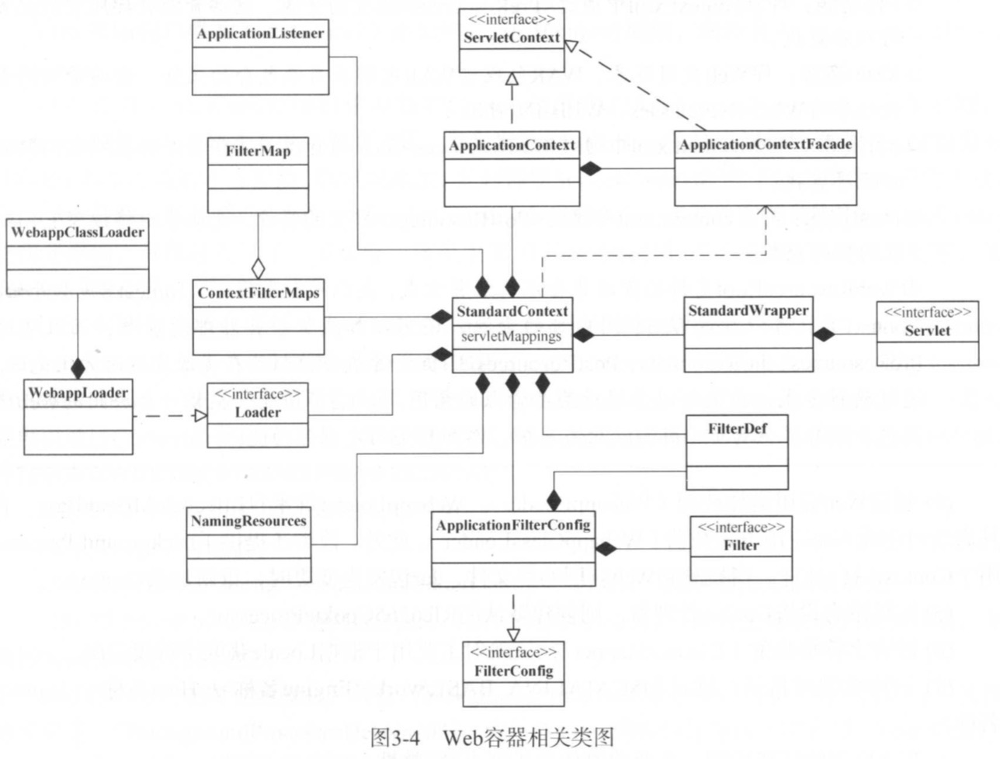

# WebApp Deploy Process
Tomcat使用WebappLoader加载war包的过程如下图所示


三种部署方式
* 通过Context描述符部署
* 将包含webapp所有资源的目录放到Host指定的appBase目录下
* 将包含webapp所有资源的War包放到Host指定的appBase目录下


先通过一篇转载的文章，了解context描述符部署webapp
[Tomcat Context config](./config/context_config.md)


Tomcat 部署Webapp过程如下
# Engine Start
Engine由StandardService启动

[如Bootstrap中所述，tomcat通过实现生命周期接口来启动各组件](./bootstrap.md)
* Bootstrap.main(
    * Catalina.start()
        * Server.start()
        * StandardServer.startInternal()
            * Service.start()
            * StandardService.startInternal()
                * 启动Engine
                * 启动Executor
                * 启动MapperListener
                * 启动Connector

StandardService#startInternal()将启动Engine
```java
// Start our defined Container first
if (engine != null) {
    synchronized (engine) {
        engine.start();
    }
}
```
StandardEngine#startInternal()
```java
@Override
protected synchronized void startInternal() throws LifecycleException {

    // Log our server identification information
    if(log.isInfoEnabled())
        log.info( "Starting Servlet Engine: " + ServerInfo.getServerInfo());

    // Standard container startup
    super.startInternal();
}
```
## 调用ContainerBase#startInternal()
```java
/**
    * Start this component and implement the requirements
    * of {@link org.apache.catalina.util.LifecycleBase#startInternal()}.
    *
    * @exception LifecycleException if this component detects a fatal error
    *  that prevents this component from being used
    */
@Override
protected synchronized void startInternal() throws LifecycleException {

    // Start our subordinate components, if any
    logger = null;
    getLogger();
    Cluster cluster = getClusterInternal();
    if (cluster instanceof Lifecycle) {
        ((Lifecycle) cluster).start();
    }
    Realm realm = getRealmInternal();
    if (realm instanceof Lifecycle) {
        ((Lifecycle) realm).start();
    }

    // Start our child containers, if any
    Container children[] = findChildren();
    List<Future<Void>> results = new ArrayList<>();
    for (int i = 0; i < children.length; i++) {
        results.add(startStopExecutor.submit(new StartChild(children[i])));
    }

    boolean fail = false;
    for (Future<Void> result : results) {
        try {
            result.get();
        } catch (Exception e) {
            log.error(sm.getString("containerBase.threadedStartFailed"), e);
            fail = true;
        }

    }
    if (fail) {
        throw new LifecycleException(
                sm.getString("containerBase.threadedStartFailed"));
    }

    // Start the Valves in our pipeline (including the basic), if any
    if (pipeline instanceof Lifecycle)
        ((Lifecycle) pipeline).start();


    setState(LifecycleState.STARTING);

    // Start our thread
    threadStart();

}
```

* 如果配置了Cluster启动
* 如果配置了Realm启动
* 启动子节点Host
```java
// ----------------------------- Inner classes used with start/stop Executor

private static class StartChild implements Callable<Void> {

    private Container child;

    public StartChild(Container child) {
        this.child = child;
    }

    @Override
    public Void call() throws LifecycleException {
        // 启动Host
        child.start();
        return null;
    }
}
```
* 启动Engine持有的pipeline
* 设置Engine状态为LifecycleState.STARTING，此举会触发START_EVENT生命周期事件。EngineConfig监听到该事件，仅仅打印日志
* 启动Engine层级后台任务处理
    * Cluster后台任务
    * Realm后台任务
    * Pipeline中Value的后台任务
### Cluster等启动放在ContainerBase中的原因
Cluster专用于配置Tomcat集群的元素，**可用于Engine和Host容器中**。在用于Engine容器中时，Engine中的所有Host均支持集群功能。在Cluster元素中，需要直接定义一个Manager元素，这个Manager元素有一个其值为org.apache.catalina.ha.session.DeltaManager或org.apache.catalina.ha.session.BackupManager的className属性。同时，Cluster中还需要分别定义一个Channel和ClusterListener元素。

# Host Start
与Engine相似，ContainerBase#startInternal()通过线程池使用其他线程来启动Host

```java
/**
    * Start this component and implement the requirements
    * of {@link org.apache.catalina.util.LifecycleBase#startInternal()}.
    *
    * @exception LifecycleException if this component detects a fatal error
    *  that prevents this component from being used
    */
@Override
protected synchronized void startInternal() throws LifecycleException {

    // Set error report valve
    String errorValve = getErrorReportValveClass();
    if ((errorValve != null) && (!errorValve.equals(""))) {
        try {
            boolean found = false;
            Valve[] valves = getPipeline().getValves();
            for (Valve valve : valves) {
                if (errorValve.equals(valve.getClass().getName())) {
                    found = true;
                    break;
                }
            }
            if(!found) {
                Valve valve =
                    (Valve) Class.forName(errorValve).getConstructor().newInstance();
                getPipeline().addValve(valve);
            }
        } catch (Throwable t) {
            ExceptionUtils.handleThrowable(t);
            log.error(sm.getString(
                    "standardHost.invalidErrorReportValveClass",
                    errorValve), t);
        }
    }
    super.startInternal();
}
```
## 添加ErrorReportValve
主要用于在服务器处理异常时输出错误页面，如果没有在web.xml中添加错误页面，则异常栈页面由它来生成

通过在web.xml中添加\<error-page\>来添加错误处理页面

也可以通过设置Host的errorReportValveClass来指定全局的错误处理页面
## 调用ContainerBase#startInternal()
* 如果配置了Cluster启动
* 如果配置了Realm启动
* 启动子节点
* 启动Host持有的pipeline
* <span id="STARTING">**设置Host状态为LifecycleState.STARTING，此举会触发START_EVENT生命周期事件。HostConfig监听到该事件，扫描Web部署目录，对于部署描述文件，WAR包，目录会自动创建StandardContext实例，添加到Host并启动**</span>
    ```java
    public enum LifecycleState {
        NEW(false, null),
        INITIALIZING(false, Lifecycle.BEFORE_INIT_EVENT),
        INITIALIZED(false, Lifecycle.AFTER_INIT_EVENT),
        STARTING_PREP(false, Lifecycle.BEFORE_START_EVENT),
        STARTING(true, Lifecycle.START_EVENT),
        STARTED(true, Lifecycle.AFTER_START_EVENT),
        STOPPING_PREP(true, Lifecycle.BEFORE_STOP_EVENT),
        STOPPING(false, Lifecycle.STOP_EVENT),
        STOPPED(false, Lifecycle.AFTER_STOP_EVENT),
        DESTROYING(false, Lifecycle.BEFORE_DESTROY_EVENT),
        DESTROYED(false, Lifecycle.AFTER_DESTROY_EVENT),
        FAILED(false, null);

        private final boolean available;
        private final String lifecycleEvent;

        private LifecycleState(boolean available, String lifecycleEvent) {
            this.available = available;
            this.lifecycleEvent = lifecycleEvent;
        }
        public String getLifecycleEvent() {
            return lifecycleEvent;
        }
    }
    ```
    ```java
    protected synchronized void startInternal() throws LifecycleException {
        ...
        setState(LifecycleState.STARTING);
        // Start our thread
        threadStart();
    }
    ```
    ```java
    protected synchronized void setState(LifecycleState state) throws LifecycleException {
        setStateInternal(state, null, true);
    }
    ```
    ```java
        private synchronized void setStateInternal(LifecycleState state, Object data, boolean check)
            throws LifecycleException {

        if (log.isDebugEnabled()) {
            log.debug(sm.getString("lifecycleBase.setState", this, state));
        }

        if (check) {
            // Must have been triggered by one of the abstract methods (assume
            // code in this class is correct)
            // null is never a valid state
            if (state == null) {
                invalidTransition("null");
                // Unreachable code - here to stop eclipse complaining about
                // a possible NPE further down the method
                return;
            }

            // Any method can transition to failed
            // startInternal() permits STARTING_PREP to STARTING
            // stopInternal() permits STOPPING_PREP to STOPPING and FAILED to
            // STOPPING
            if (!(state == LifecycleState.FAILED ||
                    (this.state == LifecycleState.STARTING_PREP &&
                            state == LifecycleState.STARTING) ||
                    (this.state == LifecycleState.STOPPING_PREP &&
                            state == LifecycleState.STOPPING) ||
                    (this.state == LifecycleState.FAILED &&
                            state == LifecycleState.STOPPING))) {
                // No other transition permitted
                invalidTransition(state.name());
            }
        }

        this.state = state;
        String lifecycleEvent = state.getLifecycleEvent();
        if (lifecycleEvent != null) {
            // 触发START_EVENT
            fireLifecycleEvent(lifecycleEvent, data);
        }
    }
    ```
* 启动Host层级后台任务处理
    * Cluster后台任务
    * Realm后台任务
    * Pipeline中Value的后台任务
# HostConfig
HostConfig是一个生命周期监听器。[由Catalina默认添加到Host实例上](./bootstrap.md)

server.xml中有如下默认配置，即我们将war包至于$CATALINA_BASE/webapps路径下时，Tomcat将会自动部署该webapp。这是通过HostConfig实现的。

server.xml
```xml
<Host name="localhost"  appBase="webapps"
            unpackWARs="true" autoDeploy="true">
```
```java
public class HostConfig implements LifecycleListener {
```
**HostConfig处理如下生命周期事件**
```java
@Override
public void lifecycleEvent(LifecycleEvent event) {

    // Identify the host we are associated with
    try {
        host = (Host) event.getLifecycle();
        if (host instanceof StandardHost) {
            setCopyXML(((StandardHost) host).isCopyXML());
            setDeployXML(((StandardHost) host).isDeployXML());
            setUnpackWARs(((StandardHost) host).isUnpackWARs());
            setContextClass(((StandardHost) host).getContextClass());
        }
    } catch (ClassCastException e) {
        log.error(sm.getString("hostConfig.cce", event.getLifecycle()), e);
        return;
    }

    // Process the event that has occurred
    if (event.getType().equals(Lifecycle.PERIODIC_EVENT)) {
        check();
    } else if (event.getType().equals(Lifecycle.BEFORE_START_EVENT)) {
        beforeStart();
    } else if (event.getType().equals(Lifecycle.START_EVENT)) {
        start();
    } else if (event.getType().equals(Lifecycle.STOP_EVENT)) {
        stop();
    }
}
```
## Lifecycle.BEFORE_START_EVENT
```java
public void beforeStart() {
    if (host.getCreateDirs()) {
        File[] dirs = new File[] {host.getAppBaseFile(),host.getConfigBaseFile()};
        for (int i=0; i<dirs.length; i++) {
            if (!dirs[i].mkdirs() && !dirs[i].isDirectory()) {
                log.error(sm.getString("hostConfig.createDirs",dirs[i]));
            }
        }
    }
}
```
## Lifecycle.START_EVENT
[Host启动过程中，会设置Host状态为LifecycleState.STARTING，此举会触发START_EVENT生命周期事件](#STARTING)
```java
/**
    * Process a "start" event for this Host.
    */
public void start() {

    if (log.isDebugEnabled())
        log.debug(sm.getString("hostConfig.start"));

    try {
        ObjectName hostON = host.getObjectName();
        oname = new ObjectName
            (hostON.getDomain() + ":type=Deployer,host=" + host.getName());
        Registry.getRegistry(null, null).registerComponent
            (this, oname, this.getClass().getName());
    } catch (Exception e) {
        log.error(sm.getString("hostConfig.jmx.register", oname), e);
    }

    if (!host.getAppBaseFile().isDirectory()) {
        log.error(sm.getString("hostConfig.appBase", host.getName(),
                host.getAppBaseFile().getPath()));
        host.setDeployOnStartup(false);
        host.setAutoDeploy(false);
    }

    // deployOnStartup属性为true时，服务器才会在启动阶段部署webapp(deployOnStartup默认为true)
    if (host.getDeployOnStartup())
        deployApps();

}
```
```java
/**
    * Deploy applications for any directories or WAR files that are found
    * in our "application root" directory.
    */
protected void deployApps() {

    File appBase = host.getAppBaseFile();
    File configBase = host.getConfigBaseFile();
    String[] filteredAppPaths = filterAppPaths(appBase.list());
    // Deploy XML descriptors from configBase
    deployDescriptors(configBase, configBase.list());
    // Deploy WARs
    deployWARs(appBase, filteredAppPaths);
    // Deploy expanded folders
    deployDirectories(appBase, filteredAppPaths);

}
```
### Context描述文件部署[不常用]
[如前所述，Context描述文件一个有三种级别，建议不要在server.xml中对其进行配置](./config/context_config.md)

Context描述文件的存储路径由Host的xmlBase属性指定，若没指定则默认值为$CATALINA_BASE/conf/<Engine名称>/<Host名称>。

默认情况下，该描述符的路径为$CATALINA_BASE/conf/Catalina/localhost

Context描述符文件部署示例：
* 在路径$CATALINA_BASE/conf/Catalina/localhost下创建文件命名为myApp.xml,内容为：
```xml
<Context docBase="test/myApp" path="myApp" reloadable="false">
    <WatchedResource>WEB-INF/web.xml</WatchedResource>
<Context>
```
* 将目录名为myApp的web app复制到test目录下，此时Tomcat将自动部署该Web App

```java
/**
    * Deploy XML context descriptors.
    * @param configBase The config base
    * @param files The XML descriptors which should be deployed
    */
protected void deployDescriptors(File configBase, String[] files) {

    if (files == null)
        return;

    ExecutorService es = host.getStartStopExecutor();
    List<Future<?>> results = new ArrayList<>();

    for (int i = 0; i < files.length; i++) {
        // 扫描Host配置文件基础目录，即$CATALINA_BASE/conf/Engine名称/Host名称
        // 默认为$CATALINA_BASE/conf/Catalina/localhost
        // 对于该目录下的每个配置文件，由线程池完成解析部署
        File contextXml = new File(configBase, files[i]);

        if (files[i].toLowerCase(Locale.ENGLISH).endsWith(".xml")) {
            ContextName cn = new ContextName(files[i], true);

            if (isServiced(cn.getName()) || deploymentExists(cn.getName()))
                continue;

            results.add(
                    es.submit(new DeployDescriptor(this, cn, contextXml)));
        }
    }

    for (Future<?> result : results) {
        try {
            result.get();
        } catch (Exception e) {
            log.error(sm.getString(
                    "hostConfig.deployDescriptor.threaded.error"), e);
        }
    }
}
```
```java
private static class DeployDescriptor implements Runnable {

    private HostConfig config;
    private ContextName cn;
    private File descriptor;

    public DeployDescriptor(HostConfig config, ContextName cn,
            File descriptor) {
        this.config = config;
        this.cn = cn;
        this.descriptor= descriptor;
    }

    @Override
    public void run() {
        config.deployDescriptor(cn, descriptor);
    }
}
```
对于每个文件的部署线程，进行如下操作
```java
/**
    * Deploy specified context descriptor.
    * @param cn The context name
    * @param contextXml The descriptor
    */
@SuppressWarnings("null") // context is not null
protected void deployDescriptor(ContextName cn, File contextXml) {

    DeployedApplication deployedApp =
            new DeployedApplication(cn.getName(), true);

    long startTime = 0;
    // Assume this is a configuration descriptor and deploy it
    if(log.isInfoEnabled()) {
        startTime = System.currentTimeMillis();
        log.info(sm.getString("hostConfig.deployDescriptor",
                contextXml.getAbsolutePath()));
    }

    Context context = null;
    boolean isExternalWar = false;
    boolean isExternal = false;
    File expandedDocBase = null;

    // 使用digester解析配置文件，创建context实例
    try (FileInputStream fis = new FileInputStream(contextXml)) {
        synchronized (digesterLock) {
            try {
                context = (Context) digester.parse(fis);
            } catch (Exception e) {
                log.error(sm.getString(
                        "hostConfig.deployDescriptor.error",
                        contextXml.getAbsolutePath()), e);
            } finally {
                digester.reset();
                if (context == null) {
                    context = new FailedContext();
                }
            }
        }

        Class<?> clazz = Class.forName(host.getConfigClass());
        LifecycleListener listener =
            (LifecycleListener) clazz.newInstance();
        // 添加生命周期监听器
        context.addLifecycleListener(listener);

        // 设置相关配置
        context.setConfigFile(contextXml.toURI().toURL());
        context.setName(cn.getName());
        context.setPath(cn.getPath());
        context.setWebappVersion(cn.getVersion());
        // Add the associated docBase to the redeployed list if it's a WAR
        if (context.getDocBase() != null) {
            File docBase = new File(context.getDocBase());
            if (!docBase.isAbsolute()) {
                docBase = new File(host.getAppBaseFile(), context.getDocBase());
            }
            // If external docBase, register .xml as redeploy first
            if (!docBase.getCanonicalPath().startsWith(
                    host.getAppBaseFile().getAbsolutePath() + File.separator)) {
                isExternal = true;
                deployedApp.redeployResources.put(
                        contextXml.getAbsolutePath(),
                        Long.valueOf(contextXml.lastModified()));
                deployedApp.redeployResources.put(docBase.getAbsolutePath(),
                        Long.valueOf(docBase.lastModified()));
                if (docBase.getAbsolutePath().toLowerCase(Locale.ENGLISH).endsWith(".war")) {
                    isExternalWar = true;
                }
            } else {
                log.warn(sm.getString("hostConfig.deployDescriptor.localDocBaseSpecified",
                            docBase));
                // Ignore specified docBase
                context.setDocBase(null);
            }
        }

        // 将Context实例添加到Host，判断context是否启动，如果否，则启动context
        host.addChild(context);
    } catch (Throwable t) {
        ExceptionUtils.handleThrowable(t);
        log.error(sm.getString("hostConfig.deployDescriptor.error",
                                contextXml.getAbsolutePath()), t);
    } finally {
        // Get paths for WAR and expanded WAR in appBase

        // default to appBase dir + name
        expandedDocBase = new File(host.getAppBaseFile(), cn.getBaseName());
        if (context.getDocBase() != null
                && !context.getDocBase().toLowerCase(Locale.ENGLISH).endsWith(".war")) {
            // first assume docBase is absolute
            expandedDocBase = new File(context.getDocBase());
            if (!expandedDocBase.isAbsolute()) {
                // if docBase specified and relative, it must be relative to appBase
                expandedDocBase = new File(host.getAppBaseFile(), context.getDocBase());
            }
        }

        boolean unpackWAR = unpackWARs;
        if (unpackWAR && context instanceof StandardContext) {
            unpackWAR = ((StandardContext) context).getUnpackWAR();
        }

        // Add the eventual unpacked WAR and all the resources which will be
        // watched inside it
        if (isExternalWar) {
            if (unpackWAR) {
                deployedApp.redeployResources.put(expandedDocBase.getAbsolutePath(),
                        Long.valueOf(expandedDocBase.lastModified()));
                addWatchedResources(deployedApp, expandedDocBase.getAbsolutePath(), context);
            } else {
                addWatchedResources(deployedApp, null, context);
            }
        } else {
            // Find an existing matching war and expanded folder
            if (!isExternal) {
                File warDocBase = new File(expandedDocBase.getAbsolutePath() + ".war");
                if (warDocBase.exists()) {
                    deployedApp.redeployResources.put(warDocBase.getAbsolutePath(),
                            Long.valueOf(warDocBase.lastModified()));
                } else {
                    // Trigger a redeploy if a WAR is added
                    deployedApp.redeployResources.put(
                            warDocBase.getAbsolutePath(),
                            Long.valueOf(0));
                }
            }
            if (unpackWAR) {
                deployedApp.redeployResources.put(expandedDocBase.getAbsolutePath(),
                        Long.valueOf(expandedDocBase.lastModified()));
                addWatchedResources(deployedApp,
                        expandedDocBase.getAbsolutePath(), context);
            } else {
                addWatchedResources(deployedApp, null, context);
            }
            if (!isExternal) {
                // For external docBases, the context.xml will have been
                // added above.
                deployedApp.redeployResources.put(
                        contextXml.getAbsolutePath(),
                        Long.valueOf(contextXml.lastModified()));
            }
        }
        // Add the global redeploy resources (which are never deleted) at
        // the end so they don't interfere with the deletion process
        addGlobalRedeployResources(deployedApp);
    }

    if (host.findChild(context.getName()) != null) {
        deployed.put(context.getName(), deployedApp);
    }

    if (log.isInfoEnabled()) {
        log.info(sm.getString("hostConfig.deployDescriptor.finished",
            contextXml.getAbsolutePath(), Long.valueOf(System.currentTimeMillis() - startTime)));
    }
}
```
### War目录部署
以目录的形式发布并部署Web应用是Tomcat中最常见的部署方式，只需要将包含Web应用所有资源文件的目录放到Host指定的appBase目录下即可完成部署。

**在这种部署方式下，Catania同样支持通过配置文件来实例化Context(默认为webapp的META-INF/context.xml)，因此，仍然可以在配置文件中对Context进行定制，但无法覆盖name,path,webappVersion,docBase这四个属性，这些由web目录的路径及名称确定。(因此，这种方式无法自定义web应用的部署目录)**
```java
/**
    * Deploy exploded webapps.
    * @param appBase The base path for applications
    * @param files The exploded webapps that should be deployed
    */
protected void deployDirectories(File appBase, String[] files) {

    if (files == null)
        return;

    ExecutorService es = host.getStartStopExecutor();
    List<Future<?>> results = new ArrayList<>();

    for (int i = 0; i < files.length; i++) {

        if (files[i].equalsIgnoreCase("META-INF"))
            continue;
        if (files[i].equalsIgnoreCase("WEB-INF"))
            continue;
        File dir = new File(appBase, files[i]);
        if (dir.isDirectory()) {
            ContextName cn = new ContextName(files[i], false);

            if (isServiced(cn.getName()) || deploymentExists(cn.getName()))
                continue;

            results.add(es.submit(new DeployDirectory(this, cn, dir)));
        }
    }

    for (Future<?> result : results) {
        try {
            result.get();
        } catch (Exception e) {
            log.error(sm.getString(
                    "hostConfig.deployDir.threaded.error"), e);
        }
    }
}
```
```java
/**
    * Deploy exploded webapp.
    * @param cn The context name
    * @param dir The path to the root folder of the weapp
    */
protected void deployDirectory(ContextName cn, File dir) {


    long startTime = 0;
    // Deploy the application in this directory
    if( log.isInfoEnabled() ) {
        startTime = System.currentTimeMillis();
        log.info(sm.getString("hostConfig.deployDir",
                dir.getAbsolutePath()));
    }

    Context context = null;
    File xml = new File(dir, Constants.ApplicationContextXml);
    File xmlCopy =
            new File(host.getConfigBaseFile(), cn.getBaseName() + ".xml");


    DeployedApplication deployedApp;
    boolean copyThisXml = copyXML;

    try {
        // deployXML为true且META-INF/context.xml存在
        // 使用digester解析并创建context
        if (deployXML && xml.exists()) {
            synchronized (digesterLock) {
                try {
                    context = (Context) digester.parse(xml);
                } catch (Exception e) {
                    log.error(sm.getString(
                            "hostConfig.deployDescriptor.error",
                            xml), e);
                    context = new FailedContext();
                } finally {
                    digester.reset();
                    if (context == null) {
                        context = new FailedContext();
                    }
                }
            }

            if (copyThisXml == false && context instanceof StandardContext) {
                // Host is using default value. Context may override it.
                copyThisXml = ((StandardContext) context).getCopyXML();
            }

            // 如果copyXML为true,
            //则copy META-INF/context.xml到CATALINA_BASE/conf/Host/localhost目录下，
            // 文件名与应用相同
            if (copyThisXml) {
                Files.copy(xml.toPath(), xmlCopy.toPath());
                context.setConfigFile(xmlCopy.toURI().toURL());
            } else {
                context.setConfigFile(xml.toURI().toURL());
            }
        } else if (!deployXML && xml.exists()) {
            // Block deployment as META-INF/context.xml may contain security
            // configuration necessary for a secure deployment.
            log.error(sm.getString("hostConfig.deployDescriptor.blocked",
                    cn.getPath(), xml, xmlCopy));
            context = new FailedContext();
        } else {
            context = (Context) Class.forName(contextClass).newInstance();
        }

        Class<?> clazz = Class.forName(host.getConfigClass());
        LifecycleListener listener =
            (LifecycleListener) clazz.newInstance();
        // 添加生命周期监听器
        context.addLifecycleListener(listener);
        // 相应配置
        context.setName(cn.getName());
        context.setPath(cn.getPath());
        context.setWebappVersion(cn.getVersion());
        context.setDocBase(cn.getBaseName());
        // 添加到host上，该方法会判断context是否启动，如果否，则启动context
        host.addChild(context);
    } catch (Throwable t) {
        ExceptionUtils.handleThrowable(t);
        log.error(sm.getString("hostConfig.deployDir.error",
                dir.getAbsolutePath()), t);
    } finally {
        deployedApp = new DeployedApplication(cn.getName(),
                xml.exists() && deployXML && copyThisXml);

        // Fake re-deploy resource to detect if a WAR is added at a later
        // point
        deployedApp.redeployResources.put(dir.getAbsolutePath() + ".war",
                Long.valueOf(0));
        deployedApp.redeployResources.put(dir.getAbsolutePath(),
                Long.valueOf(dir.lastModified()));
        if (deployXML && xml.exists()) {
            if (copyThisXml) {
                deployedApp.redeployResources.put(
                        xmlCopy.getAbsolutePath(),
                        Long.valueOf(xmlCopy.lastModified()));
            } else {
                deployedApp.redeployResources.put(
                        xml.getAbsolutePath(),
                        Long.valueOf(xml.lastModified()));
                // Fake re-deploy resource to detect if a context.xml file is
                // added at a later point
                deployedApp.redeployResources.put(
                        xmlCopy.getAbsolutePath(),
                        Long.valueOf(0));
            }
        } else {
            // Fake re-deploy resource to detect if a context.xml file is
            // added at a later point
            deployedApp.redeployResources.put(
                    xmlCopy.getAbsolutePath(),
                    Long.valueOf(0));
            if (!xml.exists()) {
                deployedApp.redeployResources.put(
                        xml.getAbsolutePath(),
                        Long.valueOf(0));
            }
        }
        addWatchedResources(deployedApp, dir.getAbsolutePath(), context);
        // Add the global redeploy resources (which are never deleted) at
        // the end so they don't interfere with the deletion process
        addGlobalRedeployResources(deployedApp);
    }

    deployed.put(cn.getName(), deployedApp);

    if( log.isInfoEnabled() ) {
        log.info(sm.getString("hostConfig.deployDir.finished",
                dir.getAbsolutePath(), Long.valueOf(System.currentTimeMillis() - startTime)));
    }
}
```
### War包部署[常用]
与War目录部署相似，只是多了对压缩文件的处理过程

## Lifecycle.STOP_EVENT
```java
/**
    * Process a "stop" event for this Host.
    */
public void stop() {

    if (log.isDebugEnabled())
        log.debug(sm.getString("hostConfig.stop"));

    if (oname != null) {
        try {
            Registry.getRegistry(null, null).unregisterComponent(oname);
        } catch (Exception e) {
            log.error(sm.getString("hostConfig.jmx.unregister", oname), e);
        }
    }
    oname = null;
}
```
## Lifecycle.PERIODIC_EVENT
[Check status of a specific web application and reload, redeploy or deploy](./hot_reload_redeploy.md)
```java
/**
    * Check status of all webapps.
    */
protected void check() {

    if (host.getAutoDeploy()) {
        // Check for resources modification to trigger redeployment
        DeployedApplication[] apps =
            deployed.values().toArray(new DeployedApplication[0]);
        for (int i = 0; i < apps.length; i++) {
            if (!isServiced(apps[i].name))
                checkResources(apps[i], false);
        }

        // Check for old versions of applications that can now be undeployed
        if (host.getUndeployOldVersions()) {
            checkUndeploy();
        }

        // Hotdeploy applications
        deployApps();
    }
}


/**
    * Check status of a specific web application and reload, redeploy or deploy
    * it as necessary. This method is for use with functionality such as
    * management web applications that upload new/updated web applications and
    * need to trigger the appropriate action to deploy them. This method
    * assumes that the web application is currently marked as serviced and that
    * any uploading/updating has been completed before this method is called.
    * Any action taken as a result of the checks will complete before this
    * method returns.
    *
    * @param name The name of the web application to check
    */
public void check(String name) {
    DeployedApplication app = deployed.get(name);
    if (app != null) {
        checkResources(app, true);
    }
    deployApps(name);
}
```
## 总结
Web应用部署基本分为目录和war包两类，每一类进一步支持Context的定制化

默认情况下，Catalina会根据发布包的路径及名称自动创建一个Context对象
# Context Start
**对于StandardHost和HostConfig来说，只是根据不同情况(部署描述符，部署目录，WAR包)创建并启动context对象，并不包含具体的Web应用初始化及启动工作，该部分工作由组件Context完成**



由上图可知
* Tomcat中，ServletContext实现类为ApplicationContext,相应Facade为ApplicationContextFacade
* Tomcat中，FilterConfig实现类为ApplicationFilterConfig

接下来看Context启动过程，Context也通过其父类ContainerBase#startInternal()启动

StandardContext#startInternal
```java
protected synchronized void startInternal() throws LifecycleException {

    if(log.isDebugEnabled())
        log.debug("Starting " + getBaseName());

    // Send j2ee.state.starting notification
    if (this.getObjectName() != null) {
        Notification notification = new Notification("j2ee.state.starting",
                this.getObjectName(), sequenceNumber.getAndIncrement());
        broadcaster.sendNotification(notification);
    }

    setConfigured(false);
    boolean ok = true;

    // Currently this is effectively a NO-OP but needs to be called to
    // ensure the NamingResources follows the correct lifecycle
    if (namingResources != null) {
        namingResources.start();
    }

    // Add missing components as necessary
    if (getResources() == null) {   // (1) Required by Loader
        if (log.isDebugEnabled())
            log.debug("Configuring default Resources");

        try {
            setResources(new StandardRoot(this));
        } catch (IllegalArgumentException e) {
            log.error(sm.getString("standardContext.resourcesInit"), e);
            ok = false;
        }
    }
    if (ok) {
        // 初始化当前Context使用的WebResourceRoot并启动
        // WebResourceRoot维护了Web应用的资源集合(Class,Jar及其他资源文件)
        resourcesStart();
    }

    // 创建web应用类加载器，该类加载器提供了backgroundProcess用于Context后台处理
    // 当检测到web应用的classes，jar包发生变更时，重新加载context
    if (getLoader() == null) {
        WebappLoader webappLoader = new WebappLoader(getParentClassLoader());
        webappLoader.setDelegate(getDelegate());
        setLoader(webappLoader);
    }

    // An explicit cookie processor hasn't been specified; use the default
    if (cookieProcessor == null) {
        cookieProcessor = new Rfc6265CookieProcessor();
    }

    // Initialize character set mapper
    getCharsetMapper();

    // Post work directory
    postWorkDirectory();

    // Validate required extensions
    boolean dependencyCheck = true;
    try {
        dependencyCheck = ExtensionValidator.validateApplication
            (getResources(), this);
    } catch (IOException ioe) {
        log.error(sm.getString("standardContext.extensionValidationError"), ioe);
        dependencyCheck = false;
    }

    if (!dependencyCheck) {
        // do not make application available if dependency check fails
        ok = false;
    }

    // Reading the "catalina.useNaming" environment variable
    String useNamingProperty = System.getProperty("catalina.useNaming");
    if ((useNamingProperty != null)
        && (useNamingProperty.equals("false"))) {
        useNaming = false;
    }

    if (ok && isUseNaming()) {
        if (getNamingContextListener() == null) {
            NamingContextListener ncl = new NamingContextListener();
            ncl.setName(getNamingContextName());
            ncl.setExceptionOnFailedWrite(getJndiExceptionOnFailedWrite());
            addLifecycleListener(ncl);
            setNamingContextListener(ncl);
        }
    }

    // Standard container startup
    if (log.isDebugEnabled())
        log.debug("Processing standard container startup");


    // Binding thread
    ClassLoader oldCCL = bindThread();

    try {
        if (ok) {
            // Start our subordinate components, if any
            Loader loader = getLoader();
            if (loader instanceof Lifecycle) {
                ((Lifecycle) loader).start();
            }

            // since the loader just started, the webapp classloader is now
            // created.
            setClassLoaderProperty("clearReferencesRmiTargets",
                    getClearReferencesRmiTargets());
            setClassLoaderProperty("clearReferencesStopThreads",
                    getClearReferencesStopThreads());
            setClassLoaderProperty("clearReferencesStopTimerThreads",
                    getClearReferencesStopTimerThreads());
            setClassLoaderProperty("clearReferencesHttpClientKeepAliveThread",
                    getClearReferencesHttpClientKeepAliveThread());

            // By calling unbindThread and bindThread in a row, we setup the
            // current Thread CCL to be the webapp classloader
            unbindThread(oldCCL);
            oldCCL = bindThread();

            // Initialize logger again. Other components might have used it
            // too early, so it should be reset.
            logger = null;
            getLogger();

            Realm realm = getRealmInternal();
            if(null != realm) {
                if (realm instanceof Lifecycle) {
                    ((Lifecycle) realm).start();
                }

                // Place the CredentialHandler into the ServletContext so
                // applications can have access to it. Wrap it in a "safe"
                // handler so application's can't modify it.
                CredentialHandler safeHandler = new CredentialHandler() {
                    @Override
                    public boolean matches(String inputCredentials, String storedCredentials) {
                        return getRealmInternal().getCredentialHandler().matches(inputCredentials, storedCredentials);
                    }

                    @Override
                    public String mutate(String inputCredentials) {
                        return getRealmInternal().getCredentialHandler().mutate(inputCredentials);
                    }
                };
                context.setAttribute(Globals.CREDENTIAL_HANDLER, safeHandler);
            }

            // Notify our interested LifecycleListeners
            // ContextConfig监听该事件以完成web容器初始化
            // web应用部署符可来源于WEB-INF/web.xml,
            // META-INF/web-fragment.xml,
            // ServletContainerInitializer
            // annotation
            fireLifecycleEvent(Lifecycle.CONFIGURE_START_EVENT, null);

            // Start our child containers, if not already started
            // 启动子节点Wrapper
            for (Container child : findChildren()) {
                if (!child.getState().isAvailable()) {
                    child.start();
                }
            }

            // Start the Valves in our pipeline (including the basic),
            // if any
            if (pipeline instanceof Lifecycle) {
                ((Lifecycle) pipeline).start();
            }

            // Acquire clustered manager
            Manager contextManager = null;
            Manager manager = getManager();
            if (manager == null) {
                if (log.isDebugEnabled()) {
                    log.debug(sm.getString("standardContext.cluster.noManager",
                            Boolean.valueOf((getCluster() != null)),
                            Boolean.valueOf(distributable)));
                }
                if ( (getCluster() != null) && distributable) {
                    try {
                        contextManager = getCluster().createManager(getName());
                    } catch (Exception ex) {
                        log.error("standardContext.clusterFail", ex);
                        ok = false;
                    }
                } else {
                    contextManager = new StandardManager();
                }
            }

            // Configure default manager if none was specified
            if (contextManager != null) {
                if (log.isDebugEnabled()) {
                    log.debug(sm.getString("standardContext.manager",
                            contextManager.getClass().getName()));
                }
                setManager(contextManager);
            }

            if (manager!=null && (getCluster() != null) && distributable) {
                //let the cluster know that there is a context that is distributable
                //and that it has its own manager
                getCluster().registerManager(manager);
            }
        }

        if (!getConfigured()) {
            log.error(sm.getString("standardContext.configurationFail"));
            ok = false;
        }

        // We put the resources into the servlet context
        if (ok)
            getServletContext().setAttribute
                (Globals.RESOURCES_ATTR, getResources());

        if (ok ) {
            if (getInstanceManager() == null) {
                javax.naming.Context context = null;
                if (isUseNaming() && getNamingContextListener() != null) {
                    context = getNamingContextListener().getEnvContext();
                }
                Map<String, Map<String, String>> injectionMap = buildInjectionMap(
                        getIgnoreAnnotations() ? new NamingResourcesImpl(): getNamingResources());
                setInstanceManager(new DefaultInstanceManager(context,
                        injectionMap, this, this.getClass().getClassLoader()));
            }
            getServletContext().setAttribute(
                    InstanceManager.class.getName(), getInstanceManager());
            InstanceManagerBindings.bind(getLoader().getClassLoader(), getInstanceManager());
        }

        // Create context attributes that will be required
        if (ok) {
            getServletContext().setAttribute(
                    JarScanner.class.getName(), getJarScanner());
        }

        // Set up the context init params
        // 合并ServletContext初始化参数和Context组件中ApplicationParameter
        mergeParameters();

        // Call ServletContainerInitializers
        // 主要用于可编程的方式添加Web应用的配置，如servlet,filter
        for (Map.Entry<ServletContainerInitializer, Set<Class<?>>> entry :
            initializers.entrySet()) {
            try {
                entry.getKey().onStartup(entry.getValue(),
                        getServletContext());
            } catch (ServletException e) {
                log.error(sm.getString("standardContext.sciFail"), e);
                ok = false;
                break;
            }
        }

        // Configure and call application event listeners
        if (ok) {
            if (!listenerStart()) {
                log.error(sm.getString("standardContext.listenerFail"));
                ok = false;
            }
        }

        // Check constraints for uncovered HTTP methods
        // Needs to be after SCIs and listeners as they may programmatically
        // change constraints
        if (ok) {
            checkConstraintsForUncoveredMethods(findConstraints());
        }

        try {
            // Start manager
            Manager manager = getManager();
            if (manager instanceof Lifecycle) {
                ((Lifecycle) manager).start();
            }
        } catch(Exception e) {
            log.error(sm.getString("standardContext.managerFail"), e);
            ok = false;
        }

        // Configure and call application filters
        if (ok) {
            if (!filterStart()) {
                log.error(sm.getString("standardContext.filterFail"));
                ok = false;
            }
        }

        // Load and initialize all "load on startup" servlets
        // load-on-startup元素标记容器是否在启动的时候就加载这个servlet
        // (实例化并调用其init()方法)。
        if (ok) {
            if (!loadOnStartup(findChildren())){
                log.error(sm.getString("standardContext.servletFail"));
                ok = false;
            }
        }

        // Start ContainerBackgroundProcessor thread
        super.threadStart();
    } finally {
        // Unbinding thread
        unbindThread(oldCCL);
    }

    // Set available status depending upon startup success
    if (ok) {
        if (log.isDebugEnabled())
            log.debug("Starting completed");
    } else {
        log.error(sm.getString("standardContext.startFailed", getName()));
    }

    startTime=System.currentTimeMillis();

    // Send j2ee.state.running notification
    if (ok && (this.getObjectName() != null)) {
        Notification notification =
            new Notification("j2ee.state.running", this.getObjectName(),
                                sequenceNumber.getAndIncrement());
        broadcaster.sendNotification(notification);
    }

    // The WebResources implementation caches references to JAR files. On
    // some platforms these references may lock the JAR files. Since web
    // application start is likely to have read from lots of JARs, trigger
    // a clean-up now.
    getResources().gc();

    // Reinitializing if something went wrong
    if (!ok) {
        setState(LifecycleState.FAILED);
    } else {
        setState(LifecycleState.STARTING);
    }
}
```

# ContextConfig


ContextConfig共监听在六个事件上
```java
/**
    * Process events for an associated Context.
    *
    * @param event The lifecycle event that has occurred
    */
@Override
public void lifecycleEvent(LifecycleEvent event) {

    // Identify the context we are associated with
    try {
        context = (Context) event.getLifecycle();
    } catch (ClassCastException e) {
        log.error(sm.getString("contextConfig.cce", event.getLifecycle()), e);
        return;
    }

    // Process the event that has occurred
    if (event.getType().equals(Lifecycle.CONFIGURE_START_EVENT)) {
        configureStart();
    } else if (event.getType().equals(Lifecycle.BEFORE_START_EVENT)) {
        beforeStart();
    } else if (event.getType().equals(Lifecycle.AFTER_START_EVENT)) {
        // Restore docBase for management tools
        if (originalDocBase != null) {
            context.setDocBase(originalDocBase);
        }
    } else if (event.getType().equals(Lifecycle.CONFIGURE_STOP_EVENT)) {
        configureStop();
    } else if (event.getType().equals(Lifecycle.AFTER_INIT_EVENT)) {
        init();
    } else if (event.getType().equals(Lifecycle.AFTER_DESTROY_EVENT)) {
        destroy();
    }

}
```

## AFTER_INIT_EVENT
在Context初始化阶段触发，用于Context属性的配置工作

Tomcat中Context属性的优先级为：

configFile --> conf/<Engine名称>/<Host名称>/context.xml.default --> conf/context.xml 

即Web应用配置优先级最高，其次为Host配置，Catalina容器配置优先级最低
```java
protected void init() {
    // Called from StandardContext.init()

    Digester contextDigester = createContextDigester();
    contextDigester.getParser();

    if (log.isDebugEnabled()) {
        log.debug(sm.getString("contextConfig.init"));
    }
    context.setConfigured(false);
    ok = true;

    contextConfig(contextDigester);
}
```
```java
/**
    * Process the default configuration file, if it exists.
    * @param digester The digester that will be used for XML parsing
    */
protected void contextConfig(Digester digester) {

    String defaultContextXml = null;

    // Open the default context.xml file, if it exists
    if (context instanceof StandardContext) {
        defaultContextXml = ((StandardContext)context).getDefaultContextXml();
    }
    // set the default if we don't have any overrides
    if (defaultContextXml == null) {
        defaultContextXml = Constants.DefaultContextXml;
    }

    if (!context.getOverride()) {
        File defaultContextFile = new File(defaultContextXml);
        if (!defaultContextFile.isAbsolute()) {
            defaultContextFile =
                    new File(context.getCatalinaBase(), defaultContextXml);
        }
        if (defaultContextFile.exists()) {
            try {
                URL defaultContextUrl = defaultContextFile.toURI().toURL();
                processContextConfig(digester, defaultContextUrl);
            } catch (MalformedURLException e) {
                log.error(sm.getString(
                        "contextConfig.badUrl", defaultContextFile), e);
            }
        }

        File hostContextFile = new File(getHostConfigBase(), Constants.HostContextXml);
        if (hostContextFile.exists()) {
            try {
                URL hostContextUrl = hostContextFile.toURI().toURL();
                processContextConfig(digester, hostContextUrl);
            } catch (MalformedURLException e) {
                log.error(sm.getString(
                        "contextConfig.badUrl", hostContextFile), e);
            }
        }
    }
    if (context.getConfigFile() != null) {
        processContextConfig(digester, context.getConfigFile());
    }

}
```

## BEFORE_START_EVENT
在Context启动之前触发，用于更新Context的docBase属性和解决Web目录锁的问题
```java
/**
    * Process a "before start" event for this Context.
    */
protected synchronized void beforeStart() {

    try {
        fixDocBase();
    } catch (IOException e) {
        log.error(sm.getString(
                "contextConfig.fixDocBase", context.getName()), e);
    }

    antiLocking();
}
```
## CONFIGURE_START_EVENT
真正创建Wrapper的则是CONFIGURE_START_EVENT事件
### Web容器初始化
web应用的部署描述符来源于
* Servlet规范
    * WEB-INF/web.xml
    * [web应用jar包中的META-INF/web-fragment.xml](../../servlet-and-jsp/webxml/web-fragment.md)
    * META-INF/services/javax.servlet.ServletContainerInitializer
        * 配置了所属jar中该接口的实现类是哪个
    * annotation
* Tomcat
    * 容器级别conf/web.xml
    * Host级别conf/\<Engine名称\>/\<Host名称\>/web.xml.default

优先级
web应用-->Host级-->Container级别
```java
/**
    * Scan the web.xml files that apply to the web application and merge them
    * using the rules defined in the spec. For the global web.xml files,
    * where there is duplicate configuration, the most specific level wins. ie
    * an application's web.xml takes precedence over the host level or global
    * web.xml file.
    */
protected void webConfig() {
    /*
        * Anything and everything can override the global and host defaults.
        * This is implemented in two parts
        * - Handle as a web fragment that gets added after everything else so
        *   everything else takes priority
        * - Mark Servlets as overridable so SCI configuration can replace
        *   configuration from the defaults
        */

    /*
        * The rules for annotation scanning are not as clear-cut as one might
        * think. Tomcat implements the following process:
        * - As per SRV.1.6.2, Tomcat will scan for annotations regardless of
        *   which Servlet spec version is declared in web.xml. The EG has
        *   confirmed this is the expected behaviour.
        * - As per http://java.net/jira/browse/SERVLET_SPEC-36, if the main
        *   web.xml is marked as metadata-complete, JARs are still processed
        *   for SCIs.
        * - If metadata-complete=true and an absolute ordering is specified,
        *   JARs excluded from the ordering are also excluded from the SCI
        *   processing.
        * - If an SCI has a @HandlesType annotation then all classes (except
        *   those in JARs excluded from an absolute ordering) need to be
        *   scanned to check if they match.
        */
    WebXmlParser webXmlParser = new WebXmlParser(context.getXmlNamespaceAware(),
            context.getXmlValidation(), context.getXmlBlockExternal());

    Set<WebXml> defaults = new HashSet<>();
    defaults.add(getDefaultWebXmlFragment(webXmlParser));

    Set<WebXml> tomcatWebXml = new HashSet<>();
    tomcatWebXml.add(getTomcatWebXmlFragment(webXmlParser));

    WebXml webXml = createWebXml();

    // Parse context level web.xml
    InputSource contextWebXml = getContextWebXmlSource();
    if (!webXmlParser.parseWebXml(contextWebXml, webXml, false)) {
        ok = false;
    }

    ServletContext sContext = context.getServletContext();

    // Ordering is important here

    // Step 1. Identify all the JARs packaged with the application and those
    // provided by the container. If any of the application JARs have a
    // web-fragment.xml it will be parsed at this point. web-fragment.xml
    // files are ignored for container provided JARs.
    Map<String,WebXml> fragments = processJarsForWebFragments(webXml, webXmlParser);

    // Step 2. Order the fragments.
    Set<WebXml> orderedFragments = null;
    orderedFragments =
            WebXml.orderWebFragments(webXml, fragments, sContext);

    // Step 3. Look for ServletContainerInitializer implementations
    if (ok) {
        processServletContainerInitializers();
    }

    if  (!webXml.isMetadataComplete() || typeInitializerMap.size() > 0) {
        // Step 4. Process /WEB-INF/classes for annotations and
        // @HandlesTypes matches
        Map<String,JavaClassCacheEntry> javaClassCache = new HashMap<>();

        if (ok) {
            WebResource[] webResources =
                    context.getResources().listResources("/WEB-INF/classes");

            for (WebResource webResource : webResources) {
                // Skip the META-INF directory from any JARs that have been
                // expanded in to WEB-INF/classes (sometimes IDEs do this).
                if ("META-INF".equals(webResource.getName())) {
                    continue;
                }
                processAnnotationsWebResource(webResource, webXml,
                        webXml.isMetadataComplete(), javaClassCache);
            }
        }

        // Step 5. Process JARs for annotations and
        // @HandlesTypes matches - only need to process those fragments we
        // are going to use (remember orderedFragments includes any
        // container fragments)
        if (ok) {
            processAnnotations(
                    orderedFragments, webXml.isMetadataComplete(), javaClassCache);
        }

        // Cache, if used, is no longer required so clear it
        javaClassCache.clear();
    }

    if (!webXml.isMetadataComplete()) {
        // Step 6. Merge web-fragment.xml files into the main web.xml
        // file.
        if (ok) {
            ok = webXml.merge(orderedFragments);
        }

        // Step 7a
        // merge tomcat-web.xml
        webXml.merge(tomcatWebXml);

        // Step 7b. Apply global defaults
        // Have to merge defaults before JSP conversion since defaults
        // provide JSP servlet definition.
        webXml.merge(defaults);

        // Step 8. Convert explicitly mentioned jsps to servlets
        if (ok) {
            convertJsps(webXml);
        }

        // Step 9. Apply merged web.xml to Context
        if (ok) {
            configureContext(webXml);
        }
    } else {
        webXml.merge(tomcatWebXml);
        webXml.merge(defaults);
        convertJsps(webXml);
        configureContext(webXml);
    }

    if (context.getLogEffectiveWebXml()) {
        log.info("web.xml:\n" + webXml.toXml());
    }

    // Always need to look for static resources
    // Step 10. Look for static resources packaged in JARs
    if (ok) {
        // Spec does not define an order.
        // Use ordered JARs followed by remaining JARs
        Set<WebXml> resourceJars = new LinkedHashSet<>();
        for (WebXml fragment : orderedFragments) {
            resourceJars.add(fragment);
        }
        for (WebXml fragment : fragments.values()) {
            if (!resourceJars.contains(fragment)) {
                resourceJars.add(fragment);
            }
        }
        processResourceJARs(resourceJars);
        // See also StandardContext.resourcesStart() for
        // WEB-INF/classes/META-INF/resources configuration
    }

    // Step 11. Apply the ServletContainerInitializer config to the
    // context
    if (ok) {
        for (Map.Entry<ServletContainerInitializer,
                Set<Class<?>>> entry :
                    initializerClassMap.entrySet()) {
            if (entry.getValue().isEmpty()) {
                context.addServletContainerInitializer(
                        entry.getKey(), null);
            } else {
                context.addServletContainerInitializer(
                        entry.getKey(), entry.getValue());
            }
        }
    }
}
```
# Wrapper Start
将StandardWarpper组件状态设置为STARTED(除广播通知外，不进行其他处理)
```java
/**
    * Start this component and implement the requirements
    * of {@link org.apache.catalina.util.LifecycleBase#startInternal()}.
    *
    * @exception LifecycleException if this component detects a fatal error
    *  that prevents this component from being used
    */
@Override
protected synchronized void startInternal() throws LifecycleException {

    // Send j2ee.state.starting notification
    if (this.getObjectName() != null) {
        Notification notification = new Notification("j2ee.state.starting",
                                                    this.getObjectName(),
                                                    sequenceNumber++);
        broadcaster.sendNotification(notification);
    }

    // Start up this component
    super.startInternal();

    setAvailable(0L);

    // Send j2ee.state.running notification
    if (this.getObjectName() != null) {
        Notification notification =
            new Notification("j2ee.state.running", this.getObjectName(),
                            sequenceNumber++);
        broadcaster.sendNotification(notification);
    }

}
```