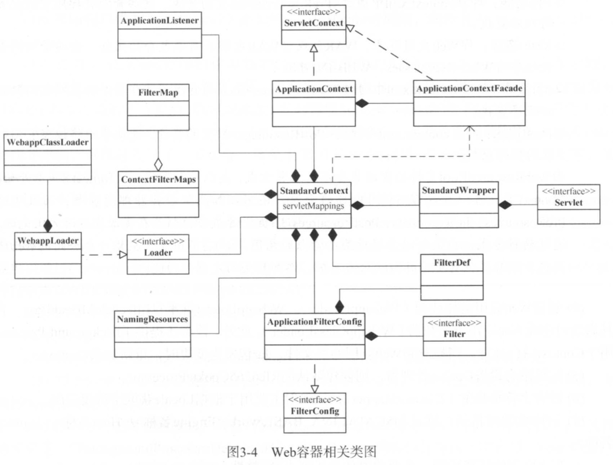

# Context Start
**[对于StandardHost和HostConfig来说，只是根据不同情况(部署描述符，部署目录，WAR包)创建并启动context对象](./webapp_deploy.md)，并不包含具体的Web应用初始化及启动工作，该部分工作由组件Context完成**



由上图可知
* Tomcat中，ServletContext实现类为ApplicationContext,相应Facade为ApplicationContextFacade
* Tomcat中，FilterConfig实现类为ApplicationFilterConfig

## Context启动

接下来看Context启动过程，Context也通过其父类ContainerBase#startInternal()启动

StandardContext#startInternal
```java
protected synchronized void startInternal() throws LifecycleException {

    if(log.isDebugEnabled())
        log.debug("Starting " + getBaseName());

    // Send j2ee.state.starting notification
    if (this.getObjectName() != null) {
        Notification notification = new Notification("j2ee.state.starting",
                this.getObjectName(), sequenceNumber.getAndIncrement());
        broadcaster.sendNotification(notification);
    }

    setConfigured(false);
    boolean ok = true;

    // Currently this is effectively a NO-OP but needs to be called to
    // ensure the NamingResources follows the correct lifecycle
    if (namingResources != null) {
        namingResources.start();
    }

    // Add missing components as necessary
    if (getResources() == null) {   // (1) Required by Loader
        if (log.isDebugEnabled())
            log.debug("Configuring default Resources");

        try {
            setResources(new StandardRoot(this));
        } catch (IllegalArgumentException e) {
            log.error(sm.getString("standardContext.resourcesInit"), e);
            ok = false;
        }
    }
    if (ok) {
        // 初始化当前Context使用的WebResourceRoot并启动
        // WebResourceRoot维护了Web应用的资源集合(Class,Jar及其他资源文件)
        resourcesStart();
    }

    // 创建web应用类加载器，该类加载器提供了backgroundProcess用于Context后台处理
    // 当检测到web应用的classes，jar包发生变更时，重新加载context
    if (getLoader() == null) {
        WebappLoader webappLoader = new WebappLoader(getParentClassLoader());
        webappLoader.setDelegate(getDelegate());
        setLoader(webappLoader);
    }

    // An explicit cookie processor hasn't been specified; use the default
    if (cookieProcessor == null) {
        cookieProcessor = new Rfc6265CookieProcessor();
    }

    // Initialize character set mapper
    getCharsetMapper();

    // Post work directory
    postWorkDirectory();

    // Validate required extensions
    boolean dependencyCheck = true;
    try {
        dependencyCheck = ExtensionValidator.validateApplication
            (getResources(), this);
    } catch (IOException ioe) {
        log.error(sm.getString("standardContext.extensionValidationError"), ioe);
        dependencyCheck = false;
    }

    if (!dependencyCheck) {
        // do not make application available if dependency check fails
        ok = false;
    }

    // Reading the "catalina.useNaming" environment variable
    String useNamingProperty = System.getProperty("catalina.useNaming");
    if ((useNamingProperty != null)
        && (useNamingProperty.equals("false"))) {
        useNaming = false;
    }

    if (ok && isUseNaming()) {
        if (getNamingContextListener() == null) {
            NamingContextListener ncl = new NamingContextListener();
            ncl.setName(getNamingContextName());
            ncl.setExceptionOnFailedWrite(getJndiExceptionOnFailedWrite());
            addLifecycleListener(ncl);
            setNamingContextListener(ncl);
        }
    }

    // Standard container startup
    if (log.isDebugEnabled())
        log.debug("Processing standard container startup");


    // Binding thread
    ClassLoader oldCCL = bindThread();

    try {
        if (ok) {
            // 启动Web应用类加载器(WebappLoader.start)
            // 此时才真正创建WebappClassLoader实例
            // Start our subordinate components, if any
            Loader loader = getLoader();
            if (loader instanceof Lifecycle) {
                ((Lifecycle) loader).start();
            }

            // since the loader just started, the webapp classloader is now
            // created.
            setClassLoaderProperty("clearReferencesRmiTargets",
                    getClearReferencesRmiTargets());
            setClassLoaderProperty("clearReferencesStopThreads",
                    getClearReferencesStopThreads());
            setClassLoaderProperty("clearReferencesStopTimerThreads",
                    getClearReferencesStopTimerThreads());
            setClassLoaderProperty("clearReferencesHttpClientKeepAliveThread",
                    getClearReferencesHttpClientKeepAliveThread());

            // By calling unbindThread and bindThread in a row, we setup the
            // current Thread CCL to be the webapp classloader
            unbindThread(oldCCL);
            oldCCL = bindThread();

            // Initialize logger again. Other components might have used it
            // too early, so it should be reset.
            logger = null;
            getLogger();

            // 启动安全组件
            Realm realm = getRealmInternal();
            if(null != realm) {
                if (realm instanceof Lifecycle) {
                    ((Lifecycle) realm).start();
                }

                // Place the CredentialHandler into the ServletContext so
                // applications can have access to it. Wrap it in a "safe"
                // handler so application's can't modify it.
                CredentialHandler safeHandler = new CredentialHandler() {
                    @Override
                    public boolean matches(String inputCredentials, String storedCredentials) {
                        return getRealmInternal().getCredentialHandler().matches(inputCredentials, storedCredentials);
                    }

                    @Override
                    public String mutate(String inputCredentials) {
                        return getRealmInternal().getCredentialHandler().mutate(inputCredentials);
                    }
                };
                context.setAttribute(Globals.CREDENTIAL_HANDLER, safeHandler);
            }

            // Notify our interested LifecycleListeners

            // 发布Lifecycle.CONFIGURE_START_EVENT事件
            // ContextConfig监听该事件以完成web容器初始化
            // web应用部署符可来源于WEB-INF/web.xml,
            // META-INF/web-fragment.xml,
            // ServletContainerInitializer
            // annotation
            fireLifecycleEvent(Lifecycle.CONFIGURE_START_EVENT, null);

            // Start our child containers, if not already started
            // 启动子节点Wrapper
            for (Container child : findChildren()) {
                if (!child.getState().isAvailable()) {
                    child.start();
                }
            }

            // Start the Valves in our pipeline (including the basic),
            // if any
            if (pipeline instanceof Lifecycle) {
                ((Lifecycle) pipeline).start();
            }

            // Acquire clustered manager
            Manager contextManager = null;
            Manager manager = getManager();
            if (manager == null) {
                if (log.isDebugEnabled()) {
                    log.debug(sm.getString("standardContext.cluster.noManager",
                            Boolean.valueOf((getCluster() != null)),
                            Boolean.valueOf(distributable)));
                }
                if ( (getCluster() != null) && distributable) {
                    try {
                        contextManager = getCluster().createManager(getName());
                    } catch (Exception ex) {
                        log.error("standardContext.clusterFail", ex);
                        ok = false;
                    }
                } else {
                    contextManager = new StandardManager();
                }
            }

            // Configure default manager if none was specified
            if (contextManager != null) {
                if (log.isDebugEnabled()) {
                    log.debug(sm.getString("standardContext.manager",
                            contextManager.getClass().getName()));
                }
                setManager(contextManager);
            }

            if (manager!=null && (getCluster() != null) && distributable) {
                //let the cluster know that there is a context that is distributable
                //and that it has its own manager
                getCluster().registerManager(manager);
            }
        }

        if (!getConfigured()) {
            log.error(sm.getString("standardContext.configurationFail"));
            ok = false;
        }

        // We put the resources into the servlet context
        if (ok)
            getServletContext().setAttribute
                (Globals.RESOURCES_ATTR, getResources());

        if (ok ) {
            if (getInstanceManager() == null) {
                javax.naming.Context context = null;
                if (isUseNaming() && getNamingContextListener() != null) {
                    context = getNamingContextListener().getEnvContext();
                }
                Map<String, Map<String, String>> injectionMap = buildInjectionMap(
                        getIgnoreAnnotations() ? new NamingResourcesImpl(): getNamingResources());
                setInstanceManager(new DefaultInstanceManager(context,
                        injectionMap, this, this.getClass().getClassLoader()));
            }
            getServletContext().setAttribute(
                    InstanceManager.class.getName(), getInstanceManager());
            InstanceManagerBindings.bind(getLoader().getClassLoader(), getInstanceManager());
        }

        // Create context attributes that will be required
        if (ok) {
            getServletContext().setAttribute(
                    JarScanner.class.getName(), getJarScanner());
        }

        // Set up the context init params
        // 合并ServletContext初始化参数和Context组件中ApplicationParameter
        mergeParameters();

        // Call ServletContainerInitializers
        // 主要用于可编程的方式添加Web应用的配置，如servlet,filter
        for (Map.Entry<ServletContainerInitializer, Set<Class<?>>> entry :
            initializers.entrySet()) {
            try {
                entry.getKey().onStartup(entry.getValue(),
                        getServletContext());
            } catch (ServletException e) {
                log.error(sm.getString("standardContext.sciFail"), e);
                ok = false;
                break;
            }
        }

        // Configure and call application event listeners

        // 实例化应用监听器（ApplicationListener）,分为
        // 事件监听器(ServletContextAttributeListener，
        // ServletRequestAttributeListener,
        // ServletRequestListener,
        // HttpSessionIdListener,
        // HttpSessionAttributeListener)
        // 生命周期监听器(HttpSessionListener,
        // ServletContextListener)
        // 这些监听器可以通过context配置文件，
        // 可编程方式(ServletContainerInitializer),
        // web.xml添加

        // 并触发ServletContextListener.contextInitialized
        if (ok) {
            if (!listenerStart()) {
                log.error(sm.getString("standardContext.listenerFail"));
                ok = false;
            }
        }

        // Check constraints for uncovered HTTP methods
        // Needs to be after SCIs and listeners as they may programmatically
        // change constraints
        if (ok) {
            checkConstraintsForUncoveredMethods(findConstraints());
        }

        try {
            // Start manager
            Manager manager = getManager();
            if (manager instanceof Lifecycle) {
                ((Lifecycle) manager).start();
            }
        } catch(Exception e) {
            log.error(sm.getString("standardContext.managerFail"), e);
            ok = false;
        }

        // Configure and call application filters

        // 实例化FilterConfig(ApplicationFilterConfig),
        // Filter
        // 并调用Filter.init方法初始化
        if (ok) {
            if (!filterStart()) {
                log.error(sm.getString("standardContext.filterFail"));
                ok = false;
            }
        }

        // Load and initialize all "load on startup" servlets
        // load-on-startup元素标记容器是否在启动的时候就加载这个servlet
        // 对于loadOnStartup>=0的Wrapper,实例化并调用其init()方法)。
        if (ok) {
            if (!loadOnStartup(findChildren())){
                log.error(sm.getString("standardContext.servletFail"));
                ok = false;
            }
        }

        // Start ContainerBackgroundProcessor thread
        // 启动后台定时处理线程
        // 只有当backgroundProcessDelay>0时启动
        // 用于监控守护文件的变更
        // backgroundProcessDelay<=0,表示Context的后台任务由上级Host调度
        super.threadStart();
    } finally {
        // Unbinding thread
        unbindThread(oldCCL);
    }

    // Set available status depending upon startup success
    if (ok) {
        if (log.isDebugEnabled())
            log.debug("Starting completed");
    } else {
        log.error(sm.getString("standardContext.startFailed", getName()));
    }

    startTime=System.currentTimeMillis();

    // Send j2ee.state.running notification
    if (ok && (this.getObjectName() != null)) {
        Notification notification =
            new Notification("j2ee.state.running", this.getObjectName(),
                                sequenceNumber.getAndIncrement());
        broadcaster.sendNotification(notification);
    }

    // The WebResources implementation caches references to JAR files. On
    // some platforms these references may lock the JAR files. Since web
    // application start is likely to have read from lots of JARs, trigger
    // a clean-up now.
    getResources().gc();

    // Reinitializing if something went wrong
    if (!ok) {
        setState(LifecycleState.FAILED);
    } else {
        setState(LifecycleState.STARTING);
    }
}
```
以上为StandardContext启动过程，这部分工作并不包含web.xml解析，请求映射，Filter等相关配置，这些具体由ContextConfig完成

# ContextConfig


ContextConfig共监听在六个事件上
```java
/**
    * Process events for an associated Context.
    *
    * @param event The lifecycle event that has occurred
    */
@Override
public void lifecycleEvent(LifecycleEvent event) {

    // Identify the context we are associated with
    try {
        context = (Context) event.getLifecycle();
    } catch (ClassCastException e) {
        log.error(sm.getString("contextConfig.cce", event.getLifecycle()), e);
        return;
    }

    // Process the event that has occurred
    if (event.getType().equals(Lifecycle.CONFIGURE_START_EVENT)) {
        configureStart();
    } else if (event.getType().equals(Lifecycle.BEFORE_START_EVENT)) {
        beforeStart();
    } else if (event.getType().equals(Lifecycle.AFTER_START_EVENT)) {
        // Restore docBase for management tools
        if (originalDocBase != null) {
            context.setDocBase(originalDocBase);
        }
    } else if (event.getType().equals(Lifecycle.CONFIGURE_STOP_EVENT)) {
        configureStop();
    } else if (event.getType().equals(Lifecycle.AFTER_INIT_EVENT)) {
        init();
    } else if (event.getType().equals(Lifecycle.AFTER_DESTROY_EVENT)) {
        destroy();
    }

}
```

## AFTER_INIT_EVENT
在Context初始化阶段触发，用于Context属性的配置工作

Tomcat中Context属性的优先级为：

configFile --> conf/<Engine名称>/<Host名称>/context.xml.default --> conf/context.xml 

即Web应用配置优先级最高，其次为Host配置，Catalina容器配置优先级最低
```java
protected void init() {
    // Called from StandardContext.init()

    Digester contextDigester = createContextDigester();
    contextDigester.getParser();

    if (log.isDebugEnabled()) {
        log.debug(sm.getString("contextConfig.init"));
    }
    context.setConfigured(false);
    ok = true;

    contextConfig(contextDigester);
}
```
```java
/**
    * Process the default configuration file, if it exists.
    * @param digester The digester that will be used for XML parsing
    */
protected void contextConfig(Digester digester) {

    String defaultContextXml = null;

    // Open the default context.xml file, if it exists
    if (context instanceof StandardContext) {
        defaultContextXml = ((StandardContext)context).getDefaultContextXml();
    }
    // set the default if we don't have any overrides
    if (defaultContextXml == null) {
        defaultContextXml = Constants.DefaultContextXml;
    }

    if (!context.getOverride()) {
        File defaultContextFile = new File(defaultContextXml);
        if (!defaultContextFile.isAbsolute()) {
            defaultContextFile =
                    new File(context.getCatalinaBase(), defaultContextXml);
        }
        if (defaultContextFile.exists()) {
            try {
                URL defaultContextUrl = defaultContextFile.toURI().toURL();
                processContextConfig(digester, defaultContextUrl);
            } catch (MalformedURLException e) {
                log.error(sm.getString(
                        "contextConfig.badUrl", defaultContextFile), e);
            }
        }

        File hostContextFile = new File(getHostConfigBase(), Constants.HostContextXml);
        if (hostContextFile.exists()) {
            try {
                URL hostContextUrl = hostContextFile.toURI().toURL();
                processContextConfig(digester, hostContextUrl);
            } catch (MalformedURLException e) {
                log.error(sm.getString(
                        "contextConfig.badUrl", hostContextFile), e);
            }
        }
    }
    if (context.getConfigFile() != null) {
        processContextConfig(digester, context.getConfigFile());
    }

}
```

## BEFORE_START_EVENT
在Context启动之前触发，用于更新Context的docBase属性和解决Web目录锁的问题
```java
/**
    * Process a "before start" event for this Context.
    */
protected synchronized void beforeStart() {

    try {
        fixDocBase();
    } catch (IOException e) {
        log.error(sm.getString(
                "contextConfig.fixDocBase", context.getName()), e);
    }

    antiLocking();
}
```
## CONFIGURE_START_EVENT
**真正创建Wrapper的是CONFIGURE_START_EVENT事件**
```java
/**
    * Process a "contextConfig" event for this Context.
    */
protected synchronized void configureStart() {
    // Called from StandardContext.start()

    if (log.isDebugEnabled()) {
        log.debug(sm.getString("contextConfig.start"));
    }

    if (log.isDebugEnabled()) {
        log.debug(sm.getString("contextConfig.xmlSettings",
                context.getName(),
                Boolean.valueOf(context.getXmlValidation()),
                Boolean.valueOf(context.getXmlNamespaceAware())));
    }

    webConfig();

    if (!context.getIgnoreAnnotations()) {
        applicationAnnotationsConfig();
    }
    if (ok) {
        validateSecurityRoles();
    }

    // Configure an authenticator if we need one
    if (ok) {
        authenticatorConfig();
    }

    // Dump the contents of this pipeline if requested
    if (log.isDebugEnabled()) {
        log.debug("Pipeline Configuration:");
        Pipeline pipeline = context.getPipeline();
        Valve valves[] = null;
        if (pipeline != null) {
            valves = pipeline.getValves();
        }
        if (valves != null) {
            for (int i = 0; i < valves.length; i++) {
                log.debug("  " + valves[i].getClass().getName());
            }
        }
        log.debug("======================");
    }

    // Make our application available if no problems were encountered
    if (ok) {
        context.setConfigured(true);
    } else {
        log.error(sm.getString("contextConfig.unavailable"));
        context.setConfigured(false);
    }

}
```
### Web容器初始化
web应用的部署描述符来源于
* Servlet规范
    * WEB-INF/web.xml
    * [web应用jar包中的META-INF/web-fragment.xml](../../servlet-and-jsp/webxml/web-fragment.md)
    * META-INF/services/javax.servlet.ServletContainerInitializer
        * 配置了所属jar中该接口的实现类是哪个
    * annotation
* Tomcat
    * 容器级别conf/web.xml
        * 配置JspServlet
        ```xml
        <servlet>
            <servlet-name>jsp</servlet-name>
            <servlet-class>org.apache.jasper.servlet.JspServlet</servlet-class>
            <init-param>
                <param-name>fork</param-name>
                <param-value>false</param-value>
            </init-param>
            <init-param>
                <param-name>xpoweredBy</param-name>
                <param-value>false</param-value>
            </init-param>
            <load-on-startup>3</load-on-startup>
        </servlet>
            <!-- The mappings for the JSP servlet -->
        <servlet-mapping>
            <servlet-name>jsp</servlet-name>
            <url-pattern>*.jsp</url-pattern>
            <url-pattern>*.jspx</url-pattern>
        </servlet-mapping>
        ```
    * Host级别conf/\<Engine名称\>/\<Host名称\>/web.xml.default

优先级
web应用-->Host级-->Container级别
```java
/**
    * Scan the web.xml files that apply to the web application and merge them
    * using the rules defined in the spec. For the global web.xml files,
    * where there is duplicate configuration, the most specific level wins. ie
    * an application's web.xml takes precedence over the host level or global
    * web.xml file.
    */
protected void webConfig() {
    /*
        * Anything and everything can override the global and host defaults.
        * This is implemented in two parts
        * - Handle as a web fragment that gets added after everything else so
        *   everything else takes priority
        * - Mark Servlets as overridable so SCI configuration can replace
        *   configuration from the defaults
        */

    /*
        * The rules for annotation scanning are not as clear-cut as one might
        * think. Tomcat implements the following process:
        * - As per SRV.1.6.2, Tomcat will scan for annotations regardless of
        *   which Servlet spec version is declared in web.xml. The EG has
        *   confirmed this is the expected behaviour.
        * - As per http://java.net/jira/browse/SERVLET_SPEC-36, if the main
        *   web.xml is marked as metadata-complete, JARs are still processed
        *   for SCIs.
        * - If metadata-complete=true and an absolute ordering is specified,
        *   JARs excluded from the ordering are also excluded from the SCI
        *   processing.
        * - If an SCI has a @HandlesType annotation then all classes (except
        *   those in JARs excluded from an absolute ordering) need to be
        *   scanned to check if they match.
        */
    WebXmlParser webXmlParser = new WebXmlParser(context.getXmlNamespaceAware(),
            context.getXmlValidation(), context.getXmlBlockExternal());

    Set<WebXml> defaults = new HashSet<>();
    defaults.add(getDefaultWebXmlFragment(webXmlParser));

    Set<WebXml> tomcatWebXml = new HashSet<>();
    tomcatWebXml.add(getTomcatWebXmlFragment(webXmlParser));

    // 根据默认配置生成webXml对象
    // 容器级别conf/web.xml
    // Host级别conf/\<Engine名称\>/\<Host名称\>/web.xml.default
    // 对应同名配置Host级别覆盖Container级别
    WebXml webXml = createWebXml();
    
    // 解析Web应用级别配置web.xml,生成主webxml对象
    // 其他webxml对象要合并到该对象上
    // Parse context level web.xml
    InputSource contextWebXml = getContextWebXmlSource();
    if (!webXmlParser.parseWebXml(contextWebXml, webXml, false)) {
        ok = false;
    }

    ServletContext sContext = context.getServletContext();

    // Ordering is important here

    // Step 1. Identify all the JARs packaged with the application and those
    // provided by the container. If any of the application JARs have a
    // web-fragment.xml it will be parsed at this point. web-fragment.xml
    // files are ignored for container provided JARs.
    // 解析web-fragment.xml生成webxml对象，并按照Servlet规范对其排序
    Map<String,WebXml> fragments = processJarsForWebFragments(webXml, webXmlParser);

    // Step 2. Order the fragments.
    Set<WebXml> orderedFragments = null;
    orderedFragments =
            WebXml.orderWebFragments(webXml, fragments, sContext);

    // Step 3. Look for ServletContainerInitializer implementations
    // 查找ServletContainerInitializer实现并创建实例
    // 根据ServletContainerInitializer查询结果初始化typeInitializerMap
    // 根据javax.servlet.annotation.HandlesTypes注解配置初始化initializerClassMap
    // 用于后续的注解检测
    if (ok) {
        processServletContainerInitializers();
    }

    // 主webxml对象metadataComplete不为空，且typeInitializerMap不为空
    // 处理web-inf/classes下的注解
    // 合并WebServlet WebFilter WebListener注解配置到主webxml
    if  (!webXml.isMetadataComplete() || typeInitializerMap.size() > 0) {
        // Step 4. Process /WEB-INF/classes for annotations and
        // @HandlesTypes matches
        Map<String,JavaClassCacheEntry> javaClassCache = new HashMap<>();

        if (ok) {
            WebResource[] webResources =
                    context.getResources().listResources("/WEB-INF/classes");

            for (WebResource webResource : webResources) {
                // Skip the META-INF directory from any JARs that have been
                // expanded in to WEB-INF/classes (sometimes IDEs do this).
                if ("META-INF".equals(webResource.getName())) {
                    continue;
                }
                processAnnotationsWebResource(webResource, webXml,
                        webXml.isMetadataComplete(), javaClassCache);
            }
        }

        // Step 5. Process JARs for annotations and
        // @HandlesTypes matches - only need to process those fragments we
        // are going to use (remember orderedFragments includes any
        // container fragments)
        if (ok) {
            processAnnotations(
                    orderedFragments, webXml.isMetadataComplete(), javaClassCache);
        }

        // Cache, if used, is no longer required so clear it
        javaClassCache.clear();
    }

    if (!webXml.isMetadataComplete()) {
        // Step 6. Merge web-fragment.xml files into the main web.xml
        // file.
        if (ok) {
            ok = webXml.merge(orderedFragments);
        }

        // Step 7a
        // merge tomcat-web.xml
        webXml.merge(tomcatWebXml);

        // Step 7b. Apply global defaults
        // Have to merge defaults before JSP conversion since defaults
        // provide JSP servlet definition.
        webXml.merge(defaults);

        // 配置JspServlet。对于当前web应用中JspFile属性不为空的Servlet，
        // 将其servletClass设置为org.jasper.servlet.JspServlet(Tomcat Jsp引擎)
        // 该配置由container级别配置文件conf/web.xml默认提供
        // 将JspFile设置为ServletClass的初始化参数，
        // 同时将名为jsp的servlet(conf/web.xml)的初始化参数也复制到该servlet中
        // Step 8. Convert explicitly mentioned jsps to servlets
        if (ok) {
            convertJsps(webXml);
        }

        // Step 9. Apply merged web.xml to Context
        if (ok) {
            configureContext(webXml);
        }
    } else {
        webXml.merge(tomcatWebXml);
        webXml.merge(defaults);
        convertJsps(webXml);
        configureContext(webXml);
    }

    if (context.getLogEffectiveWebXml()) {
        log.info("web.xml:\n" + webXml.toXml());
    }

    // Always need to look for static resources
    // Step 10. Look for static resources packaged in JARs
    if (ok) {
        // Spec does not define an order.
        // Use ordered JARs followed by remaining JARs
        Set<WebXml> resourceJars = new LinkedHashSet<>();
        for (WebXml fragment : orderedFragments) {
            resourceJars.add(fragment);
        }
        for (WebXml fragment : fragments.values()) {
            if (!resourceJars.contains(fragment)) {
                resourceJars.add(fragment);
            }
        }
        processResourceJARs(resourceJars);
        // See also StandardContext.resourcesStart() for
        // WEB-INF/classes/META-INF/resources configuration
    }

    // Step 11. Apply the ServletContainerInitializer config to the
    // context
    // 将ServletContainerInitializer扫描结果添加到servletContext中
    if (ok) {
        for (Map.Entry<ServletContainerInitializer,
                Set<Class<?>>> entry :
                    initializerClassMap.entrySet()) {
            if (entry.getValue().isEmpty()) {
                context.addServletContainerInitializer(
                        entry.getKey(), null);
            } else {
                context.addServletContainerInitializer(
                        entry.getKey(), entry.getValue());
            }
        }
    }
}
```
