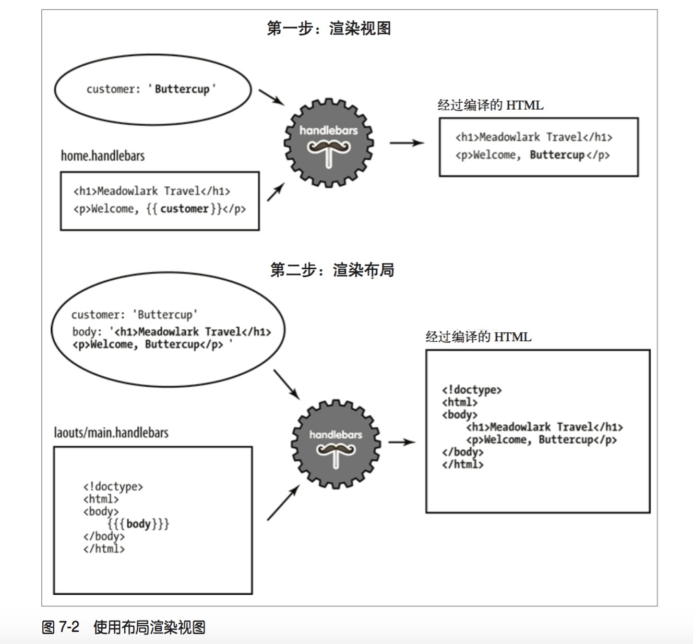

# render


* {{}}
* {{{}}}
* 区别：三个大括号关闭html转义功能
# block
context
```
{
    currency: {
        name: 'United States dollars',
        abbrev: 'USD',
    }, 
    tours: [
        { name: 'Hood River', price: '$99.95' },
        { name: 'Oregon Coast', price, '$159.95' },
    ],
    specialsUrl: '/january-specials',
    currencies: [ 'USD', 'GBP', 'BTC' ],
}
```
* block(eg. if, each)会产生一个新的上下文，与上一级上下文相同
* ../上一级上下文
* {{.}}当前上下文

handlebars
```hbs
<ul>
    {{#each tours}}
        {{! I'm in a new block...and the context has changed to tours}} 
        <li>
            {{name}} - {{price}}
            {{#if ../currencies}}
                {!I'm in a new block...and the context has changed to the item of tours}
                ({{../../currency.abbrev}})
            {{/if}}
        </li>
    {{/each}}
</ul>
{{#unless currencies}}
    <p>All prices in {{currency.name}}.</p>
{{/unless}}
{{#if specialsUrl}}
    {{! I'm in a new block...but the context hasn't changed(sortof)}}
    <p>Check out our <a href="{{specialsUrl}}">specials!</p> 
{{else}}
    <p>Please check back often for specials.</p> 
{{/if}}
<p>
    {{#each currencies}}
        <a href="#" class="currency">{{.}}</a>
    {{else}}
        Unfortunately, we currently only accept {{currency.name}}.
    {{/each}}
</p>
```
# 改扩展名为.hbs
require('express-handlebars').create({ extname: '.hbs' }), 将扩展名改成常见的.hbs。

# view and layout
