# 基变换

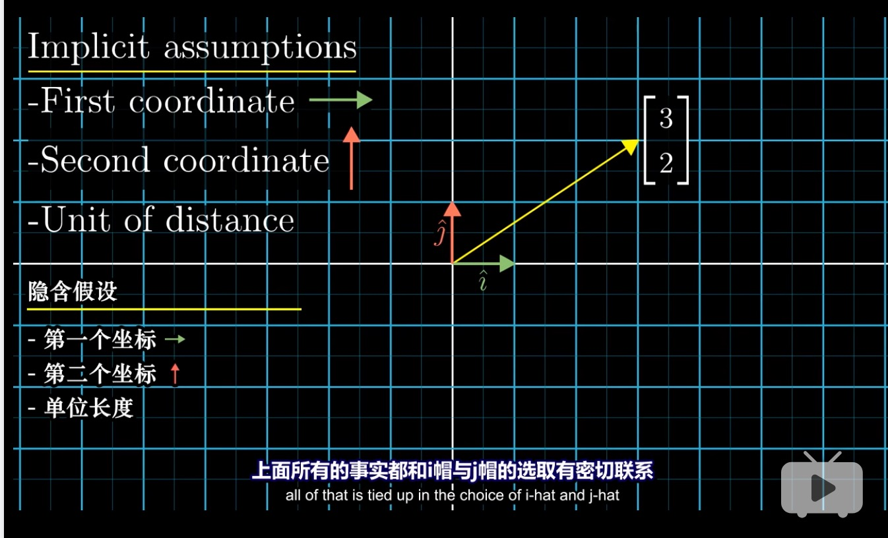
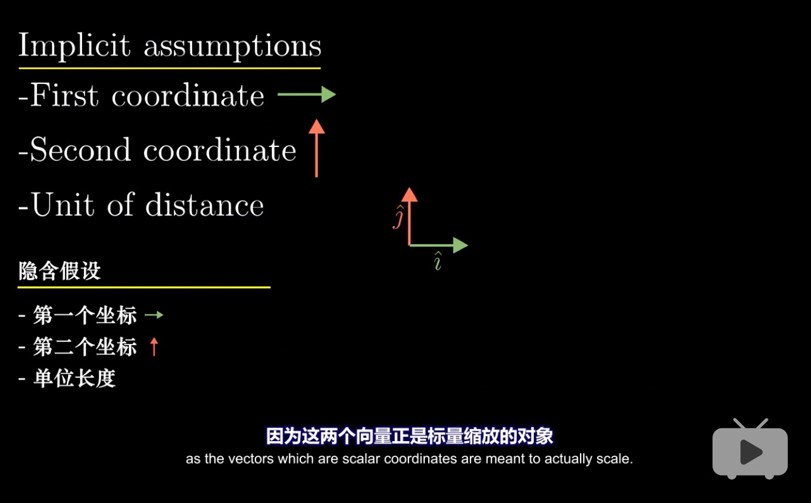
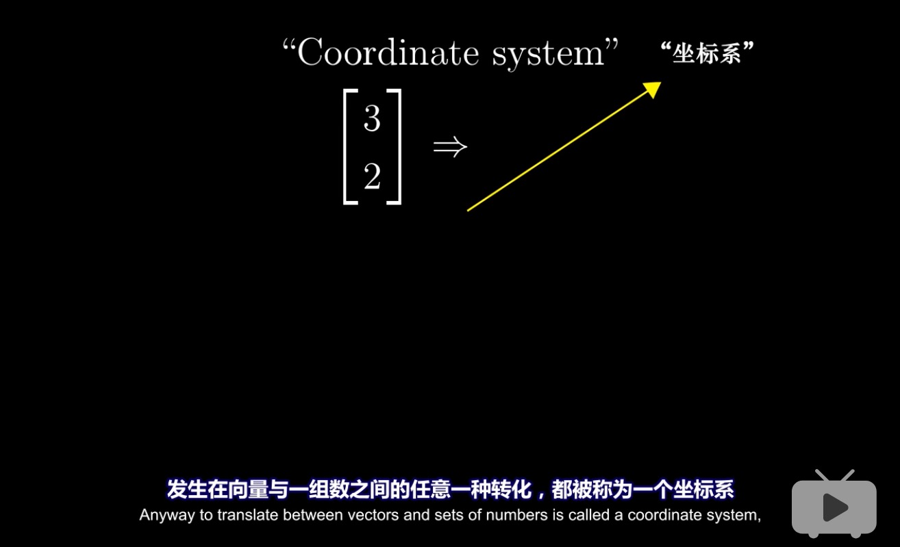

使用另一组坐标系(b1,b2)
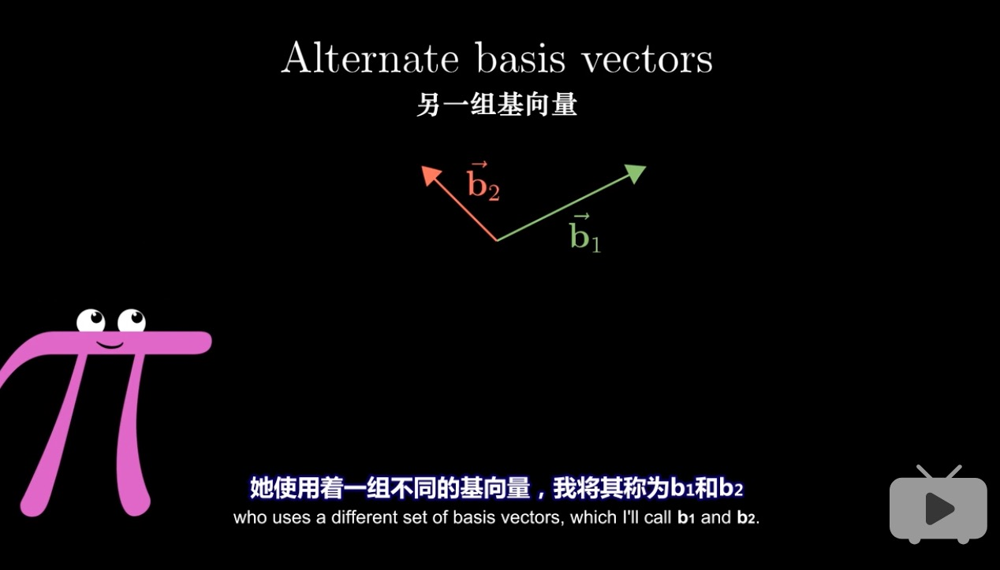
对应基为(i,j)的坐标系，其基坐标为
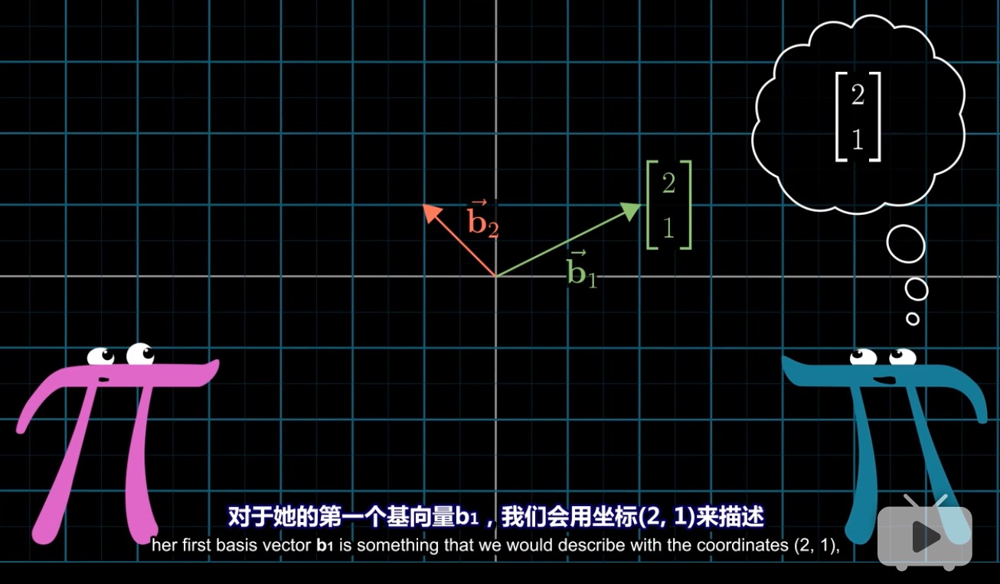
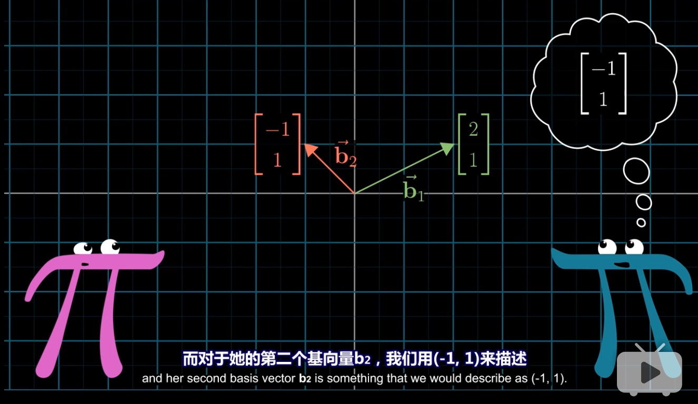
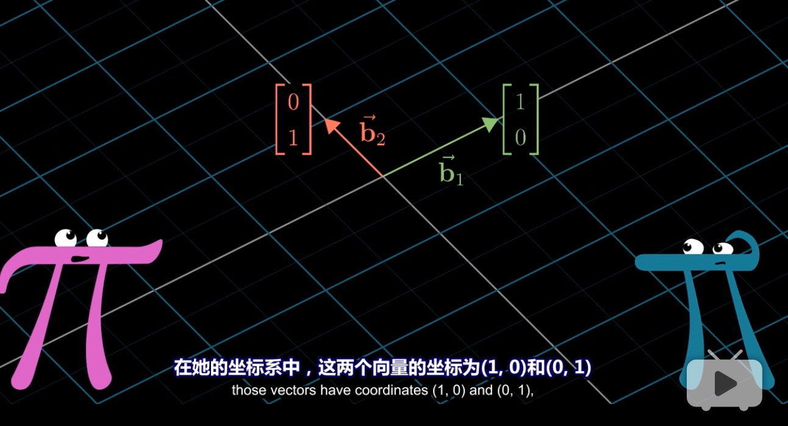
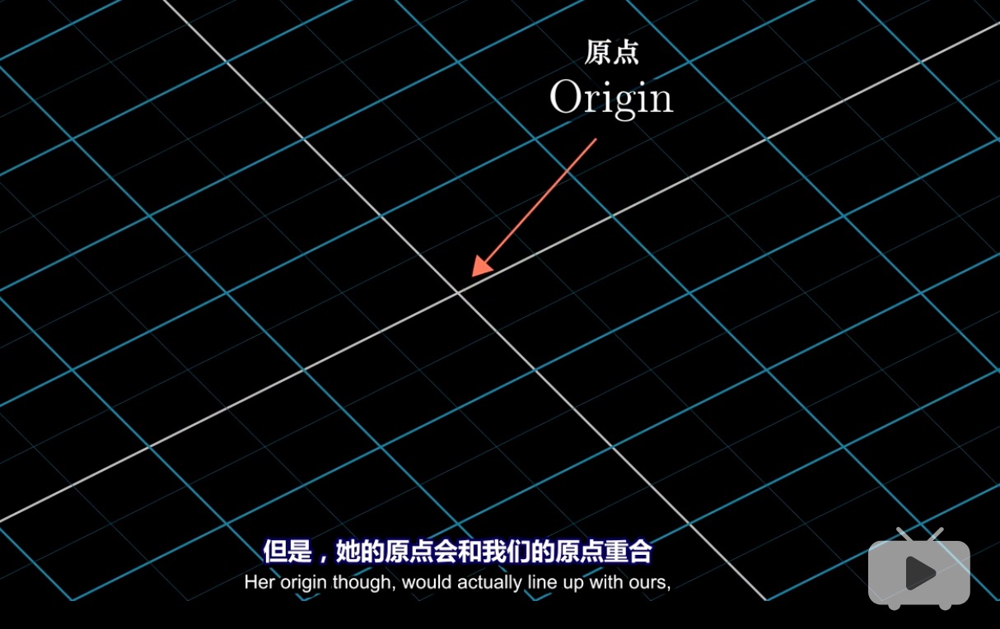

对坐标系(b1,b2)中的向量v进行线性变换：逆时针旋转90度
* 首先进行基变换(b1,b2)-->(i,j)用矩阵A表示这一过程
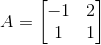
* 再进行线性变换(逆时针旋转90度)用矩阵M表示这一过程
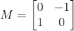
* 最后再通过A逆变换，得到向量v在坐标系(b1,b2)中逆时针旋转90度的结果,即：

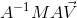

这个公式暗示着数学上的一种转移作用(将复杂坐标系下的线性变换转移到简单坐标系中进行计算)
