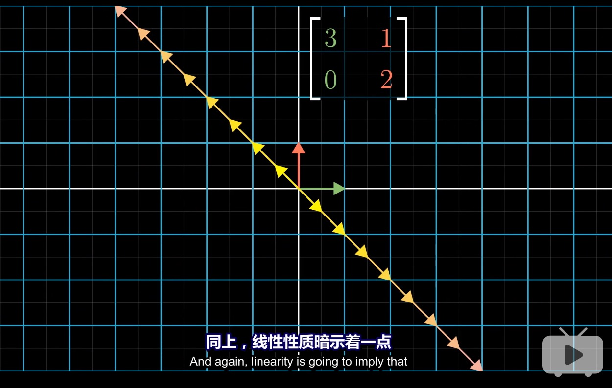
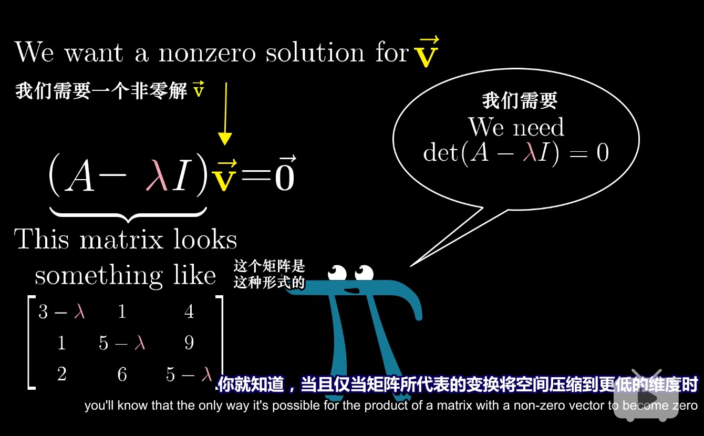
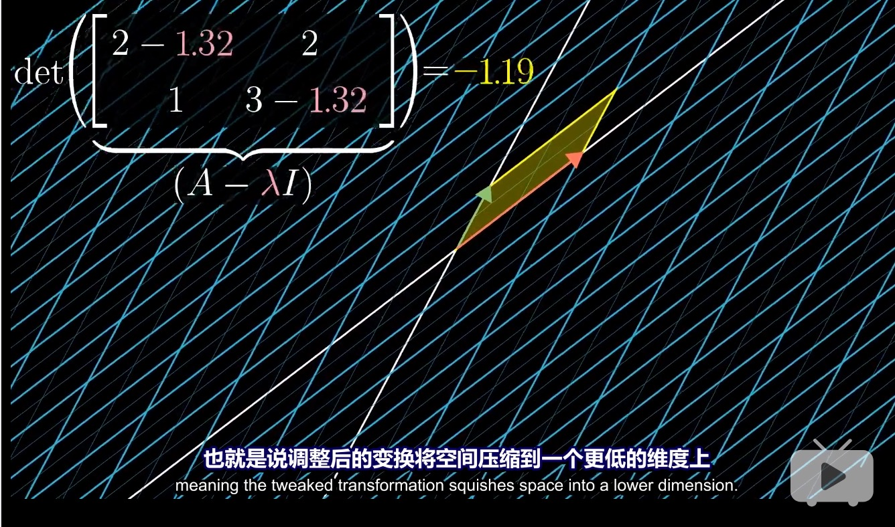
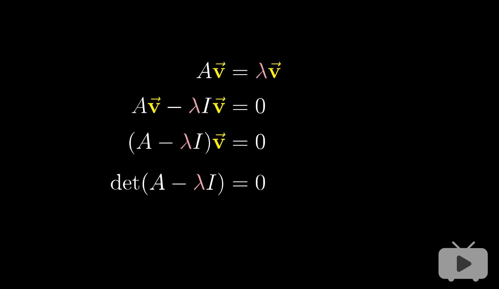
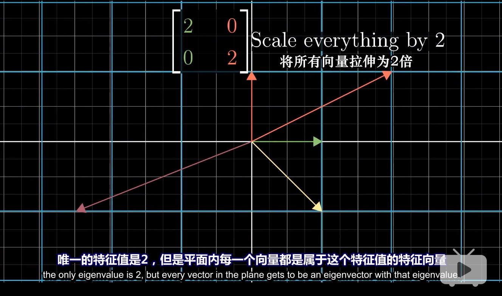
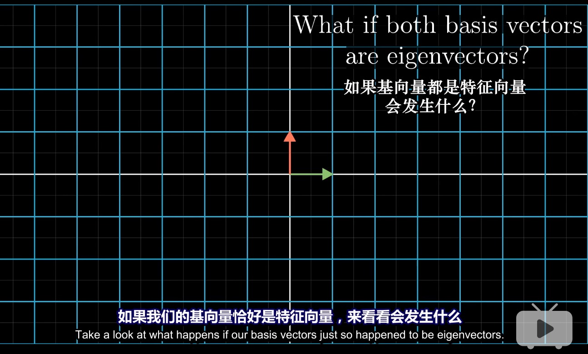

# 特征向量和特征值
## 特征向量和特征值的几何意义

## 特征向量和特征值的作用
如下例所示

如果能够找到这个旋转的特征向量，也就是留在其张成的空间中的向量，也就找到了旋转轴

### 特征值计算
理解线性变换的作用更好的方式是求出其特征向量和特征值
公式为：

即矩阵向量乘积也就是A乘以v,等于特征向量v乘以某个数,因此求解矩阵的特征向量和特征值，也就是求解上面公式的v和常数

首先将等号右边转换为矩阵向量乘积

如果矩阵A为

二维矩阵不一定存在特征向量和特征值

例如90度逆时针旋转

另一个例子是剪切变换

属于单个特征值的特征向量可以不止在一条直线上

例如将所有向量变换为两倍的矩阵，唯一的特征值是2

## 特征基与对角矩阵

对角矩阵在很多方面都很容易处理

比如矩阵与自己相乘的结果更容易计算

### 如何在另一个坐标系中，表述当前坐标系所描述变换

例如矩阵

它的特征向量为
,

也就是说，在原坐标系中进行矩阵变换

也就相当于在以(,
)为基的新坐标系进行矩阵变换

