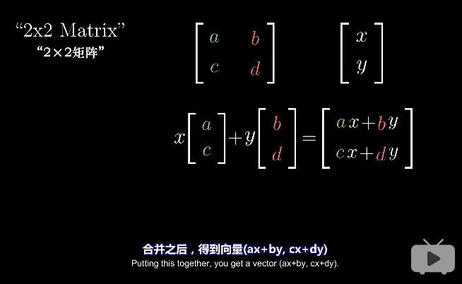

# 矩阵和线性变换
## 线性变换Linear transformation

* linear transformation就是函数的一种说法
* 在线性代数中，就是输入一个向量，输出一个变换向量
### linear transformation特点
* 直线依旧是直线
* 原点保持固定
* 

### 如何用数值描述线性变换

* 例如
    * 向量v=-1i+2j
    * Transformed v=-1(Transformed i)+2(Transformed j)
    * Transformed i=1i-2j
    * Transformed j=3i+0j
    * Transformed v=-1(1i-2j)+2(3i+0j)=-i+2j+6i=5i+2j
    * 对于任意向量(xi,yj),其变化后的位置就是x(1i-2j)+y(3i+0j)=xi-2xj+3yi=(x+3y)i-2xj

### 矩阵向量乘法

空间逆时针旋转90度

如果变化后的i帽与j帽是线性相关的，即其中一个向量是另一个向量的倍数，则这个线性变化将二维空间挤压到它们所在的一条直线上

总结，线性变换

## 复合变换（矩阵相乘）
对一个向量先后应用旋转与剪切变换，等同于对它应用旋转与剪切的复合变换

* M1*M2不等于M2*M1
    * 先进行M2变换再进行M1变换不等于先进性M1变换再进行M2变换
* (AB)C=A(BC)
    * 成立的原因是，二者都是先进行C变换再进行B变换再进行A变换