# vector
## 计算机视角
* vercots<=>lists of numbers
* 向量<=>数字列表
* 向量只不过是列表的一种说法
* 2 dimensional二维向量是因为这个列表的长度是2

## 向量加法
### 几何角度

### 计算机视角
向量加法就是把列表对应项相加

## 向量数乘
### 几何角度
向量数乘就是向量缩放

### 计算机角度
向量数乘就是列表中的每个元素与标量相乘

# 坐标
i帽，j帽（x,y方向单位向量）

## 基向量
当我们用数字描述向量时，它都依赖于我们正在使用的基（坐标系）

# 向量组合

## 张成的空间

* 在二维平面内的两个向量
    * 一个向量保持不动，另一个向量的标量自由变化，张成的空间是一条直线。

        证明：

        两个向量(a,b),(c,d)

        组合得到向量(a+c,b+d)

        其中一个向量的标量自由变化

        组合得到向量(a+ck,b+dk),k为变量

        由

        

        可得，

        一个向量保持不动，另一个向量的标量自由变化，张成的空间是一条直线。

    * 若两个向量都运动，则张成的空间是整个平面（若两个向量方向相同则张成的空间还是一条直线）
* 在三维空间内的三个向量
    * 一个向量保持不动，另两个向量张成的空间是一个穿过远点的平面。
    * 若三个向量都运动，则张成的空间是整个三维空间
    

# 线性相关和线性无关
## 线性相关

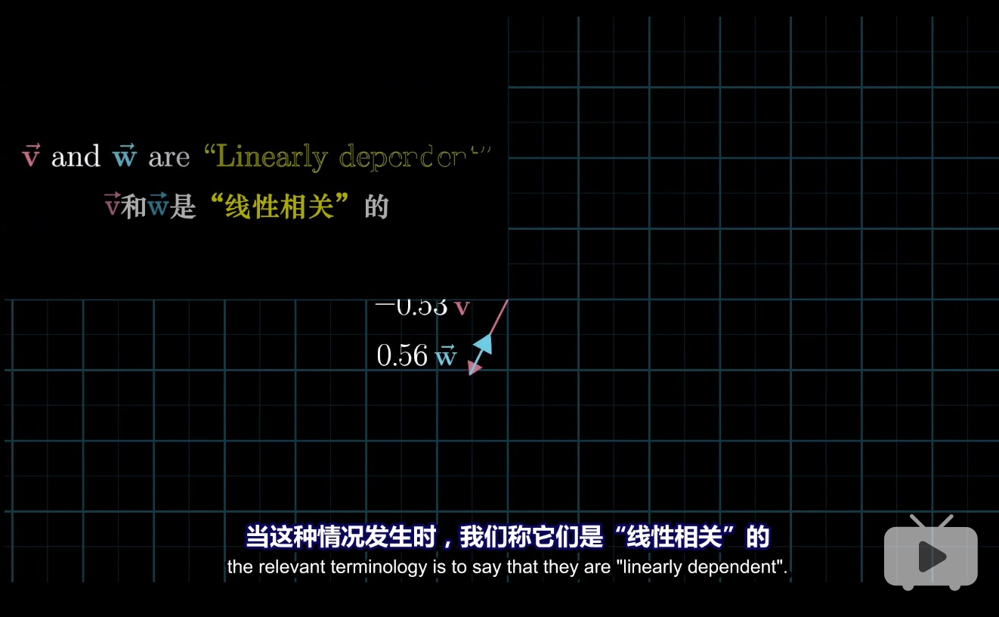

## 线性无关
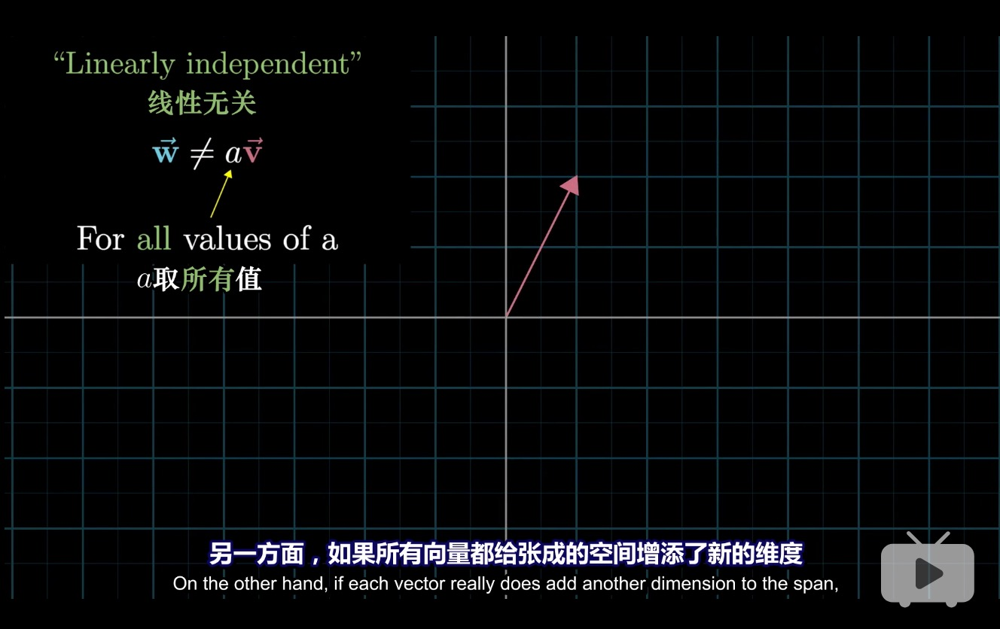

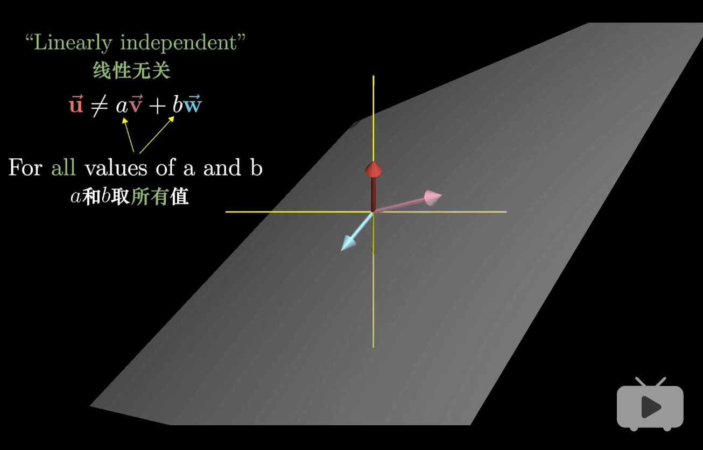
# 基的严格定义

# 矩阵和线性变换
## 线性变换Linear transformation

* linear transformation就是函数的一种说法
* 在线性代数中，就是输入一个向量，输出一个变换向量
### linear transformation特点
* 直线依旧是直线
* 原点保持固定
* 

### 如何用数值描述线性变换
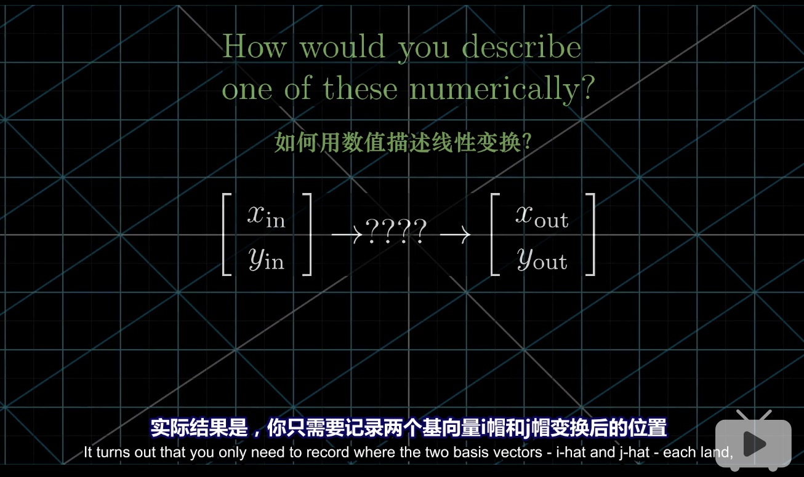

* 例如
    * 向量v=-1i+2j
    * Transformed v=-1(Transformed i)+2(Transformed j)
    * Transformed i=1i-2j
    * Transformed j=3i+0j
    * Transformed v=-1(1i-2j)+2(3i+0j)=-i+2j+6i=5i+2j
    * 对于任意向量(xi,yj),其变化后的位置就是x(1i-2j)+y(3i+0j)=xi-2xj+3yi=(x+3y)i-2xj
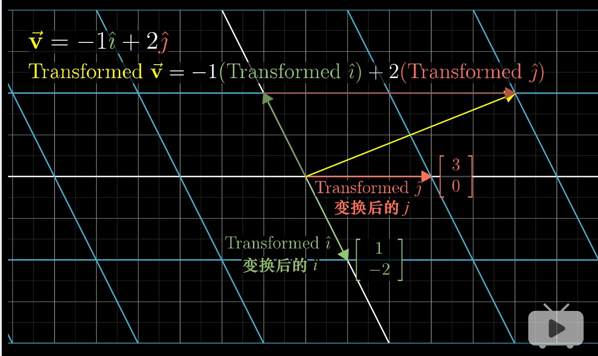

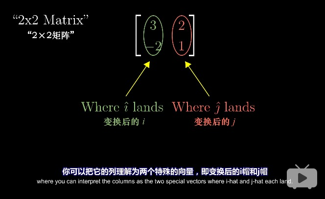

### 矩阵乘法
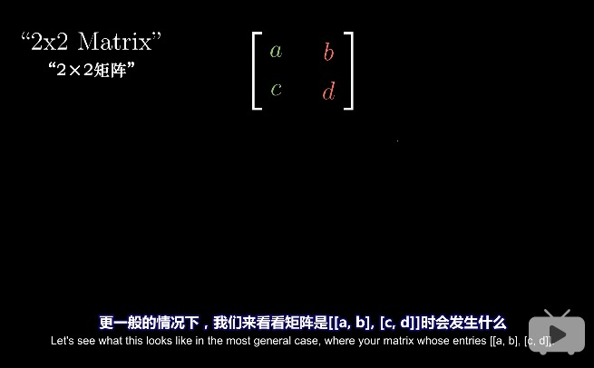

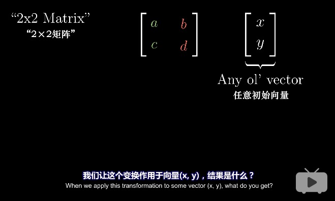
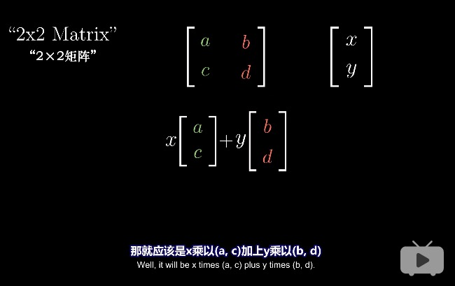

空间逆时针旋转90度

如果变化后的i帽与j帽是线性相关的，即其中一个向量是另一个向量的倍数，则这个线性变化将二维空间挤压到它们所在的一条直线上

总结，线性变换

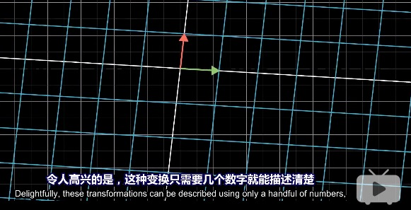
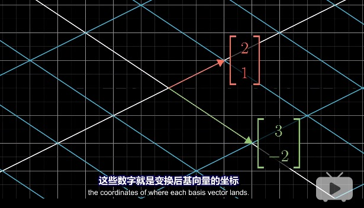

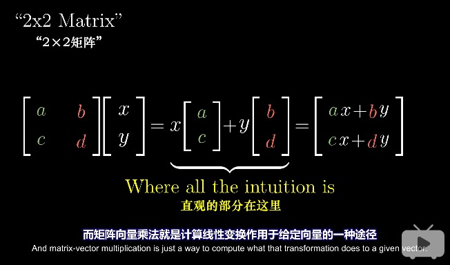
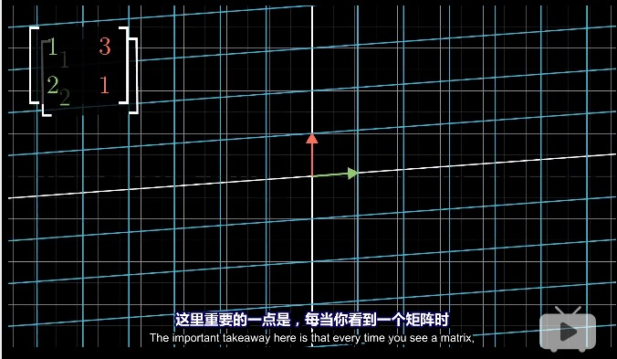
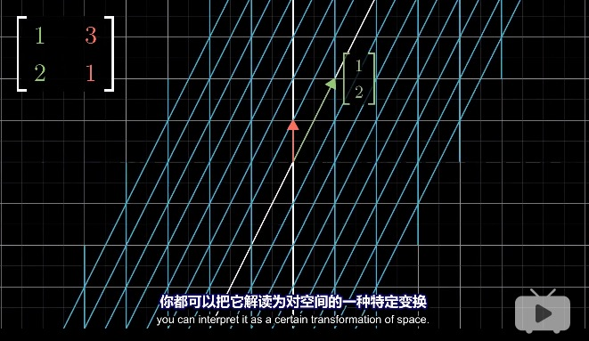

# 复合变换（矩阵相乘）
对一个向量先后应用旋转与剪切变换，等同于对它应用旋转与剪切的复合变换

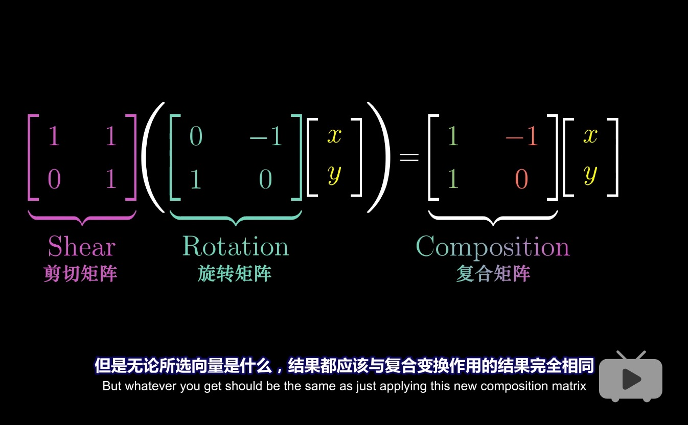

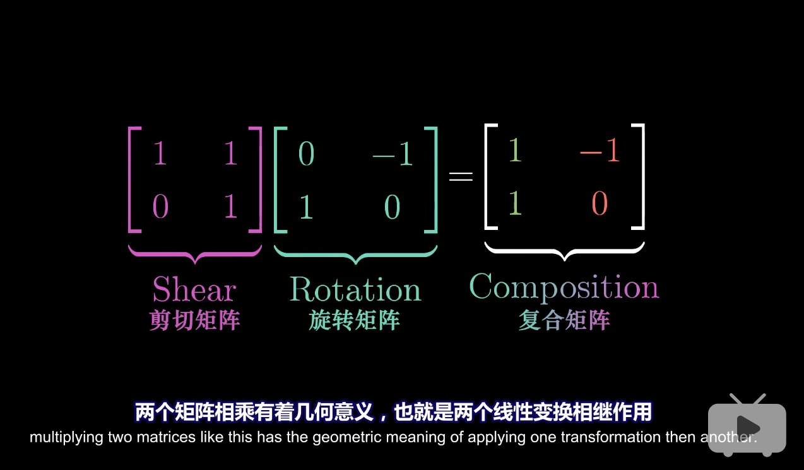

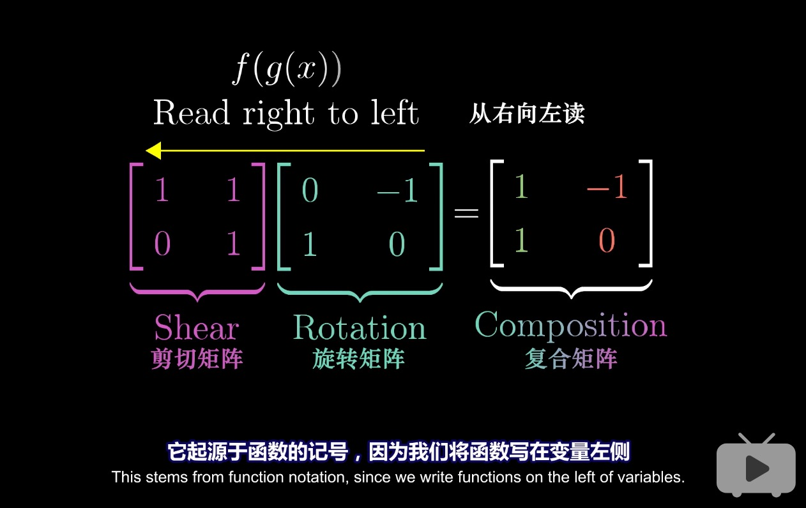

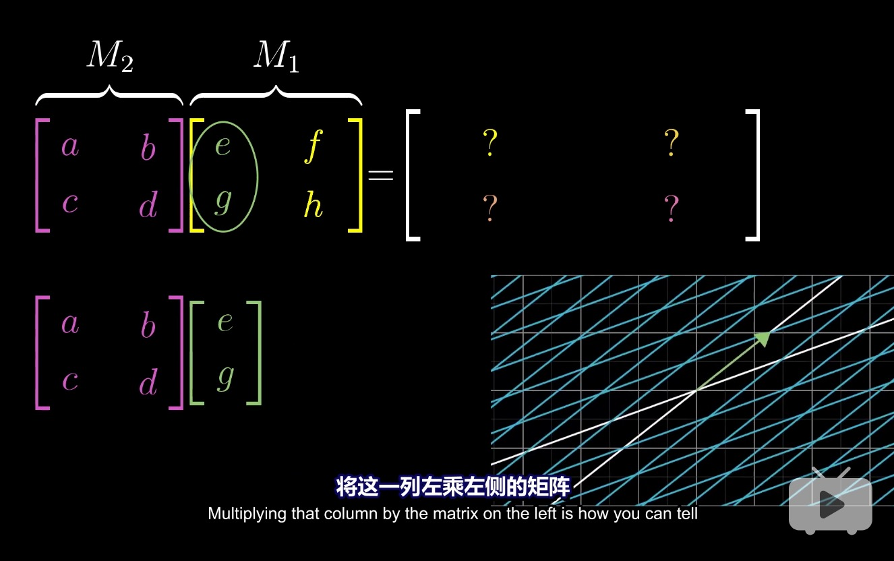

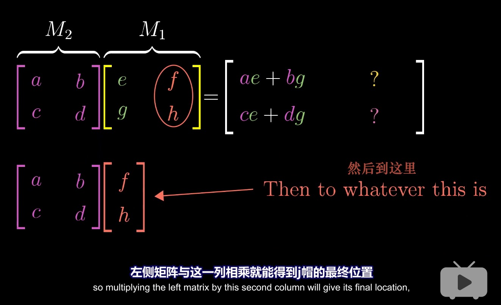
