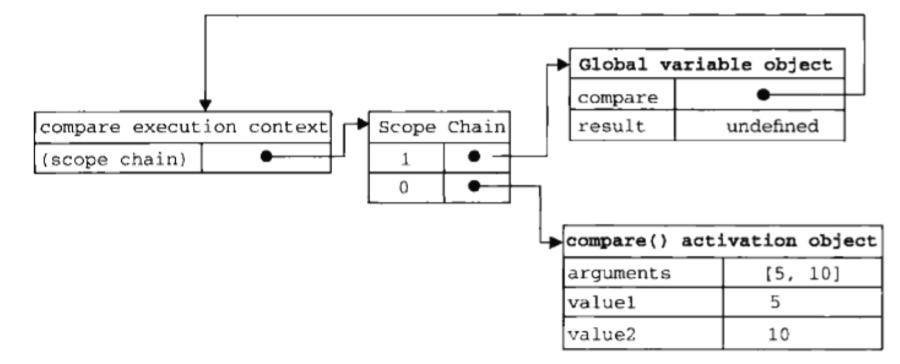
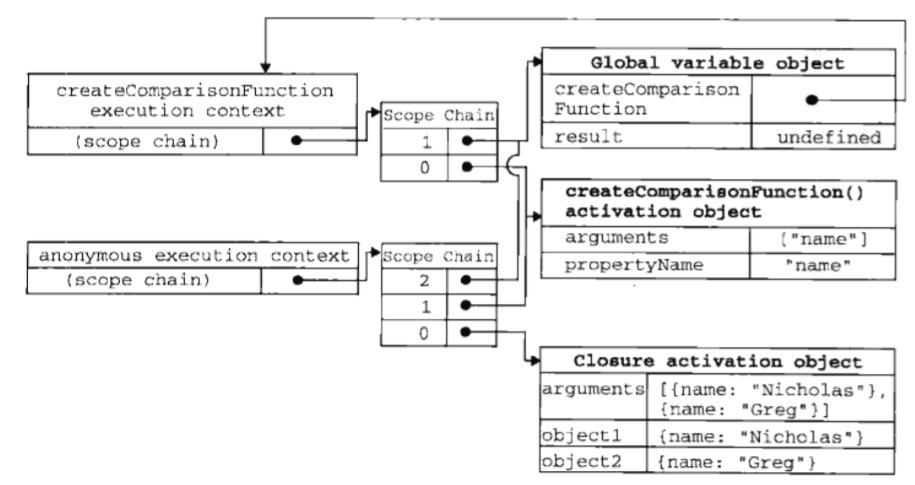

# Closures

闭包是指一个函数，该函数可以访问另一个函数作用域中的变量。  
闭包常见的创建方式，是在一个函数中创建另一个函数。

```js
function compare(v1,v2) {
    if (v1 < v2) {
        return -1;
    } else if (v1 > v2) {
        return 1;
    } else {
        return 0;
    }
}

var result=compare(2,3);
```
当某个函数被调用时，会创建一个执行环境execution context以及相应的作用域链，然后初始化函数的活动对象activation object（包括arguments,以及函数的其他命名参数）。一般来说，函数执行完毕后，局部活动对象就会被销毁。
* execution context
    * scope chain
* activation object

下图展示了上例中的上述关系。

**但若是闭包，则情况有所不同。**
```js
function createComparisonFunction(propertyName) {
    return function (object1,object2) {
        var v1=object1[propertyName];
        var v2=object2[propertyName];

        if(v1<v2) {
            return -1;
        } else if(v1>v2) {
            return 1;
        } else {
            return 0;
        }
    };
}

var compareNames=createComparisonFunction('name');
var result=compareNames({name:'zhang'},{name:'wang'});
compareNames=null;
```

上例中，createComparisonFunction函数中定义的匿名内部函数就是一个闭包。

下图展示了上例作用域链之间的关系。


闭包会将外部函数的活动对象添加到其作用域中。因此，当函数createComparisonFunction(外不函数)执行完毕，createComparisonFunction的作用域链会被销毁而**活动对象不会被销毁**，直到匿名函数被销毁后（本例中compareNames=null），createComparisonFunction的活动对象才会被销毁。

## 闭包与变量
闭包有一个值得注意的副作用，即闭包只能取得包含函数中任何变量的最后一个值，所以在闭包函数内加入 loop 时要格外注意。
```js
function createFunctions() {
    var result=new Array();
    for(var i=0;i<10;i++) {
        result[i]=function () {
            return i;
        };
    }
    return result;
}

var result=createFunctions();
for(var i=0;i<10;i++) {
    console.log(result[i]()); //全部是10
}
```
上例的本意是获取一个函数数组，每个函数返回自己的索引，但实际上每个函数返回的都是10。因为当实际执行闭包时，i的值都是10。

通过再创建一个匿名函数，并立即执行它的方式让闭包的行为符合预期。
```js
function createFunctions2() {
    var result=new Array();
    for(var i=0;i<10;i++) {
        result[i]=function (num) {
            // 使用的是上层匿名函数的参数num而不是i
            return function () {
                return num;
            };
        }(i); //立刻执行外层匿名函数
    }
    return result;
}

var result=createFunctions2();
for(var i=0;i<10;i++) {
    console.log(result[i]()); //0-9
}
```

## 闭包与this

闭包中的this指向window
```js
var name='The window';
var object={
    name:'my Object',
    getNameFunc:function () {
        return function () {
            return this.name;
        };
    }
};

console.log(object.getNameFunc()()); // The window
```
通过提前将this赋值给闭包能访问到的变量来访问外层函数的this。
```js
var name='The window';
var object2={
    name:'my Object',
    getNameFunc:function () {
        var that=this;
        return function () {
            return that.name;
        };
    }
};

console.log(object2.getNameFunc()()); // The Object
```

## 块级作用域

js没有块级作用域的概念，通过函数表达式可以模拟块级作用域。
匿名函数用()包含并立即调用。
```js
(function(){
    //这里是块级作用域
})();
```
经常用于全局作用域的函数外部，从而限制向全局作用域添加过多的变量和函数。


