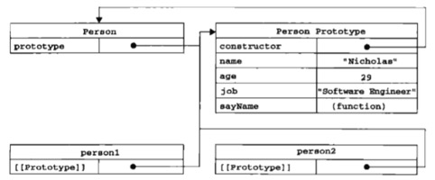

# Object Create

除了通过Object的构造函数和对象字面量方式创建单个对象外，还可以通过如下方式创建对象
* 优点：解决创建多个相似对象，大量重复代码问题
* 缺点：没有解决对象识别的问题（即对象的类型）

## 工厂模式
```js
// 工厂模式：解决创建多个相似对象，大量重复代码问题
function createPerson(name, age, job) {
    var o=new Object();
    o.name=name;
    o.age=age;
    o.job=job;
    o.sayName=function () {
        console.log(this.name);
    };
    return o;
}

var p1=createPerson("zhang",29,"teacher");
var p2=createPerson("wang",25,"Doctor");
```
## 构造函数模式
* 优点：解决了对象识别的问题
* 缺点：每个实例都包含不同的Function实例。

和java的构造函数相似，首字母大写，没有return语句。
另外，**不能显示地创造对象，直接将属性方法赋给this对象**。
```js
// 构造函数模式
function Person(name,age,job) {
    this.name=name;
    this.age=age;
    this.job=job;
    this.sayName=function () {
        console.log(this.name);
    };
}

var p1=new Person("zhang",29,"teacher");
var p2=new Person("wang",25,"Doctor");

console.log(p1.constructor==Person); //true
console.log(p2.constructor==Person); //true
```
**使用new操作符调用构造函数**实际上是如下步骤：
* **创建一个新对象**

* **将构造函数作用域赋给新对象（this指向新对象)**

* **执行构造函数中的代码**

* **返回新对象**

上例中的p1，p2都有一个constructor属性，该属性指向Person。

**这种方式定义的构造函数在Global对象（浏览器中是window对象）中**。
```js
// caller属性指向调用当前函数的函数，如果在全局环境下使用当前函数，则返回null,否则返回函数
console.log(Person.caller); //null
```

**与java不同，构造函数方式create的对象，每个对象的方法都属于对象自己**。
```js
console.log(p1.sayName==p2.sayName); //false

```
一种简单却并不太好的解决办法是将构造函数的方法设置为全局函数，构造函数拥有一个指向该函数的指针。
```js
// 简单的解决方式
function Person(name,age,job) {
    this.name=name;
    this.age=age;
    this.job=job;
    this.sayName=sayName;
}

function sayName() {
    console.log(this.name);
};

var p1=new Person("zhang",29,"teacher");
var p2=new Person("wang",25,"Doctor");

console.log(p1.sayName==p2.sayName); //true
```
## 原型模式

**prototype是一个指针，指向一个对象，这个对象包含的属性和方法可以由特定类型的实例共享**。

```js
// prototype
function Person() {
}
Person.prototype.name="zhang";
Person.prototype.age=11;
Person.prototype.job="student";
Person.prototype.sayName=function () {
    console.log(this.name);
};

var person1=new Person();
var person2=new Person();

console.log(person1.age);
console.log(person2.age);
person1.sayName(); //zhang
person2.sayName(); //zhang
console.log(person1.sayName==person2.sayName); //true


console.log(Person.prototype.constructor==Person); //true
console.log(Person.prototype.isPrototypeOf(person1)); //true
```
* **person1和person2都包含了一个内部属性，该属性仅仅指向了Person.prototype。也就是说实例和构造函数没有直接的关系。**
* **prototype的constructor属性指向构造函数**
```js
console.log(Person.prototype.constructor==Person); //true
```
* **prototype的isPrototypeOf可以判断对象的原型**
```js
console.log(Person.prototype.isPrototypeOf(person1)); //true
```



* 对象搜索属性，先从实例本身寻找，找不到再从prototype中寻找。
* 如果实例本身拥有和prototype同名的属性，则屏蔽prototype的属性，也就是说**实例不能修改prototype的属性值**
* 使用delete操作符可以完全删除实例属性，重新访问prototype的属性
* 使用hasOwnProperty()方法判断属性属于实例还是prototype
* Object.getOwnPropertyDescriptor方法只能用于实例属性，要取得原型属性的描述符，必须直接在原型对象上调用。

```js
console.log(Object.getOwnPropertyDescriptor(person1,'name')); //undefined
console.log(Object.getOwnPropertyDescriptor(Person.prototype,'name')); //{ value: 'zhang',writable: true, enumerable: true,configurable: true }

```

## 原型与in操作符

```js
// in操作符

// 属性属于实例才返回true
console.log(p1.hasOwnProperty('name')); //false
// 通过实例可以访问到属性就返回true
console.log('name' in p1); //true
p1.name='wang';
console.log(p1.hasOwnProperty('name')); //true
console.log('name' in p1); //true

```

**for-in循环，返回的是所有a.能够通过对象访问的、b.可枚举的属性。**

```js
var o={
  toString:function () {
      return 'my object';
  }
};

for(var prop in o){
    if(prop == 'toString') {
        console.log('found');
    }
}
```
### Object.keys
```js
// Object.keys方法：取得对象上所有可枚举的属性
var keys=Object.keys(Person.prototype);
console.log(keys); //[ 'name', 'age', 'job', 'sayName' ]

p1.name='zhao';
var p1keys=Object.keys(p1);
console.log(p1keys); //[ 'name' ]
```

### Object.getOwnPropertyNames
```js
// Object.getOwnPropertyNames方法：取得所有的实例属性
var pkeys=Object.getOwnPropertyNames(Person.prototype);
console.log(pkeys); //[ 'constructor', 'name', 'age', 'job', 'sayName' ]
console.log(p1keys); //[ 'name' ]
```
### for-in，Object.keys，Object.getOwnPropertyNames相似

## 简洁语法的原型
原型的语法可以更简洁，只是这种写法后，constructor属性指向Object而不是Person


```js
// 原型语法
function Person() {
}
Person.prototype.name="zhang";
Person.prototype.age=11;
Person.prototype.job="student";
Person.prototype.sayName=function () {
    console.log(this.name);
};

var p1=new Person();

console.log(p1.constructor); //Person
console.log(Person.prototype.constructor); //Person
console.log(Person.constructor); //Function

// 原型简洁语法
function Person(){

}

Person.prototype={
    name:"zhang",
    age:11,
    job:"rd",
    sayName:function () {
        console.log(this.name);
    }
}

var friend = new Person();
console.log(friend.constructor==Person); //false
console.log(friend.constructor==Object); //true
console.log(Person.prototype.constructor); //Object
console.log();

// 解决办法1
Object.defineProperty(Person.prototype,'constructor',{
    enumerable:false,
    value:Person
});

// 解决办法2:
// 注意：这种方法会导致constructor的enumerable特性被设置为true，
// 而默认情况下，原生constructor是不可枚举的
Person.prototype={
    constructor:Person,
    name:"zhang",
    age:11,
    job:"rd",
    sayName:function () {
        console.log(this.name);
    }
}

var friend = new Person();
console.log(friend.constructor==Person); //true
console.log(friend.constructor==Object); //false
console.log(Person.prototype.constructor); //Person
```
## 动态原型模式：推荐
```js
function HelloPerson(name,age,job) {
    this.name=name;
    this.age=age;
    this.job=job;

    if(typeof this.sayHelloWorld !='function') {
        console.log('初始化');
        HelloPerson.prototype.sayHelloWorld=function () {
            console.log('hello '+this.name);
        };
    }
}

var a=new HelloPerson('zhang',22,'rd');
a.sayHelloWorld();
var b=new HelloPerson('wang',43,'rd');
```
**使用new操作符调用构造函数**实际上是如下步骤：
* 创建一个新对象
* 将构造函数作用域赋给新对象（this指向新对象）
* 执行构造函数中的代码
* 返回新对象

## 寄生构造函数模式
只在特殊情况下，有此种需求。
比如说，要对原生的Array方法进行扩充。
这种方法和原型没有关系，更类似于工程模式
```js
function SpecialArray() {
    // 创建数组
    var values=new Array();
    // apply扩充作用域，这里得是values不能是this
    values.push.apply(values,arguments);
    values.toPipedString=function () {
        return this.join("|");
    };
    return values;
}
var colors=new SpecialArray("red","blue","yellow");
console.log(colors.toPipedString());//red|blue|yellow
```

## 稳妥构造函数模式
* 没有公公共属性
* 引用this对象
* 适合在安全环境中使用

```js
// 稳妥构造函数模式
function Person(name,age,job) {
    var o = new Object();
    o.sayName=function () {
        console.log(name);
    }
    return o;
}
```


## 方法属性总结

* Person.caller
* Person.prototype.constructor


* Person.prototype.isPrototypeOf()
* Object.getOwnPropertyDescriptor()
* Object.keys()
* Object.getOwnPropertyNames()
* p1.hasOwnProperty()


