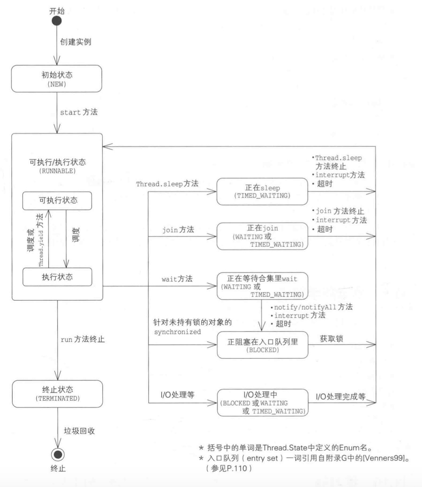
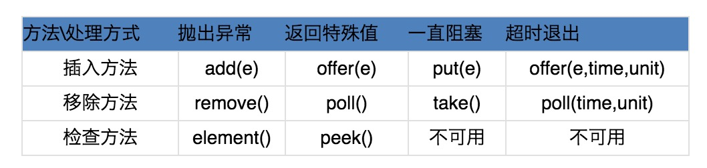
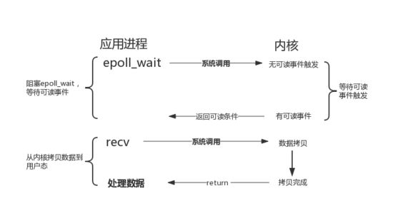
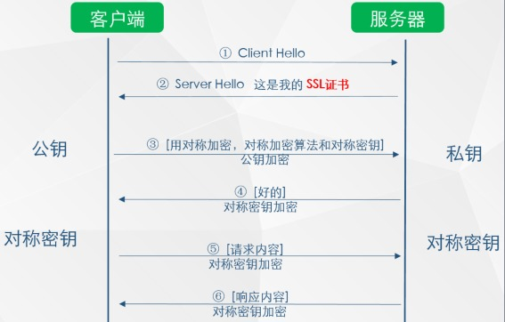

# Innodb中的行锁与表锁
前面提到过，在Innodb引擎中既支持行锁也支持表锁，那么什么时候会锁住整张表，什么时候或只锁住一行呢？

InnoDB行锁是通过给索引上的索引项加锁来实现的，这一点MySQL与Oracle不同，后者是通过在数据块中对相应数据行加锁来实现的。InnoDB这种行锁实现特点意味着：只有通过索引条件检索数据，InnoDB才使用行级锁，否则，InnoDB将使用表锁！

# 排它锁
```sql
select * from goods where id = 1 for update;
```

排他锁的申请前提：没有线程对该结果集中的任何行数据使用排他锁或共享锁，否则申请会阻塞。

for update仅适用于InnoDB，且必须在事务块(BEGIN/COMMIT)中才能生效。在进行事务操作时，通过“for update”语句，MySQL会对查询结果集中每行数据都添加排他锁，其他线程对该记录的更新与删除操作都会阻塞。排他锁包含行锁、表锁。

# 1.分布式会话

简介：将Session存入分布式缓存集群中的某台机器上，当用户访问不同节点时先从缓存中拿Session信息

       使用场景：集群中机器数多、网络环境复杂

       优点：可靠性好

       缺点：实现复杂、稳定性依赖于缓存的稳定性、Session信息放入缓存时要有合理的策略写入

# 分布式事务

# Redis持久化

# redis IO模型

IO多路复用


# 如何实现Redis的key失效

# 分布式架构，优雅下线一个服务

# 消息中间件，消息生产者发送消息失败怎么办，消费端失败怎么办，消息如何持久化


# 2.跨域
JSONP和CROS

https://www.imooc.com/article/19869?block_id=tuijian_wz

Cross-Origin Resource Sharing(CORS) 是W3C为浏览器制定的可以跨域通信的规范. 通过使用 XMLHttpRequest 对象, CORS可以让开发者方便的进行跨域通信, 就像在使用同域通信一样.
作者： LLeo小浩 
链接：https://www.imooc.com/article/19869?block_id=tuijian_wz
来源：慕课网

所有与跨域请求相关的HTTP头部都以Access-Control-开始, 下面是它们的详细信息

**Access-Control-Allow-Origin** (必选)

所有有效的跨域响应都必须包含这个请求头, 没有的话会导致跨域请求失败. 它的值可以是请求中的Origin的值, 也可以设置为*来表示可以响应所有来源的请求.

Access-Control-Allow-Credentials (可选)

默认情况下跨域请求不会携带cookies信息. 如果需要请求携带cookies信息, 则需要将这个值设置为true, 如果不需要就不要设置这个值, 而不是将它设置为false.

这个请求头需要与 [withCredentials](#XMLHttprequest 的 withCredentials 属性) 配合使用. 只有两个值都设置为true的时候才能够在请求中携带cookies信息. 当withCredentials设置为true, 而响应中不包含Access-Control-Allow-Credentials时, 请求会发生错误.

Access-Control-Expose-Headers (可选)

XMLHttpRequest2对象上的getResponseHeader()方法可以让你获取到响应中头部信息, 但在跨域请求中,你只能获取到以下信息

Cache-Control
Content-Language
Content-Type
Expires
Last-Modified
Pragma
如果你希望客户端能过获取其他的头部信息, 可以设置这个值.

# 16.ThreadLocal内部机制

ThreadLocal内部定义了一个内部类ThreadLocalMap；

Thread类持有ThreadLocalMap的实例，以用来保存若干个ThreadLocal

当在一个线程中调用ThreadLocal.get方法时，如下
```java
public T get() {
    Thread t = Thread.currentThread();
    ThreadLocalMap map = getMap(t);
    if (map != null) {
        ThreadLocalMap.Entry e = map.getEntry(this);
        if (e != null)
            return (T)e.value;
    }
    return setInitialValue();
}
```
实际是从Thread的ThreadLocalMap实例中取出的ThreadLocal,如果此时hreadLocalMap中并没有找到ThreadLocal,则先进行初始化工作,再返回结果
```java
private T setInitialValue() {
    T value = initialValue();
    Thread t = Thread.currentThread();
    ThreadLocalMap map = getMap(t);
    if (map != null)
        map.set(this, value);
    else
        createMap(t, value);
    return value;
}
```

# 3.Thread 状态转换



# 4.join yield
join,Thread的实例方法，线程状态变为waiting

yield,Thread的静态方法，线程状态变为可执行状态


# AQS，CAS，volatiile内存语义，happens before

* volatile
volatile保证了共享变量的可见性，当一个线程修改一个共享变量时，另一个线程能够读到这个值（但是不保证什么时候读到？） 

 * 可见性：对一个volatile变量的读，总是能看到任意线程对这个volatile最后的写入

 * 原子性：对任意单个volatile变量的读/写具有原子性，但类似于volatile这种复合操作不具有原子性

 语义：当写一个volatile，会把该线程对应的本地内存中的共享变量刷新到主内存中。严格限制编译器处理器对volatile变量与普通变量的重排序，确保volatile的写读和锁的释放获取具有相同的内存语义。

* happens before
  
程序顺序规则：一个线程中的每个操作，happens-before于该线程中的任意后续操作

监视器锁规则：对一个锁的解锁，happens-before于随后对这个锁的加锁

volatile:对一个volatile的写，happends-before于任意后续对这个volatile的
读

* AQS

同步阻塞队列，一个获取方法，如果当前状态不允许，将一直阻塞这个线程，一个释放方法，修改状态，让其他线程有运行的机会

# 悲观锁和乐观锁 场景
乐观锁：采用CAS操作，比较内存的值和预期原值是否一样，一样则替换内存值为新值，不一样则自旋等待下一次资源抢占（底层使用使用CPU指令实现）

悲观锁：具有排他性

先说乐观锁和悲观锁的机制：

1. 乐观锁是一种思想，具体实现是，表中有一个版本字段，第一次读的时候，获取到这个字段。处理完业务逻辑开始更新的时候，需要再次查看该字段的值是否和第一次的一样。如果一样更新，反之拒绝。之所以叫乐观，因为这个模式没有从数据库加锁。 CAS MVCC REDIS

2. 悲观锁是读取的时候为后面的更新加锁，之后再来的读操作都会等待。这种是数据库锁乐观锁优点程序实现，不会存在死锁等问题。他的适用场景也相对乐观。阻止不了除了程序之外的数据库操作。悲观锁是数据库实现，他阻止一切数据库操作。


# synchronized的原理
* synchronized编译后，会在同步块前后形成两个字节码指令
    * monitorenter
    * monitorexit
        * 这两个字节码需要指明锁定和解锁的对象（实例对象或Class对象）
* 每一个对象都有自己的对象锁
    * 在执行monitorenter指令时，首先要尝试获取对象的锁,如果这个对象没被锁定，或者当前线程已经拥有了这个对象锁，那么就把锁的计数器加1（锁在同一线程中可重入）。如果获取对象锁失败，那么当前线程进入阻塞状态，直到对象锁被另外一个线程释放，才有机会获取该对象的锁。
    * 在执行monitorexit指令时，会将锁的计数器减1，当计数器为0时，线程将锁释放。
* Note:
    * 在一个实例的私有属性上使用synchronized，不要在实例方法或this上使用synchronized：
        * method:效率低，应尽可能缩小同步块
        * this:this是整个程序都可以访问的对象引用，很容易造成调用方法的阻塞
    * 在一个私有的静态属性或在Test.class上使用synchronized，不要在类方法或this.getClass()上使用synchronized
        * this.getClass():you shouldn't synchronize on this.getClass() for another reason - it won't work in the presence of inheritance! If class Worker has two child classes, FooWorker and BarWorker, then invocations of .process() will take different locks when invoked on an instance of FooWorker vs. an instance of BarWorker. Agree that the private static variable is a better idea, but if you DO want to synchronize on the class, be explicit: synchronized(Worker.class)
# concurrent包

# 18.红黑树

红黑树，一种二叉查找树，但在每个结点上增加一个存储位表示结点的颜色，可以是Red或Black。
通过对任何一条从根到叶子的路径上各个结点着色方式的限制，红黑树确保没有一条路径会比其他路径长出俩倍，因而是接近平衡的。

 
红黑树，作为一棵二叉查找树，满足二叉查找树的一般性质。下面，来了解下 二叉查找树的一般性质。


# 19.HashMap

DK1.7中

使用一个Entry数组来存储数据，用key的hashcode取模来决定key会被放到数组里的位置，如果hashcode相同，或者hashcode取模后的结果相同（hash collision），那么这些key会被定位到Entry数组的同一个格子里，这些key会形成一个链表。

在hashcode特别差的情况下，比方说所有key的hashcode都相同，这个链表可能会很长，那么put/get操作都可能需要遍历这个链表

也就是说时间复杂度在最差情况下会退化到O(n)

 

JDK1.8中

使用一个Node数组来存储数据，但这个Node可能是链表结构，也可能是红黑树结构

如果插入的key的hashcode相同，那么这些key也会被定位到Node数组的同一个格子里。

如果同一个格子里的key不超过8个，使用链表结构存储。

如果超过了8个，那么会调用treeifyBin函数，将链表转换为红黑树。

那么即使hashcode完全相同，由于红黑树的特点，查找某个特定元素，也只需要O(log n)的开销

也就是说put/get的操作的时间复杂度最差只有O(log n)

 

 

听起来挺不错，但是真正想要利用JDK1.8的好处，有一个限制：

**key的对象，必须正确的实现了Compare接口**

如果没有实现Compare接口，或者实现得不正确（比方说所有Compare方法都返回0）

那JDK1.8的HashMap其实还是慢于JDK1.7的

原因：
如果发现链表结构中的元素超过了TREEIFY_THRESHOLD（默认为8），则会把链表转换为红黑树
在链表tree话的过程中， 如果ph = h，则表示节点“冲突”（和HashMap冲突一致），那怎么处理呢？首先调用comparableClassFor()方法判断节点的key是否实现了Comparable接口，如果kc ！= null ，则通过compareComparables()方法通过compareTo()比较带下，如果还是返回 0，即dir == 0，则调用tieBreakOrder()方法来比较了。tieBreakOrder如下：
 ```java
static int tieBreakOrder(Object a, Object b) {
    int d;
    if (a == null || b == null ||
        (d = a.getClass().getName().
            compareTo(b.getClass().getName())) == 0)
        d = (System.identityHashCode(a) <= System.identityHashCode(b) ?
                -1 : 1);
    return d;
}
```
tieBreakOrder()方法最终还是通过调用System.identityHashCode()方法来比较。

System.identityHashCode方法是java根据对象在内存中的地址算出来的一个数值，不同的地址算出来的结果是不一样的

简单的测试数据如下：

向HashMap中put/get 1w条hashcode相同的对象

JDK1.7:                                  put 0.26s，get 0.55s

JDK1.8（未实现Compare接口）：put 0.92s，get 2.1s

但是如果正确的实现了Compare接口，那么JDK1.8中的HashMap的性能有巨大提升，这次put/get 100W条hashcode相同的对象

JDK1.8（正确实现Compare接口，）：put/get大概开销都在320ms左右

 

 

为什么要这么操作呢？

我认为应该是为了避免Hash Collision DoS攻击

Java中String的hashcode函数的强度很弱，有心人可以很容易的构造出大量hashcode相同的String对象。

如果向服务器一次提交数万个hashcode相同的字符串参数，那么可以很容易的卡死JDK1.7版本的服务器。

但是String正确的实现了Compare接口，因此在JDK1.8版本的服务器上，Hash Collision DoS不会造成不可承受的开销。

# 12.阻塞队列


```
ArrayBlockingQueue ：一个由数组结构组成的有界阻塞队列。
LinkedBlockingQueue ：一个由链表结构组成的有界阻塞队列。
PriorityBlockingQueue ：一个支持优先级排序的无界阻塞队列。
DelayQueue：一个使用优先级队列实现的无界阻塞队列。
SynchronousQueue：一个不存储元素的阻塞队列。
LinkedTransferQueue：一个由链表结构组成的无界阻塞队列。
LinkedBlockingDeque：一个由链表结构组成的双向阻塞队列。
```
ArrayBlockingQueue是一个用数组实现的有界阻塞队列。此队列按照先进先出（FIFO）的原则对元素进行排序。**默认情况下不保证访问者公平的访问队列**，所谓公平访问队列是指阻塞的所有生产者线程或消费者线程，当队列可用时，可以按照阻塞的先后顺序访问队列，即先阻塞的生产者线程，可以先往队列里插入元素，先阻塞的消费者线程，可以先从队列里获取元素。通常情况下为了保证公平性会降低吞吐量。我们可以使用以下代码创建一个公平的阻塞队列：
```
ArrayBlockingQueue fairQueue = new  ArrayBlockingQueue(1000,true);
```
访问者的公平性是使用可重入锁实现的，代码如下：
```
public ArrayBlockingQueue(int capacity, boolean fair) {
        if (capacity <= 0)
            throw new IllegalArgumentException();
        this.items = new Object[capacity];
        lock = new ReentrantLock(fair);
        notEmpty = lock.newCondition();
        notFull =  lock.newCondition();
}
```
LinkedBlockingQueue是一个用链表实现的有界阻塞队列。此队列的默认和最大长度为Integer.MAX_VALUE。此队列按照先进先出的原则对元素进行排序。

PriorityBlockingQueue是一个支持优先级的无界队列。默认情况下元素采取自然顺序排列，也可以**通过比较器comparator来指定元素的排序规则。元素按照升序排列**。

DelayQueue是一个支持延时获取元素的无界阻塞队列。队列使用PriorityQueue来实现。**队列中的元素必须实现Delayed接口，在创建元素时可以指定多久才能从队列中获取当前元素。只有在延迟期满时才能从队列中提取元素**。我们可以将DelayQueue运用在以下应用场景：

缓存系统的设计：可以用DelayQueue保存缓存元素的有效期，使用一个线程循环查询DelayQueue，一旦能从DelayQueue中获取元素时，表示缓存有效期到了。
定时任务调度。使用DelayQueue保存当天将会执行的任务和执行时间，一旦从DelayQueue中获取到任务就开始执行，从比如TimerQueue就是使用DelayQueue实现的。
队列中的Delayed必须实现compareTo来指定元素的顺序。比如让延时时间最长的放在队列的末尾。实现代码如下：
```java
public int compareTo(Delayed other) {
    if (other == this) // compare zero ONLY if same object
        return 0;
    if (other instanceof ScheduledFutureTask) {
        ScheduledFutureTask x = (ScheduledFutureTask)other;
        long diff = time - x.time;
        if (diff < 0)
            return -1;
        else if (diff > 0)
            return 1;
    else if (sequenceNumber < x.sequenceNumber)
                return -1;
            else
                return 1;
        }
        long d = (getDelay(TimeUnit.NANOSECONDS) -
                    other.getDelay(TimeUnit.NANOSECONDS));
        return (d == 0) ? 0 : ((d < 0) ? -1 : 1);
    }
```
如何实现Delayed接口

我们可以参考ScheduledThreadPoolExecutor里ScheduledFutureTask类。这个类实现了Delayed接口。首先：在对象创建的时候，使用time记录前对象什么时候可以使用，代码如下：
```java

ScheduledFutureTask(Runnable r, V result, long ns, long period) {
            super(r, result);
            this.time = ns;
            this.period = period;
            this.sequenceNumber = sequencer.getAndIncrement();
}
```
然后使用getDelay可以查询当前元素还需要延时多久，代码如下：
```java
public long getDelay(TimeUnit unit) {
            return unit.convert(time - now(), TimeUnit.NANOSECONDS);
        }
```
通过构造函数可以看出延迟时间参数ns的单位是纳秒，自己设计的时候最好使用纳秒，因为getDelay时可以指定任意单位，一旦以纳秒作为单位，而延时的时间又精确不到纳秒就麻烦了。使用时请注意当time小于当前时间时，getDelay会返回负数。

如何实现延时队列

延时队列的实现很简单，当消费者从队列里获取元素时，如果元素没有达到延时时间，就阻塞当前线程。
```java
long delay = first.getDelay(TimeUnit.NANOSECONDS);
                    if (delay <= 0)
                        return q.poll();
                    else if (leader != null)
                        available.await();
```
SynchronousQueue是一个不存储元素的阻塞队列。每一个put操作必须等待一个take操作，否则不能继续添加元素。SynchronousQueue可以看成是一个传球手，负责把生产者线程处理的数据直接传递给消费者线程。**队列本身并不存储任何元素，非常适合于传递性场景,比如在一个线程中使用的数据，传递给另外一个线程使用**，SynchronousQueue的吞吐量高于LinkedBlockingQueue 和 ArrayBlockingQueue。

LinkedTransferQueue是一个由链表结构组成的无界阻塞TransferQueue队列。相对于其他阻塞队列，LinkedTransferQueue多了tryTransfer和transfer方法。

**transfer方法。如果当前有消费者正在等待接收元素（消费者使用take()方法或带时间限制的poll()方法时），transfer方法可以把生产者传入的元素立刻transfer（传输）给消费者**。如果没有消费者在等待接收元素，transfer方法会将元素存放在队列的tail节点，并等到该元素被消费者消费了才返回。transfer方法的关键代码如下：

Node pred = tryAppend(s, haveData);
return awaitMatch(s, pred, e, (how == TIMED), nanos);
第一行代码是试图把存放当前元素的s节点作为tail节点。第二行代码是让CPU自旋等待消费者消费元素。因为自旋会消耗CPU，所以自旋一定的次数后使用Thread.yield()方法来暂停当前正在执行的线程，并执行其他线程。

tryTransfer方法。则是用来试探下生产者传入的元素是否能直接传给消费者。如果没有消费者等待接收元素，则返回false。和transfer方法的区别是tryTransfer方法无论消费者是否接收，方法立即返回。而transfer方法是必须等到消费者消费了才返回。

对于带有时间限制的tryTransfer(E e, long timeout, TimeUnit unit)方法，则是试图把生产者传入的元素直接传给消费者，但是如果没有消费者消费该元素则等待指定的时间再返回，如果超时还没消费元素，则返回false，如果在超时时间内消费了元素，则返回true。

LinkedBlockingDeque是一个由链表结构组成的双向阻塞队列。所谓双向队列指的你可以从队列的两端插入和移出元素。双端队列因为多了一个操作队列的入口，在多线程同时入队时，也就减少了一半的竞争。**相比其他的阻塞队列，LinkedBlockingDeque多了addFirst，addLast，offerFirst，offerLast，peekFirst，peekLast等方法，以First单词结尾的方法，表示插入，获取（peek）或移除双端队列的第一个元素。以Last单词结尾的方法，表示插入，获取或移除双端队列的最后一个元素**。另外插入方法add等同于addLast，移除方法remove等效于removeFirst。但是take方法却等同于takeFirst，不知道是不是Jdk的bug，使用时还是用带有First和Last后缀的方法更清楚。

在初始化LinkedBlockingDeque时可以设置容量防止其过渡膨胀。另外双向阻塞队列可以运用在“工作窃取”模式中。


# 5.不重复的字符串

基于时间的UUID通过计算当前时间戳、随机数和机器MAC地址得到。由于在算法中使用了MAC地址，这个版本的UUID可以保证在全球范围的唯一性。但与此同时，使用MAC地址会带来安全性问题，这就是这个版本UUID受到批评的地方。如果应用只是在局域网中使用，也可以使用退化的算法，以IP地址来代替MAC地址－－Java的UUID往往是这样实现的（当然也考虑了获取MAC的难度）。


# 6.单例

```java
// Version 4 

public class Single4 {

    private static volatile Single4 instance;

    private Single4() {}

    public static Single4 getInstance() {

        if (instance == null) {

            synchronized (Single4.class) {

                if (instance == null) {

                    instance = new Single4();

                }

            }

        }

        return instance;

    }

}
```

# 7.动态代理
AOP的拦截功能是由java中的动态代理来实现的。说白了,就是在目标类的基础上增加切面逻辑,生成增强的目标类


Proxy类的代码量被固定下来，不会因为业务的逐渐庞大而庞大；

可以实现AOP编程，实际上静态代理也可以实现，总的来说，AOP可以算作是代理模式的一个典型应用；

解耦，通过参数就可以判断真实类，不需要事先实例化，更加灵活多变


首先定义一个接口，声明要被增强的方法。

所有被代理的类都要实现该该接口

然后实现InvocationHandler接口，该接口主要做两件是，1.绑定委托对象，然后根据委托对象生成一个代理类并返回。2.实现invoke方法，在这个方法中对被代理类的方法进行增强

最后当调用动态生成的代理类的接口方法时，实际调用的是invoke方法


```java
package test;

public interface Subject   
{   
  public void doSomething();   
}
package test;

public class RealSubject implements Subject   
{   
  public void doSomething()   
  {   
    System.out.println( "call doSomething()" );   
  }   
}  
package test;

import java.lang.reflect.InvocationHandler;  
import java.lang.reflect.Method;  
import java.lang.reflect.Proxy;  

public class ProxyHandler implements InvocationHandler
{
    private Object tar;

    //绑定委托对象，并返回代理类
    public Object bind(Object tar)
    {
        this.tar = tar;
        //绑定该类实现的所有接口，取得代理类 
        return Proxy.newProxyInstance(tar.getClass().getClassLoader(),
                                      tar.getClass().getInterfaces(),
                                      this);
    }    

    public Object invoke(Object proxy , Method method , Object[] args)throws Throwable
    {
        Object result = null;
        //这里就可以进行所谓的AOP编程了
        //在调用具体函数方法前，执行功能处理
        result = method.invoke(tar,args);
        //在调用具体函数方法后，执行功能处理
        return result;
    }
}
public class TestProxy
{
    public static void main(String args[])
    {
           ProxyHandler proxy = new ProxyHandler();
           //绑定该类实现的所有接口
           Subject sub = (Subject) proxy.bind(new RealSubject());
           sub.doSomething();
    }
}
```


9.RPC RMI dubbo

10.concurrentHashMap

11.concurrentLinkedQueue


11.epoll 

# NIO 详细 important！

最常用的I/O事件通知机制就是I/O复用(I/O multiplexing)。Linux 环境中使用select/poll/epoll_wait 实现I/O复用，I/O复用接口本身是阻塞的，在应用程序中通过I/O复用接口向内核注册fd所关注的事件，当关注事件触发时，通过I/O复用接口的返回值通知到应用程序。I/O复用接口可以同时监听多个I/O事件以提高事件处理效率。



poll 可以同时观察许多 socket 的I/O事件， 如果所有的 socket 都空闲的时候，会把当前线程阻塞掉，当有一个或多个 socket 有I/O事件时，就从阻塞态中醒来，并且，它的返回值就是有IO事件的那一个或多个 socket。我们得到这些返回值以后，就可以逐个地处理这些socket上的IO事件了。这样，我们就把多个客户端，每个都要去做的轮询交给一个 poll 去实现了。


# 20.https
那有木有一种方式既可以安全的获取公钥，又能防止黑客冒充呢？ 那就需要用到终极武器了：SSL 证书（申购）



如上图所示，在第 ② 步(连接)时服务器发送了一个SSL证书给客户端，SSL 证书中包含的具体内容有：

（1）证书的发布机构CA

（2）证书的有效期

（3）公钥

（4）证书所有者

（5）签名

………

3、客户端在接受到服务端发来的SSL证书时，会对证书的真伪进行校验，以浏览器为例说明如下：

（1）首先浏览器读取证书中的证书所有者、有效期等信息进行一一校验

（2）浏览器开始查找操作系统中已内置的受信任的证书发布机构CA，与服务器发来的证书中的颁发者CA比对，用于校验证书是否为合法机构颁发

（3）如果找不到，浏览器就会报错，说明服务器发来的证书是不可信任的。

（4）**如果找到，那么浏览器就会从操作系统中取出 颁发者CA 的公钥，然后对服务器发来的证书里面的签名进行解密**

（5）浏览器使用相同的hash算法计算出服务器发来的证书的hash值，将这个计算的hash值与证书中签名做对比

（6）**对比结果一致，则证明服务器发来的证书合法，没有被冒充**

（7）此时浏览器就可以读取证书中的公钥，用于后续加密了

4、所以通过发送SSL证书的形式，既解决了公钥获取问题，又解决了黑客冒充问题，一箭双雕，HTTPS加密过程也就此形成

所以相比HTTP，HTTPS 传输更加安全

（1） 所有信息都是加密传播，黑客无法窃听。

（2） 具有校验机制，一旦被篡改，通信双方会立刻发现。

（3） 配备身份证书，防止身份被冒充。

总结

综上所述，相比 HTTP 协议，HTTPS 协议增加了很多握手、加密解密等流程，虽然过程很复杂，但其可以保证数据传输的安全。所以在这个互联网膨胀的时代，其中隐藏着各种看不见的危机，为了保证数据的安全，维护网络稳定，建议大家多多推广HTTPS。

HTTPS 缺点：

（1）SSL 证书费用很高，以及其在服务器上的部署、更新维护非常繁琐

（2）HTTPS 降低用户访问速度（多次握手）

（3）网站改用HTTPS 以后，由HTTP 跳转到 HTTPS 的方式增加了用户访问耗时（多数网站采用302跳转）

（4）HTTPS 涉及到的安全算法会消耗 CPU 资源，需要增加大量机器（https访问过程需要加解密）


# 创建线程池的方法，最大线程参数的作用

* maximumPoolSize（线程池最大大小）：
    * 线程池允许创建的最大线程数。如果队列满了，并且已创建的线程数小于最大线程数，则线程池会再创建新的线程执行任务。值得注意的是如果使用了无界的任务队列这个参数就没什么效果。
# nignx负载均衡策略


# 8.spring 事务

Spring支持编程式事务与声明式事务

## 定义了五个隔离级别：

TransactionDefinition.ISOLATION_DEFAULT：这是默认值，表示使用底层数据库的默认隔离级别。对大部分数据库而言，通常这值就是TransactionDefinition.ISOLATION_READ_COMMITTED。

TransactionDefinition.ISOLATION_READ_UNCOMMITTED：
TransactionDefinition.ISOLATION_READ_COMMITTED：
TransactionDefinition.ISOLATION_REPEATABLE_READ：
TransactionDefinition.ISOLATION_SERIALIZABLE：


## 事务传播行为
**所谓事务的传播行为是指，如果在开始当前事务之前，一个事务上下文已经存在，此时有若干选项可以指定一个事务性方法的执行行为**。

在TransactionDefinition定义中包括了如下几个表示传播行为的常量：

TransactionDefinition.PROPAGATION_REQUIRED：如果当前存在事务，则加入该事务；如果当前没有事务，则创建一个新的事务。
TransactionDefinition.PROPAGATION_REQUIRES_NEW：创建一个新的事务，如果当前存在事务，则把当前事务挂起。
TransactionDefinition.PROPAGATION_SUPPORTS：如果当前存在事务，则加入该事务；如果当前没有事务，则以非事务的方式继续运行。
TransactionDefinition.PROPAGATION_NOT_SUPPORTED：以非事务方式运行，如果当前存在事务，则把当前事务挂起。
TransactionDefinition.PROPAGATION_NEVER：以非事务方式运行，如果当前存在事务，则抛出异常。
TransactionDefinition.PROPAGATION_MANDATORY：如果当前存在事务，则加入该事务；如果当前没有事务，则抛出异常。
TransactionDefinition.PROPAGATION_NESTED：如果当前存在事务，则创建一个事务作为当前事务的嵌套事务来运行；如果当前没有事务，则该取值等价于TransactionDefinition.PROPAGATION_REQUIRED。


# spring bean实例化时机


Spring什么时候实例化bean，首先要分2种情况 

第一：如果你使用BeanFactory作为Spring Bean的工厂类，则所有的bean都是在第一次使用该Bean的时候实例化 

第二：如果你使用ApplicationContext作为Spring Bean的工厂类，则又分为以下几种情况： 

（1）：如果bean的scope是singleton的，并且lazy-init为false（默认是false，所以可以不用设置），则ApplicationContext启动的时候就实例化该Bean，并且将实例化的Bean放在一个map结构的缓存中，下次再使用该Bean的时候，直接从这个缓存中取 

（2）：如果bean的scope是singleton的，并且lazy-init为true，则该Bean的实例化是在第一次使用该Bean的时候进行实例化 （被依赖的时候实例化,更明确的说是第一次访问] ）
```
<bean id="" name="">
```
这样这个bean是否会被实例化 
答案:不会实例化，ApplicationContext只会加载Bean的BeanDefinition. 

（3）：如果bean的scope是prototype的，则该Bean的实例化是在第一次使用该Bean的时候进行实例化 

# Spring对AOP的扩展


# Spring循环依赖是怎么解决的

这种set注入没问题的，如果两个都是构造器注入则有问题

假如A与B相互依赖，spring处理逻辑是先初始化A，把A标记为初始化中，发现A依赖B，初始化B，发现B依赖A且A是初始中，把A set进B，B初始化完成，把B set进A，A初始化完成


# Spring异常机制
# 怎么看哪个对象内存占用多

# 可以使用下面命令查使用CPU最多的K个进程
方法1：

ps -aux | sort -k3nr | head -K

方法2：top （然后按下P，注意大写
# 集合在迭代时进行删除，除了抛异常，怎么处理


                                                                                                                  


# b树 b+树区别
b+树是对b树的优化，它中间节点不存数据，只存索引，所以，每个磁盘能容纳更多的数据，降低检索消耗
# 链表排序

# intern jdk6 7的变话

dk7 版本对 intern 操作和常量池都做了一定的修改。主要包括2点：

将String常量池 从 Perm 区移动到了 Java Heap区

String#intern 方法时，如果存在堆中的对象，会直接保存对象的引用，而不会重新创建对象。

# select poll epll区别，如何实现，epoll bug，如何解决

若Selector的轮询结果为空，也没有wakeup或新消息处理，则发生空轮询，CPU使用率100%，

新版本已解决

# foreach 迭代


# filter /servlet

# springmvc / struts2

# CMS缺点 内存

之前曾经有讲过在heap size<=3G的情况下完全不要考虑CMS GC，在heap size>3G的情况下也优先选择ParallelOldGC，而不是CMS GC，只有在暂停时间无法接受的情况下才考虑CMS GC（不过当然，一般来说在heap size>8G后基本上都得选择CMS GC，否则那暂停时间是相当吓人的，除非是完全不在乎响应时间的应用

因为碎片

# hibernat缺点

# 数据库不停机分表

# 查看日志某个字段前10行 命令

# linux常用命令

# limit关键字 

# 读写锁

http://blog.csdn.net/yanyan19880509/article/details/52435135
