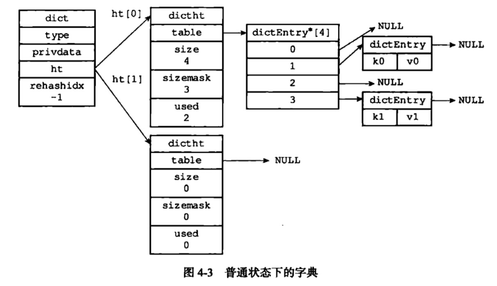

# 字典
## 作用
* Redis数据库的底层实现
* hash key底层实现之一
    * 当一个hash key包含的键值对比较多，又或者键值对中的元素都是比较长的字符串时
## 结构
```c
/* This is our hash table structure. Every dictionary has two of this as we
 * implement incremental rehashing, for the old to the new table. */
/*
 * 哈希表
 *
 * 每个字典都使用两个哈希表，从而实现渐进式 rehash 。
 */
typedef struct dictht {
    
    // 哈希表数组
    dictEntry **table;

    // 哈希表大小
    unsigned long size;
    
    // 哈希表大小掩码，用于计算索引值
    // 总是等于 size - 1
    unsigned long sizemask;

    // 该哈希表已有节点的数量
    unsigned long used;

} dictht;
```
```c
/*
 * 哈希表节点
 */
typedef struct dictEntry {
    
    // 键
    void *key;

    // 值
    union {
        void *val;
        uint64_t u64;
        int64_t s64;
    } v;

    // 指向下个哈希表节点，形成链表
    struct dictEntry *next;

} dictEntry;
```
```c
/*
 * 字典类型特定函数
 */
typedef struct dictType {

    // 计算哈希值的函数
    unsigned int (*hashFunction)(const void *key);

    // 复制键的函数
    void *(*keyDup)(void *privdata, const void *key);

    // 复制值的函数
    void *(*valDup)(void *privdata, const void *obj);

    // 对比键的函数
    int (*keyCompare)(void *privdata, const void *key1, const void *key2);

    // 销毁键的函数
    void (*keyDestructor)(void *privdata, void *key);
    
    // 销毁值的函数
    void (*valDestructor)(void *privdata, void *obj);

} dictType;
```
```c

/*
 * 字典类型特定函数
 */
typedef struct dictType {

    // 计算哈希值的函数
    unsigned int (*hashFunction)(const void *key);

    // 复制键的函数
    void *(*keyDup)(void *privdata, const void *key);

    // 复制值的函数
    void *(*valDup)(void *privdata, const void *obj);

    // 对比键的函数
    int (*keyCompare)(void *privdata, const void *key1, const void *key2);

    // 销毁键的函数
    void (*keyDestructor)(void *privdata, void *key);
    
    // 销毁值的函数
    void (*valDestructor)(void *privdata, void *obj);

} dictType;
```

## 哈希算法
MurmurHash2算法
## 哈希表的扩展与收缩

负载因子=h[0].used/ht[0].size
* 负载因子>=1
    * 没有执行命令：bgsave,bgrewriteaof
* 负载因子>=5
    * 执行命令：bgsave,bgrewriteaof

* 扩展操作
    * h[1].size = 第一个大于h[0].used*2的2的n次方
* 收缩操作
    * h[1].size = 第一个大于h[0].used的2的n次方
## 渐进式refresh
索引计算器变量rehashidx，并将它的值设置为0，表示rehash工作正式开始

每次对字典执行crud操作，除了指定操作外，还会将ht[0]在rehashidx索引上的所有键值对rehash到ht[1]，当rehash结束后，rehashidx属性的值增1

当rehash完成，rehashidx置为-1

## 时间复杂度
* 查找，增加，删除指定key，为O(1)