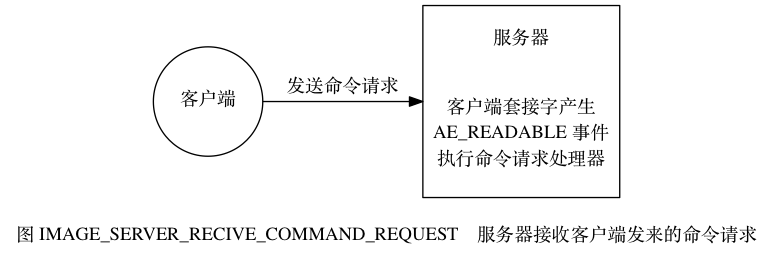

# 事件
## 文件事件
server对socket操作的抽象

* 套接字产生 AE_READABLE 事件。
    * 当套接字变得可读时
        * （客户端对套接字执行 write 操作，或者执行 close 操作）， 
    * 或者有新的可应答（acceptable）套接字出现时
        * （客户端对服务器的监听套接字执行 connect 操作）
* 套接字产生 AE_WRITABLE 事件
    * 当套接字变得可写时
        * （客户端对套接字执行 read 操作）

### 连接应答处理器
**当 Redis 服务器进行初始化的时候， 程序会将这个连接应答处理器和服务器监听套接字的 AE_READABLE 事件关联起来**， 当有客户端用 sys/socket.h/connect 函数连接服务器监听套接字的时候， 套接字就会产生 AE_READABLE 事件， 引发连接应答处理器执行， 并执行相应的套接字应答操作， 如图 IMAGE_SERVER_ACCEPT_CONNECT 所示。

### 命令请求处理器
**当一个客户端通过连接应答处理器成功连接到服务器之后， 服务器会将客户端套接字的 AE_READABLE 事件和命令请求处理器关联起来**， 当客户端向服务器发送命令请求的时候， 套接字就会产生 AE_READABLE 事件， 引发命令请求处理器执行， 并执行相应的套接字读入操作， 如图 IMAGE_SERVER_RECIVE_COMMAND_REQUEST 所示。

### 命令回复处理器
**当服务器有命令回复需要传送给客户端的时候， 服务器会将客户端套接字的 AE_WRITABLE 事件和命令回复处理器关联起来**， 当客户端准备好接收服务器传回的命令回复时， 就会产生 AE_WRITABLE 事件， 引发命令回复处理器执行， 并执行相应的套接字写入操作， 如图 IMAGE_SERVER_SEND_REPLY 所示。

## 时间事件
Server对定时操作的抽象