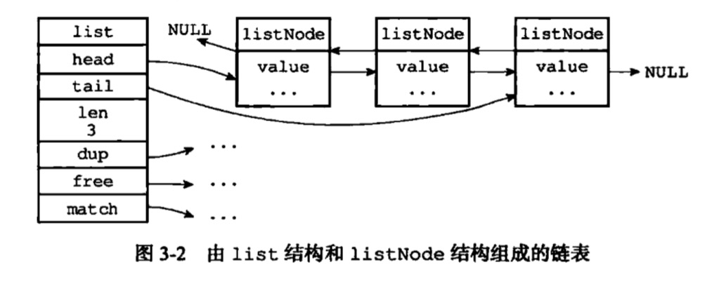

# 链表

## 作用
* list key的底层实现之一
    * 当list包含了较多元素，或者元素比较长时，使用链表作为key的底层实现

## 结构
```c
/*
 * 双端链表节点
 */
typedef struct listNode {

    // 前置节点
    struct listNode *prev;

    // 后置节点
    struct listNode *next;

    // 节点的值
    void *value;

} listNode;


/*
 * 双端链表结构
 */
typedef struct list {

    // 表头节点
    listNode *head;

    // 表尾节点
    listNode *tail;

    // 节点值复制函数
    void *(*dup)(void *ptr);

    // 节点值释放函数
    void (*free)(void *ptr);

    // 节点值对比函数
    int (*match)(void *ptr, void *key);

    // 链表所包含的节点数量
    unsigned long len;

} list;
```



## 特点
* 双端
* 无环
* 带表头指针和表尾指针
* 带链表长度计数器，len属性
* 多态

## 时间复杂度
* 插入头，尾为O(1)
* 查找,删除指定key为O(n)