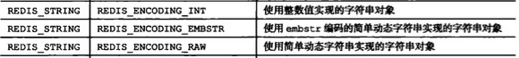
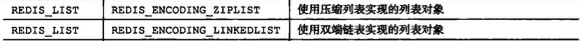

# 对象

## 作用
redis不直接使用数据结构来实现key-value数据库，而是基于这些数据结构创建一个对象系统
## 结构
```c
/* A redis object, that is a type able to hold a string / list / set */

/* The actual Redis Object */
/*
 * Redis 对象
 */
#define REDIS_LRU_BITS 24
#define REDIS_LRU_CLOCK_MAX ((1<<REDIS_LRU_BITS)-1) /* Max value of obj->lru */
#define REDIS_LRU_CLOCK_RESOLUTION 1000 /* LRU clock resolution in ms */
typedef struct redisObject {

    // 类型
    unsigned type:4;

    // 编码
    unsigned encoding:4;

    // 对象最后一次被访问的时间
    unsigned lru:REDIS_LRU_BITS; /* lru time (relative to server.lruclock) */

    // 引用计数
    int refcount;

    // 指向实际值的指针
    void *ptr;

} robj;
```
### 类型:type

type指明对象属于哪种类型

对于Redis数据库保存的key-value来说，key总是字符串对象，value则是下图中的一种


#### type命令
```bash
127.0.0.1:6379> set msg "hello"
OK
127.0.0.1:6379> type msg
string
```
### 编码:encoding
encoding指明对象使用了什么数据结构作为底层实现


### 底层实现:*ptr

ptr指针指向对象的底层实现数据结构

同一种类型的对象，底层实现可能采用不同的数据结构

### 引用计数：refcount

用于内存回收

对象共享

### 空转时长：lru

对象最后一次被访问的时间
#### 命令idletime：当前时间-lru
```bash
127.0.0.1:6379> set msg "hello"
OK
127.0.0.1:6379> type msg
string
127.0.0.1:6379> object idletime msg
(integer) 7336
127.0.0.1:6379> get msg
"hello"
127.0.0.1:6379> object idletime msg
(integer) 3
```
idletime命令被执行时，不会修改lru

#### 回收内存
打开maxmemory选项，回收算法为volatile-lru或者allkeys-lru时。当占用内存超过maxmemory设置的上限，则优先回收空转时长高的key

# 字符串对象


* 如果字符串对象保存的是一个整数值，且该整数可用long类型表示，则采用int作为底层实现，encoding为int

    
* 如果字符串长度>39字节，则采用SDS作为底层实现，encoding为raw

    
* 如果字符串长度<=39字节，则采用embstr作为底层实现，encoding为embstr
    * embstr专门用于保存短字符串，raw编码调用两次内存分配函数分别创建redisObject和sdshdr结构，而embstr则通过调用一次内存分配函数来分配一块**连续空间**。

    
* long double也是作为字符串保存的，对其进行浮点数运算时，会先将它转换为long double再进行运算，再转换为字符串保存

    

## embstr-->raw编码转换
embstr是只读的，不提供修改方法。

对于embstr为encoding的字符串的每次修改，会先将其encoding转为raw，再修改。


# 列表对象


* 列表对象保存的所有字符串长度小于64字节，并且元素数量小于512个，则采用ziplist作为底层实现，encoding为ziplist
    
    

* 其余情况时,则采用linkedlist作为底层实现，encoding为linkedlist

    

    
## ziplist-->linkedlist转换
列表对象保存的所有字符串长度小于64字节，并且元素数量小于512个。这两个条件不满足时，encoding转换为linkedlist。
* 修改上述上限的参数
    * list-max-ziplist-value
    * list-max-ziplist-entries

# 哈希对象


* hash对象保存的所有key value长度小于64字节，并且key数量小于512个，则采用ziplist作为底层实现，encoding为ziplist
    
    

    

* 其余情况时,则采用dict作为底层实现，encoding为ht

    

## ziplist-->ht转换
hash对象保存的所有key value长度小于64字节，并且key数量小于512个。这两个条件不满足时，encoding转换为ht。
* 修改上述上限的参数
    * hash-max-ziplist-value
    * hash-max-ziplist-entries
# 集合对象


* set对象保存的所有元素都为整数，且元素数量不超过512个，则采用intset作为底层实现，encoding为intset
    
    

* 其余情况时,则采用dict作为底层实现，encoding为ht

    

## intset-->ht转换
set对象保存的所有元素都为整数，且元素数量不超过512个。这两个条件不满足时，encoding转换为ht。
* 修改上述上限的参数
    * set-max-intset-entries
# 有序集合对象


* sorted set对象保存的所有元素长度小于64字节，且元素数量不超过128个，则采用ziplist作为底层实现，encoding为ziplist
    
    

    

* 其余情况时,则采用skiplist和dict作为底层实现，encoding为skiplist

    

    实际上，skiplist和dict共享元素的成员和分值，不会浪费内存

## ziplist-->skiplist转换
sorted set对象保存的所有元素长度小于64字节，且元素数量不超过128个。这两个条件不满足时，encoding转换为skiplist。
* 修改上述上限的参数
    * zset-max-ziplist-value
    * zset-max-ziplist-entries

# 类型检查和命令多态

类型检查：type

命令多态:encoding

# 内存回收