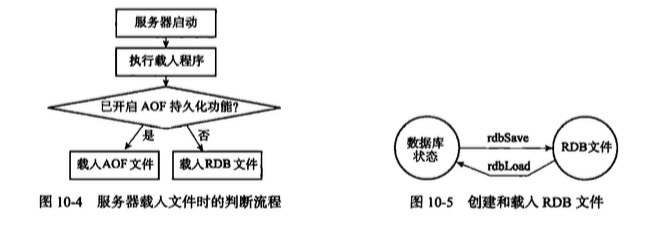
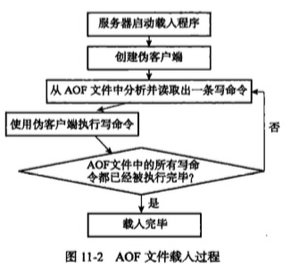

# 持久化
## RBD:保存数据库键值对
RBD文件是一个压缩的二进制文件，通过它可以还原成RDB文件生成时的数据库状态

### RBD创建
* save
    * 阻塞的创建RBD
* bgsave
    * 子进程创建RBD
### RBD载入
* 服务器启动时，自动载入（只有关闭了AOF持久化功能，才使用RBD文件恢复数据库状态）
* 载入过程中，服务器阻塞
* redisServer的serverCron函数每100ms执行一次，来检查条件十否满足



### 自动保存
通过配置文件，自动执行bgsave命令
```
save 900 1
save 300 10
save 60 10000
```
redisServer
```c
// 负责执行 BGSAVE 的子进程的 ID
    // 没在执行 BGSAVE 时，设为 -1
    pid_t rdb_child_pid;            /* PID of RDB saving child */
    struct saveparam *saveparams;   /* Save points array for RDB */
    int saveparamslen;              /* Number of saving points */
    char *rdb_filename;             /* Name of RDB file */
    int rdb_compression;            /* Use compression in RDB? */
```
```c
// 服务器的保存条件（BGSAVE 自动执行的条件）
struct saveparam {

    // 多少秒之内
    time_t seconds;

    // 发生多少次修改
    int changes;

};
```

### dirty lastsave
```c
// 自从上次 SAVE/BGSAVE 执行以来，数据库被修改的次数
long long dirty;                /* Changes to DB from the last save */

// 最后一次完成 SAVE/BGSAVE 的时间
time_t lastsave;                /* Unix time of last successful save */
```

## AOF：保存写命令
### 文件追加
* 配置 appendonly yes
* 写入同步（从buffer写入到aof文件）
    * appendfsync
        * always
        * everysyc
        * no
            * 由操作系统控制

redisServer
```c
// AOF 缓冲区
sds aof_buf;      /* AOF buffer, written before entering the event loop */
```

### AOF载入



### AOF重写
* 命令bgrewriteaof
* 通过读取数据库当前状态来实现的
* 子进程实现
* aof重写缓冲区，在服务器创建子进程后开始使用，记录Redis写命令，当子进程完成重写，会像父进程发送信号，父进程将aof缓冲区中的所有内容写入到新aof中(只有信号处理函数会对父进程造成阻塞)
