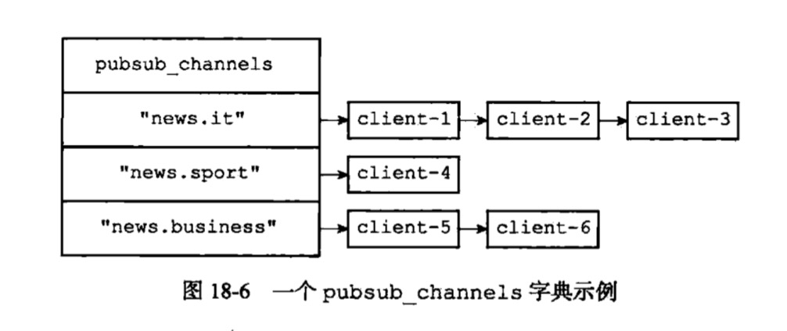
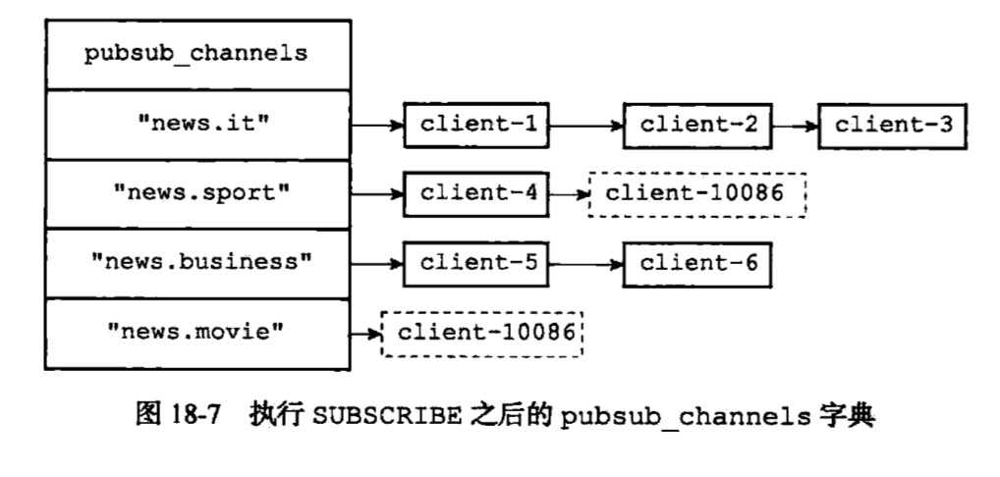
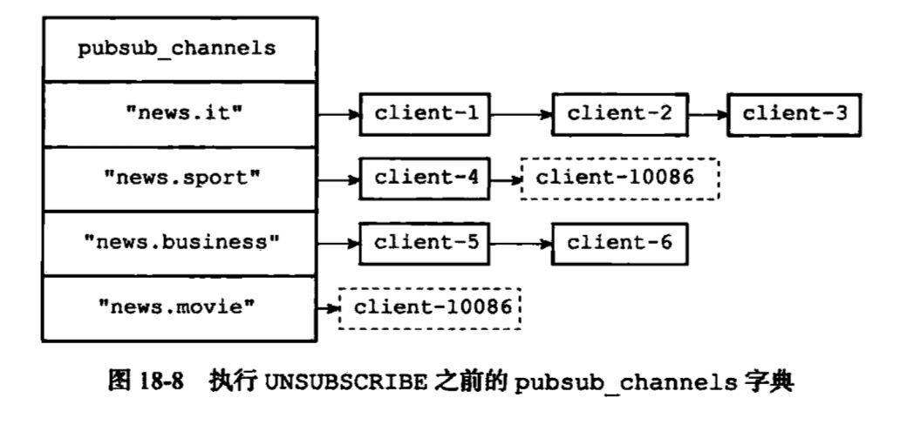
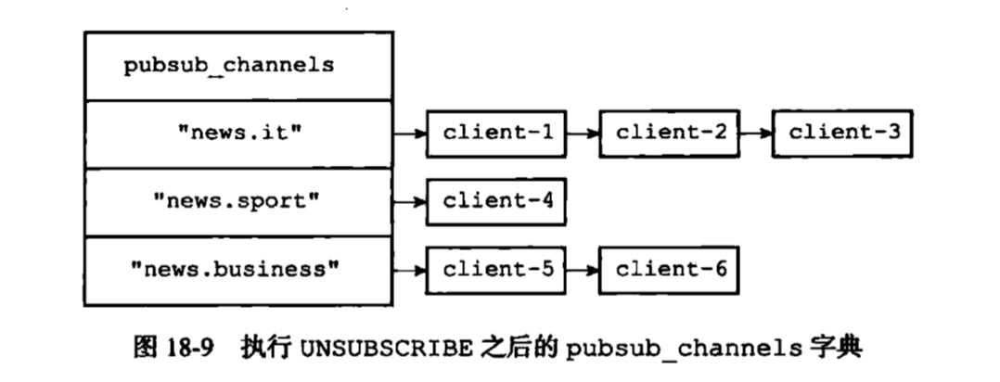
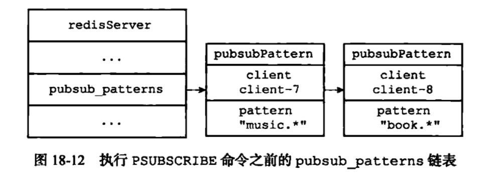
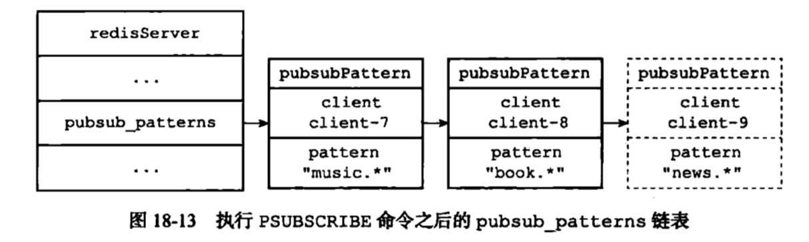
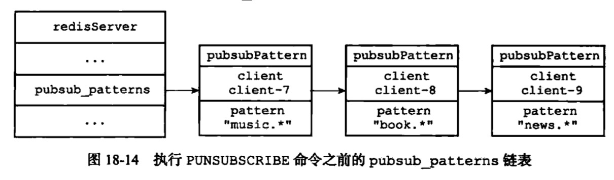
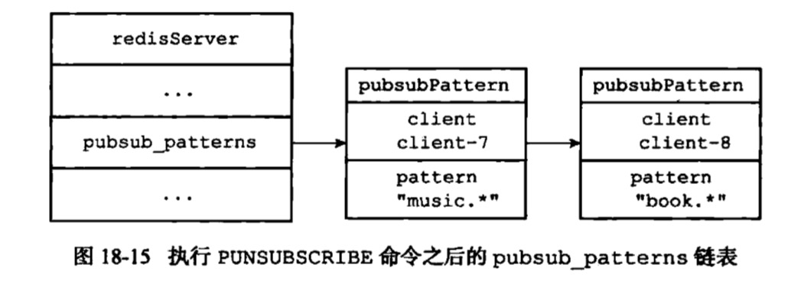

# 发布与订阅
## subscribe unsubscribe
redisServer
```c
/* Pubsub */
// 字典，键为频道，值为链表
// 链表中保存了所有订阅某个频道的客户端
// 新客户端总是被添加到链表的表尾
dict *pubsub_channels;  /* Map channels to list of subscribed clients */
```

```bash
subscribe "news.sport" "news.movie"
```



```bash
unsubscribe "news.sport" "news.movie"
```




## psubscribe punsubscribe
redisServer
```c
// 这个链表记录了客户端订阅的所有模式的名字
list *pubsub_patterns;  /* A list of pubsub_patterns */
```
```c
/*
 * 记录订阅模式的结构
 */
typedef struct pubsubPattern {

    // 订阅模式的客户端
    redisClient *client;

    // 被订阅的模式
    robj *pattern;

} pubsubPattern;
```

```bash
psubscribe "news.*"
```





```bash
punsubscribe "news.*"
```




## publish
* 频道订阅者
    * 在pubsub_channels字典里找到频道channel的订阅者名单(一个链表)，然后遍历链表，将消息发送给这个名单上的所有客户端
* 模式订阅者
    * 遍历pubsub_patterns链表，查找哪些与channel频道相匹配的模式，并将消息发送给订阅了这些模式的客户端
## pubsub
### pubsub channels [pattern]
* 返回服务器当前被订阅的频道
    * 遍历服务器pubsub_channels字典所有的键，并返回符合条件的频道来实现的

```bash
pubsub channels
```
```
1)"news.it"
2)"news.sport"
3)"news.business"
4)"news.movie"
```
```bash
pubsub channels "news.[is]*"
```
```
1)"news.it"
2)"news.sport"
```
### pubsub nubsub [channel-1 channel-2 ...]
* 接受任意多个频道作为命令参数，并返回这些频道的订阅者数量
    * 在pubsub_channels字典中找到频道对应的订阅者链表，然后返回订阅者链表的长度来实现的

### pubsub numpat
* 用于返回服务器当前被订阅模式的数量
    * 返回pubsub_patterns链表长度来实现的